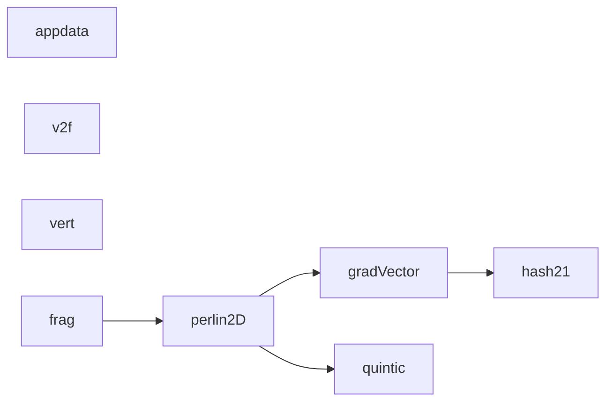

# 代码骨架：t-001（unity）

> 状态：stale: false · 生成：2026-09-12T13:24:28+08:00

## 导出接口（8）
- `fn hash21`（L17_Dissolve.shader:61:13）

```unity
CBUFFER_END // ------------------------------------------------------------ // Perlin 梯度噪声 (2D) // hash 复用 SDFLib.cginc 的 iq 风格 hash21: 格点 → 伪随机梯度角 // ------------------------------------------------------------ float hash21(float2 p)
```

- `fn gradVector`（L17_Dissolve.shader:75:13）

```unity
float2 gradVector(float2 cell)
```

- `fn quintic`（L17_Dissolve.shader:83:13）

```unity
float2 quintic(float2 t)
```

- `fn perlin2D`（L17_Dissolve.shader:89:13）

```unity
float perlin2D(float2 p)
```

- `struct appdata`（L17_Dissolve.shader:105:13）

```unity
struct appdata { float4 vertex : POSITION; float3 normal : NORMAL; float2 uv : TEXCOORD0; }
```

- `struct v2f`（L17_Dissolve.shader:112:13）

```unity
struct v2f { float4 pos : SV_POSITION; float2 uv : TEXCOORD0; float3 norWS : TEXCOORD1; // 世界空间法线 (极简光照用) }
```

- `fn vert`（L17_Dissolve.shader:119:13）

```unity
v2f vert(appdata v)
```

- `fn frag`（L17_Dissolve.shader:128:13）

```unity
float4 frag(v2f i) : SV_Target
```

## 调用关系



## 调用边（7）
- gradVector → hash21（L17_Dissolve.shader:77:31）
- perlin2D → gradVector（L17_Dissolve.shader:95:31）
- perlin2D → gradVector（L17_Dissolve.shader:96:31）
- perlin2D → gradVector（L17_Dissolve.shader:97:31）
- perlin2D → gradVector（L17_Dissolve.shader:98:31）
- perlin2D → quintic（L17_Dissolve.shader:100:28）
- frag → perlin2D（L17_Dissolve.shader:132:42）