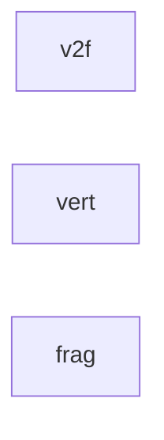

# 代码骨架：t-002（unity）

> 状态：stale: false · 生成：2026-09-12T13:24:28+08:00

## 导出接口（3）
- `struct v2f`（L18_Dissolve3D.shader:69:13）

```unity
struct v2f { float4 pos : SV_POSITION; float3 objPos : TEXCOORD0; // 对象空间位置 (溶解采样域) float3 norWS : TEXCOORD1; // 世界空间法线 (极简光照用) }
```

- `fn vert`（L18_Dissolve3D.shader:76:13）

```unity
v2f vert(appdata v)
```

- `fn frag`（L18_Dissolve3D.shader:85:13）

```unity
float4 frag(v2f i) : SV_Target
```

## 调用关系



## 调用边（0）