# 代码骨架：g-001（cpp）

> 状态：stale: false · 生成：2026-09-09T11:44:42+08:00

## 导出接口（126）
- `fn Application`（app/application.cpp:122:1）

```cpp
Application::Application()
```

- `fn Application`（app/application.cpp:126:1）

```cpp
Application::~Application()
```

- `fn initialize`（app/application.cpp:131:1）

```cpp
bool Application::initialize(HINSTANCE hInstance, int nCmdShow, const char* cmdLine)
```

- `fn initWindow`（app/application.cpp:211:1）

```cpp
bool Application::initWindow(HINSTANCE hInstance)
```

- `fn initGL`（app/application.cpp:236:1）

```cpp
bool Application::initGL()
```

- `fn initImGui`（app/application.cpp:282:1）

```cpp
void Application::initImGui()
```

- `fn shutdownImGui`（app/application.cpp:383:1）

```cpp
void Application::shutdownImGui()
```

- `fn cleanupGL`（app/application.cpp:391:1）

```cpp
void Application::cleanupGL()
```

- `fn updateTitle`（app/application.cpp:415:1）

```cpp
void Application::updateTitle()
```

- `fn onKeyDown`（app/application.cpp:422:1）

```cpp
void Application::onKeyDown(WPARAM key)
```

- `fn handleMessage`（app/application.cpp:437:1）

```cpp
LRESULT Application::handleMessage(HWND hWnd, UINT message, WPARAM wParam, LPARAM lParam)
```

- `fn WndProc`（app/application.cpp:511:1）

```cpp
LRESULT CALLBACK Application::WndProc(HWND hWnd, UINT message, WPARAM wParam, LPARAM lParam)
```

- `fn computeImageRect`（app/application.cpp:521:1）

```cpp
void Application::computeImageRect(int& ox, int& oy, int& vw, int& vh) const
```

- `fn updateViewport`（app/application.cpp:535:1）

```cpp
void Application::updateViewport()
```

- `fn renderImGui`（app/application.cpp:544:1）

```cpp
void Application::renderImGui(float dt)
```

- `fn run`（app/application.cpp:665:1）

```cpp
int Application::run()
```

- `fn lower`（assets/cornell_materials.cpp:12:1）

```cpp
inline std::string lower(const std::string& s)
```

- `fn makeDiffuse`（assets/cornell_materials.cpp:20:1）

```cpp
Material makeDiffuse(const Vec3& color)
```

- `fn makeLight`（assets/cornell_materials.cpp:28:1）

```cpp
Material makeLight(const Vec3& color, float intensity)
```

- `fn makeMetal`（assets/cornell_materials.cpp:39:1）

```cpp
Material makeMetal(const Vec3& color)
```

- `fn makeGlass`（assets/cornell_materials.cpp:51:1）

```cpp
Material makeGlass()
```

- `enum CornellWall`（assets/cornell_materials.cpp:61:1）

```cpp
enum CornellWall { WALL_FLOOR = 0, WALL_CEILING, WALL_BACK, WALL_LEFT, WALL_RIGHT }
```

- `fn classifyWall`（assets/cornell_materials.cpp:71:1）

```cpp
int classifyWall(const Vec3& n)
```

- `fn assignCornellBoxMaterials`（assets/cornell_materials.cpp:83:1）

```cpp
void assignCornellBoxMaterials(Scene& scene)
```

- `fn buildEmissiveLights`（assets/cornell_materials.cpp:132:1）

```cpp
void buildEmissiveLights(Scene& scene)
```

- `fn addCornellCeilingLight`（assets/cornell_materials.cpp:151:1）

```cpp
void addCornellCeilingLight(Scene& scene)
```

- `fn resolveIndex`（assets/obj_loader.cpp:13:1）

```cpp
inline uint32_t resolveIndex(int idx, size_t count)
```

- `fn convertMaterial`（assets/obj_loader.cpp:19:1）

```cpp
Material convertMaterial(const rapidobj::Material& src)
```

- `fn loadObjScenes`（assets/obj_loader.cpp:30:1）

```cpp
bool loadObjScenes(const std::vector<std::string>& filepaths, Scene& scene)
```

- `fn loadObjScene`（assets/obj_loader.cpp:46:1）

```cpp
bool loadObjScene(const std::string& filepath, Scene& scene, uint32_t materialIndexOffset)
```

- `fn computeVertexNormalsIfMissing`（assets/obj_loader.cpp:170:1）

```cpp
void computeVertexNormalsIfMissing(Mesh& mesh)
```

- `fn build`（backends/bvh.cpp:15:1）

```cpp
void BVH::build(std::vector<FlatTriangle>&& tris)
```

- `fn recursiveSplit`（backends/bvh.cpp:61:1）

```cpp
void BVH::recursiveSplit(BuildNode* node)
```

- `fn recursiveFlatten`（backends/bvh.cpp:181:1）

```cpp
size_t BVH::recursiveFlatten(BuildNode* node)
```

- `fn intersect`（backends/bvh.cpp:224:1）

```cpp
std::optional<BVH::HitResult> BVH::intersect(const Vec3& orig, const Vec3& dir, float tMin, float tMax) const
```

- `fn occluded`（backends/bvh.cpp:281:1）

```cpp
bool BVH::occluded(const Vec3& orig, const Vec3& dir, float tMin, float tMax) const
```

- `fn initialize`（backends/path_trace_gpu_backend.cpp:46:1）

```cpp
bool PathTraceGpuBackend::initialize(int width, int height, Display* display)
```

- `fn loadScene`（backends/path_trace_gpu_backend.cpp:84:1）

```cpp
bool PathTraceGpuBackend::loadScene(const Scene& scene)
```

- `fn setCamera`（backends/path_trace_gpu_backend.cpp:246:1）

```cpp
void PathTraceGpuBackend::setCamera(const OrbitCamera& camera)
```

- `fn renderFrame`（backends/path_trace_gpu_backend.cpp:260:1）

```cpp
void PathTraceGpuBackend::renderFrame(float deltaTime)
```

- `fn getOutput`（backends/path_trace_gpu_backend.cpp:323:1）

```cpp
RenderOutput PathTraceGpuBackend::getOutput() const
```

- `fn onCameraChanged`（backends/path_trace_gpu_backend.cpp:327:1）

```cpp
void PathTraceGpuBackend::onCameraChanged()
```

- `fn freeDeviceData`（backends/path_trace_gpu_backend.cpp:336:1）

```cpp
void PathTraceGpuBackend::freeDeviceData()
```

- `fn freeFrameBuffers`（backends/path_trace_gpu_backend.cpp:347:1）

```cpp
void PathTraceGpuBackend::freeFrameBuffers()
```

- `fn shutdown`（backends/path_trace_gpu_backend.cpp:353:1）

```cpp
void PathTraceGpuBackend::shutdown()
```

- `fn exeDirPath`（backends/path_trace_gpu_backend.cpp:367:1）

```cpp
std::string exeDirPath()
```

- `fn writePFM`（backends/path_trace_gpu_backend.cpp:375:1）

```cpp
bool writePFM(const std::string& path, int w, int h, const float* rgb)
```

- `fn writeBMP24`（backends/path_trace_gpu_backend.cpp:383:1）

```cpp
bool writeBMP24(const std::string& path, int w, int h, const uint32_t* bgra)
```

- `fn saveFrame`（backends/path_trace_gpu_backend.cpp:415:1）

```cpp
bool PathTraceGpuBackend::saveFrame(const char* baseName)
```

- `struct TuneParam`（backends/path_trace_gpu_backend.cpp:442:1）

```cpp
struct TuneParam { const char* name; // English (keyboard channel / slider value) const char* zh; // 中文名 const char* hint; // 中文说明（tooltip） float minV, maxV, step; }
```

- `fn tuneCount`（backends/path_trace_gpu_backend.cpp:457:1）

```cpp
int PathTraceGpuBackend::tuneCount() const
```

- `fn sppDepth`（backends/path_trace_gpu_backend.cpp:474:1）

```cpp
int PathTraceGpuBackend::sppDepth() const
```

- `fn tuneValue`（backends/path_trace_gpu_backend.cpp:478:1）

```cpp
float PathTraceGpuBackend::tuneValue(int index) const
```

- `fn tuneAdjust`（backends/path_trace_gpu_backend.cpp:488:1）

```cpp
void PathTraceGpuBackend::tuneAdjust(int index, float delta)
```

- `fn tuneSetValue`（backends/path_trace_gpu_backend.cpp:495:1）

```cpp
void PathTraceGpuBackend::tuneSetValue(int index, float value)
```

- `fn tuneRange`（backends/path_trace_gpu_backend.cpp:507:1）

```cpp
void PathTraceGpuBackend::tuneRange(int index, float& minV, float& maxV, float& step) const
```

- `fn sampleBlueNoise`（backends/path_trace_gpu_backend.cu:23:1）

```cpp
__device__ inline float2 sampleBlueNoise(int pixelX, int pixelY, int frameIndex)
```

- `fn setRtTunables`（backends/path_trace_gpu_backend.cu:50:12）

```cpp
void setRtTunables(const RtTunables* t)
```

- `struct PCG32`（backends/path_trace_gpu_backend.cu:57:1）

```cpp
struct PCG32 { uint64_t state, inc; // 初始化：state 用 init_state，流序列号用 init_seq __device__ void setState(uint64_t init_state, uint64_t init_seq) { state = 0u; inc = (init_seq << 1u) | 1u; next(); state += init_state; next(); } __device__ uint32_t next() { uint64_t old_state = stat
```

- `fn PCG32::setState`（backends/path_trace_gpu_backend.cu:61:5）

```cpp
__device__ void setState(uint64_t init_state, uint64_t init_seq)
```

- `fn PCG32::next`（backends/path_trace_gpu_backend.cu:69:5）

```cpp
__device__ uint32_t next()
```

- `fn PCG32::uniform`（backends/path_trace_gpu_backend.cu:78:5）

```cpp
__device__ float uniform()
```

- `fn ptLum`（backends/path_trace_gpu_backend.cu:84:1）

```cpp
__device__ inline float ptLum(float3 c)
```

- `struct Frame`（backends/path_trace_gpu_backend.cu:92:1）

```cpp
struct Frame { float3 n, s, t; __device__ explicit Frame(const float3& normal) : n(normal) { // s = normalize(cross(任意非平行轴, n))；法线接近 z 轴时改用 x 轴 if (fabsf(normal.z) < 0.999f) { s = normalize(cross(make_float3(0.0f, 0.0f, 1.0f), normal)); } else { s = make_float3(1.0f, 
```

- `fn Frame::Frame`（backends/path_trace_gpu_backend.cu:95:25）

```cpp
Frame(const float3& normal) : n(normal)
```

- `fn Frame::toWorld`（backends/path_trace_gpu_backend.cu:106:5）

```cpp
__device__ float3 toWorld(const float3& local) const
```

- `fn Frame::toLocal`（backends/path_trace_gpu_backend.cu:111:5）

```cpp
__device__ float3 toLocal(const float3& world) const
```

- `fn cosineSampleHemisphere`（backends/path_trace_gpu_backend.cu:122:1）

```cpp
__device__ float3 cosineSampleHemisphere(float u1, float u2)
```

- `fn powerHeuristic`（backends/path_trace_gpu_backend.cu:135:1）

```cpp
__device__ float powerHeuristic(float pdfJ, float pdfK)
```

- `fn cxAdd`（backends/path_trace_gpu_backend.cu:148:1）

```cpp
__device__ ComplexF cxAdd(ComplexF a, ComplexF b)
```

- `fn cxSub`（backends/path_trace_gpu_backend.cu:149:1）

```cpp
__device__ ComplexF cxSub(ComplexF a, ComplexF b)
```

- `fn cxMul`（backends/path_trace_gpu_backend.cu:150:1）

```cpp
__device__ ComplexF cxMul(ComplexF a, ComplexF b)
```

- `fn cxMulS`（backends/path_trace_gpu_backend.cu:153:1）

```cpp
__device__ ComplexF cxMulS(ComplexF a, float s)
```

- `fn cxDiv`（backends/path_trace_gpu_backend.cu:154:1）

```cpp
__device__ ComplexF cxDiv(ComplexF a, ComplexF b)
```

- `fn cxNorm2`（backends/path_trace_gpu_backend.cu:159:1）

```cpp
__device__ float cxNorm2(ComplexF a)
```

- `fn cxLength`（backends/path_trace_gpu_backend.cu:160:1）

```cpp
__device__ float cxLength(ComplexF a)
```

- `fn cxSqrt`（backends/path_trace_gpu_backend.cu:161:1）

```cpp
__device__ ComplexF cxSqrt(ComplexF a)
```

- `fn conductorFresnel3`（backends/path_trace_gpu_backend.cu:172:1）

```cpp
__device__ float3 conductorFresnel3(const float3& eta, const float3& k, float cosThetaI)
```

- `fn dielectricFresnel`（backends/path_trace_gpu_backend.cu:203:1）

```cpp
__device__ float dielectricFresnel(float etaiDivEtat, float cosThetaT, float& cosThetaI)
```

- `fn boundsIntersect`（backends/path_trace_gpu_backend.cu:219:1）

```cpp
__device__ bool boundsIntersect( const BvhNodePod& node, const float3& orig, const float3& invDir, float tMin, float tMax)
```

- `fn mollerTrumbore`（backends/path_trace_gpu_backend.cu:236:1）

```cpp
__device__ bool mollerTrumbore( const FlatTriPod& tri, const float3& orig, const float3& dir, float& t, float& u, float& v)
```

- `struct PtHit`（backends/path_trace_gpu_backend.cu:263:1）

```cpp
struct PtHit { float t; float3 point; float3 normal; uint32_t materialIndex; uint32_t emissiveTriIndex; }
```

- `fn bvhIntersect`（backends/path_trace_gpu_backend.cu:274:1）

```cpp
__device__ bool bvhIntersect( const BvhNodePod* __restrict__ nodes, const FlatTriPod* __restrict__ tris, const float3& orig, const float3& dir, int numNodes, int numTris, PtHit& hit)
```

- `fn bvhOccluded`（backends/path_trace_gpu_backend.cu:336:1）

```cpp
__device__ bool bvhOccluded( const BvhNodePod* __restrict__ nodes, const FlatTriPod* __restrict__ tris, const float3& orig, const float3& dir, float tMin, float tMax, int numNodes, int numTris, const EmissiveTriPod* __restrict__ emissiveTris, int numEmissive)
```

- `fn bvhOccludedGlassTransparent`（backends/path_trace_gpu_backend.cu:409:1）

```cpp
__device__ bool bvhOccludedGlassTransparent( const BvhNodePod* __restrict__ nodes, const FlatTriPod* __restrict__ tris, const PtMaterialPod* __restrict__ materials, int numMaterials, const float3& orig, const float3& dir, float tMin, float tMax, int numNodes, int numTris, const EmissiveTriPod* __res
```

- `fn sampleAreaLight`（backends/path_trace_gpu_backend.cu:489:1）

```cpp
__device__ float3 sampleAreaLight( const EmissiveTriPod* __restrict__ emissiveTris, int numEmissive, const float3& worldPos, PCG32& rng, int pixelX, int pixelY, int frameIndex, float3& lightDir, float3& lightNormal, float& lightPdf, float& lightDist)
```

- `fn areaLightPdf`（backends/path_trace_gpu_backend.cu:536:1）

```cpp
__device__ float areaLightPdf( const EmissiveTriPod* __restrict__ emissiveTris, int numEmissive, const float3& worldPos, const float3& dir, uint32_t emissiveTriIndex)
```

- `fn traceRay`（backends/path_trace_gpu_backend.cu:578:1）

```cpp
__device__ float3 traceRay( const BvhNodePod* __restrict__ nodes, const FlatTriPod* __restrict__ tris, const PtMaterialPod* __restrict__ materials, const EmissiveTriPod* __restrict__ emissiveTris, int numNodes, int numTris, int numMaterials, int numEmissive, float3 orig, float3 dir, int maxDepth, PC
```

- `fn ptRadianceKernel`（backends/path_trace_gpu_backend.cu:744:1）

```cpp
__global__ void __launch_bounds__(256, 4) ptRadianceKernel( float3* __restrict__ d_radiance, const BvhNodePod* __restrict__ d_nodes, const FlatTriPod* __restrict__ d_triangles, const PtMaterialPod* __restrict__ d_materials, const EmissiveTriPod* __restrict__ d_emissiveTris, int width, int height, Pt
```

- `fn ptAccumulateKernel`（backends/path_trace_gpu_backend.cu:808:1）

```cpp
__global__ void ptAccumulateKernel( float* __restrict__ d_accum, const float3* __restrict__ d_radiance, int width, int height, int spp)
```

- `fn packColorToRGBA8Kernel`（backends/path_trace_gpu_backend.cu:834:1）

```cpp
__global__ void packColorToRGBA8Kernel( const float3* __restrict__ src, uint32_t* __restrict__ dst, int width, int height)
```

- `fn launchPtRadiance`（backends/path_trace_gpu_backend.cu:865:1）

```cpp
extern "C" void launchPtRadiance( float* d_radiance, const BvhNodePod* d_nodes, const FlatTriPod* d_triangles, const PtMaterialPod* d_materials, const EmissiveTriPod* d_emissiveTris, int width, int height, const PtGpuParams* params)
```

- `fn launchPtAccumulate`（backends/path_trace_gpu_backend.cu:882:1）

```cpp
extern "C" void launchPtAccumulate( float* d_accum, const float* d_radiance, int width, int height, int spp)
```

- `fn launchPackColorToRGBA8`（backends/path_trace_gpu_backend.cu:896:1）

```cpp
extern "C" void launchPackColorToRGBA8( const void* src, uint32_t* dst, int width, int height)
```

- `fn OrbitCamera`（core/camera.cpp:5:1）

```cpp
OrbitCamera::OrbitCamera() : target_(0.0f, 0.0f, 0.0f) , up_(0.0f, 1.0f, 0.0f) , eye_(0.0f, 0.0f, 5.0f) , radius_(5.0f) , yaw_(0.0f) , pitch_(0.0f) , dragMode_(CameraDragMode::None) , lastX_(0) , lastY_(0) , sensitivity_(0.005f) , sensitivityScale_(1.0f)
```

- `fn lookAt`（core/camera.cpp:22:1）

```cpp
void OrbitCamera::lookAt(const Vec3& eye, const Vec3& target, const Vec3& up)
```

- `fn recomputeFromOrbit`（core/camera.cpp:37:1）

```cpp
void OrbitCamera::recomputeFromOrbit()
```

- `fn onMouseDown`（core/camera.cpp:51:1）

```cpp
void OrbitCamera::onMouseDown(int x, int y, int button)
```

- `fn onMouseMove`（core/camera.cpp:62:1）

```cpp
void OrbitCamera::onMouseMove(int x, int y)
```

- `fn onMouseUp`（core/camera.cpp:89:1）

```cpp
void OrbitCamera::onMouseUp()
```

- `fn onMouseWheel`（core/camera.cpp:93:1）

```cpp
void OrbitCamera::onMouseWheel(float delta)
```

- `fn panViewPlane`（core/camera.cpp:101:1）

```cpp
void OrbitCamera::panViewPlane(float dx, float dy)
```

- `fn resetToDefault`（core/camera.cpp:111:1）

```cpp
void OrbitCamera::resetToDefault()
```

- `fn viewMatrix`（core/camera.cpp:116:1）

```cpp
Mat4 OrbitCamera::viewMatrix() const
```

- `fn projectionMatrix`（core/camera.cpp:121:1）

```cpp
Mat4 OrbitCamera::projectionMatrix(float aspect, float fovDeg, float nearZ, float farZ) const
```

- `fn eye`（core/camera.cpp:125:1）

```cpp
Vec3 OrbitCamera::eye() const
```

- `fn QPCTimer`（core/timer.cpp:3:1）

```cpp
QPCTimer::QPCTimer()
```

- `fn mark`（core/timer.cpp:8:1）

```cpp
void QPCTimer::mark(const char* label)
```

- `fn elapsedMs`（core/timer.cpp:14:1）

```cpp
double QPCTimer::elapsedMs() const
```

- `fn WinMain`（main.cpp:8:1）

```cpp
int WINAPI WinMain(HINSTANCE hInstance, HINSTANCE, LPSTR lpCmdLine, int nCmdShow)
```

- `fn Display`（raster/display.cpp:12:1）

```cpp
Display::Display(int width, int height) : width_(width) , height_(height) , pbos_{0, 0} , displayTexture_(0) , cudaResources_{nullptr, nullptr} , writeIdx_(0) , displayIdx_(0) , ready_(false) , cpuUploaded_(false)
```

- `fn Display`（raster/display.cpp:23:1）

```cpp
Display::~Display()
```

- `fn initialize`（raster/display.cpp:27:1）

```cpp
bool Display::initialize()
```

- `fn cleanup`（raster/display.cpp:70:1）

```cpp
void Display::cleanup()
```

- `fn renderFrame`（raster/display.cpp:91:1）

```cpp
void Display::renderFrame(float time)
```

- `fn fillSolid`（raster/display.cpp:103:1）

```cpp
void Display::fillSolid(uint8_t r, uint8_t g, uint8_t b)
```

- `fn uploadFromCPU`（raster/display.cpp:113:1）

```cpp
void Display::uploadFromCPU(const uint32_t* pixels)
```

- `fn uploadFromGPU`（raster/display.cpp:123:1）

```cpp
void Display::uploadFromGPU(const uint32_t* d_pixels)
```

- `fn present`（raster/display.cpp:158:1）

```cpp
void Display::present(HDC hdc, const char* statusText, const char* toastText, const char* tuneText)
```

- `fn swapBuffers`（raster/display.cpp:206:1）

```cpp
void Display::swapBuffers(HDC hdc)
```

- `fn initFont`（raster/display.cpp:210:1）

```cpp
bool Display::initFont(HDC hdc)
```

- `fn drawTextPanel`（raster/display.cpp:234:1）

```cpp
void Display::drawTextPanel(const char* text, int x, int y)
```

- `fn fillKernel`（raster/display.cu:13:1）

```cpp
__global__ void fillKernel(uint32_t* pixels, int width, int height, float time)
```

- `fn launchFillKernel`（raster/display.cu:38:1）

```cpp
void launchFillKernel(cudaGraphicsResource_t resource, int width, int height, float time)
```

- `fn fillSolidKernel`（raster/display.cu:63:1）

```cpp
__global__ void fillSolidKernel(uint32_t* pixels, int width, int height, uint8_t r, uint8_t g, uint8_t b)
```

- `fn launchFillSolidKernel`（raster/display.cu:71:1）

```cpp
void launchFillSolidKernel(cudaGraphicsResource_t resource, int width, int height, uint8_t r, uint8_t g, uint8_t b)
```

## 调用关系

```mermaid
flowchart LR
  n100["panViewPlane"]
  n101["resetToDefault"]
  n102["viewMatrix"]
  n103["projectionMatrix"]
  n104["eye"]
  n105["QPCTimer"]
  n106["mark"]
  n107["elapsedMs"]
  n108["WinMain"]
  n109["Display"]
  n10["handleMessage"]
  n110["cleanup"]
  n111["fillSolid"]
  n112["uploadFromCPU"]
  n113["uploadFromGPU"]
  n114["present"]
  n115["swapBuffers"]
  n116["initFont"]
  n117["drawTextPanel"]
  n118["fillKernel"]
  n119["launchFillKernel"]
  n11["WndProc"]
  n120["fillSolidKernel"]
  n121["launchFillSolidKernel"]
  n122["enablePerMonitorV2Dpi"]
  n123["createDefaultScene"]
  n124["next"]
  n125["uniform"]
  n126["toLocal"]
  n127["toWorld"]
  n128["setState"]
  n12["computeImageRect"]
  n13["updateViewport"]
  n14["renderImGui"]
  n15["run"]
  n16["lower"]
  n17["makeDiffuse"]
  n18["makeLight"]
  n19["makeMetal"]
  n1["Application"]
  n20["makeGlass"]
  n21["CornellWall"]
  n22["classifyWall"]
  n23["assignCornellBoxMaterials"]
  n24["buildEmissiveLights"]
  n25["addCornellCeilingLight"]
  n26["resolveIndex"]
  n27["convertMaterial"]
  n28["loadObjScenes"]
  n29["loadObjScene"]
  n2["initialize"]
  n30["computeVertexNormalsIfMissing"]
  n31["build"]
  n32["recursiveSplit"]
  n33["recursiveFlatten"]
  n34["intersect"]
  n35["occluded"]
  n36["loadScene"]
  n37["setCamera"]
  n38["renderFrame"]
  n39["getOutput"]
  n3["initWindow"]
  n40["onCameraChanged"]
  n41["freeDeviceData"]
  n42["freeFrameBuffers"]
  n43["shutdown"]
  n44["exeDirPath"]
  n45["writePFM"]
  n46["writeBMP24"]
  n47["saveFrame"]
  n48["TuneParam"]
  n49["tuneCount"]
  n4["initGL"]
  n50["sppDepth"]
  n51["tuneValue"]
  n52["tuneAdjust"]
  n53["tuneSetValue"]
  n54["tuneRange"]
  n55["sampleBlueNoise"]
  n56["setRtTunables"]
  n57["PCG32"]
  n58["PCG32::setState"]
  n59["PCG32::next"]
  n5["initImGui"]
  n60["PCG32::uniform"]
  n61["ptLum"]
  n62["Frame"]
  n63["Frame::Frame"]
  n64["Frame::toWorld"]
  n65["Frame::toLocal"]
  n66["cosineSampleHemisphere"]
  n67["powerHeuristic"]
  n68["cxAdd"]
  n69["cxSub"]
  n6["shutdownImGui"]
  n70["cxMul"]
  n71["cxMulS"]
  n72["cxDiv"]
  n73["cxNorm2"]
  n74["cxLength"]
  n75["cxSqrt"]
  n76["conductorFresnel3"]
  n77["dielectricFresnel"]
  n78["boundsIntersect"]
  n79["mollerTrumbore"]
  n7["cleanupGL"]
  n80["PtHit"]
  n81["bvhIntersect"]
  n82["bvhOccluded"]
  n83["bvhOccludedGlassTransparent"]
  n84["sampleAreaLight"]
  n85["areaLightPdf"]
  n86["traceRay"]
  n87["ptRadianceKernel"]
  n88["ptAccumulateKernel"]
  n89["packColorToRGBA8Kernel"]
  n8["updateTitle"]
  n90["launchPtRadiance"]
  n91["launchPtAccumulate"]
  n92["launchPackColorToRGBA8"]
  n93["OrbitCamera"]
  n94["lookAt"]
  n95["recomputeFromOrbit"]
  n96["onMouseDown"]
  n97["onMouseMove"]
  n98["onMouseUp"]
  n99["onMouseWheel"]
  n9["onKeyDown"]
  n1 --> n7
  n10 --> n13
  n10 --> n9
  n101 --> n94
  n102 --> n94
  n109 --> n110
  n11 --> n10
  n114 --> n116
  n114 --> n117
  n13 --> n12
  n14 --> n12
  n15 --> n13
  n15 --> n14
  n15 --> n7
  n15 --> n8
  n2 --> n110
  n2 --> n122
  n2 --> n123
  n2 --> n13
  n2 --> n3
  n2 --> n4
  n2 --> n42
  n2 --> n5
  n2 --> n7
  n23 --> n16
  n23 --> n17
  n23 --> n19
  n23 --> n20
  n23 --> n22
  n28 --> n29
  n29 --> n26
  n29 --> n27
  n29 --> n30
  n31 --> n32
  n31 --> n33
  n34 --> n79
  n35 --> n79
  n36 --> n41
  n43 --> n41
  n43 --> n42
  n47 --> n44
  n47 --> n45
  n47 --> n46
  n52 --> n51
  n52 --> n53
  n58 --> n124
  n60 --> n124
  n7 --> n6
  n74 --> n73
  n75 --> n74
  n76 --> n68
  n76 --> n69
  n76 --> n70
  n76 --> n71
  n76 --> n72
  n76 --> n73
  n76 --> n75
  n81 --> n78
  n81 --> n79
  n82 --> n78
  n82 --> n79
  n83 --> n78
  n83 --> n79
  n84 --> n125
  n84 --> n55
  n86 --> n125
  n86 --> n126
  n86 --> n127
  n86 --> n55
  n86 --> n66
  n86 --> n67
  n86 --> n76
  n86 --> n77
  n86 --> n81
  n86 --> n82
  n86 --> n84
  n86 --> n85
  n87 --> n128
  n87 --> n55
  n87 --> n81
  n87 --> n86
  n9 --> n13
  n93 --> n94
  n97 --> n100
  n97 --> n95
  n99 --> n95
```



## 调用边（120）
- Application → cleanupGL（app/application.cpp:127:5）
- initialize → enablePerMonitorV2Dpi（app/application.cpp:164:5）
- initialize → initWindow（app/application.cpp:166:10）
- initialize → initGL（app/application.cpp:167:10）
- initialize → cleanupGL（app/application.cpp:168:9）
- initialize → createDefaultScene（app/application.cpp:175:14）
- initialize → cleanupGL（app/application.cpp:180:9）
- initialize → cleanupGL（app/application.cpp:192:9）
- initialize → initImGui（app/application.cpp:203:5）
- initialize → updateViewport（app/application.cpp:204:5）
- cleanupGL → shutdownImGui（app/application.cpp:392:5）
- onKeyDown → updateViewport（app/application.cpp:424:45）
- handleMessage → onKeyDown（app/application.cpp:447:13）
- handleMessage → updateViewport（app/application.cpp:451:13）
- handleMessage → updateViewport（app/application.cpp:455:13）
- WndProc → handleMessage（app/application.cpp:513:16）
- updateViewport → computeImageRect（app/application.cpp:537:5）
- renderImGui → computeImageRect（app/application.cpp:554:5）
- run → updateTitle（app/application.cpp:677:5）
- run → updateViewport（app/application.cpp:725:13）
- run → renderImGui（app/application.cpp:728:30）
- run → cleanupGL（app/application.cpp:733:5）
- assignCornellBoxMaterials → makeDiffuse（assets/cornell_materials.cpp:85:9）
- assignCornellBoxMaterials → makeDiffuse（assets/cornell_materials.cpp:86:9）
- assignCornellBoxMaterials → makeDiffuse（assets/cornell_materials.cpp:87:9）
- assignCornellBoxMaterials → makeDiffuse（assets/cornell_materials.cpp:88:9）
- assignCornellBoxMaterials → makeDiffuse（assets/cornell_materials.cpp:89:9）
- assignCornellBoxMaterials → makeMetal（assets/cornell_materials.cpp:96:31）
- assignCornellBoxMaterials → makeGlass（assets/cornell_materials.cpp:99:31）
- assignCornellBoxMaterials → lower（assets/cornell_materials.cpp:102:28）
- assignCornellBoxMaterials → classifyWall（assets/cornell_materials.cpp:116:27）
- loadObjScenes → loadObjScene（assets/obj_loader.cpp:35:14）
- loadObjScene → convertMaterial（assets/obj_loader.cpp:66:35）
- loadObjScene → resolveIndex（assets/obj_loader.cpp:106:31）
- loadObjScene → resolveIndex（assets/obj_loader.cpp:108:23）
- loadObjScene → resolveIndex（assets/obj_loader.cpp:111:23）
- loadObjScene → computeVertexNormalsIfMissing（assets/obj_loader.cpp:158:5）
- build → recursiveSplit（backends/bvh.cpp:38:5）
- build → recursiveFlatten（backends/bvh.cpp:41:5）
- intersect → mollerTrumbore（backends/bvh.cpp:261:21）
- occluded → mollerTrumbore（backends/bvh.cpp:312:21）
- initialize → freeFrameBuffers（backends/path_trace_gpu_backend.cpp:73:9）
- loadScene → freeDeviceData（backends/path_trace_gpu_backend.cpp:86:5）
- loadScene → freeDeviceData（backends/path_trace_gpu_backend.cpp:148:31）
- loadScene → freeDeviceData（backends/path_trace_gpu_backend.cpp:151:31）
- loadScene → freeDeviceData（backends/path_trace_gpu_backend.cpp:170:31）
- loadScene → freeDeviceData（backends/path_trace_gpu_backend.cpp:173:31）
- loadScene → freeDeviceData（backends/path_trace_gpu_backend.cpp:195:31）
- loadScene → freeDeviceData（backends/path_trace_gpu_backend.cpp:198:31）
- loadScene → freeDeviceData（backends/path_trace_gpu_backend.cpp:235:35）
- loadScene → freeDeviceData（backends/path_trace_gpu_backend.cpp:238:35）
- shutdown → freeDeviceData（backends/path_trace_gpu_backend.cpp:354:5）
- shutdown → freeFrameBuffers（backends/path_trace_gpu_backend.cpp:355:5）
- saveFrame → exeDirPath（backends/path_trace_gpu_backend.cpp:428:23）
- saveFrame → writePFM（backends/path_trace_gpu_backend.cpp:431:24）
- saveFrame → writeBMP24（backends/path_trace_gpu_backend.cpp:432:24）
- tuneAdjust → tuneSetValue（backends/path_trace_gpu_backend.cpp:492:5）
- tuneAdjust → tuneValue（backends/path_trace_gpu_backend.cpp:492:25）
- PCG32::setState → next（backends/path_trace_gpu_backend.cu:64:9）
- PCG32::setState → next（backends/path_trace_gpu_backend.cu:66:9）
- PCG32::uniform → next（backends/path_trace_gpu_backend.cu:79:35）
- cxLength → cxNorm2（backends/path_trace_gpu_backend.cu:160:54）
- cxSqrt → cxLength（backends/path_trace_gpu_backend.cu:162:17）
- conductorFresnel3 → cxDiv（backends/path_trace_gpu_backend.cu:182:27）
- conductorFresnel3 → cxMul（backends/path_trace_gpu_backend.cu:182:57）
- conductorFresnel3 → cxSqrt（backends/path_trace_gpu_backend.cu:183:27）
- conductorFresnel3 → cxSub（backends/path_trace_gpu_backend.cu:183:34）
- conductorFresnel3 → cxDiv（backends/path_trace_gpu_backend.cu:185:27）
- conductorFresnel3 → cxSub（backends/path_trace_gpu_backend.cu:185:33）
- conductorFresnel3 → cxMulS（backends/path_trace_gpu_backend.cu:185:39）
- conductorFresnel3 → cxAdd（backends/path_trace_gpu_backend.cu:186:33）
- conductorFresnel3 → cxMulS（backends/path_trace_gpu_backend.cu:186:39）
- conductorFresnel3 → cxMul（backends/path_trace_gpu_backend.cu:188:26）
- conductorFresnel3 → cxDiv（backends/path_trace_gpu_backend.cu:189:27）
- conductorFresnel3 → cxSub（backends/path_trace_gpu_backend.cu:189:33）
- conductorFresnel3 → cxAdd（backends/path_trace_gpu_backend.cu:190:33）
- conductorFresnel3 → cxNorm2（backends/path_trace_gpu_backend.cu:191:28）
- conductorFresnel3 → cxNorm2（backends/path_trace_gpu_backend.cu:191:46）
- bvhIntersect → boundsIntersect（backends/path_trace_gpu_backend.cu:292:14）
- bvhIntersect → mollerTrumbore（backends/path_trace_gpu_backend.cu:311:21）
- bvhOccluded → boundsIntersect（backends/path_trace_gpu_backend.cu:378:14）
- bvhOccluded → mollerTrumbore（backends/path_trace_gpu_backend.cu:395:21）
- bvhOccludedGlassTransparent → boundsIntersect（backends/path_trace_gpu_backend.cu:451:14）
- bvhOccludedGlassTransparent → mollerTrumbore（backends/path_trace_gpu_backend.cu:471:21）
- sampleAreaLight → uniform（backends/path_trace_gpu_backend.cu:503:32）
- sampleAreaLight → sampleBlueNoise（backends/path_trace_gpu_backend.cu:514:17）
- traceRay → bvhIntersect（backends/path_trace_gpu_backend.cu:604:21）
- traceRay → areaLightPdf（backends/path_trace_gpu_backend.cu:620:34）
- traceRay → powerHeuristic（backends/path_trace_gpu_backend.cu:623:30）
- traceRay → toLocal（backends/path_trace_gpu_backend.cu:632:26）
- traceRay → uniform（backends/path_trace_gpu_backend.cu:640:21）
- traceRay → conductorFresnel3（backends/path_trace_gpu_backend.cu:650:25）
- traceRay → toWorld（backends/path_trace_gpu_backend.cu:654:23）
- traceRay → dielectricFresnel（backends/path_trace_gpu_backend.cu:671:24）
- traceRay → uniform（backends/path_trace_gpu_backend.cu:673:17）
- traceRay → toWorld（backends/path_trace_gpu_backend.cu:676:26）
- traceRay → toWorld（backends/path_trace_gpu_backend.cu:683:26）
- traceRay → sampleAreaLight（backends/path_trace_gpu_backend.cu:701:29）
- traceRay → bvhOccluded（backends/path_trace_gpu_backend.cu:707:26）
- traceRay → powerHeuristic（backends/path_trace_gpu_backend.cu:713:40）
- traceRay → sampleBlueNoise（backends/path_trace_gpu_backend.cu:721:25）
- traceRay → cosineSampleHemisphere（backends/path_trace_gpu_backend.cu:722:30）
- traceRay → toWorld（backends/path_trace_gpu_backend.cu:726:30）
- ptRadianceKernel → sampleBlueNoise（backends/path_trace_gpu_backend.cu:765:21）
- ptRadianceKernel → bvhIntersect（backends/path_trace_gpu_backend.cu:780:14）
- ptRadianceKernel → setState（backends/path_trace_gpu_backend.cu:788:9）
- ptRadianceKernel → traceRay（backends/path_trace_gpu_backend.cu:793:21）
- OrbitCamera → lookAt（core/camera.cpp:17:5）
- onMouseMove → recomputeFromOrbit（core/camera.cpp:76:13）
- onMouseMove → panViewPlane（core/camera.cpp:79:13）
- onMouseMove → recomputeFromOrbit（core/camera.cpp:83:13）
- onMouseWheel → recomputeFromOrbit（core/camera.cpp:96:5）
- resetToDefault → lookAt（core/camera.cpp:112:5）
- viewMatrix → lookAt（core/camera.cpp:117:12）
- Display → cleanup（raster/display.cpp:24:5）
- initialize → cleanup（raster/display.cpp:51:13）
- present → initFont（raster/display.cpp:188:9）
- present → drawTextPanel（raster/display.cpp:190:13）
- present → drawTextPanel（raster/display.cpp:194:13）
- present → drawTextPanel（raster/display.cpp:198:13）