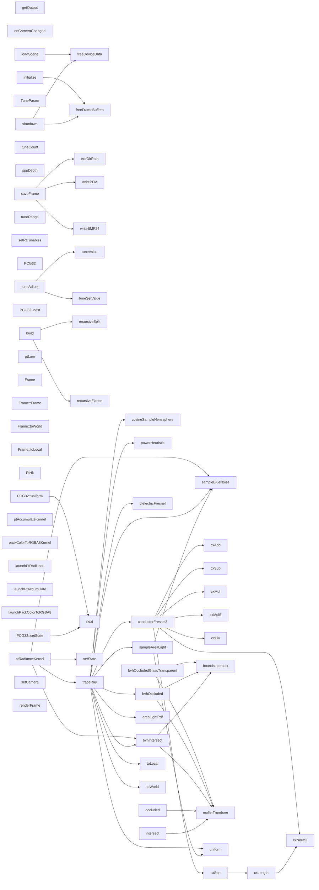

# 代码骨架：t-002（cpp）

> 状态：stale: false · 生成：2026-09-09T11:46:56+08:00

## 导出接口（63）
- `fn build`（bvh.cpp:15:1）

```cpp
void BVH::build(std::vector<FlatTriangle>&& tris)
```

- `fn recursiveSplit`（bvh.cpp:61:1）

```cpp
void BVH::recursiveSplit(BuildNode* node)
```

- `fn recursiveFlatten`（bvh.cpp:181:1）

```cpp
size_t BVH::recursiveFlatten(BuildNode* node)
```

- `fn intersect`（bvh.cpp:224:1）

```cpp
std::optional<BVH::HitResult> BVH::intersect(const Vec3& orig, const Vec3& dir, float tMin, float tMax) const
```

- `fn occluded`（bvh.cpp:281:1）

```cpp
bool BVH::occluded(const Vec3& orig, const Vec3& dir, float tMin, float tMax) const
```

- `fn initialize`（path_trace_gpu_backend.cpp:46:1）

```cpp
bool PathTraceGpuBackend::initialize(int width, int height, Display* display)
```

- `fn loadScene`（path_trace_gpu_backend.cpp:84:1）

```cpp
bool PathTraceGpuBackend::loadScene(const Scene& scene)
```

- `fn setCamera`（path_trace_gpu_backend.cpp:246:1）

```cpp
void PathTraceGpuBackend::setCamera(const OrbitCamera& camera)
```

- `fn renderFrame`（path_trace_gpu_backend.cpp:260:1）

```cpp
void PathTraceGpuBackend::renderFrame(float deltaTime)
```

- `fn getOutput`（path_trace_gpu_backend.cpp:323:1）

```cpp
RenderOutput PathTraceGpuBackend::getOutput() const
```

- `fn onCameraChanged`（path_trace_gpu_backend.cpp:327:1）

```cpp
void PathTraceGpuBackend::onCameraChanged()
```

- `fn freeDeviceData`（path_trace_gpu_backend.cpp:336:1）

```cpp
void PathTraceGpuBackend::freeDeviceData()
```

- `fn freeFrameBuffers`（path_trace_gpu_backend.cpp:347:1）

```cpp
void PathTraceGpuBackend::freeFrameBuffers()
```

- `fn shutdown`（path_trace_gpu_backend.cpp:353:1）

```cpp
void PathTraceGpuBackend::shutdown()
```

- `fn exeDirPath`（path_trace_gpu_backend.cpp:367:1）

```cpp
std::string exeDirPath()
```

- `fn writePFM`（path_trace_gpu_backend.cpp:375:1）

```cpp
bool writePFM(const std::string& path, int w, int h, const float* rgb)
```

- `fn writeBMP24`（path_trace_gpu_backend.cpp:383:1）

```cpp
bool writeBMP24(const std::string& path, int w, int h, const uint32_t* bgra)
```

- `fn saveFrame`（path_trace_gpu_backend.cpp:415:1）

```cpp
bool PathTraceGpuBackend::saveFrame(const char* baseName)
```

- `struct TuneParam`（path_trace_gpu_backend.cpp:442:1）

```cpp
struct TuneParam { const char* name; // English (keyboard channel / slider value) const char* zh; // 中文名 const char* hint; // 中文说明（tooltip） float minV, maxV, step; }
```

- `fn tuneCount`（path_trace_gpu_backend.cpp:457:1）

```cpp
int PathTraceGpuBackend::tuneCount() const
```

- `fn sppDepth`（path_trace_gpu_backend.cpp:474:1）

```cpp
int PathTraceGpuBackend::sppDepth() const
```

- `fn tuneValue`（path_trace_gpu_backend.cpp:478:1）

```cpp
float PathTraceGpuBackend::tuneValue(int index) const
```

- `fn tuneAdjust`（path_trace_gpu_backend.cpp:488:1）

```cpp
void PathTraceGpuBackend::tuneAdjust(int index, float delta)
```

- `fn tuneSetValue`（path_trace_gpu_backend.cpp:495:1）

```cpp
void PathTraceGpuBackend::tuneSetValue(int index, float value)
```

- `fn tuneRange`（path_trace_gpu_backend.cpp:507:1）

```cpp
void PathTraceGpuBackend::tuneRange(int index, float& minV, float& maxV, float& step) const
```

- `fn sampleBlueNoise`（path_trace_gpu_backend.cu:23:1）

```cpp
__device__ inline float2 sampleBlueNoise(int pixelX, int pixelY, int frameIndex)
```

- `fn setRtTunables`（path_trace_gpu_backend.cu:50:12）

```cpp
void setRtTunables(const RtTunables* t)
```

- `struct PCG32`（path_trace_gpu_backend.cu:57:1）

```cpp
struct PCG32 { uint64_t state, inc; // 初始化：state 用 init_state，流序列号用 init_seq __device__ void setState(uint64_t init_state, uint64_t init_seq) { state = 0u; inc = (init_seq << 1u) | 1u; next(); state += init_state; next(); } __device__ uint32_t next() { uint64_t old_state = stat
```

- `fn PCG32::setState`（path_trace_gpu_backend.cu:61:5）

```cpp
__device__ void setState(uint64_t init_state, uint64_t init_seq)
```

- `fn PCG32::next`（path_trace_gpu_backend.cu:69:5）

```cpp
__device__ uint32_t next()
```

- `fn PCG32::uniform`（path_trace_gpu_backend.cu:78:5）

```cpp
__device__ float uniform()
```

- `fn ptLum`（path_trace_gpu_backend.cu:84:1）

```cpp
__device__ inline float ptLum(float3 c)
```

- `struct Frame`（path_trace_gpu_backend.cu:92:1）

```cpp
struct Frame { float3 n, s, t; __device__ explicit Frame(const float3& normal) : n(normal) { // s = normalize(cross(任意非平行轴, n))；法线接近 z 轴时改用 x 轴 if (fabsf(normal.z) < 0.999f) { s = normalize(cross(make_float3(0.0f, 0.0f, 1.0f), normal)); } else { s = make_float3(1.0f, 
```

- `fn Frame::Frame`（path_trace_gpu_backend.cu:95:25）

```cpp
Frame(const float3& normal) : n(normal)
```

- `fn Frame::toWorld`（path_trace_gpu_backend.cu:106:5）

```cpp
__device__ float3 toWorld(const float3& local) const
```

- `fn Frame::toLocal`（path_trace_gpu_backend.cu:111:5）

```cpp
__device__ float3 toLocal(const float3& world) const
```

- `fn cosineSampleHemisphere`（path_trace_gpu_backend.cu:122:1）

```cpp
__device__ float3 cosineSampleHemisphere(float u1, float u2)
```

- `fn powerHeuristic`（path_trace_gpu_backend.cu:135:1）

```cpp
__device__ float powerHeuristic(float pdfJ, float pdfK)
```

- `fn cxAdd`（path_trace_gpu_backend.cu:148:1）

```cpp
__device__ ComplexF cxAdd(ComplexF a, ComplexF b)
```

- `fn cxSub`（path_trace_gpu_backend.cu:149:1）

```cpp
__device__ ComplexF cxSub(ComplexF a, ComplexF b)
```

- `fn cxMul`（path_trace_gpu_backend.cu:150:1）

```cpp
__device__ ComplexF cxMul(ComplexF a, ComplexF b)
```

- `fn cxMulS`（path_trace_gpu_backend.cu:153:1）

```cpp
__device__ ComplexF cxMulS(ComplexF a, float s)
```

- `fn cxDiv`（path_trace_gpu_backend.cu:154:1）

```cpp
__device__ ComplexF cxDiv(ComplexF a, ComplexF b)
```

- `fn cxNorm2`（path_trace_gpu_backend.cu:159:1）

```cpp
__device__ float cxNorm2(ComplexF a)
```

- `fn cxLength`（path_trace_gpu_backend.cu:160:1）

```cpp
__device__ float cxLength(ComplexF a)
```

- `fn cxSqrt`（path_trace_gpu_backend.cu:161:1）

```cpp
__device__ ComplexF cxSqrt(ComplexF a)
```

- `fn conductorFresnel3`（path_trace_gpu_backend.cu:172:1）

```cpp
__device__ float3 conductorFresnel3(const float3& eta, const float3& k, float cosThetaI)
```

- `fn dielectricFresnel`（path_trace_gpu_backend.cu:203:1）

```cpp
__device__ float dielectricFresnel(float etaiDivEtat, float cosThetaT, float& cosThetaI)
```

- `fn boundsIntersect`（path_trace_gpu_backend.cu:219:1）

```cpp
__device__ bool boundsIntersect( const BvhNodePod& node, const float3& orig, const float3& invDir, float tMin, float tMax)
```

- `fn mollerTrumbore`（path_trace_gpu_backend.cu:236:1）

```cpp
__device__ bool mollerTrumbore( const FlatTriPod& tri, const float3& orig, const float3& dir, float& t, float& u, float& v)
```

- `struct PtHit`（path_trace_gpu_backend.cu:263:1）

```cpp
struct PtHit { float t; float3 point; float3 normal; uint32_t materialIndex; uint32_t emissiveTriIndex; }
```

- `fn bvhIntersect`（path_trace_gpu_backend.cu:274:1）

```cpp
__device__ bool bvhIntersect( const BvhNodePod* __restrict__ nodes, const FlatTriPod* __restrict__ tris, const float3& orig, const float3& dir, int numNodes, int numTris, PtHit& hit)
```

- `fn bvhOccluded`（path_trace_gpu_backend.cu:336:1）

```cpp
__device__ bool bvhOccluded( const BvhNodePod* __restrict__ nodes, const FlatTriPod* __restrict__ tris, const float3& orig, const float3& dir, float tMin, float tMax, int numNodes, int numTris, const EmissiveTriPod* __restrict__ emissiveTris, int numEmissive)
```

- `fn bvhOccludedGlassTransparent`（path_trace_gpu_backend.cu:409:1）

```cpp
__device__ bool bvhOccludedGlassTransparent( const BvhNodePod* __restrict__ nodes, const FlatTriPod* __restrict__ tris, const PtMaterialPod* __restrict__ materials, int numMaterials, const float3& orig, const float3& dir, float tMin, float tMax, int numNodes, int numTris, const EmissiveTriPod* __res
```

- `fn sampleAreaLight`（path_trace_gpu_backend.cu:489:1）

```cpp
__device__ float3 sampleAreaLight( const EmissiveTriPod* __restrict__ emissiveTris, int numEmissive, const float3& worldPos, PCG32& rng, int pixelX, int pixelY, int frameIndex, float3& lightDir, float3& lightNormal, float& lightPdf, float& lightDist)
```

- `fn areaLightPdf`（path_trace_gpu_backend.cu:536:1）

```cpp
__device__ float areaLightPdf( const EmissiveTriPod* __restrict__ emissiveTris, int numEmissive, const float3& worldPos, const float3& dir, uint32_t emissiveTriIndex)
```

- `fn traceRay`（path_trace_gpu_backend.cu:578:1）

```cpp
__device__ float3 traceRay( const BvhNodePod* __restrict__ nodes, const FlatTriPod* __restrict__ tris, const PtMaterialPod* __restrict__ materials, const EmissiveTriPod* __restrict__ emissiveTris, int numNodes, int numTris, int numMaterials, int numEmissive, float3 orig, float3 dir, int maxDepth, PC
```

- `fn ptRadianceKernel`（path_trace_gpu_backend.cu:744:1）

```cpp
__global__ void __launch_bounds__(256, 4) ptRadianceKernel( float3* __restrict__ d_radiance, const BvhNodePod* __restrict__ d_nodes, const FlatTriPod* __restrict__ d_triangles, const PtMaterialPod* __restrict__ d_materials, const EmissiveTriPod* __restrict__ d_emissiveTris, int width, int height, Pt
```

- `fn ptAccumulateKernel`（path_trace_gpu_backend.cu:808:1）

```cpp
__global__ void ptAccumulateKernel( float* __restrict__ d_accum, const float3* __restrict__ d_radiance, int width, int height, int spp)
```

- `fn packColorToRGBA8Kernel`（path_trace_gpu_backend.cu:834:1）

```cpp
__global__ void packColorToRGBA8Kernel( const float3* __restrict__ src, uint32_t* __restrict__ dst, int width, int height)
```

- `fn launchPtRadiance`（path_trace_gpu_backend.cu:865:1）

```cpp
extern "C" void launchPtRadiance( float* d_radiance, const BvhNodePod* d_nodes, const FlatTriPod* d_triangles, const PtMaterialPod* d_materials, const EmissiveTriPod* d_emissiveTris, int width, int height, const PtGpuParams* params)
```

- `fn launchPtAccumulate`（path_trace_gpu_backend.cu:882:1）

```cpp
extern "C" void launchPtAccumulate( float* d_accum, const float* d_radiance, int width, int height, int spp)
```

- `fn launchPackColorToRGBA8`（path_trace_gpu_backend.cu:896:1）

```cpp
extern "C" void launchPackColorToRGBA8( const void* src, uint32_t* dst, int width, int height)
```

## 调用关系



## 调用边（70）
- build → recursiveSplit（bvh.cpp:38:5）
- build → recursiveFlatten（bvh.cpp:41:5）
- intersect → mollerTrumbore（bvh.cpp:261:21）
- occluded → mollerTrumbore（bvh.cpp:312:21）
- initialize → freeFrameBuffers（path_trace_gpu_backend.cpp:73:9）
- loadScene → freeDeviceData（path_trace_gpu_backend.cpp:86:5）
- loadScene → freeDeviceData（path_trace_gpu_backend.cpp:148:31）
- loadScene → freeDeviceData（path_trace_gpu_backend.cpp:151:31）
- loadScene → freeDeviceData（path_trace_gpu_backend.cpp:170:31）
- loadScene → freeDeviceData（path_trace_gpu_backend.cpp:173:31）
- loadScene → freeDeviceData（path_trace_gpu_backend.cpp:195:31）
- loadScene → freeDeviceData（path_trace_gpu_backend.cpp:198:31）
- loadScene → freeDeviceData（path_trace_gpu_backend.cpp:235:35）
- loadScene → freeDeviceData（path_trace_gpu_backend.cpp:238:35）
- shutdown → freeDeviceData（path_trace_gpu_backend.cpp:354:5）
- shutdown → freeFrameBuffers（path_trace_gpu_backend.cpp:355:5）
- saveFrame → exeDirPath（path_trace_gpu_backend.cpp:428:23）
- saveFrame → writePFM（path_trace_gpu_backend.cpp:431:24）
- saveFrame → writeBMP24（path_trace_gpu_backend.cpp:432:24）
- tuneAdjust → tuneSetValue（path_trace_gpu_backend.cpp:492:5）
- tuneAdjust → tuneValue（path_trace_gpu_backend.cpp:492:25）
- PCG32::setState → next（path_trace_gpu_backend.cu:64:9）
- PCG32::setState → next（path_trace_gpu_backend.cu:66:9）
- PCG32::uniform → next（path_trace_gpu_backend.cu:79:35）
- cxLength → cxNorm2（path_trace_gpu_backend.cu:160:54）
- cxSqrt → cxLength（path_trace_gpu_backend.cu:162:17）
- conductorFresnel3 → cxDiv（path_trace_gpu_backend.cu:182:27）
- conductorFresnel3 → cxMul（path_trace_gpu_backend.cu:182:57）
- conductorFresnel3 → cxSqrt（path_trace_gpu_backend.cu:183:27）
- conductorFresnel3 → cxSub（path_trace_gpu_backend.cu:183:34）
- conductorFresnel3 → cxDiv（path_trace_gpu_backend.cu:185:27）
- conductorFresnel3 → cxSub（path_trace_gpu_backend.cu:185:33）
- conductorFresnel3 → cxMulS（path_trace_gpu_backend.cu:185:39）
- conductorFresnel3 → cxAdd（path_trace_gpu_backend.cu:186:33）
- conductorFresnel3 → cxMulS（path_trace_gpu_backend.cu:186:39）
- conductorFresnel3 → cxMul（path_trace_gpu_backend.cu:188:26）
- conductorFresnel3 → cxDiv（path_trace_gpu_backend.cu:189:27）
- conductorFresnel3 → cxSub（path_trace_gpu_backend.cu:189:33）
- conductorFresnel3 → cxAdd（path_trace_gpu_backend.cu:190:33）
- conductorFresnel3 → cxNorm2（path_trace_gpu_backend.cu:191:28）
- conductorFresnel3 → cxNorm2（path_trace_gpu_backend.cu:191:46）
- bvhIntersect → boundsIntersect（path_trace_gpu_backend.cu:292:14）
- bvhIntersect → mollerTrumbore（path_trace_gpu_backend.cu:311:21）
- bvhOccluded → boundsIntersect（path_trace_gpu_backend.cu:378:14）
- bvhOccluded → mollerTrumbore（path_trace_gpu_backend.cu:395:21）
- bvhOccludedGlassTransparent → boundsIntersect（path_trace_gpu_backend.cu:451:14）
- bvhOccludedGlassTransparent → mollerTrumbore（path_trace_gpu_backend.cu:471:21）
- sampleAreaLight → uniform（path_trace_gpu_backend.cu:503:32）
- sampleAreaLight → sampleBlueNoise（path_trace_gpu_backend.cu:514:17）
- traceRay → bvhIntersect（path_trace_gpu_backend.cu:604:21）
- traceRay → areaLightPdf（path_trace_gpu_backend.cu:620:34）
- traceRay → powerHeuristic（path_trace_gpu_backend.cu:623:30）
- traceRay → toLocal（path_trace_gpu_backend.cu:632:26）
- traceRay → uniform（path_trace_gpu_backend.cu:640:21）
- traceRay → conductorFresnel3（path_trace_gpu_backend.cu:650:25）
- traceRay → toWorld（path_trace_gpu_backend.cu:654:23）
- traceRay → dielectricFresnel（path_trace_gpu_backend.cu:671:24）
- traceRay → uniform（path_trace_gpu_backend.cu:673:17）
- traceRay → toWorld（path_trace_gpu_backend.cu:676:26）
- traceRay → toWorld（path_trace_gpu_backend.cu:683:26）
- traceRay → sampleAreaLight（path_trace_gpu_backend.cu:701:29）
- traceRay → bvhOccluded（path_trace_gpu_backend.cu:707:26）
- traceRay → powerHeuristic（path_trace_gpu_backend.cu:713:40）
- traceRay → sampleBlueNoise（path_trace_gpu_backend.cu:721:25）
- traceRay → cosineSampleHemisphere（path_trace_gpu_backend.cu:722:30）
- traceRay → toWorld（path_trace_gpu_backend.cu:726:30）
- ptRadianceKernel → sampleBlueNoise（path_trace_gpu_backend.cu:765:21）
- ptRadianceKernel → bvhIntersect（path_trace_gpu_backend.cu:780:14）
- ptRadianceKernel → setState（path_trace_gpu_backend.cu:788:9）
- ptRadianceKernel → traceRay（path_trace_gpu_backend.cu:793:21）