# 代码骨架：engram-arch-constitution（rust）

> 状态：stale: false · 生成：2026-09-09T08:15:28+08:00

## 导出接口（49）
- `fn init_chain`（chain.rs:26:1）

```rust
pub fn init_chain(root: &Path, mode: ScanMode) -> Result<ChainSnapshot, String>
```

- `fn refresh_ai_guide_if_stale`（chain.rs:58:1）

```rust
pub fn refresh_ai_guide_if_stale(root: &Path) -> Result<(bool, String), String>
```

- `fn append_log`（chain.rs:92:1）

```rust
pub fn append_log(dir: &Path, text: &str) -> Result<String, String>
```

- `fn get_process_log`（chain.rs:119:1）

```rust
pub fn get_process_log(dir: &Path) -> Result<String, String>
```

- `fn snapshot_chain`（chain.rs:142:1）

```rust
pub fn snapshot_chain(dir: &Path, tag: &str) -> Result<String, String>
```

- `fn list_snapshots`（chain.rs:190:1）

```rust
pub fn list_snapshots(dir: &Path) -> Result<Vec<SnapshotMeta>, String>
```

- `fn read_snapshot`（chain.rs:202:1）

```rust
pub fn read_snapshot(dir: &Path, snap_id: &str) -> Result<ChainSnapshot, String>
```

- `fn fold_chain`（chain.rs:221:1）

```rust
pub fn fold_chain(dir: &Path, node_id: &str, mode: ScanMode) -> Result<ChainSnapshot, String>
```

- `struct Workspace`（mod.rs:29:1）

```rust
pub struct Workspace { pub root: PathBuf, pub mode: ScanMode, pub(crate) stats: std::sync::Mutex<crate::stats::StatsStore>, pub(crate) index: std::sync::Mutex<crate::index::IndexStore>, }
```

- `impl impl Workspace`（mod.rs:36:1）

```rust
impl Workspace
```

- `fn impl Workspace::open`（mod.rs:39:5）

```rust
pub fn open(root: PathBuf) -> Result<Self, String>
```

- `fn impl Workspace::bump_clock`（mod.rs:65:5）

```rust
pub fn bump_clock(&self) -> Result<(), String>
```

- `fn impl Workspace::touch_write`（mod.rs:73:5）

```rust
pub fn touch_write(&self, id: &str) -> Result<(), String>
```

- `fn impl Workspace::touch_read`（mod.rs:83:5）

```rust
pub fn touch_read(&self, id: &str) -> Result<(), String>
```

- `fn impl Workspace::touch_read_feedback`（mod.rs:94:5）

```rust
pub fn touch_read_feedback(&self, id: &str, derived: bool) -> Result<(), String>
```

- `fn impl Workspace::params`（mod.rs:105:5）

```rust
pub fn params(&self) -> Result<crate::stats::Params, String>
```

- `fn impl Workspace::mark_index_stale`（mod.rs:115:5）

```rust
pub fn mark_index_stale(&self, id: &str) -> Result<(), String>
```

- `fn impl Workspace::audit`（mod.rs:122:5）

```rust
pub fn audit(&self, action: &str, node_id: &str, detail: &str)
```

- `fn impl Workspace::record_conflict`（mod.rs:129:5）

```rust
pub fn record_conflict(&self) -> Result<(), String>
```

- `fn impl Workspace::mode_str`（mod.rs:138:5）

```rust
pub fn mode_str(&self) -> &'static str
```

- `fn impl Workspace::guide_version`（mod.rs:142:5）

```rust
pub fn guide_version(&self) -> u32
```

- `fn impl Workspace::scan`（mod.rs:162:5）

```rust
pub(crate) fn scan(&self) -> Result<crate::model::chain::ChainSnapshot, String>
```

- `fn atomic_write`（mod.rs:173:1）

```rust
pub fn atomic_write(path: &Path, content: &str) -> Result<(), String>
```

- `fn atomic_write_bytes`（mod.rs:189:1）

```rust
pub fn atomic_write_bytes(path: &Path, content: &[u8]) -> Result<(), String>
```

- `fn parse_lenient`（mod.rs:205:1）

```rust
pub fn parse_lenient(raw: &str, node_id: &str) -> Result<(serde_yaml::Mapping, String), String>
```

- `fn get_overview`（mod.rs:258:1）

```rust
pub fn get_overview(ctx: &Workspace) -> Result<Value, String>
```

- `fn search`（mod.rs:275:1）

```rust
pub fn search(ctx: &Workspace, query: &str, limit: Option<usize>) -> Result<Value, String>
```

- `fn search_impl`（mod.rs:279:1）

```rust
pub(crate) fn search_impl( ctx: &Workspace, query: &str, limit: Option<usize>, touch_stats: bool, ) -> Result<Value, String>
```

- `fn read_node`（mod.rs:352:1）

```rust
pub fn read_node( ctx: &Workspace, id: &str, include_neighbors: Option<bool>, ) -> Result<Value, String>
```

- `fn expand`（mod.rs:395:1）

```rust
pub fn expand(ctx: &Workspace, id: &str, depth: Option<u32>) -> Result<Value, String>
```

- `fn read_path`（mod.rs:456:1）

```rust
pub fn read_path(ctx: &Workspace, from: &str, to: &str) -> Result<Value, String>
```

- `fn get_guide`（mod.rs:547:1）

```rust
pub fn get_guide(ctx: &Workspace) -> Result<Value, String>
```

- `fn create_node`（mod.rs:563:1）

```rust
pub fn create_node( ctx: &Workspace, title: &str, body: Option<&str>, tags: Option<Vec<String>>, force: Option<bool>, ) -> Result<Value, String>
```

- `fn create_node_impl`（mod.rs:573:1）

```rust
pub(crate) fn create_node_impl( ctx: &Workspace, title: &str, body: Option<&str>, tags: Option<Vec<String>>, force: Option<bool>, embedder_override: Option<&dyn crate::embed::Embedder>, ) -> Result<Value, String>
```

- `fn update_node`（mod.rs:750:1）

```rust
pub fn update_node( ctx: &Workspace, id: &str, mode: &str, content: &str, expected_updated: Option<&str>, ) -> Result<Value, String>
```

- `fn link_nodes`（mod.rs:866:1）

```rust
pub fn link_nodes( ctx: &Workspace, from: &str, to: &str, rel_type: &str, desc: Option<&str>, ) -> Result<Value, String>
```

- `fn recall`（mod.rs:948:1）

```rust
pub fn recall( ctx: &Workspace, query: &str, k: Option<usize>, include_archived: bool, ) -> Result<Value, String>
```

- `fn node_memory_info`（mod.rs:961:1）

```rust
pub fn node_memory_info(ctx: &Workspace, id: &str) -> Result<Value, String>
```

- `fn consolidate`（mod.rs:1009:1）

```rust
pub fn consolidate( ctx: &Workspace, targets: Option<Vec<String>>, dry_run: Option<bool>, k: Option<usize>, ) -> Result<Value, String>
```

- `fn archive_node`（mod.rs:1102:1）

```rust
pub fn archive_node( ctx: &Workspace, id: &str, reason: Option<&str>, ) -> Result<Value, String>
```

- `fn unlink_nodes`（mod.rs:1187:1）

```rust
pub fn unlink_nodes(ctx: &Workspace, from: &str, to: &str) -> Result<Value, String>
```

- `impl impl Embedder for Stub`（mod.rs:1725:9）

```rust
impl Embedder for Stub
```

- `struct CreateNodeInput`（node_edit.rs:21:1）

```rust
pub struct CreateNodeInput { /// 可选；缺省自动生成 node-N pub id: Option<String>, pub title: String, /// goal/design/task/verification；缺省 task #[serde(default)] pub node_type: Option<String>, /// pending/in_progress/success/failed/blocked；缺省 pending #[serde(default)] pub status
```

- `fn is_safe_id`（node_edit.rs:51:1）

```rust
pub fn is_safe_id(id: &str) -> bool
```

- `fn auto_id`（node_edit.rs:61:1）

```rust
pub fn auto_id(nodes_dir: &std::path::Path) -> String
```

- `fn create_node`（node_edit.rs:89:1）

```rust
pub fn create_node( root: &Path, input: &CreateNodeInput, mode: ScanMode, ) -> Result<ChainSnapshot, String>
```

- `fn delete_node`（node_edit.rs:141:1）

```rust
pub fn delete_node(root: &Path, node_id: &str, mode: ScanMode) -> Result<ChainSnapshot, String>
```

- `fn set_parent`（node_edit.rs:161:1）

```rust
pub fn set_parent( root: &Path, node_id: &str, parent: Option<String>, mode: ScanMode, rel: Option<String>, ) -> Result<ChainSnapshot, String>
```

- `fn update_node_fields`（node_edit.rs:219:1）

```rust
pub fn update_node_fields( root: &Path, node_id: &str, fields: &UpdateFields, mode: ScanMode, ) -> Result<ChainSnapshot, String>
```

## 调用关系

```mermaid
flowchart LR
  n100["tests::node_memory_info_visualization"]
  n101["tests::recall_then_read_node_positive_sample"]
  n102["tests::dup_feedback_tp_and_fp_counters"]
  n103["normalize_type"]
  n104["normalize_status"]
  n105["normalize_rel"]
  n106["tests::test_create_node_auto_id_and_defaults"]
  n107["tests::test_create_node_with_parent_link"]
  n108["tests::test_create_node_rejects_analysis_mode"]
  n109["tests::test_delete_node"]
  n10["impl Workspace"]
  n110["tests::test_set_parent_connect_and_disconnect"]
  n111["tests::test_update_title"]
  n112["tests::test_update_status"]
  n113["tests::test_update_tags"]
  n114["tests::test_update_node_not_found"]
  n115["tests::test_update_body_empty"]
  n116["tests::test_update_evidence"]
  n117["tests::test_update_writes_valid_rfc3339_updated"]
  n118["tests::test_atomic_write_leaves_no_tmp_residue"]
  n11["impl Workspace::open"]
  n12["impl Workspace::bump_clock"]
  n13["impl Workspace::touch_write"]
  n14["impl Workspace::touch_read"]
  n15["impl Workspace::touch_read_feedback"]
  n16["impl Workspace::params"]
  n17["impl Workspace::mark_index_stale"]
  n18["impl Workspace::audit"]
  n19["impl Workspace::record_conflict"]
  n1["init_chain"]
  n20["impl Workspace::mode_str"]
  n21["impl Workspace::guide_version"]
  n22["impl Workspace::scan"]
  n23["atomic_write"]
  n24["atomic_write_bytes"]
  n25["parse_lenient"]
  n26["get_overview"]
  n27["search"]
  n28["search_impl"]
  n29["read_node"]
  n2["refresh_ai_guide_if_stale"]
  n30["expand"]
  n31["read_path"]
  n32["get_guide"]
  n33["create_node"]
  n34["create_node_impl"]
  n35["update_node"]
  n36["link_nodes"]
  n37["recall"]
  n38["node_memory_info"]
  n39["consolidate"]
  n3["append_log"]
  n40["archive_node"]
  n41["unlink_nodes"]
  n42["impl Embedder for Stub"]
  n43["CreateNodeInput"]
  n44["is_safe_id"]
  n45["auto_id"]
  n46["delete_node"]
  n47["set_parent"]
  n48["update_node_fields"]
  n49["log_path"]
  n4["get_process_log"]
  n50["index_path"]
  n51["logs_dir"]
  n52["build_fold_summary"]
  n53["tests::test_init_chain_creates_structure"]
  n54["tests::test_init_chain_idempotent_for_node"]
  n55["tests::test_guide_refresh_unmarked"]
  n56["tests::test_guide_refresh_older_version"]
  n57["tests::test_guide_keep_same_version"]
  n58["tests::test_guide_keep_newer_version"]
  n59["tests::test_guide_refresh_absent"]
  n5["snapshot_chain"]
  n60["tests::test_append_creates_log_with_header"]
  n61["tests::test_append_multiple_lines"]
  n62["tests::test_append_empty_rejected"]
  n63["tests::test_get_log_missing_returns_empty"]
  n64["tests::test_snapshot_and_list"]
  n65["tests::test_read_snapshot"]
  n66["tests::test_snapshot_empty_tag_rejected"]
  n67["tests::test_list_empty"]
  n68["tests::test_fold_sub_chain"]
  n69["tests::test_fold_rejects_non_success"]
  n6["list_snapshots"]
  n70["tests::test_fold_nonexistent_node"]
  n71["tests::test_fold_rejects_failed_target"]
  n72["tests::test_fold_rejects_blocked_target"]
  n73["tests::test_fold_backs_up_target_self"]
  n74["open"]
  n75["mode_str"]
  n76["ensure_not_frozen"]
  n77["fm_get_bool"]
  n78["normalize_title_key"]
  n79["fm_get_str"]
  n7["read_snapshot"]
  n80["tests::ctx_of"]
  n81["tests::create_and_read_node"]
  n82["tests::create_duplicate_title_requires_force"]
  n83["tests::update_append_then_replace"]
  n84["tests::update_optimistic_lock_conflict_not_written"]
  n85["tests::update_rejects_bad_mode_and_empty_analysis_body"]
  n86["tests::link_nodes_full_flow"]
  n87["tests::link_rejects_bad_rel_and_missing_node"]
  n88["tests::search_and_expand_and_path"]
  n89["tests::get_overview_and_guide"]
  n8["fold_chain"]
  n90["tests::archive_unlink_full_flow"]
  n91["tests::archive_prefix_idempotent_and_stats_touched"]
  n92["tests::archive_unlink_errors"]
  n93["tests::read_tools_touch_stats"]
  n94["tests::conflict_freezes_node_and_blocks_writes"]
  n95["tests::duplicate_detection_stage2_stub"]
  n96["tests::duplicate_detection_no_candidate_no_hint"]
  n97["tests::consolidate_plan_and_run_flow"]
  n98["tests::consolidate_empty_and_targets_filter"]
  n99["tests::audit_entries_appended_for_write_actions"]
  n9["Workspace"]
  n1 --> n2
  n100 --> n29
  n100 --> n38
  n101 --> n29
  n101 --> n37
  n102 --> n33
  n106 --> n33
  n107 --> n33
  n108 --> n33
  n109 --> n33
  n109 --> n46
  n11 --> n74
  n110 --> n33
  n110 --> n47
  n111 --> n48
  n112 --> n48
  n113 --> n48
  n114 --> n48
  n115 --> n48
  n116 --> n48
  n117 --> n48
  n118 --> n33
  n118 --> n48
  n20 --> n75
  n27 --> n28
  n3 --> n49
  n33 --> n103
  n33 --> n104
  n33 --> n105
  n33 --> n34
  n33 --> n44
  n33 --> n45
  n34 --> n23
  n34 --> n78
  n35 --> n23
  n35 --> n25
  n35 --> n76
  n35 --> n79
  n36 --> n23
  n36 --> n25
  n36 --> n76
  n36 --> n79
  n39 --> n23
  n4 --> n49
  n40 --> n23
  n40 --> n25
  n40 --> n76
  n40 --> n79
  n41 --> n23
  n41 --> n25
  n41 --> n76
  n41 --> n79
  n46 --> n44
  n47 --> n105
  n47 --> n44
  n5 --> n50
  n5 --> n51
  n50 --> n51
  n53 --> n1
  n54 --> n1
  n55 --> n2
  n56 --> n2
  n57 --> n2
  n58 --> n2
  n59 --> n2
  n6 --> n50
  n60 --> n3
  n60 --> n49
  n61 --> n3
  n61 --> n49
  n62 --> n3
  n63 --> n4
  n64 --> n5
  n64 --> n51
  n64 --> n6
  n65 --> n5
  n65 --> n7
  n66 --> n5
  n67 --> n6
  n68 --> n8
  n69 --> n8
  n7 --> n51
  n70 --> n8
  n71 --> n8
  n72 --> n8
  n73 --> n8
  n76 --> n77
  n8 --> n52
  n80 --> n74
  n81 --> n29
  n81 --> n33
  n82 --> n33
  n83 --> n29
  n83 --> n33
  n83 --> n35
  n84 --> n29
  n84 --> n33
  n84 --> n35
  n85 --> n33
  n86 --> n29
  n86 --> n33
  n86 --> n36
  n87 --> n33
  n88 --> n27
  n88 --> n30
  n88 --> n31
  n89 --> n26
  n89 --> n32
  n90 --> n27
  n90 --> n29
  n90 --> n33
  n90 --> n36
  n90 --> n40
  n90 --> n41
  n91 --> n33
  n91 --> n40
  n92 --> n33
  n92 --> n36
  n92 --> n40
  n92 --> n41
  n93 --> n27
  n93 --> n29
  n93 --> n30
  n93 --> n31
  n94 --> n23
  n94 --> n25
  n94 --> n29
  n94 --> n33
  n94 --> n35
  n94 --> n36
  n94 --> n40
  n94 --> n41
  n95 --> n29
  n95 --> n33
  n95 --> n34
  n96 --> n29
  n96 --> n33
  n97 --> n29
  n97 --> n33
  n97 --> n36
  n97 --> n39
  n98 --> n33
  n98 --> n36
  n98 --> n39
  n99 --> n33
  n99 --> n35
  n99 --> n36
  n99 --> n40
  n99 --> n41
```



## 调用边（200）
- init_chain → refresh_ai_guide_if_stale（chain.rs:44:9）
- append_log → log_path（chain.rs:98:16）
- get_process_log → log_path（chain.rs:120:16）
- index_path → logs_dir（chain.rs:137:5）
- snapshot_chain → logs_dir（chain.rs:150:16）
- snapshot_chain → index_path（chain.rs:175:43）
- snapshot_chain → index_path（chain.rs:176:38）
- snapshot_chain → index_path（chain.rs:184:15）
- list_snapshots → index_path（chain.rs:191:14）
- read_snapshot → logs_dir（chain.rs:203:21）
- fold_chain → build_fold_summary（chain.rs:290:19）
- tests::test_init_chain_creates_structure → init_chain（chain.rs:435:20）
- tests::test_init_chain_idempotent_for_node → init_chain（chain.rs:462:9）
- tests::test_init_chain_idempotent_for_node → init_chain（chain.rs:471:9）
- tests::test_guide_refresh_unmarked → refresh_ai_guide_if_stale（chain.rs:487:33）
- tests::test_guide_refresh_older_version → refresh_ai_guide_if_stale（chain.rs:501:33）
- tests::test_guide_keep_same_version → refresh_ai_guide_if_stale（chain.rs:520:30）
- tests::test_guide_keep_newer_version → refresh_ai_guide_if_stale（chain.rs:534:30）
- tests::test_guide_refresh_absent → refresh_ai_guide_if_stale（chain.rs:544:30）
- tests::test_append_creates_log_with_header → append_log（chain.rs:558:9）
- tests::test_append_creates_log_with_header → log_path（chain.rs:560:42）
- tests::test_append_multiple_lines → append_log（chain.rs:571:9）
- tests::test_append_multiple_lines → append_log（chain.rs:572:9）
- tests::test_append_multiple_lines → append_log（chain.rs:573:9）
- tests::test_append_multiple_lines → log_path（chain.rs:575:42）
- tests::test_append_empty_rejected → append_log（chain.rs:591:22）
- tests::test_get_log_missing_returns_empty → get_process_log（chain.rs:598:23）
- tests::test_snapshot_and_list → snapshot_chain（chain.rs:608:18）
- tests::test_snapshot_and_list → list_snapshots（chain.rs:611:20）
- tests::test_snapshot_and_list → logs_dir（chain.rs:617:25）
- tests::test_read_snapshot → snapshot_chain（chain.rs:625:18）
- tests::test_read_snapshot → read_snapshot（chain.rs:626:20）
- tests::test_snapshot_empty_tag_rejected → snapshot_chain（chain.rs:634:22）
- tests::test_list_empty → list_snapshots（chain.rs:641:20）
- tests::test_fold_sub_chain → fold_chain（chain.rs:671:20）
- tests::test_fold_rejects_non_success → fold_chain（chain.rs:701:22）
- tests::test_fold_nonexistent_node → fold_chain（chain.rs:709:22）
- tests::test_fold_rejects_failed_target → fold_chain（chain.rs:721:22）
- tests::test_fold_rejects_blocked_target → fold_chain（chain.rs:737:22）
- tests::test_fold_backs_up_target_self → fold_chain（chain.rs:745:20）
- impl Workspace::open → open（mod.rs:54:21）
- impl Workspace::open → open（mod.rs:55:21）
- impl Workspace::mode_str → mode_str（mod.rs:139:9）
- ensure_not_frozen → fm_get_bool（mod.rs:247:8）
- search → search_impl（mod.rs:276:5）
- create_node → create_node_impl（mod.rs:570:5）
- create_node_impl → normalize_title_key（mod.rs:623:19）
- create_node_impl → normalize_title_key（mod.rs:628:25）
- create_node_impl → atomic_write（mod.rs:706:5）
- update_node → parse_lenient（mod.rs:770:9）
- update_node → ensure_not_frozen（mod.rs:775:5）
- update_node → fm_get_str（mod.rs:779:23）
- update_node → fm_get_str（mod.rs:781:29）
- update_node → atomic_write（mod.rs:808:13）
- update_node → atomic_write（mod.rs:848:5）
- link_nodes → parse_lenient（mod.rs:901:26）
- link_nodes → ensure_not_frozen（mod.rs:902:5）
- link_nodes → fm_get_str（mod.rs:927:17）
- link_nodes → atomic_write（mod.rs:932:5）
- consolidate → atomic_write（mod.rs:1064:13）
- archive_node → parse_lenient（mod.rs:1129:26）
- archive_node → ensure_not_frozen（mod.rs:1130:5）
- archive_node → fm_get_str（mod.rs:1131:21）
- archive_node → atomic_write（mod.rs:1159:5）
- unlink_nodes → parse_lenient（mod.rs:1213:26）
- unlink_nodes → ensure_not_frozen（mod.rs:1214:5）
- unlink_nodes → fm_get_str（mod.rs:1215:22）
- unlink_nodes → fm_get_str（mod.rs:1222:23）
- unlink_nodes → atomic_write（mod.rs:1238:5）
- tests::ctx_of → open（mod.rs:1268:9）
- tests::create_and_read_node → create_node（mod.rs:1299:17）
- tests::create_and_read_node → read_node（mod.rs:1310:17）
- tests::create_duplicate_title_requires_force → create_node（mod.rs:1321:9）
- tests::create_duplicate_title_requires_force → create_node（mod.rs:1322:19）
- tests::create_duplicate_title_requires_force → create_node（mod.rs:1325:17）
- tests::update_append_then_replace → create_node（mod.rs:1340:9）
- tests::update_append_then_replace → update_node（mod.rs:1342:18）
- tests::update_append_then_replace → read_node（mod.rs:1344:17）
- tests::update_append_then_replace → update_node（mod.rs:1348:9）
- tests::update_append_then_replace → read_node（mod.rs:1349:17）
- tests::update_optimistic_lock_conflict_not_written → create_node（mod.rs:1358:9）
- tests::update_optimistic_lock_conflict_not_written → read_node（mod.rs:1359:17）
- tests::update_optimistic_lock_conflict_not_written → update_node（mod.rs:1363:9）
- tests::update_optimistic_lock_conflict_not_written → update_node（mod.rs:1367:19）
- tests::update_optimistic_lock_conflict_not_written → read_node（mod.rs:1376:18）
- tests::update_rejects_bad_mode_and_empty_analysis_body → create_node（mod.rs:1396:9）
- tests::link_nodes_full_flow → create_node（mod.rs:1415:9）
- tests::link_nodes_full_flow → create_node（mod.rs:1416:9）
- tests::link_nodes_full_flow → link_nodes（mod.rs:1417:17）
- tests::link_nodes_full_flow → link_nodes（mod.rs:1435:9）
- tests::link_nodes_full_flow → read_node（mod.rs:1436:21）
- tests::link_rejects_bad_rel_and_missing_node → create_node（mod.rs:1444:9）
- tests::link_rejects_bad_rel_and_missing_node → create_node（mod.rs:1445:9）
- tests::search_and_expand_and_path → search（mod.rs:1473:17）
- tests::search_and_expand_and_path → expand（mod.rs:1479:17）
- tests::search_and_expand_and_path → read_path（mod.rs:1484:17）
- tests::search_and_expand_and_path → read_path（mod.rs:1499:18）
- tests::get_overview_and_guide → get_overview（mod.rs:1509:17）
- tests::get_overview_and_guide → get_guide（mod.rs:1514:17）
- tests::archive_unlink_full_flow → create_node（mod.rs:1525:9）
- tests::archive_unlink_full_flow → create_node（mod.rs:1526:9）
- tests::archive_unlink_full_flow → link_nodes（mod.rs:1527:9）
- tests::archive_unlink_full_flow → unlink_nodes（mod.rs:1530:17）
- tests::archive_unlink_full_flow → read_node（mod.rs:1535:21）
- tests::archive_unlink_full_flow → link_nodes（mod.rs:1543:9）
- tests::archive_unlink_full_flow → archive_node（mod.rs:1544:17）
- tests::archive_unlink_full_flow → read_node（mod.rs:1564:17）
- tests::archive_unlink_full_flow → search（mod.rs:1569:17）
- tests::archive_unlink_full_flow → archive_node（mod.rs:1573:19）
- tests::archive_unlink_full_flow → unlink_nodes（mod.rs:1576:19）
- tests::archive_prefix_idempotent_and_stats_touched → create_node（mod.rs:1584:9）
- tests::archive_prefix_idempotent_and_stats_touched → archive_node（mod.rs:1585:9）
- tests::archive_unlink_errors → create_node（mod.rs:1602:9）
- tests::archive_unlink_errors → create_node（mod.rs:1603:9）
- tests::archive_unlink_errors → unlink_nodes（mod.rs:1607:19）
- tests::archive_unlink_errors → link_nodes（mod.rs:1612:9）
- tests::archive_unlink_errors → unlink_nodes（mod.rs:1613:9）
- tests::archive_unlink_errors → archive_node（mod.rs:1619:19）
- tests::archive_unlink_errors → unlink_nodes（mod.rs:1621:19）
- tests::archive_unlink_errors → link_nodes（mod.rs:1624:19）
- tests::read_tools_touch_stats → read_node（mod.rs:1636:9）
- tests::read_tools_touch_stats → search（mod.rs:1637:9）
- tests::read_tools_touch_stats → expand（mod.rs:1638:9）
- tests::read_tools_touch_stats → read_path（mod.rs:1639:9）
- tests::conflict_freezes_node_and_blocks_writes → create_node（mod.rs:1653:9）
- tests::conflict_freezes_node_and_blocks_writes → read_node（mod.rs:1654:17）
- tests::conflict_freezes_node_and_blocks_writes → update_node（mod.rs:1658:9）
- tests::conflict_freezes_node_and_blocks_writes → update_node（mod.rs:1661:19）
- tests::conflict_freezes_node_and_blocks_writes → read_node（mod.rs:1673:17）
- tests::conflict_freezes_node_and_blocks_writes → update_node（mod.rs:1687:19）
- tests::conflict_freezes_node_and_blocks_writes → create_node（mod.rs:1689:9）
- tests::conflict_freezes_node_and_blocks_writes → link_nodes（mod.rs:1690:19）
- tests::conflict_freezes_node_and_blocks_writes → archive_node（mod.rs:1692:19）
- tests::conflict_freezes_node_and_blocks_writes → unlink_nodes（mod.rs:1694:19）
- tests::conflict_freezes_node_and_blocks_writes → parse_lenient（mod.rs:1704:30）
- tests::conflict_freezes_node_and_blocks_writes → atomic_write（mod.rs:1711:9）
- tests::conflict_freezes_node_and_blocks_writes → update_node（mod.rs:1712:9）
- tests::conflict_freezes_node_and_blocks_writes → read_node（mod.rs:1713:17）
- tests::duplicate_detection_stage2_stub → create_node（mod.rs:1722:9）
- tests::duplicate_detection_stage2_stub → create_node_impl（mod.rs:1733:17）
- tests::duplicate_detection_stage2_stub → read_node（mod.rs:1751:21）
- tests::duplicate_detection_stage2_stub → create_node_impl（mod.rs:1756:18）
- tests::duplicate_detection_stage2_stub → read_node（mod.rs:1766:21）
- tests::duplicate_detection_no_candidate_no_hint → create_node（mod.rs:1775:9）
- tests::duplicate_detection_no_candidate_no_hint → create_node（mod.rs:1776:17）
- tests::duplicate_detection_no_candidate_no_hint → read_node（mod.rs:1782:21）
- tests::consolidate_plan_and_run_flow → create_node（mod.rs:1791:9）
- tests::consolidate_plan_and_run_flow → create_node（mod.rs:1792:9）
- tests::consolidate_plan_and_run_flow → link_nodes（mod.rs:1793:9）
- tests::consolidate_plan_and_run_flow → consolidate（mod.rs:1796:17）
- tests::consolidate_plan_and_run_flow → consolidate（mod.rs:1809:17）
- tests::consolidate_plan_and_run_flow → read_node（mod.rs:1816:17）
- tests::consolidate_empty_and_targets_filter → create_node（mod.rs:1833:9）
- tests::consolidate_empty_and_targets_filter → create_node（mod.rs:1834:9）
- tests::consolidate_empty_and_targets_filter → consolidate（mod.rs:1836:19）
- tests::consolidate_empty_and_targets_filter → link_nodes（mod.rs:1840:9）
- tests::consolidate_empty_and_targets_filter → consolidate（mod.rs:1841:19）
- tests::consolidate_empty_and_targets_filter → consolidate（mod.rs:1843:17）
- tests::audit_entries_appended_for_write_actions → create_node（mod.rs:1851:9）
- tests::audit_entries_appended_for_write_actions → update_node（mod.rs:1852:9）
- tests::audit_entries_appended_for_write_actions → create_node（mod.rs:1853:9）
- tests::audit_entries_appended_for_write_actions → link_nodes（mod.rs:1854:9）
- tests::audit_entries_appended_for_write_actions → archive_node（mod.rs:1855:9）
- tests::audit_entries_appended_for_write_actions → unlink_nodes（mod.rs:1856:9）
- tests::node_memory_info_visualization → node_memory_info（mod.rs:1883:20）
- tests::node_memory_info_visualization → read_node（mod.rs:1893:9）
- tests::node_memory_info_visualization → node_memory_info（mod.rs:1894:20）
- tests::node_memory_info_visualization → node_memory_info（mod.rs:1900:20）
- tests::recall_then_read_node_positive_sample → recall（mod.rs:1910:9）
- tests::recall_then_read_node_positive_sample → read_node（mod.rs:1911:9）
- tests::dup_feedback_tp_and_fp_counters → create_node（mod.rs:1934:9）
- tests::dup_feedback_tp_and_fp_counters → create_node（mod.rs:1936:9）
- create_node → is_safe_id（node_edit.rs:106:17）
- create_node → auto_id（node_edit.rs:111:17）
- create_node → normalize_type（node_edit.rs:124:21）
- create_node → normalize_status（node_edit.rs:125:18）
- create_node → normalize_rel（node_edit.rs:130:15）
- delete_node → is_safe_id（node_edit.rs:148:9）
- set_parent → is_safe_id（node_edit.rs:174:9）
- set_parent → normalize_rel（node_edit.rs:193:15）
- tests::test_create_node_auto_id_and_defaults → create_node（node_edit.rs:301:20）
- tests::test_create_node_auto_id_and_defaults → create_node（node_edit.rs:308:21）
- tests::test_create_node_with_parent_link → create_node（node_edit.rs:316:9）
- tests::test_create_node_with_parent_link → create_node（node_edit.rs:319:20）
- tests::test_create_node_rejects_analysis_mode → create_node（node_edit.rs:328:19）
- tests::test_delete_node → create_node（node_edit.rs:367:9）
- tests::test_delete_node → delete_node（node_edit.rs:368:20）
- tests::test_set_parent_connect_and_disconnect → create_node（node_edit.rs:376:9）
- tests::test_set_parent_connect_and_disconnect → create_node（node_edit.rs:377:9）
- tests::test_set_parent_connect_and_disconnect → set_parent（node_edit.rs:380:20）
- tests::test_set_parent_connect_and_disconnect → set_parent（node_edit.rs:392:20）
- tests::test_update_title → update_node_fields（node_edit.rs:437:20）
- tests::test_update_status → update_node_fields（node_edit.rs:461:20）
- tests::test_update_tags → update_node_fields（node_edit.rs:483:20）
- tests::test_update_node_not_found → update_node_fields（node_edit.rs:506:22）
- tests::test_update_body_empty → update_node_fields（node_edit.rs:524:22）
- tests::test_update_evidence → update_node_fields（node_edit.rs:542:20）
- tests::test_update_writes_valid_rfc3339_updated → update_node_fields（node_edit.rs:566:9）
- tests::test_atomic_write_leaves_no_tmp_residue → create_node（node_edit.rs:595:9）
- tests::test_atomic_write_leaves_no_tmp_residue → update_node_fields（node_edit.rs:596:9）