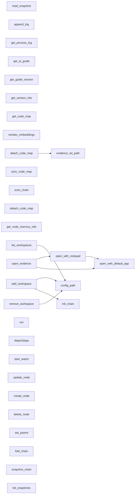

# 代码骨架：engram-gui-cli（rust）

> 状态：stale: false · 生成：2026-09-09T08:09:10+08:00

## 导出接口（29）
- `fn scan_chain`（src/commands.rs:16:1）

```rust
pub fn scan_chain( dir: String, mode: Option<String>, app: AppHandle, state: State<'_, crate::watcher::WatchState>, ) -> Result<ChainSnapshot, String>
```

- `fn update_node`（src/commands.rs:48:1）

```rust
pub fn update_node( dir: String, node_id: String, fields: UpdateFields, mode: Option<String>, ) -> Result<ChainSnapshot, String>
```

- `fn create_node`（src/commands.rs:62:1）

```rust
pub fn create_node( dir: String, input: CreateNodeInput, mode: Option<String>, ) -> Result<ChainSnapshot, String>
```

- `fn delete_node`（src/commands.rs:75:1）

```rust
pub fn delete_node( dir: String, node_id: String, mode: Option<String>, ) -> Result<ChainSnapshot, String>
```

- `fn set_parent`（src/commands.rs:88:1）

```rust
pub fn set_parent( dir: String, node_id: String, parent: Option<String>, mode: Option<String>, rel: Option<String>, ) -> Result<ChainSnapshot, String>
```

- `fn init_chain`（src/commands.rs:105:1）

```rust
pub fn init_chain(dir: String, mode: Option<String>) -> Result<ChainSnapshot, String>
```

- `fn fold_chain`（src/commands.rs:114:1）

```rust
pub fn fold_chain( dir: String, node_id: String, mode: Option<String>, ) -> Result<ChainSnapshot, String>
```

- `fn snapshot_chain`（src/commands.rs:127:1）

```rust
pub fn snapshot_chain(dir: String, tag: String) -> Result<String, String>
```

- `fn list_snapshots`（src/commands.rs:132:1）

```rust
pub fn list_snapshots(dir: String) -> Result<Vec<engram_core::model::chain::SnapshotMeta>, String>
```

- `fn read_snapshot`（src/commands.rs:137:1）

```rust
pub fn read_snapshot(dir: String, snap_id: String) -> Result<ChainSnapshot, String>
```

- `fn append_log`（src/commands.rs:142:1）

```rust
pub fn append_log(dir: String, text: String) -> Result<String, String>
```

- `fn get_process_log`（src/commands.rs:147:1）

```rust
pub fn get_process_log(dir: String) -> Result<String, String>
```

- `fn get_ai_guide`（src/commands.rs:155:1）

```rust
pub fn get_ai_guide(mode: Option<String>) -> String
```

- `fn get_guide_version`（src/commands.rs:161:1）

```rust
pub fn get_guide_version(mode: Option<String>) -> u32
```

- `fn get_version_info`（src/commands.rs:167:1）

```rust
pub fn get_version_info(app: AppHandle) -> Result<engram_core::version::VersionInfo, String>
```

- `fn get_code_map`（src/commands.rs:178:1）

```rust
pub fn get_code_map(dir: String, node_id: String) -> Result<Option<String>, String>
```

- `fn reindex_embeddings`（src/commands.rs:187:1）

```rust
pub fn reindex_embeddings(dir: String) -> Result<String, String>
```

- `fn attach_code_map`（src/commands.rs:201:1）

```rust
pub fn attach_code_map( dir: String, node_id: String, abs_source: String, ) -> Result<ChainSnapshot, String>
```

- `fn sync_code_map`（src/commands.rs:216:1）

```rust
pub fn sync_code_map(dir: String, node_id: String) -> Result<Option<String>, String>
```

- `fn detach_code_map`（src/commands.rs:224:1）

```rust
pub fn detach_code_map(dir: String, node_id: String) -> Result<ChainSnapshot, String>
```

- `fn get_node_memory_info`（src/commands.rs:234:1）

```rust
pub fn get_node_memory_info(dir: String, node_id: String) -> Result<serde_json::Value, String>
```

- `fn evidence_rel_path`（src/commands.rs:243:1）

```rust
pub fn evidence_rel_path(dir: String, abs: String) -> Result<String, String>
```

- `fn open_evidence`（src/commands.rs:250:1）

```rust
pub fn open_evidence(dir: String, rel: String) -> Result<(), String>
```

- `fn list_workspaces`（src/commands.rs:360:1）

```rust
pub fn list_workspaces(app: AppHandle) -> Result<Vec<WorkspaceInfo>, String>
```

- `fn add_workspace`（src/commands.rs:376:1）

```rust
pub fn add_workspace( dir: String, mode: String, app: AppHandle, ) -> Result<Vec<WorkspaceInfo>, String>
```

- `fn remove_workspace`（src/commands.rs:424:1）

```rust
pub fn remove_workspace(dir: String, app: AppHandle) -> Result<Vec<WorkspaceInfo>, String>
```

- `fn run`（src/lib.rs:8:1）

```rust
pub fn run()
```

- `struct WatchState`（src/watcher.rs:11:1）

```rust
pub struct WatchState { pub watcher: Mutex<Option<RecommendedWatcher>>, pub mode: Arc<Mutex<ScanMode>>, pub dir: Mutex<Option<PathBuf>>, }
```

- `fn start_watch`（src/watcher.rs:19:1）

```rust
pub fn start_watch( dir: PathBuf, app: AppHandle, state: &WatchState, mode: Arc<Mutex<ScanMode>>, ) -> Result<(), String>
```

## 调用关系



## 调用边（8）
- attach_code_map → evidence_rel_path（src/commands.rs:207:15）
- open_evidence → open_with_notepad（src/commands.rs:254:9）
- open_evidence → open_with_default_app（src/commands.rs:256:9）
- open_with_notepad → open_with_default_app（src/commands.rs:273:9）
- list_workspaces → config_path（src/commands.rs:361:13）
- add_workspace → init_chain（src/commands.rs:396:9）
- add_workspace → config_path（src/commands.rs:405:13）
- remove_workspace → config_path（src/commands.rs:425:13）