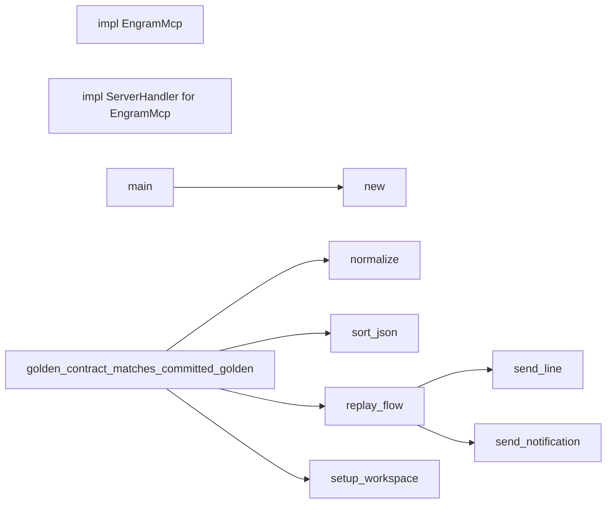

# 代码骨架：engram-mcp-contract（rust）

> 状态：stale: false · 生成：2026-09-09T08:09:10+08:00

## 导出接口（2）
- `impl impl EngramMcp`（src/main.rs:152:1）

```rust
impl EngramMcp
```

- `impl impl ServerHandler for EngramMcp`（src/main.rs:318:1）

```rust
impl ServerHandler for EngramMcp
```

## 调用关系



## 调用边（10）
- main → new（src/main.rs:366:18）
- replay_flow → send_line（tests/golden_contract.rs:138:13）
- replay_flow → send_notification（tests/golden_contract.rs:147:5）
- replay_flow → send_line（tests/golden_contract.rs:155:24）
- golden_contract_matches_committed_golden → setup_workspace（tests/golden_contract.rs:214:14）
- golden_contract_matches_committed_golden → replay_flow（tests/golden_contract.rs:215:19）
- golden_contract_matches_committed_golden → normalize（tests/golden_contract.rs:235:20）
- golden_contract_matches_committed_golden → normalize（tests/golden_contract.rs:236:23）
- golden_contract_matches_committed_golden → sort_json（tests/golden_contract.rs:238:22）
- golden_contract_matches_committed_golden → sort_json（tests/golden_contract.rs:239:25）