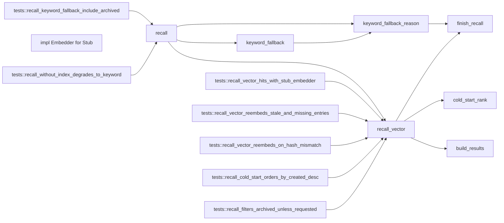

# 代码骨架：engram-memory-l2（rust）

> 状态：stale: false · 生成：2026-09-09T08:09:11+08:00

## 导出接口（2）
- `fn recall`（retrieval.rs:13:1）

```rust
pub fn recall( ctx: &Workspace, query: &str, k: Option<usize>, include_archived: bool, ) -> Result<Value, String>
```

- `impl impl Embedder for Stub`（retrieval.rs:439:5）

```rust
impl Embedder for Stub
```

## 调用关系



## 调用边（19）
- recall → keyword_fallback（retrieval.rs:32:19）
- recall → keyword_fallback_reason（retrieval.rs:37:19）
- recall → recall_vector（retrieval.rs:46:5）
- recall_vector → cold_start_rank（retrieval.rs:141:22）
- recall_vector → build_results（retrieval.rs:142:23）
- recall_vector → finish_recall（retrieval.rs:143:9）
- recall_vector → build_results（retrieval.rs:187:23）
- recall_vector → finish_recall（retrieval.rs:193:9）
- keyword_fallback → keyword_fallback_reason（retrieval.rs:268:5）
- keyword_fallback_reason → finish_recall（retrieval.rs:330:5）
- tests::recall_without_index_degrades_to_keyword → recall（retrieval.rs:487:17）
- tests::recall_vector_hits_with_stub_embedder → recall_vector（retrieval.rs:524:17）
- tests::recall_vector_reembeds_stale_and_missing_entries → recall_vector（retrieval.rs:560:17）
- tests::recall_vector_reembeds_on_hash_mismatch → recall_vector（retrieval.rs:594:17）
- tests::recall_cold_start_orders_by_created_desc → recall_vector（retrieval.rs:618:17）
- tests::recall_filters_archived_unless_requested → recall_vector（retrieval.rs:657:17）
- tests::recall_filters_archived_unless_requested → recall_vector（retrieval.rs:668:18）
- tests::recall_keyword_fallback_include_archived → recall（retrieval.rs:687:17）
- tests::recall_keyword_fallback_include_archived → recall（retrieval.rs:692:18）