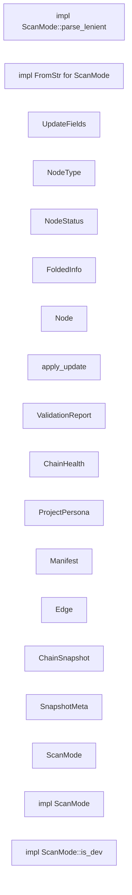

# 代码骨架：engram-model-profile（rust）

> 状态：stale: false · 生成：2026-09-09T08:09:11+08:00

## 导出接口（18）
- `struct ChainHealth`（chain.rs:6:1）

```rust
pub struct ChainHealth { pub blocked_count: usize, pub failed_count: usize, pub in_progress_count: usize, pub pending_count: usize, pub success_count: usize, pub root_goal: String, }
```

- `struct ProjectPersona`（chain.rs:16:1）

```rust
pub struct ProjectPersona { pub domain: String, pub tech_stack: Vec<String>, pub coding_style: String, pub key_conventions: Vec<String>, }
```

- `struct Manifest`（chain.rs:24:1）

```rust
pub struct Manifest { pub root: PathBuf, pub node_count: usize, pub edge_count: usize, pub generated_at: String, /// ≤200 token 紧凑树状摘要，只展示非 success 节点，供 AI 快速恢复全局认知 pub active_chain: String, /// 各状态节点计数 + 根目标标题，一眼看清工
```

- `struct Edge`（chain.rs:39:1）

```rust
pub struct Edge { pub parent: String, pub child: String, /// v2.4 关系类型：contains（默认）/ solves / alternative #[serde(default = "default_edge_rel")] pub rel: String, }
```

- `struct ChainSnapshot`（chain.rs:52:1）

```rust
pub struct ChainSnapshot { /// 活跃节点（未归档；唯一事实源 .chain/nodes/ 中 archived != true 的文件） pub nodes: Vec<crate::model::node::Node>, pub edges: Vec<Edge>, /// v2.10 M7'：归档节点列表（frontmatter archived: true，或位于 .chain/archive/ 下）。 /// 与 node
```

- `struct SnapshotMeta`（chain.rs:66:1）

```rust
pub struct SnapshotMeta { pub id: String, pub tag: String, pub created_at: String, pub node_count: usize, pub edge_count: usize, }
```

- `enum ScanMode`（mod.rs:14:1）

```rust
pub enum ScanMode { Analysis, Dev, }
```

- `impl impl ScanMode`（mod.rs:19:1）

```rust
impl ScanMode
```

- `fn impl ScanMode::is_dev`（mod.rs:20:5）

```rust
pub fn is_dev(self) -> bool
```

- `fn impl ScanMode::parse_lenient`（mod.rs:25:5）

```rust
pub fn parse_lenient(s: &str) -> ScanMode
```

- `impl impl FromStr for ScanMode`（mod.rs:33:1）

```rust
impl FromStr for ScanMode
```

- `struct UpdateFields`（mod.rs:43:1）

```rust
pub struct UpdateFields { pub title: Option<String>, pub status: Option<crate::model::node::NodeStatus>, pub body: Option<String>, pub tags: Option<Vec<String>>, pub evidence: Option<Vec<String>>, /// v2.0：Some(Some(id)) = 设置父节点；Some(None) = 断开链接（parent: null） #[serde(defau
```

- `enum NodeType`（node.rs:5:1）

```rust
pub enum NodeType { Goal, Design, Task, Verification, /// v2.0 开发模式中性类型：知识库节点不属于链协议四类型（分析模式校验拒绝 note） Note, }
```

- `enum NodeStatus`（node.rs:16:1）

```rust
pub enum NodeStatus { Pending, InProgress, Success, Failed, Blocked, /// v2.0 开发模式无状态：知识库节点不需要任务状态（分析模式校验拒绝 none） None, }
```

- `struct FoldedInfo`（node.rs:28:1）

```rust
pub struct FoldedInfo { /// 被折叠的原始节点 id 列表 pub original_nodes: Vec<String>, /// 折叠时刻 pub folded_at: String, /// 折叠前该子链的节点总数 pub original_node_count: usize, }
```

- `struct Node`（node.rs:43:1）

```rust
pub struct Node { pub id: String, #[serde(rename = "type")] pub node_type: NodeType, pub title: String, pub parent: Option<String>, /// v2.4 递进关系类型（开发模式）：contains（默认，父包含子）/ /// solves（子解决父的局限，递进主链）/ alternative（子是父的备
```

- `fn apply_update`（node.rs:99:1）

```rust
pub fn apply_update( fm: &mut serde_yaml::Mapping, fields: &crate::model::UpdateFields, ) -> Result<(), String>
```

- `struct ValidationReport`（validation.rs:4:1）

```rust
pub struct ValidationReport { pub valid: bool, pub errors: Vec<String>, pub warnings: Vec<String>, }
```

## 调用关系



## 调用边（0）