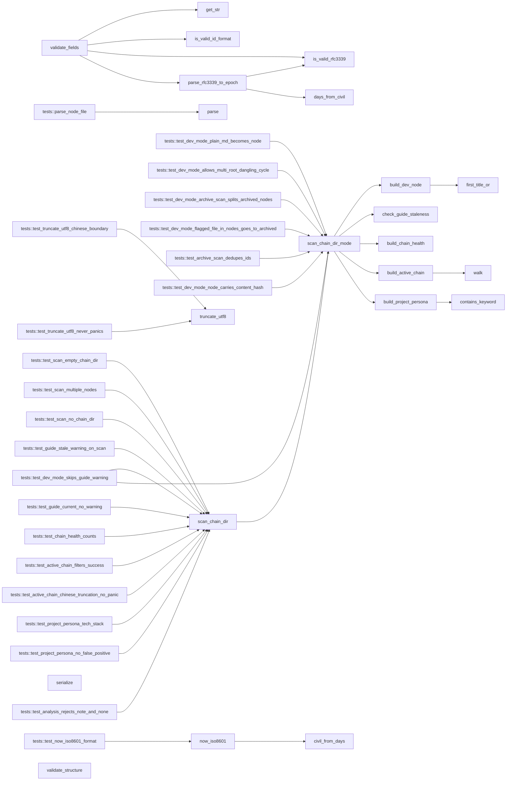

# 代码骨架：engram-scanner-ops（rust）

> 状态：stale: false · 生成：2026-09-09T08:09:11+08:00

## 导出接口（8）
- `fn now_iso8601`（frontmatter.rs:4:1）

```rust
pub fn now_iso8601() -> String
```

- `fn parse`（frontmatter.rs:37:1）

```rust
pub fn parse(content: &str) -> Result<(serde_yaml::Mapping, String)>
```

- `fn serialize`（frontmatter.rs:61:1）

```rust
pub fn serialize(fm: &serde_yaml::Mapping, body: &str) -> Result<String>
```

- `fn truncate_utf8`（frontmatter.rs:74:1）

```rust
pub fn truncate_utf8(s: &str, max_bytes: usize) -> &str
```

- `fn validate_fields`（validator.rs:8:1）

```rust
pub fn validate_fields(filename: &str, fm: &serde_yaml::Mapping, errors: &mut Vec<String>)
```

- `fn validate_structure`（validator.rs:160:1）

```rust
pub fn validate_structure( nodes: &[(&str, &Node)], errors: &mut Vec<String>, warnings: &mut Vec<String>, )
```

- `fn scan_chain_dir`（walker.rs:12:1）

```rust
pub fn scan_chain_dir(root: &Path) -> Result<ChainSnapshot>
```

- `fn scan_chain_dir_mode`（walker.rs:17:1）

```rust
pub fn scan_chain_dir_mode(root: &Path, mode: ScanMode) -> Result<ChainSnapshot>
```

## 调用关系



## 调用边（50）
- now_iso8601 → civil_from_days（frontmatter.rs:12:21）
- tests::parse_node_file → parse（frontmatter.rs:92:26）
- tests::test_now_iso8601_format → now_iso8601（frontmatter.rs:156:17）
- tests::test_truncate_utf8_chinese_boundary → truncate_utf8（frontmatter.rs:198:17）
- tests::test_truncate_utf8_never_panics → truncate_utf8（frontmatter.rs:208:21）
- validate_fields → get_str（validator.rs:10:20）
- validate_fields → is_valid_id_format（validator.rs:17:9）
- validate_fields → get_str（validator.rs:32:11）
- validate_fields → get_str（validator.rs:39:11）
- validate_fields → get_str（validator.rs:46:11）
- validate_fields → get_str（validator.rs:55:25）
- validate_fields → is_valid_rfc3339（validator.rs:57:17）
- validate_fields → get_str（validator.rs:72:25）
- validate_fields → is_valid_rfc3339（validator.rs:74:17）
- validate_fields → parse_rfc3339_to_epoch（validator.rs:91:13）
- validate_fields → parse_rfc3339_to_epoch（validator.rs:92:13）
- parse_rfc3339_to_epoch → is_valid_rfc3339（validator.rs:311:9）
- parse_rfc3339_to_epoch → days_from_civil（validator.rs:321:16）
- scan_chain_dir → scan_chain_dir_mode（walker.rs:13:5）
- scan_chain_dir_mode → build_dev_node（walker.rs:54:24）
- scan_chain_dir_mode → build_dev_node（walker.rs:132:17）
- scan_chain_dir_mode → check_guide_staleness（walker.rs:180:9）
- scan_chain_dir_mode → build_chain_health（walker.rs:184:24）
- scan_chain_dir_mode → build_active_chain（walker.rs:185:24）
- scan_chain_dir_mode → build_project_persona（walker.rs:186:27）
- build_dev_node → first_title_or（walker.rs:225:24）
- build_dev_node → first_title_or（walker.rs:273:28）
- build_active_chain → walk（walker.rs:529:17）
- build_active_chain → walk（walker.rs:543:5）
- build_project_persona → contains_keyword（walker.rs:604:12）
- tests::test_scan_empty_chain_dir → scan_chain_dir（walker.rs:708:24）
- tests::test_scan_multiple_nodes → scan_chain_dir（walker.rs:736:24）
- tests::test_scan_no_chain_dir → scan_chain_dir（walker.rs:751:22）
- tests::test_guide_stale_warning_on_scan → scan_chain_dir（walker.rs:768:20）
- tests::test_guide_current_no_warning → scan_chain_dir（walker.rs:799:20）
- tests::test_chain_health_counts → scan_chain_dir（walker.rs:853:20）
- tests::test_active_chain_filters_success → scan_chain_dir（walker.rs:893:20）
- tests::test_active_chain_chinese_truncation_no_panic → scan_chain_dir（walker.rs:937:20）
- tests::test_project_persona_tech_stack → scan_chain_dir（walker.rs:954:20）
- tests::test_project_persona_no_false_positive → scan_chain_dir（walker.rs:979:20）
- tests::test_dev_mode_plain_md_becomes_node → scan_chain_dir_mode（walker.rs:1002:20）
- tests::test_dev_mode_allows_multi_root_dangling_cycle → scan_chain_dir_mode（walker.rs:1034:20）
- tests::test_dev_mode_allows_multi_root_dangling_cycle → scan_chain_dir_mode（walker.rs:1046:21）
- tests::test_dev_mode_skips_guide_warning → scan_chain_dir_mode（walker.rs:1063:20）
- tests::test_dev_mode_skips_guide_warning → scan_chain_dir（walker.rs:1074:29）
- tests::test_analysis_rejects_note_and_none → scan_chain_dir（walker.rs:1094:20）
- tests::test_dev_mode_archive_scan_splits_archived_nodes → scan_chain_dir_mode（walker.rs:1139:20）
- tests::test_dev_mode_flagged_file_in_nodes_goes_to_archived → scan_chain_dir_mode（walker.rs:1163:20）
- tests::test_archive_scan_dedupes_ids → scan_chain_dir_mode（walker.rs:1182:20）
- tests::test_dev_mode_node_carries_content_hash → scan_chain_dir_mode（walker.rs:1194:20）