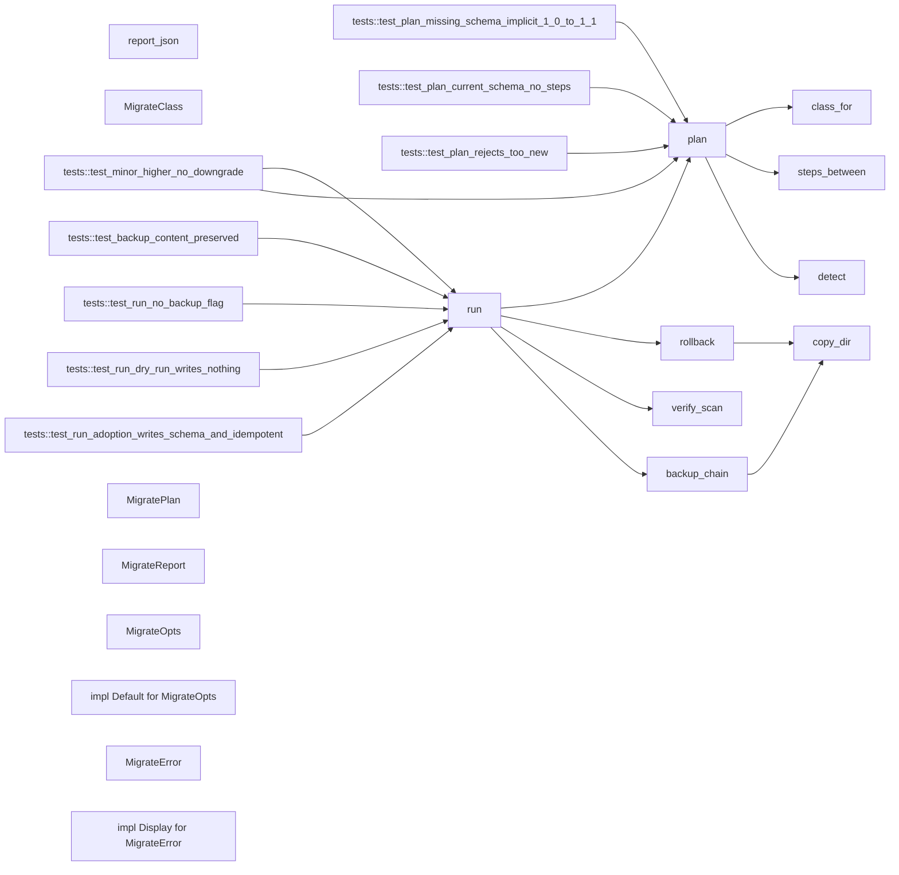

# 代码骨架：engram-schema-migrate（rust）

> 状态：stale: false · 生成：2026-09-09T08:15:28+08:00

## 导出接口（10）
- `enum MigrateClass`（migrate.rs:16:1）

```rust
pub enum MigrateClass { A, B, }
```

- `struct MigratePlan`（migrate.rs:22:1）

```rust
pub struct MigratePlan { pub from: SchemaVersion, pub to: SchemaVersion, pub class: MigrateClass, /// 各迁移步骤的人类可读描述（当前为空；未来版本登记） pub steps: Vec<String>, }
```

- `struct MigrateReport`（migrate.rs:31:1）

```rust
pub struct MigrateReport { pub from: String, pub to: String, pub class: MigrateClass, /// A 类：被改写的文件（相对 .chain）；当前为空 pub transformed: Vec<String>, /// B 类：重建的派生物；当前为空 pub rebuilt: Vec<String>, pub backup: Option<String>, pub warnings: Vec<S
```

- `struct MigrateOpts`（migrate.rs:46:1）

```rust
pub struct MigrateOpts { pub dry_run: bool, pub auto_backup: bool, }
```

- `impl impl Default for MigrateOpts`（migrate.rs:51:1）

```rust
impl Default for MigrateOpts
```

- `enum MigrateError`（migrate.rs:61:1）

```rust
pub enum MigrateError { SchemaTooNew { found: SchemaVersion, supported: SchemaVersion, }, MigrateFailed(String), VerifyFailed(String), NotAWorkspace, Io(String), }
```

- `impl impl Display for MigrateError`（migrate.rs:72:1）

```rust
impl Display for MigrateError
```

- `fn plan`（migrate.rs:117:1）

```rust
pub fn plan(root: &Path) -> Result<MigratePlan, MigrateError>
```

- `fn run`（migrate.rs:155:1）

```rust
pub fn run(root: &Path, opts: &MigrateOpts) -> Result<MigrateReport, MigrateError>
```

- `fn report_json`（migrate.rs:292:1）

```rust
pub fn report_json(report: &MigrateReport) -> String
```

## 调用关系



## 调用边（20）
- plan → detect（migrate.rs:118:17）
- plan → steps_between（migrate.rs:131:9）
- plan → class_for（migrate.rs:141:16）
- run → plan（migrate.rs:156:13）
- run → backup_chain（migrate.rs:204:14）
- run → verify_scan（migrate.rs:210:21）
- run → rollback（migrate.rs:212:21）
- run → rollback（migrate.rs:222:21）
- backup_chain → copy_dir（migrate.rs:261:5）
- rollback → copy_dir（migrate.rs:288:5）
- tests::test_plan_missing_schema_implicit_1_0_to_1_1 → plan（migrate.rs:326:17）
- tests::test_plan_current_schema_no_steps → plan（migrate.rs:337:17）
- tests::test_plan_rejects_too_new → plan（migrate.rs:348:15）
- tests::test_run_adoption_writes_schema_and_idempotent → run（migrate.rs:364:18）
- tests::test_run_adoption_writes_schema_and_idempotent → run（migrate.rs:388:18）
- tests::test_run_dry_run_writes_nothing → run（migrate.rs:401:17）
- tests::test_run_no_backup_flag → run（migrate.rs:413:9）
- tests::test_backup_content_preserved → run（migrate.rs:425:17）
- tests::test_minor_higher_no_downgrade → plan（migrate.rs:437:17）
- tests::test_minor_higher_no_downgrade → run（migrate.rs:439:17）