# 代码骨架：d-015（cpp）

> 状态：stale: false · 生成：2026-09-09T11:44:41+08:00

## 导出接口（311）
- `fn Application`（app/application.cpp:136:1）

```cpp
Application::Application()
```

- `fn Application`（app/application.cpp:140:1）

```cpp
Application::~Application()
```

- `fn initialize`（app/application.cpp:145:1）

```cpp
bool Application::initialize(HINSTANCE hInstance, int nCmdShow)
```

- `fn initWindow`（app/application.cpp:217:1）

```cpp
bool Application::initWindow(HINSTANCE hInstance)
```

- `fn initGL`（app/application.cpp:242:1）

```cpp
bool Application::initGL()
```

- `fn cleanupGL`（app/application.cpp:288:1）

```cpp
void Application::cleanupGL()
```

- `fn switchPreviewMode`（app/application.cpp:350:1）

```cpp
bool Application::switchPreviewMode(RenderMode mode)
```

- `fn switchRenderMode`（app/application.cpp:380:1）

```cpp
bool Application::switchRenderMode(RenderMode mode)
```

- `fn activateBackend`（app/application.cpp:408:1）

```cpp
bool Application::activateBackend(IRenderBackend* b, RenderMode mode)
```

- `fn setRenderMode`（app/application.cpp:420:1）

```cpp
bool Application::setRenderMode(RenderMode mode)
```

- `fn onStartRender`（app/application.cpp:429:1）

```cpp
void Application::onStartRender()
```

- `fn onStopRender`（app/application.cpp:454:1）

```cpp
void Application::onStopRender()
```

- `fn syncUiPending`（app/application.cpp:473:1）

```cpp
void Application::syncUiPending()
```

- `fn applyMaterialEdit`（app/application.cpp:485:1）

```cpp
void Application::applyMaterialEdit(int index, const Material& mat)
```

- `fn switchModel`（app/application.cpp:497:1）

```cpp
void Application::switchModel(int index)
```

- `fn rescanModels`（app/application.cpp:585:1）

```cpp
void Application::rescanModels()
```

- `fn frameCameraToScene`（app/application.cpp:611:1）

```cpp
void Application::frameCameraToScene()
```

- `fn setAutotest`（app/application.cpp:640:1）

```cpp
void Application::setAutotest(int mode, float seconds)
```

- `fn setAutotestAccum`（app/application.cpp:648:1）

```cpp
void Application::setAutotestAccum(bool on)
```

- `fn setAutotestPasses`（app/application.cpp:653:1）

```cpp
void Application::setAutotestPasses(int n)
```

- `fn setAutotestDump`（app/application.cpp:658:1）

```cpp
void Application::setAutotestDump(const std::string& dir)
```

- `fn setAutotestCurve`（app/application.cpp:664:1）

```cpp
void Application::setAutotestCurve(const std::string& ref)
```

- `fn setAutotestModel`（app/application.cpp:672:1）

```cpp
void Application::setAutotestModel(const std::string& name)
```

- `fn jsonEsc`（app/application.cpp:681:1）

```cpp
std::string jsonEsc(const std::string& s)
```

- `fn readBinaryFile`（app/application.cpp:703:1）

```cpp
bool readBinaryFile(const std::string& path, std::vector<uint8_t>& out)
```

- `fn buildCompareReport`（app/application.cpp:718:1）

```cpp
bool buildCompareReport(const std::string& refPath, const std::string& srcPfmPath, const std::string& base, const std::string& modeName, const std::string& params, const std::string& commit, const std::string& build, const std::string& ts, std::string& summary)
```

- `fn runVisionJudge`（app/application.cpp:871:1）

```cpp
void Application::runVisionJudge()
```

- `struct tm`（app/application.cpp:882:5）

```cpp
struct tm
```

- `fn runVisionCli`（app/application.cpp:983:1）

```cpp
int Application::runVisionCli(const std::string& bmpPath, const std::string& prompt)
```

- `fn runCompareReference`（app/application.cpp:1014:1）

```cpp
void Application::runCompareReference()
```

- `struct tm`（app/application.cpp:1020:5）

```cpp
struct tm
```

- `fn runCompareCli`（app/application.cpp:1076:1）

```cpp
int Application::runCompareCli(const std::string& testPfm, const std::string& refPfm)
```

- `fn updateTitle`（app/application.cpp:1098:1）

```cpp
void Application::updateTitle()
```

- `fn onKeyDown`（app/application.cpp:1106:1）

```cpp
void Application::onKeyDown(WPARAM key)
```

- `fn isCameraInputEnabled`（app/application.cpp:1117:1）

```cpp
bool Application::isCameraInputEnabled() const
```

- `fn handleMessage`（app/application.cpp:1125:1）

```cpp
LRESULT Application::handleMessage(HWND hWnd, UINT message, WPARAM wParam, LPARAM lParam)
```

- `fn WndProc`（app/application.cpp:1210:1）

```cpp
LRESULT CALLBACK Application::WndProc(HWND hWnd, UINT message, WPARAM wParam, LPARAM lParam)
```

- `fn computeImageRect`（app/application.cpp:1220:1）

```cpp
void Application::computeImageRect(int& ox, int& oy, int& vw, int& vh) const
```

- `fn updateViewport`（app/application.cpp:1238:1）

```cpp
void Application::updateViewport()
```

- `fn run`（app/application.cpp:1245:1）

```cpp
int Application::run()
```

- `fn initImGui`（app/application_ui.cpp:32:1）

```cpp
void Application::initImGui()
```

- `fn shutdownImGui`（app/application_ui.cpp:190:1）

```cpp
void Application::shutdownImGui()
```

- `fn renderImGui`（app/application_ui.cpp:201:1）

```cpp
void Application::renderImGui(float dt)
```

- `struct SegEntry`（app/application_ui.cpp:424:13）

```cpp
struct SegEntry { RenderMode mode; const char* name; const char* zh; const char* en; }
```

- `fn writeHeader`（app/crash_diag.cpp:19:1）

```cpp
void writeHeader(FILE* f, const char* reason)
```

- `fn writeStack`（app/crash_diag.cpp:31:1）

```cpp
void writeStack(FILE* f)
```

- `fn __report_gsfailure`（app/crash_diag.cpp:58:12）

```cpp
void __report_gsfailure(uintptr_t stackTraceAddress)
```

- `fn initCrashDiag`（app/crash_diag.cpp:70:1）

```cpp
void initCrashDiag()
```

- `fn base64Encode`（app/vision_judge.cpp:24:1）

```cpp
std::string base64Encode(const uint8_t* data, size_t len)
```

- `fn jsonEscape`（app/vision_judge.cpp:41:1）

```cpp
std::string jsonEscape(const std::string& s)
```

- `fn httpGet`（app/vision_judge.cpp:65:1）

```cpp
bool httpGet(const wchar_t* path, std::string& outBody)
```

- `fn httpPost`（app/vision_judge.cpp:96:1）

```cpp
bool httpPost(const std::string& body, std::string& outBody)
```

- `fn extractContent`（app/vision_judge.cpp:132:1）

```cpp
std::string extractContent(const std::string& resp)
```

- `fn startEngine`（app/vision_judge.cpp:174:1）

```cpp
bool startEngine()
```

- `fn vision::healthOk`（app/vision_judge.cpp:194:1）

```cpp
bool healthOk()
```

- `fn vision::ask`（app/vision_judge.cpp:200:1）

```cpp
AskResult ask(const std::string& prompt, const std::vector<uint8_t>& imageBytes, const std::string& mime)
```

- `fn lower`（assets/cornell_materials.cpp:11:1）

```cpp
inline std::string lower(const std::string& s)
```

- `fn makeDiffuse`（assets/cornell_materials.cpp:18:1）

```cpp
Material makeDiffuse(const Vec3& color)
```

- `fn makeLight`（assets/cornell_materials.cpp:25:1）

```cpp
Material makeLight(const Vec3& color, float intensity)
```

- `fn makeMetal`（assets/cornell_materials.cpp:33:1）

```cpp
Material makeMetal(const Vec3& color)
```

- `fn makeGlass`（assets/cornell_materials.cpp:48:1）

```cpp
Material makeGlass()
```

- `enum CornellWall`（assets/cornell_materials.cpp:57:1）

```cpp
enum CornellWall { WALL_FLOOR = 0, WALL_CEILING, WALL_BACK, WALL_LEFT, WALL_RIGHT }
```

- `fn classifyWall`（assets/cornell_materials.cpp:65:1）

```cpp
int classifyWall(const Vec3& n)
```

- `fn assignCornellBoxMaterials`（assets/cornell_materials.cpp:76:1）

```cpp
void assignCornellBoxMaterials(Scene& scene)
```

- `fn buildEmissiveLights`（assets/cornell_materials.cpp:127:1）

```cpp
void buildEmissiveLights(Scene& scene)
```

- `fn addCornellCeilingLight`（assets/cornell_materials.cpp:143:1）

```cpp
void addCornellCeilingLight(Scene& scene)
```

- `fn toUtf8`（assets/model_library.cpp:18:1）

```cpp
std::string toUtf8(const std::wstring& w)
```

- `fn cornellPaths`（assets/model_library.cpp:30:1）

```cpp
std::vector<std::string> cornellPaths()
```

- `fn lowerCopy`（assets/model_library.cpp:38:1）

```cpp
std::string lowerCopy(const std::string& s)
```

- `fn startsWith`（assets/model_library.cpp:45:1）

```cpp
bool startsWith(const std::string& s, const std::string& prefix)
```

- `fn scanModelFolder`（assets/model_library.cpp:52:1）

```cpp
std::vector<ModelEntry> scanModelFolder(const std::string& folder)
```

- `fn buildModelScene`（assets/model_library.cpp:91:1）

```cpp
bool buildModelScene(const ModelEntry& entry, Scene& scene)
```

- `fn resolveIndex`（assets/obj_loader.cpp:16:1）

```cpp
inline uint32_t resolveIndex(int idx, size_t count)
```

- `fn convertMaterial`（assets/obj_loader.cpp:27:1）

```cpp
Material convertMaterial(const rapidobj::Material& src)
```

- `fn loadObjScenes`（assets/obj_loader.cpp:54:1）

```cpp
bool loadObjScenes(const std::vector<std::string>& filepaths, Scene& scene)
```

- `fn loadObjScene`（assets/obj_loader.cpp:70:1）

```cpp
bool loadObjScene(const std::string& filepath, Scene& scene, uint32_t materialIndexOffset)
```

- `fn computeVertexNormalsIfMissing`（assets/obj_loader.cpp:216:1）

```cpp
void computeVertexNormalsIfMissing(Mesh& mesh)
```

- `fn build`（backends/bvh.cpp:11:1）

```cpp
void BVH::build(std::vector<FlatTriangle>&& tris)
```

- `fn recursiveSplit`（backends/bvh.cpp:52:1）

```cpp
void BVH::recursiveSplit(BuildNode* node)
```

- `fn recursiveFlatten`（backends/bvh.cpp:174:1）

```cpp
size_t BVH::recursiveFlatten(BuildNode* node)
```

- `fn intersect`（backends/bvh.cpp:213:1）

```cpp
std::optional<BVH::HitResult> BVH::intersect(const Vec3& orig, const Vec3& dir, float tMin, float tMax) const
```

- `fn occluded`（backends/bvh.cpp:276:1）

```cpp
bool BVH::occluded(const Vec3& orig, const Vec3& dir, float tMin, float tMax) const
```

- `fn packColor`（backends/path_trace_cpu_backend.cpp:28:1）

```cpp
inline uint32_t packColor(const Vec3& c)
```

- `fn powerHeuristic`（backends/path_trace_cpu_backend.cpp:55:1）

```cpp
float powerHeuristic(float pdfJ, float pdfK)
```

- `fn initialize`（backends/path_trace_cpu_backend.cpp:61:1）

```cpp
bool PathTraceCpuBackend::initialize(int width, int height, Display* display)
```

- `fn loadScene`（backends/path_trace_cpu_backend.cpp:74:1）

```cpp
bool PathTraceCpuBackend::loadScene(const Scene& scene)
```

- `fn setCamera`（backends/path_trace_cpu_backend.cpp:138:1）

```cpp
void PathTraceCpuBackend::setCamera(const OrbitCamera& camera)
```

- `fn resetAccumulation`（backends/path_trace_cpu_backend.cpp:155:1）

```cpp
void PathTraceCpuBackend::resetAccumulation()
```

- `fn sampleAreaLight`（backends/path_trace_cpu_backend.cpp:161:1）

```cpp
Vec3 PathTraceCpuBackend::sampleAreaLight(const Vec3& worldPos, const Vec3& normal, PCG32& rng, Vec3& lightDir, Vec3& lightNormal, float& lightPdf, float& lightDist)
```

- `fn areaLightPdf`（backends/path_trace_cpu_backend.cpp:206:1）

```cpp
float PathTraceCpuBackend::areaLightPdf(const Vec3& worldPos, const Vec3& normal, const Vec3& dir, uint32_t emissiveTriIndex) const
```

- `fn traceRay`（backends/path_trace_cpu_backend.cpp:243:1）

```cpp
Vec3 PathTraceCpuBackend::traceRay(const Vec3& orig, const Vec3& dir, PCG32& rng)
```

- `fn renderScanline`（backends/path_trace_cpu_backend.cpp:336:1）

```cpp
void PathTraceCpuBackend::renderScanline(int y, int passIndex, PCG32& rng)
```

- `fn renderOnePass`（backends/path_trace_cpu_backend.cpp:366:1）

```cpp
void PathTraceCpuBackend::renderOnePass(int passIndex)
```

- `fn uploadCurrentFrame`（backends/path_trace_cpu_backend.cpp:376:1）

```cpp
void PathTraceCpuBackend::uploadCurrentFrame()
```

- `fn renderFrame`（backends/path_trace_cpu_backend.cpp:380:1）

```cpp
void PathTraceCpuBackend::renderFrame(float deltaTime)
```

- `fn getOutput`（backends/path_trace_cpu_backend.cpp:444:1）

```cpp
RenderOutput PathTraceCpuBackend::getOutput() const
```

- `fn captureFrame`（backends/path_trace_cpu_backend.cpp:449:1）

```cpp
bool PathTraceCpuBackend::captureFrame(const char* bmpPath) const
```

- `fn dumpFrame`（backends/path_trace_cpu_backend.cpp:463:1）

```cpp
bool PathTraceCpuBackend::dumpFrame(const char* base) const
```

- `fn setConvergenceTarget`（backends/path_trace_cpu_backend.cpp:478:1）

```cpp
void PathTraceCpuBackend::setConvergenceTarget(const char* refPfmPath)
```

- `fn setPassBudget`（backends/path_trace_cpu_backend.cpp:513:1）

```cpp
void PathTraceCpuBackend::setPassBudget(int passes)
```

- `fn isProgressComplete`（backends/path_trace_cpu_backend.cpp:518:1）

```cpp
bool PathTraceCpuBackend::isProgressComplete() const
```

- `fn progress`（backends/path_trace_cpu_backend.cpp:522:1）

```cpp
float PathTraceCpuBackend::progress() const
```

- `fn updateMaterial`（backends/path_trace_cpu_backend.cpp:527:1）

```cpp
void PathTraceCpuBackend::updateMaterial(int index, const Material& mat)
```

- `fn setShadingModel`（backends/path_trace_cpu_backend.cpp:534:1）

```cpp
void PathTraceCpuBackend::setShadingModel(ShadingModel model)
```

- `fn shutdown`（backends/path_trace_cpu_backend.cpp:540:1）

```cpp
void PathTraceCpuBackend::shutdown()
```

- `fn initialize`（backends/path_trace_gpu_backend.cpp:167:1）

```cpp
bool PathTraceGpuBackend::initialize(int width, int height, Display* display)
```

- `fn loadScene`（backends/path_trace_gpu_backend.cpp:327:1）

```cpp
bool PathTraceGpuBackend::loadScene(const Scene& scene)
```

- `fn setCamera`（backends/path_trace_gpu_backend.cpp:493:1）

```cpp
void PathTraceGpuBackend::setCamera(const OrbitCamera& camera)
```

- `fn renderFrame`（backends/path_trace_gpu_backend.cpp:520:1）

```cpp
void PathTraceGpuBackend::renderFrame(float deltaTime)
```

- `fn getOutput`（backends/path_trace_gpu_backend.cpp:869:1）

```cpp
RenderOutput PathTraceGpuBackend::getOutput() const
```

- `fn isProgressComplete`（backends/path_trace_gpu_backend.cpp:873:1）

```cpp
bool PathTraceGpuBackend::isProgressComplete() const
```

- `fn progress`（backends/path_trace_gpu_backend.cpp:877:1）

```cpp
float PathTraceGpuBackend::progress() const
```

- `fn freeDeviceData`（backends/path_trace_gpu_backend.cpp:881:1）

```cpp
void PathTraceGpuBackend::freeDeviceData()
```

- `fn freeFrameBuffers`（backends/path_trace_gpu_backend.cpp:894:1）

```cpp
void PathTraceGpuBackend::freeFrameBuffers()
```

- `fn onCameraChanged`（backends/path_trace_gpu_backend.cpp:931:1）

```cpp
void PathTraceGpuBackend::onCameraChanged()
```

- `fn updateMaterial`（backends/path_trace_gpu_backend.cpp:947:1）

```cpp
void PathTraceGpuBackend::updateMaterial(int index, const Material& mat)
```

- `fn setShadingModel`（backends/path_trace_gpu_backend.cpp:972:1）

```cpp
void PathTraceGpuBackend::setShadingModel(ShadingModel model)
```

- `fn setAccumMode`（backends/path_trace_gpu_backend.cpp:981:1）

```cpp
void PathTraceGpuBackend::setAccumMode(bool on)
```

- `fn setSvgfTemporal`（backends/path_trace_gpu_backend.cpp:997:1）

```cpp
void PathTraceGpuBackend::setSvgfTemporal(bool on)
```

- `fn setSvgfSpatial`（backends/path_trace_gpu_backend.cpp:1002:1）

```cpp
void PathTraceGpuBackend::setSvgfSpatial(bool on)
```

- `fn setAutoExposure`（backends/path_trace_gpu_backend.cpp:1009:1）

```cpp
void PathTraceGpuBackend::setAutoExposure(bool on)
```

- `fn getRestirStats`（backends/path_trace_gpu_backend.cpp:1017:1）

```cpp
bool PathTraceGpuBackend::getRestirStats(float& avgMdi, float& avgMgi, float& meanL, float& varL) const
```

- `fn dumpFrame`（backends/path_trace_gpu_backend.cpp:1032:1）

```cpp
bool PathTraceGpuBackend::dumpFrame(const char* base) const
```

- `fn captureFrame`（backends/path_trace_gpu_backend.cpp:1049:1）

```cpp
bool PathTraceGpuBackend::captureFrame(const char* bmpPath) const
```

- `fn shutdown`（backends/path_trace_gpu_backend.cpp:1067:1）

```cpp
void PathTraceGpuBackend::shutdown()
```

- `struct TuneParam`（backends/path_trace_gpu_backend.cpp:1082:1）

```cpp
struct TuneParam { const char* name; const char* group; // [t-017/M3] 面板分组 (ARCHITECTURE.md §3) float minV, maxV, step; }
```

- `fn tuneCount`（backends/path_trace_gpu_backend.cpp:1103:1）

```cpp
int PathTraceGpuBackend::tuneCount() const
```

- `fn tuneValue`（backends/path_trace_gpu_backend.cpp:1110:1）

```cpp
float PathTraceGpuBackend::tuneValue(int index) const
```

- `fn tuneAdjust`（backends/path_trace_gpu_backend.cpp:1128:1）

```cpp
void PathTraceGpuBackend::tuneAdjust(int index, float delta)
```

- `fn tuneSetValue`（backends/path_trace_gpu_backend.cpp:1136:1）

```cpp
void PathTraceGpuBackend::tuneSetValue(int index, float value)
```

- `fn tuneRange`（backends/path_trace_gpu_backend.cpp:1157:1）

```cpp
void PathTraceGpuBackend::tuneRange(int index, float& minV, float& maxV, float& step) const
```

- `fn sampleBlueNoise`（backends/path_trace_gpu_backend.cu:12:1）

```cpp
__device__ inline float2 sampleBlueNoise(int pixelX, int pixelY, int frameIndex)
```

- `fn setRtTunables`（backends/path_trace_gpu_backend.cu:44:12）

```cpp
void setRtTunables(const RtTunables* t)
```

- `struct PCG32`（backends/path_trace_gpu_backend.cu:51:1）

```cpp
struct PCG32 { uint64_t state, inc; __device__ void setState(uint64_t init_state, uint64_t init_seq) { state = 0u; inc = (init_seq << 1u) | 1u; next(); state += init_state; next(); } __device__ uint32_t next() { uint64_t old_state = state; state = old_state * 6364136223846793005ull + inc; uint32_t x
```

- `fn PCG32::setState`（backends/path_trace_gpu_backend.cu:54:5）

```cpp
__device__ void setState(uint64_t init_state, uint64_t init_seq)
```

- `fn PCG32::next`（backends/path_trace_gpu_backend.cu:62:5）

```cpp
__device__ uint32_t next()
```

- `fn PCG32::uniform`（backends/path_trace_gpu_backend.cu:70:5）

```cpp
__device__ float uniform()
```

- `fn restirLum`（backends/path_trace_gpu_backend.cu:75:1）

```cpp
__device__ inline float restirLum(float3 c)
```

- `struct Frame`（backends/path_trace_gpu_backend.cu:82:1）

```cpp
struct Frame { float3 n, s, t; __device__ explicit Frame(const float3& normal) : n(normal) { if (fabsf(normal.z) < 0.999f) { s = normalize(cross(make_float3(0.0f, 0.0f, 1.0f), normal)); } else { s = make_float3(1.0f, 0.0f, 0.0f); } t = cross(normal, s); } __device__ float3 toWorld(const float3& loca
```

- `fn Frame::Frame`（backends/path_trace_gpu_backend.cu:85:25）

```cpp
Frame(const float3& normal) : n(normal)
```

- `fn Frame::toWorld`（backends/path_trace_gpu_backend.cu:94:5）

```cpp
__device__ float3 toWorld(const float3& local) const
```

- `fn Frame::toLocal`（backends/path_trace_gpu_backend.cu:98:5）

```cpp
__device__ float3 toLocal(const float3& world) const
```

- `fn cosineSampleHemisphere`（backends/path_trace_gpu_backend.cu:106:1）

```cpp
__device__ float3 cosineSampleHemisphere(float u1, float u2)
```

- `fn powerHeuristic`（backends/path_trace_gpu_backend.cu:117:1）

```cpp
__device__ float powerHeuristic(float pdfJ, float pdfK)
```

- `fn cxAdd`（backends/path_trace_gpu_backend.cu:130:1）

```cpp
__device__ ComplexF cxAdd(ComplexF a, ComplexF b)
```

- `fn cxSub`（backends/path_trace_gpu_backend.cu:131:1）

```cpp
__device__ ComplexF cxSub(ComplexF a, ComplexF b)
```

- `fn cxMul`（backends/path_trace_gpu_backend.cu:132:1）

```cpp
__device__ ComplexF cxMul(ComplexF a, ComplexF b)
```

- `fn cxMulS`（backends/path_trace_gpu_backend.cu:135:1）

```cpp
__device__ ComplexF cxMulS(ComplexF a, float s)
```

- `fn cxDiv`（backends/path_trace_gpu_backend.cu:136:1）

```cpp
__device__ ComplexF cxDiv(ComplexF a, ComplexF b)
```

- `fn cxNorm2`（backends/path_trace_gpu_backend.cu:141:1）

```cpp
__device__ float cxNorm2(ComplexF a)
```

- `fn cxLength`（backends/path_trace_gpu_backend.cu:142:1）

```cpp
__device__ float cxLength(ComplexF a)
```

- `fn cxSqrt`（backends/path_trace_gpu_backend.cu:143:1）

```cpp
__device__ ComplexF cxSqrt(ComplexF a)
```

- `fn conductorFresnel3`（backends/path_trace_gpu_backend.cu:152:1）

```cpp
__device__ float3 conductorFresnel3(const float3& eta, const float3& k, float cosThetaI)
```

- `fn dielectricFresnel`（backends/path_trace_gpu_backend.cu:184:1）

```cpp
__device__ float dielectricFresnel(float etaiDivEtat, float cosThetaT, float& cosThetaI)
```

- `fn boundsIntersect`（backends/path_trace_gpu_backend.cu:197:1）

```cpp
__device__ bool boundsIntersect( const BvhNodePod& node, const float3& orig, const float3& invDir, float tMin, float tMax)
```

- `fn mollerTrumbore`（backends/path_trace_gpu_backend.cu:213:1）

```cpp
__device__ bool mollerTrumbore( const FlatTriPod& tri, const float3& orig, const float3& dir, float& t, float& u, float& v)
```

- `struct PtHit`（backends/path_trace_gpu_backend.cu:239:1）

```cpp
struct PtHit { float t; float3 point; float3 normal; uint32_t materialIndex; uint32_t emissiveTriIndex; }
```

- `fn bvhIntersect`（backends/path_trace_gpu_backend.cu:247:1）

```cpp
__device__ bool bvhIntersect( const BvhNodePod* __restrict__ nodes, const FlatTriPod* __restrict__ tris, const float3& orig, const float3& dir, int numNodes, int numTris, PtHit& hit)
```

- `fn bvhOccluded`（backends/path_trace_gpu_backend.cu:306:1）

```cpp
__device__ bool bvhOccluded( const BvhNodePod* __restrict__ nodes, const FlatTriPod* __restrict__ tris, const float3& orig, const float3& dir, float tMin, float tMax, int numNodes, int numTris, const EmissiveTriPod* __restrict__ emissiveTris, int numEmissive)
```

- `fn bvhOccludedGlassTransparent`（backends/path_trace_gpu_backend.cu:381:1）

```cpp
__device__ bool bvhOccludedGlassTransparent( const BvhNodePod* __restrict__ nodes, const FlatTriPod* __restrict__ tris, const PtMaterialPod* __restrict__ materials, int numMaterials, const float3& orig, const float3& dir, float tMin, float tMax, int numNodes, int numTris, const EmissiveTriPod* __res
```

- `fn sampleAreaLight`（backends/path_trace_gpu_backend.cu:457:1）

```cpp
__device__ float3 sampleAreaLight( const EmissiveTriPod* __restrict__ emissiveTris, int numEmissive, const float3& worldPos, PCG32& rng, int pixelX, int pixelY, int frameIndex, float3& lightDir, float3& lightNormal, float& lightPdf, float& lightDist)
```

- `fn areaLightPdf`（backends/path_trace_gpu_backend.cu:502:1）

```cpp
__device__ float areaLightPdf( const EmissiveTriPod* __restrict__ emissiveTris, int numEmissive, const float3& worldPos, const float3& dir, uint32_t emissiveTriIndex)
```

- `fn traceRay`（backends/path_trace_gpu_backend.cu:541:1）

```cpp
__device__ float3 traceRay( const BvhNodePod* __restrict__ nodes, const FlatTriPod* __restrict__ tris, const PtMaterialPod* __restrict__ materials, const EmissiveTriPod* __restrict__ emissiveTris, int numNodes, int numTris, int numMaterials, int numEmissive, float3 orig, float3 dir, int maxDepth, PC
```

- `fn ptGpuKernel`（backends/path_trace_gpu_backend.cu:668:1）

```cpp
__global__ void __launch_bounds__(256, 4) ptGpuKernel( float3* __restrict__ d_normal, float* __restrict__ d_depth, float3* __restrict__ d_albedo, float3* __restrict__ d_worldPos, uint8_t* __restrict__ d_matFlags, const BvhNodePod* __restrict__ d_nodes, const FlatTriPod* __restrict__ d_triangles, con
```

- `fn restirCandidateKernel`（backends/path_trace_gpu_backend.cu:788:1）

```cpp
__global__ void restirCandidateKernel( RestirReservoir* __restrict__ d_reservoir, const float3* __restrict__ worldPos, const float3* __restrict__ normal, const float3* __restrict__ albedo, const uint8_t* __restrict__ matFlags, const EmissiveTriPod* __restrict__ emissiveTris, const BvhNodePod* __rest
```

- `fn restirShadeKernel`（backends/path_trace_gpu_backend.cu:876:1）

```cpp
__global__ void restirShadeKernel( float3* __restrict__ ioRadiance, const RestirReservoir* __restrict__ reservoir, const float3* __restrict__ albedo, const float3* __restrict__ worldPos, const float3* __restrict__ normal, const BvhNodePod* __restrict__ nodes, const FlatTriPod* __restrict__ tris, con
```

- `fn restirTemporalReuseKernel`（backends/path_trace_gpu_backend.cu:952:1）

```cpp
__global__ void restirTemporalReuseKernel( RestirReservoir* __restrict__ ioReservoir, const RestirReservoir* __restrict__ prevReservoir, const float3* __restrict__ worldPos, const float3* __restrict__ normal, const float* __restrict__ depth, const float3* __restrict__ prevNormal, const float* __rest
```

- `fn restirSpatialReuseKernel`（backends/path_trace_gpu_backend.cu:1077:1）

```cpp
__global__ void restirSpatialReuseKernel( const RestirReservoir* __restrict__ inReservoir, RestirReservoir* __restrict__ outReservoir, const float3* __restrict__ worldPos, const float3* __restrict__ normal, const float* __restrict__ depth, const float3* __restrict__ albedo, const EmissiveTriPod* __r
```

- `fn halfTonemapKernel`（backends/path_trace_gpu_backend.cu:1178:1）

```cpp
__global__ void halfTonemapKernel( const float3* __restrict__ inColor, float3* __restrict__ outLdr, float exposure, int width, int height)
```

- `fn halfAlbedoKernel`（backends/path_trace_gpu_backend.cu:1204:1）

```cpp
__global__ void halfAlbedoKernel( const float3* __restrict__ inAlbedo, float3* __restrict__ outAlbedo, int width, int height)
```

- `fn halfNormalFlowKernel`（backends/path_trace_gpu_backend.cu:1226:1）

```cpp
__global__ void halfNormalFlowKernel( const float3* __restrict__ inNormal, float3* __restrict__ outNormalView, float2* __restrict__ outFlow, const float* __restrict__ viewMat, const float* __restrict__ vpMatrix, int width, int height)
```

- `fn inverseTonemapKernel`（backends/path_trace_gpu_backend.cu:1269:1）

```cpp
__global__ void inverseTonemapKernel( const float3* __restrict__ inLdr, float3* __restrict__ outHdr, float exposure, int width, int height)
```

- `fn logLumReduceKernel`（backends/path_trace_gpu_backend.cu:1289:1）

```cpp
__global__ void logLumReduceKernel( const float3* __restrict__ src, float* __restrict__ d_sum, // single float, MUST be zeroed before launch int width, int height)
```

- `fn packColorToRGBA8Kernel`（backends/path_trace_gpu_backend.cu:1316:1）

```cpp
__global__ void packColorToRGBA8Kernel( const float3* __restrict__ src, uint32_t* __restrict__ dst, int width, int height)
```

- `fn ptAccumulateKernel`（backends/path_trace_gpu_backend.cu:1352:1）

```cpp
__global__ void ptAccumulateKernel( float3* __restrict__ d_accum, const float3* __restrict__ d_radiance, int width, int height, int spp)
```

- `fn launchPtGpuKernel`（backends/path_trace_gpu_backend.cu:1375:1）

```cpp
extern "C" void launchPtGpuKernel( void* d_normal, void* d_depth, float* d_accum, void* d_albedo, void* d_worldPos, void* d_matFlags, const BvhNodePod* d_nodes, const FlatTriPod* d_triangles, const PtMaterialPod* d_materials, const EmissiveTriPod* d_emissiveTris, int width, int height, const PtGpuPa
```

- `fn giMisWeight`（backends/path_trace_gpu_backend.cu:1415:1）

```cpp
__device__ float giMisWeight(float ndotl, float cosLight, float dist2, float numEmissive, float area)
```

- `fn restirGiCandidateKernel`（backends/path_trace_gpu_backend.cu:1427:1）

```cpp
__global__ void restirGiCandidateKernel( RestirGiReservoir* __restrict__ d_reservoir, const float3* __restrict__ worldPos, const float3* __restrict__ normal, const float3* __restrict__ albedo, const uint8_t* __restrict__ matFlags, const PtMaterialPod* __restrict__ materials, const BvhNodePod* __rest
```

- `fn restirGiTemporalReuseKernel`（backends/path_trace_gpu_backend.cu:1820:1）

```cpp
__global__ void restirGiTemporalReuseKernel( RestirGiReservoir* __restrict__ ioReservoir, const RestirGiReservoir* __restrict__ prevReservoir, const float3* __restrict__ worldPos, const float3* __restrict__ normal, const float* __restrict__ depth, const float3* __restrict__ prevNormal, const float* 
```

- `fn restirGiSpatialReuseKernel`（backends/path_trace_gpu_backend.cu:2049:1）

```cpp
__global__ void restirGiSpatialReuseKernel( const RestirGiReservoir* __restrict__ inReservoir, RestirGiReservoir* __restrict__ outReservoir, const float3* __restrict__ worldPos, const float3* __restrict__ normal, const float* __restrict__ depth, const float3* __restrict__ albedo, const EmissiveTriPo
```

- `fn restirGiShadeKernel`（backends/path_trace_gpu_backend.cu:2153:1）

```cpp
__global__ void restirGiShadeKernel( float3* __restrict__ ioRadiance, const RestirGiReservoir* __restrict__ reservoir, const float3* __restrict__ albedo, const float3* __restrict__ worldPos, const float3* __restrict__ normal, const uint8_t* __restrict__ matFlags, const EmissiveTriPod* __restrict__ e
```

- `fn launchRestirCandidate`（backends/path_trace_gpu_backend.cu:2285:1）

```cpp
extern "C" void launchRestirCandidate( void* d_reservoir, const void* d_worldPos, const void* d_normal, const void* d_albedo, const void* d_matFlags, const EmissiveTriPod* d_emissiveTris, const BvhNodePod* d_nodes, const FlatTriPod* d_triangles, int numNodes, int numTris, int numEmissive, int width,
```

- `fn launchRestirShade`（backends/path_trace_gpu_backend.cu:2310:1）

```cpp
extern "C" void launchRestirShade( void* io_radiance, const void* d_reservoir, const void* d_albedo, const void* d_worldPos, const void* d_normal, const BvhNodePod* d_nodes, const FlatTriPod* d_triangles, const EmissiveTriPod* d_emissiveTris, int numNodes, int numTris, int numEmissive, int width, in
```

- `fn restirStatsKernel`（backends/path_trace_gpu_backend.cu:2341:1）

```cpp
__global__ void restirStatsKernel( const float3* __restrict__ radiance, const RestirReservoir* __restrict__ diRes, const RestirGiReservoir* __restrict__ giRes, float* __restrict__ outSum, int width, int height)
```

- `fn launchRestirStats`（backends/path_trace_gpu_backend.cu:2382:1）

```cpp
extern "C" void launchRestirStats( const void* d_radiance, const void* d_diFinal, const void* d_giFinal, float* d_outSum4, int width, int height)
```

- `fn launchRestirTemporalReuse`（backends/path_trace_gpu_backend.cu:2399:1）

```cpp
extern "C" void launchRestirTemporalReuse( void* io_reservoir, const void* d_prevReservoir, const void* d_worldPos, const void* d_normal, const void* d_depth, const void* d_prevNormal, const void* d_prevDepth, const void* d_albedo, const EmissiveTriPod* d_emissiveTris, const BvhNodePod* d_nodes, con
```

- `fn launchRestirSpatialReuse`（backends/path_trace_gpu_backend.cu:2432:1）

```cpp
extern "C" void launchRestirSpatialReuse( const void* d_inReservoir, void* d_outReservoir, const void* d_worldPos, const void* d_normal, const void* d_depth, const void* d_albedo, const EmissiveTriPod* d_emissiveTris, int numEmissive, int width, int height, unsigned int frameIndex)
```

- `fn launchHalfTonemap`（backends/path_trace_gpu_backend.cu:2457:1）

```cpp
extern "C" void launchHalfTonemap( const void* d_inColor, void* d_outLdr, float exposure, int width, int height)
```

- `fn launchHalfAlbedo`（backends/path_trace_gpu_backend.cu:2467:1）

```cpp
extern "C" void launchHalfAlbedo( const void* d_inAlbedo, void* d_outAlbedo, int width, int height)
```

- `fn launchHalfNormalFlow`（backends/path_trace_gpu_backend.cu:2477:1）

```cpp
extern "C" void launchHalfNormalFlow( const void* d_inNormal, void* d_outNormalView, void* d_outFlow, const float* d_viewMat, const float* d_vpMatrix, int width, int height)
```

- `fn launchInverseTonemap`（backends/path_trace_gpu_backend.cu:2491:1）

```cpp
extern "C" void launchInverseTonemap( const void* d_inLdr, void* d_outHdr, float exposure, int width, int height)
```

- `fn launchLogLumReduce`（backends/path_trace_gpu_backend.cu:2501:1）

```cpp
extern "C" void launchLogLumReduce( const void* src, float* d_sum, int width, int height)
```

- `fn launchRestirGiCandidate`（backends/path_trace_gpu_backend.cu:2510:1）

```cpp
extern "C" void launchRestirGiCandidate( void* d_reservoir, const void* d_worldPos, const void* d_normal, const void* d_albedo, const void* d_matFlags, const PtMaterialPod* d_materials, const BvhNodePod* d_nodes, const FlatTriPod* d_triangles, const EmissiveTriPod* d_emissiveTris, int numNodes, int 
```

- `fn launchRestirGiTemporalReuse`（backends/path_trace_gpu_backend.cu:2538:1）

```cpp
extern "C" void launchRestirGiTemporalReuse( void* io_reservoir, const void* d_prevReservoir, const void* d_worldPos, const void* d_normal, const void* d_depth, const void* d_prevNormal, const void* d_prevDepth, const void* d_albedo, const BvhNodePod* d_nodes, const FlatTriPod* d_triangles, const Pt
```

- `fn launchRestirGiSpatialReuse`（backends/path_trace_gpu_backend.cu:2573:1）

```cpp
extern "C" void launchRestirGiSpatialReuse( const void* d_inReservoir, void* d_outReservoir, const void* d_worldPos, const void* d_normal, const void* d_depth, const void* d_albedo, const EmissiveTriPod* d_emissiveTris, const BvhNodePod* d_nodes, const FlatTriPod* d_triangles, int numNodes, int numT
```

- `fn launchRestirGiShade`（backends/path_trace_gpu_backend.cu:2600:1）

```cpp
extern "C" void launchRestirGiShade( void* io_radiance, const void* d_reservoir, const void* d_albedo, const void* d_worldPos, const void* d_normal, const void* d_matFlags, const EmissiveTriPod* d_emissiveTris, const BvhNodePod* d_nodes, const FlatTriPod* d_triangles, const PtMaterialPod* d_material
```

- `fn launchPtAccumulate`（backends/path_trace_gpu_backend.cu:2629:1）

```cpp
extern "C" void launchPtAccumulate( float* d_accum, const float* d_radiance, int width, int height, int spp)
```

- `fn launchPackColorToRGBA8`（backends/path_trace_gpu_backend.cu:2643:1）

```cpp
extern "C" void launchPackColorToRGBA8( const void* src, uint32_t* dst, int width, int height)
```

- `fn packColor`（backends/raster_cpu_backend.cpp:14:1）

```cpp
inline uint32_t packColor(const Vec3& c)
```

- `fn barycentric`（backends/raster_cpu_backend.cpp:22:1）

```cpp
inline bool barycentric(float px, float py, float ax, float ay, float bx, float by, float cx, float cy, float& u, float& v, float& w)
```

- `fn initialize`（backends/raster_cpu_backend.cpp:49:1）

```cpp
bool RasterCpuBackend::initialize(int width, int height, Display* display)
```

- `fn loadScene`（backends/raster_cpu_backend.cpp:65:1）

```cpp
bool RasterCpuBackend::loadScene(const Scene& scene)
```

- `fn setCamera`（backends/raster_cpu_backend.cpp:72:1）

```cpp
void RasterCpuBackend::setCamera(const OrbitCamera& camera)
```

- `fn renderFrame`（backends/raster_cpu_backend.cpp:79:1）

```cpp
void RasterCpuBackend::renderFrame(float deltaTime)
```

- `fn rasterizeTriangleSSAA`（backends/raster_cpu_backend.cpp:119:1）

```cpp
void RasterCpuBackend::rasterizeTriangleSSAA( const Vec3& a, const Vec3& b, const Vec3& c, const Vertex& va, const Vertex& vb, const Vertex& vc, const Material& mat)
```

- `fn getOutput`（backends/raster_cpu_backend.cpp:173:1）

```cpp
RenderOutput RasterCpuBackend::getOutput() const
```

- `fn dumpFrame`（backends/raster_cpu_backend.cpp:179:1）

```cpp
bool RasterCpuBackend::dumpFrame(const char* base) const
```

- `fn captureFrame`（backends/raster_cpu_backend.cpp:192:1）

```cpp
bool RasterCpuBackend::captureFrame(const char* bmpPath) const
```

- `fn updateMaterial`（backends/raster_cpu_backend.cpp:205:1）

```cpp
void RasterCpuBackend::updateMaterial(int index, const Material& mat)
```

- `fn shutdown`（backends/raster_cpu_backend.cpp:210:1）

```cpp
void RasterCpuBackend::shutdown()
```

- `fn initialize`（backends/raster_gpu_backend.cpp:27:1）

```cpp
bool RasterGpuBackend::initialize(int width, int height, Display* display)
```

- `fn loadScene`（backends/raster_gpu_backend.cpp:44:1）

```cpp
bool RasterGpuBackend::loadScene(const Scene& scene)
```

- `fn setCamera`（backends/raster_gpu_backend.cpp:134:1）

```cpp
void RasterGpuBackend::setCamera(const OrbitCamera& camera)
```

- `fn renderFrame`（backends/raster_gpu_backend.cpp:140:1）

```cpp
void RasterGpuBackend::renderFrame(float deltaTime)
```

- `fn getOutput`（backends/raster_gpu_backend.cpp:179:1）

```cpp
RenderOutput RasterGpuBackend::getOutput() const
```

- `fn dumpFrame`（backends/raster_gpu_backend.cpp:184:1）

```cpp
bool RasterGpuBackend::dumpFrame(const char* base) const
```

- `fn captureFrame`（backends/raster_gpu_backend.cpp:203:1）

```cpp
bool RasterGpuBackend::captureFrame(const char* bmpPath) const
```

- `fn freeDeviceData`（backends/raster_gpu_backend.cpp:221:1）

```cpp
void RasterGpuBackend::freeDeviceData()
```

- `fn updateMaterial`（backends/raster_gpu_backend.cpp:234:1）

```cpp
void RasterGpuBackend::updateMaterial(int index, const Material& mat)
```

- `fn shutdown`（backends/raster_gpu_backend.cpp:239:1）

```cpp
void RasterGpuBackend::shutdown()
```

- `struct Material`（backends/raster_gpu_backend.cu:12:1）

```cpp
struct Material { float3 baseColor; float3 emission; float3 conductorEta; float3 conductorK; float roughness; float metallic; float ior; uint8_t isEmissive; uint8_t isMetal; uint8_t isGlass; }
```

- `fn mulMatVec`（backends/raster_gpu_backend.cu:26:1）

```cpp
__device__ float4 mulMatVec(const float* m, const float4& v)
```

- `fn dot`（backends/raster_gpu_backend.cu:43:1）

```cpp
__device__ float dot(const float3& a, const float3& b)
```

- `fn normalize`（backends/raster_gpu_backend.cu:47:1）

```cpp
__device__ float3 normalize(const float3& v)
```

- `fn packColor`（backends/raster_gpu_backend.cu:53:1）

```cpp
__device__ uint32_t packColor(const float3& c)
```

- `fn toPod`（backends/raster_gpu_backend.cu:67:1）

```cpp
__device__ PtMaterialPod toPod(const Material& mat, const float3& albedo)
```

- `fn shadeCookTorranceDevice`（backends/raster_gpu_backend.cu:79:1）

```cpp
__device__ float3 shadeCookTorranceDevice( const dsh::Query& query, const float3& n, const float3& albedo, const float3& lightDir, const float3& lightColor, float lightIntensity, const float3& ambientColor)
```

- `fn barycentric`（backends/raster_gpu_backend.cu:97:1）

```cpp
__device__ bool barycentric(int px, int py, float ax, float ay, float bx, float by, float cx, float cy, float& u, float& v, float& w)
```

- `fn rasterGpuKernel`（backends/raster_gpu_backend.cu:122:1）

```cpp
__global__ void rasterGpuKernel(uint32_t* pixels, int width, int height, const VertexPod* vertices, int numVertices, const TrianglePod* triangles, int numTriangles, const Material* materials, int numMaterials, RasterGpuParams params, const TrianglePod* emissiveTris, int numEmissive)
```

- `fn launchRasterGpuKernel`（backends/raster_gpu_backend.cu:240:12）

```cpp
void launchRasterGpuKernel(uint32_t* d_pixels, int width, int height, const void* d_vertices, int numVertices, const void* d_triangles, int numTriangles, const void* d_materials, int numMaterials, const RasterGpuParams* params, const void* d_emissiveTris, int numEmissive)
```

- `fn ThreadPool`（backends/thread_pool.cpp:4:1）

```cpp
ThreadPool::ThreadPool(size_t threadCount)
```

- `fn ThreadPool`（backends/thread_pool.cpp:14:1）

```cpp
ThreadPool::~ThreadPool()
```

- `fn workerLoop`（backends/thread_pool.cpp:20:1）

```cpp
void ThreadPool::workerLoop()
```

- `fn parallelForTiles`（backends/thread_pool.cpp:36:1）

```cpp
void ThreadPool::parallelForTiles(int width, int height, const std::function<void(int, int, int, int)>& lambda)
```

- `fn wait`（backends/thread_pool.cpp:77:1）

```cpp
void ThreadPool::wait()
```

- `fn OrbitCamera`（core/camera.cpp:4:1）

```cpp
OrbitCamera::OrbitCamera() : target_(0.0f, 0.0f, 0.0f) , up_(0.0f, 1.0f, 0.0f) , eye_(0.0f, 0.0f, 5.0f) , radius_(5.0f) , yaw_(0.0f) , pitch_(0.0f) , dragMode_(CameraDragMode::None) , lastX_(0) , lastY_(0) , sensitivity_(0.005f) , sensitivityScale_(1.0f)
```

- `fn lookAt`（core/camera.cpp:19:1）

```cpp
void OrbitCamera::lookAt(const Vec3& eye, const Vec3& target, const Vec3& up)
```

- `fn recomputeFromOrbit`（core/camera.cpp:33:1）

```cpp
void OrbitCamera::recomputeFromOrbit()
```

- `fn onMouseDown`（core/camera.cpp:47:1）

```cpp
void OrbitCamera::onMouseDown(int x, int y, int button)
```

- `fn onMouseMove`（core/camera.cpp:58:1）

```cpp
void OrbitCamera::onMouseMove(int x, int y)
```

- `fn onMouseUp`（core/camera.cpp:85:1）

```cpp
void OrbitCamera::onMouseUp()
```

- `fn onMouseWheel`（core/camera.cpp:89:1）

```cpp
void OrbitCamera::onMouseWheel(float delta)
```

- `fn panViewPlane`（core/camera.cpp:95:1）

```cpp
void OrbitCamera::panViewPlane(float dx, float dy)
```

- `fn resetToDefault`（core/camera.cpp:105:1）

```cpp
void OrbitCamera::resetToDefault()
```

- `fn viewMatrix`（core/camera.cpp:109:1）

```cpp
Mat4 OrbitCamera::viewMatrix() const
```

- `fn projectionMatrix`（core/camera.cpp:113:1）

```cpp
Mat4 OrbitCamera::projectionMatrix(float aspect, float fovDeg, float nearZ, float farZ) const
```

- `fn eye`（core/camera.cpp:117:1）

```cpp
Vec3 OrbitCamera::eye() const
```

- `fn QPCTimer`（core/timer.cpp:3:1）

```cpp
QPCTimer::QPCTimer()
```

- `fn mark`（core/timer.cpp:8:1）

```cpp
void QPCTimer::mark(const char* label)
```

- `fn elapsedMs`（core/timer.cpp:14:1）

```cpp
double QPCTimer::elapsedMs() const
```

- `fn denoise::optixDenoiserAvailable`（denoising/optix_denoiser.cpp:68:1）

```cpp
bool optixDenoiserAvailable()
```

- `fn denoise::optixDenoiserInit`（denoising/optix_denoiser.cpp:70:1）

```cpp
bool optixDenoiserInit(int inWidth, int inHeight)
```

- `fn denoise::optixDenoiserRun`（denoising/optix_denoiser.cpp:154:1）

```cpp
bool optixDenoiserRun(const void* d_colorLdrIn, void* d_colorOut, const void* d_albedo, const void* d_normal, const void* d_flow, bool newSequence)
```

- `fn denoise::optixDenoiserShutdown`（denoising/optix_denoiser.cpp:234:1）

```cpp
void optixDenoiserShutdown()
```

- `fn denoise::optixDenoiserAvailable`（denoising/optix_denoiser.cpp:253:1）

```cpp
bool optixDenoiserAvailable()
```

- `fn denoise::optixDenoiserInit`（denoising/optix_denoiser.cpp:255:1）

```cpp
bool optixDenoiserInit(int inWidth, int inHeight)
```

- `fn denoise::optixDenoiserRun`（denoising/optix_denoiser.cpp:260:1）

```cpp
bool optixDenoiserRun(const void* d_colorLdrIn, void* d_colorOut, const void* d_albedo, const void* d_normal, const void* d_flow, bool newSequence)
```

- `fn denoise::optixDenoiserShutdown`（denoising/optix_denoiser.cpp:268:1）

```cpp
void optixDenoiserShutdown()
```

- `fn denoise::luminance`（denoising/restir_simplified.cu:8:1）

```cpp
__device__ inline float luminance(float3 c)
```

- `fn denoise::mul4x4`（denoising/restir_simplified.cu:12:1）

```cpp
__device__ inline float4 mul4x4(const float* M, float4 v)
```

- `fn denoise::restirSpatialKernel`（denoising/restir_simplified.cu:20:1）

```cpp
__global__ void restirSpatialKernel( const float3* __restrict__ inR, float3* __restrict__ outR, const float3* __restrict__ inN, const float* __restrict__ inD, int width, int height, int frameIndex)
```

- `fn denoise::restirTemporalKernel`（denoising/restir_simplified.cu:70:1）

```cpp
__global__ void restirTemporalKernel( const float3* __restrict__ inR, const float3* __restrict__ histR, float3* __restrict__ outR, const float3* __restrict__ cNbuf, const float* __restrict__ cDbuf, const float3* __restrict__ hNbuf, const float* __restrict__ hDbuf, int width, int height, const float*
```

- `fn denoise::launchRestirSpatial`（denoising/restir_simplified.cu:150:1）

```cpp
void launchRestirSpatial( const void* d_radianceIn, void* d_radianceOut, const void* d_normal, const void* d_depth, int width, int height, int frameIndex)
```

- `fn denoise::launchRestirTemporal`（denoising/restir_simplified.cu:165:1）

```cpp
void launchRestirTemporal( const void* d_radianceIn, const void* d_historyR, void* d_radianceOut, const void* d_currNormal, const void* d_currDepth, const void* d_histNormal, const void* d_histDepth, int width, int height, const float* vpMatrix)
```

- `fn denoise::spatialFilter5x5Kernel`（denoising/spatial_filter.cu:17:1）

```cpp
__global__ void spatialFilter5x5Kernel( const float3* __restrict__ src, float3* __restrict__ dst, int width, int height)
```

- `fn denoise::launchSpatialFilter5x5`（denoising/spatial_filter.cu:66:1）

```cpp
void launchSpatialFilter5x5( const void* srcRadiance, void* dstRadiance, int width, int height)
```

- `fn denoise::atrousLum`（denoising/svgf_atrous.cu:8:1）

```cpp
__device__ inline float atrousLum(float3 c)
```

- `fn denoise::buildVarianceKernel`（denoising/svgf_atrous.cu:17:1）

```cpp
__global__ void buildVarianceKernel( const float3* __restrict__ accumColor, const float* __restrict__ moment, float4* __restrict__ colorVariance, int width, int height)
```

- `fn denoise::atrousKernel`（denoising/svgf_atrous.cu:45:1）

```cpp
__global__ void atrousKernel( const float4* __restrict__ inCv, float4* __restrict__ outCv, float3* __restrict__ finalColor, const float3* __restrict__ normal, const float* __restrict__ depth, const uint8_t* __restrict__ matFlags, float colorPhi, float varFloor, float centerW, int width, int height, 
```

- `fn denoise::launchBuildVariance`（denoising/svgf_atrous.cu:126:1）

```cpp
void launchBuildVariance( const void* d_accumColor, const void* d_moment, void* d_colorVariance, int width, int height)
```

- `fn denoise::launchAtrous`（denoising/svgf_atrous.cu:139:1）

```cpp
void launchAtrous( const void* d_inCv, void* d_outCv, void* d_finalColor, const void* d_normal, const void* d_depth, const void* d_matFlags, float colorPhi, float varFloor, float centerW, int width, int height, int stepSize, bool last)
```

- `fn denoise::mul4x4`（denoising/temporal_reproject.cu:9:1）

```cpp
__device__ inline float4 mul4x4(const float* M, float4 v)
```

- `fn denoise::tLuminance`（denoising/temporal_reproject.cu:17:1）

```cpp
__device__ inline float tLuminance(float3 c)
```

- `fn denoise::temporalReprojectKernel`（denoising/temporal_reproject.cu:21:1）

```cpp
__global__ void temporalReprojectKernel( const float3* __restrict__ currR, const float3* __restrict__ currN, const float* __restrict__ currD, const float3* __restrict__ histR, const float3* __restrict__ histN, const float* __restrict__ histD, const float* __restrict__ histM, float3* __restrict__ out
```

- `fn denoise::launchTemporalReproject`（denoising/temporal_reproject.cu:168:1）

```cpp
void launchTemporalReproject( const void* d_currRadiance, const void* d_currNormal, const void* d_currDepth, const void* d_histRadiance, const void* d_histNormal, const void* d_histDepth, const void* d_histMoment, void* d_outputRadiance, void* d_outputMoment, const TemporalReprojectParams& params, u
```

- `fn WinMain`（main.cpp:16:1）

```cpp
int WINAPI WinMain(HINSTANCE hInstance, HINSTANCE, LPSTR lpCmdLine, int nCmdShow)
```

- `fn Display`（raster/display.cpp:12:1）

```cpp
Display::Display(int width, int height) : width_(width) , height_(height) , pbos_{0, 0} , displayTexture_(0) , cudaResources_{nullptr, nullptr} , writeIdx_(0) , displayIdx_(0) , ready_(false) , cpuUploaded_(false)
```

- `fn Display`（raster/display.cpp:23:1）

```cpp
Display::~Display()
```

- `fn initialize`（raster/display.cpp:27:1）

```cpp
bool Display::initialize()
```

- `fn cleanup`（raster/display.cpp:70:1）

```cpp
void Display::cleanup()
```

- `fn renderFrame`（raster/display.cpp:91:1）

```cpp
void Display::renderFrame(float time)
```

- `fn fillSolid`（raster/display.cpp:103:1）

```cpp
void Display::fillSolid(uint8_t r, uint8_t g, uint8_t b)
```

- `fn uploadFromCPU`（raster/display.cpp:113:1）

```cpp
void Display::uploadFromCPU(const uint32_t* pixels)
```

- `fn uploadFromGPU`（raster/display.cpp:123:1）

```cpp
void Display::uploadFromGPU(const uint32_t* d_pixels)
```

- `fn present`（raster/display.cpp:158:1）

```cpp
void Display::present(HDC hdc, const char* statusText, const char* toastText, const char* tuneText)
```

- `fn swapBuffers`（raster/display.cpp:206:1）

```cpp
void Display::swapBuffers(HDC hdc)
```

- `fn initFont`（raster/display.cpp:210:1）

```cpp
bool Display::initFont(HDC hdc)
```

- `fn drawTextPanel`（raster/display.cpp:234:1）

```cpp
void Display::drawTextPanel(const char* text, int x, int y)
```

- `fn fillKernel`（raster/display.cu:8:1）

```cpp
__global__ void fillKernel(uint32_t* pixels, int width, int height, float time)
```

- `fn launchFillKernel`（raster/display.cu:32:1）

```cpp
void launchFillKernel(cudaGraphicsResource_t resource, int width, int height, float time)
```

- `fn fillSolidKernel`（raster/display.cu:57:1）

```cpp
__global__ void fillSolidKernel(uint32_t* pixels, int width, int height, uint8_t r, uint8_t g, uint8_t b)
```

- `fn launchFillSolidKernel`（raster/display.cu:65:1）

```cpp
void launchFillSolidKernel(cudaGraphicsResource_t resource, int width, int height, uint8_t r, uint8_t g, uint8_t b)
```

- `fn halfVector`（shading/bsdf.cpp:16:1）

```cpp
bool halfVector(const Vec3& wi, const Vec3& wo, Vec3& h)
```

- `struct Basis`（shading/bsdf.cpp:24:1）

```cpp
struct Basis { Vec3 s, n, t; explicit Basis(const Vec3& normal) : n(normal) { if (std::fabs(normal.z) < 0.999f) { s = glm::normalize(glm::cross(Vec3(0.0f, 0.0f, 1.0f), normal)); } else { s = Vec3(1.0f, 0.0f, 0.0f); } t = glm::cross(normal, s); } Vec3 toWorld(const Vec3& local) const { return local.x
```

- `fn Basis::Basis`（shading/bsdf.cpp:26:5）

```cpp
explicit Basis(const Vec3& normal) : n(normal)
```

- `fn Basis::toWorld`（shading/bsdf.cpp:34:5）

```cpp
Vec3 toWorld(const Vec3& local) const
```

- `fn Basis::toLocal`（shading/bsdf.cpp:37:5）

```cpp
Vec3 toLocal(const Vec3& world) const
```

- `fn cosineSampleHemisphere`（shading/bsdf.cpp:42:1）

```cpp
Vec3 cosineSampleHemisphere(float u1, float u2)
```

- `fn conductorFresnelRGB`（shading/bsdf.cpp:49:1）

```cpp
Vec3 conductorFresnelRGB(const Vec3& eta, const Vec3& k, float cosThetaI)
```

- `fn schlickF0`（shading/bsdf.cpp:56:1）

```cpp
Vec3 schlickF0(const Material& m)
```

- `fn schlickRGB`（shading/bsdf.cpp:61:1）

```cpp
Vec3 schlickRGB(const Vec3& f0, float cosTheta)
```

- `fn diffuseSplitProb`（shading/bsdf.cpp:70:1）

```cpp
float diffuseSplitProb(const Vec3& f0)
```

- `fn evalPbr`（shading/bsdf.cpp:78:1）

```cpp
BsdfEval evalPbr(const BsdfQuery& q, const Vec3& wi)
```

- `fn samplePbr`（shading/bsdf.cpp:149:1）

```cpp
BsdfSample samplePbr(const BsdfQuery& q, float u1, float u2, float u3)
```

- `fn evalBsdf`（shading/bsdf.cpp:285:1）

```cpp
BsdfEval evalBsdf(const BsdfQuery& q, const Vec3& wi)
```

- `fn sampleBsdf`（shading/bsdf.cpp:301:1）

```cpp
BsdfSample sampleBsdf(const BsdfQuery& q, float u1, float u2, float u3)
```

- `fn cookTorrancePerLight`（shading/lambert_blinn.cpp:17:1）

```cpp
Vec3 cookTorrancePerLight(const BsdfQuery& query, const Vec3& n, const Vec3& l)
```

- `fn shadeLambertBlinn`（shading/lambert_blinn.cpp:26:1）

```cpp
Vec3 shadeLambertBlinn(const Vec3& n, const Vec3& v, const Vec3& albedo, float roughness, const ShadingParams& params)
```

- `fn linearToSRGB`（shading/lambert_blinn.cpp:43:1）

```cpp
Vec3 linearToSRGB(const Vec3& c)
```

- `fn srgbToLinear`（shading/lambert_blinn.cpp:51:1）

```cpp
Vec3 srgbToLinear(const Vec3& c)
```

- `fn shadeCornell`（shading/lambert_blinn.cpp:58:1）

```cpp
Vec3 shadeCornell(const Vec3& n, const Vec3& v, const Vec3& albedo, const Material& mat, const ShadingParams& params, const Scene& scene, const Vec3& worldPos)
```

## 调用关系

```mermaid
flowchart LR
  n100["updateMaterial"]
  n101["setShadingModel"]
  n102["shutdown"]
  n103["freeDeviceData"]
  n104["freeFrameBuffers"]
  n105["onCameraChanged"]
  n106["setAccumMode"]
  n107["setSvgfTemporal"]
  n108["setSvgfSpatial"]
  n109["setAutoExposure"]
  n10["onStartRender"]
  n110["getRestirStats"]
  n111["TuneParam"]
  n112["tuneCount"]
  n113["tuneValue"]
  n114["tuneAdjust"]
  n115["tuneSetValue"]
  n116["tuneRange"]
  n117["sampleBlueNoise"]
  n118["setRtTunables"]
  n119["PCG32"]
  n11["onStopRender"]
  n120["PCG32::setState"]
  n121["PCG32::next"]
  n122["PCG32::uniform"]
  n123["restirLum"]
  n124["Frame"]
  n125["Frame::Frame"]
  n126["Frame::toWorld"]
  n127["Frame::toLocal"]
  n128["cosineSampleHemisphere"]
  n129["cxAdd"]
  n12["syncUiPending"]
  n130["cxSub"]
  n131["cxMul"]
  n132["cxMulS"]
  n133["cxDiv"]
  n134["cxNorm2"]
  n135["cxLength"]
  n136["cxSqrt"]
  n137["conductorFresnel3"]
  n138["dielectricFresnel"]
  n139["boundsIntersect"]
  n13["applyMaterialEdit"]
  n140["mollerTrumbore"]
  n141["PtHit"]
  n142["bvhIntersect"]
  n143["bvhOccluded"]
  n144["bvhOccludedGlassTransparent"]
  n145["ptGpuKernel"]
  n146["restirCandidateKernel"]
  n147["restirShadeKernel"]
  n148["restirTemporalReuseKernel"]
  n149["restirSpatialReuseKernel"]
  n14["switchModel"]
  n150["halfTonemapKernel"]
  n151["halfAlbedoKernel"]
  n152["halfNormalFlowKernel"]
  n153["inverseTonemapKernel"]
  n154["logLumReduceKernel"]
  n155["packColorToRGBA8Kernel"]
  n156["ptAccumulateKernel"]
  n157["launchPtGpuKernel"]
  n158["giMisWeight"]
  n159["restirGiCandidateKernel"]
  n15["rescanModels"]
  n160["restirGiTemporalReuseKernel"]
  n161["restirGiSpatialReuseKernel"]
  n162["restirGiShadeKernel"]
  n163["launchRestirCandidate"]
  n164["launchRestirShade"]
  n165["restirStatsKernel"]
  n166["launchRestirStats"]
  n167["launchRestirTemporalReuse"]
  n168["launchRestirSpatialReuse"]
  n169["launchHalfTonemap"]
  n16["frameCameraToScene"]
  n170["launchHalfAlbedo"]
  n171["launchHalfNormalFlow"]
  n172["launchInverseTonemap"]
  n173["launchLogLumReduce"]
  n174["launchRestirGiCandidate"]
  n175["launchRestirGiTemporalReuse"]
  n176["launchRestirGiSpatialReuse"]
  n177["launchRestirGiShade"]
  n178["launchPtAccumulate"]
  n179["launchPackColorToRGBA8"]
  n17["setAutotest"]
  n180["barycentric"]
  n181["rasterizeTriangleSSAA"]
  n182["Material"]
  n183["mulMatVec"]
  n184["dot"]
  n185["normalize"]
  n186["toPod"]
  n187["shadeCookTorranceDevice"]
  n188["rasterGpuKernel"]
  n189["launchRasterGpuKernel"]
  n18["setAutotestAccum"]
  n190["ThreadPool"]
  n191["workerLoop"]
  n192["parallelForTiles"]
  n193["wait"]
  n194["OrbitCamera"]
  n195["lookAt"]
  n196["recomputeFromOrbit"]
  n197["onMouseDown"]
  n198["onMouseMove"]
  n199["onMouseUp"]
  n19["setAutotestPasses"]
  n1["Application"]
  n200["onMouseWheel"]
  n201["panViewPlane"]
  n202["resetToDefault"]
  n203["viewMatrix"]
  n204["projectionMatrix"]
  n205["eye"]
  n206["QPCTimer"]
  n207["mark"]
  n208["elapsedMs"]
  n209["denoise::optixDenoiserAvailable"]
  n20["setAutotestDump"]
  n210["denoise::optixDenoiserInit"]
  n211["denoise::optixDenoiserRun"]
  n212["denoise::optixDenoiserShutdown"]
  n213["denoise::luminance"]
  n214["denoise::mul4x4"]
  n215["denoise::restirSpatialKernel"]
  n216["denoise::restirTemporalKernel"]
  n217["denoise::launchRestirSpatial"]
  n218["denoise::launchRestirTemporal"]
  n219["denoise::spatialFilter5x5Kernel"]
  n21["setAutotestCurve"]
  n220["denoise::launchSpatialFilter5x5"]
  n221["denoise::atrousLum"]
  n222["denoise::buildVarianceKernel"]
  n223["denoise::atrousKernel"]
  n224["denoise::launchBuildVariance"]
  n225["denoise::launchAtrous"]
  n226["denoise::tLuminance"]
  n227["denoise::temporalReprojectKernel"]
  n228["denoise::launchTemporalReproject"]
  n229["WinMain"]
  n22["setAutotestModel"]
  n230["Display"]
  n231["cleanup"]
  n232["fillSolid"]
  n233["uploadFromCPU"]
  n234["uploadFromGPU"]
  n235["present"]
  n236["swapBuffers"]
  n237["initFont"]
  n238["drawTextPanel"]
  n239["fillKernel"]
  n23["jsonEsc"]
  n240["launchFillKernel"]
  n241["fillSolidKernel"]
  n242["launchFillSolidKernel"]
  n243["halfVector"]
  n244["Basis"]
  n245["Basis::Basis"]
  n246["Basis::toWorld"]
  n247["Basis::toLocal"]
  n248["conductorFresnelRGB"]
  n249["schlickF0"]
  n24["readBinaryFile"]
  n250["schlickRGB"]
  n251["diffuseSplitProb"]
  n252["evalPbr"]
  n253["samplePbr"]
  n254["evalBsdf"]
  n255["sampleBsdf"]
  n256["cookTorrancePerLight"]
  n257["shadeLambertBlinn"]
  n258["linearToSRGB"]
  n259["srgbToLinear"]
  n25["buildCompareReport"]
  n260["shadeCornell"]
  n261["enablePerMonitorV2Dpi"]
  n262["createFallbackCubeScene"]
  n263["firstUsedMaterial"]
  n264["healthOk"]
  n265["toMaterialPod"]
  n266["next"]
  n267["uniform"]
  n268["setState"]
  n269["toLocal"]
  n26["runVisionJudge"]
  n270["toWorld"]
  n271["loadNvoptix"]
  n272["mul4x4"]
  n273["atrousLum"]
  n274["tLuminance"]
  n27["tm"]
  n28["runVisionCli"]
  n29["runCompareReference"]
  n2["initialize"]
  n30["runCompareCli"]
  n31["updateTitle"]
  n32["onKeyDown"]
  n33["isCameraInputEnabled"]
  n34["handleMessage"]
  n35["WndProc"]
  n36["computeImageRect"]
  n37["updateViewport"]
  n38["run"]
  n39["initImGui"]
  n3["initWindow"]
  n40["shutdownImGui"]
  n41["renderImGui"]
  n42["SegEntry"]
  n43["writeHeader"]
  n44["writeStack"]
  n45["__report_gsfailure"]
  n46["initCrashDiag"]
  n47["base64Encode"]
  n48["jsonEscape"]
  n49["httpGet"]
  n4["initGL"]
  n50["httpPost"]
  n51["extractContent"]
  n52["startEngine"]
  n53["vision::healthOk"]
  n54["vision::ask"]
  n55["lower"]
  n56["makeDiffuse"]
  n57["makeLight"]
  n58["makeMetal"]
  n59["makeGlass"]
  n5["cleanupGL"]
  n60["CornellWall"]
  n61["classifyWall"]
  n62["assignCornellBoxMaterials"]
  n63["buildEmissiveLights"]
  n64["addCornellCeilingLight"]
  n65["toUtf8"]
  n66["cornellPaths"]
  n67["lowerCopy"]
  n68["startsWith"]
  n69["scanModelFolder"]
  n6["switchPreviewMode"]
  n70["buildModelScene"]
  n71["resolveIndex"]
  n72["convertMaterial"]
  n73["loadObjScenes"]
  n74["loadObjScene"]
  n75["computeVertexNormalsIfMissing"]
  n76["build"]
  n77["recursiveSplit"]
  n78["recursiveFlatten"]
  n79["intersect"]
  n7["switchRenderMode"]
  n80["occluded"]
  n81["packColor"]
  n82["powerHeuristic"]
  n83["loadScene"]
  n84["setCamera"]
  n85["resetAccumulation"]
  n86["sampleAreaLight"]
  n87["areaLightPdf"]
  n88["traceRay"]
  n89["renderScanline"]
  n8["activateBackend"]
  n90["renderOnePass"]
  n91["uploadCurrentFrame"]
  n92["renderFrame"]
  n93["getOutput"]
  n94["captureFrame"]
  n95["dumpFrame"]
  n96["setConvergenceTarget"]
  n97["setPassBudget"]
  n98["isProgressComplete"]
  n99["progress"]
  n9["setRenderMode"]
  n1 --> n5
  n10 --> n12
  n10 --> n8
  n100 --> n265
  n100 --> n85
  n101 --> n85
  n102 --> n103
  n102 --> n104
  n11 --> n8
  n114 --> n113
  n114 --> n115
  n115 --> n113
  n120 --> n266
  n122 --> n266
  n135 --> n134
  n136 --> n135
  n137 --> n129
  n137 --> n130
  n137 --> n131
  n137 --> n132
  n137 --> n133
  n137 --> n134
  n137 --> n136
  n14 --> n12
  n14 --> n16
  n14 --> n263
  n14 --> n31
  n142 --> n139
  n142 --> n140
  n143 --> n139
  n143 --> n140
  n144 --> n139
  n144 --> n140
  n145 --> n117
  n145 --> n142
  n146 --> n123
  n146 --> n143
  n146 --> n267
  n146 --> n268
  n147 --> n123
  n148 --> n123
  n148 --> n143
  n148 --> n267
  n148 --> n268
  n149 --> n123
  n149 --> n267
  n149 --> n268
  n15 --> n14
  n159 --> n117
  n159 --> n123
  n159 --> n128
  n159 --> n137
  n159 --> n138
  n159 --> n142
  n159 --> n144
  n159 --> n158
  n159 --> n267
  n159 --> n268
  n159 --> n269
  n159 --> n270
  n160 --> n123
  n160 --> n144
  n160 --> n158
  n160 --> n267
  n160 --> n268
  n161 --> n123
  n161 --> n267
  n161 --> n268
  n162 --> n123
  n162 --> n144
  n162 --> n158
  n181 --> n180
  n181 --> n81
  n185 --> n184
  n187 --> n184
  n187 --> n185
  n188 --> n180
  n188 --> n183
  n188 --> n184
  n188 --> n185
  n188 --> n186
  n188 --> n187
  n188 --> n81
  n191 --> n193
  n192 --> n193
  n194 --> n195
  n198 --> n196
  n198 --> n201
  n2 --> n104
  n2 --> n12
  n2 --> n231
  n2 --> n261
  n2 --> n262
  n2 --> n263
  n2 --> n3
  n2 --> n37
  n2 --> n4
  n2 --> n5
  n2 --> n9
  n200 --> n196
  n202 --> n195
  n203 --> n195
  n210 --> n271
  n216 --> n272
  n222 --> n273
  n223 --> n273
  n227 --> n272
  n227 --> n274
  n230 --> n231
  n235 --> n237
  n235 --> n238
  n25 --> n23
  n252 --> n243
  n252 --> n248
  n252 --> n249
  n252 --> n250
  n252 --> n251
  n253 --> n128
  n253 --> n248
  n253 --> n249
  n253 --> n250
  n253 --> n251
  n253 --> n269
  n253 --> n270
  n254 --> n252
  n255 --> n253
  n257 --> n256
  n26 --> n23
  n26 --> n24
  n260 --> n256
  n28 --> n24
  n29 --> n25
  n30 --> n25
  n32 --> n37
  n32 --> n9
  n34 --> n32
  n34 --> n33
  n34 --> n37
  n35 --> n34
  n37 --> n36
  n38 --> n14
  n38 --> n37
  n38 --> n5
  n38 --> n9
  n45 --> n43
  n45 --> n44
  n46 --> n43
  n46 --> n44
  n5 --> n2
  n53 --> n49
  n54 --> n264
  n54 --> n47
  n54 --> n48
  n54 --> n50
  n54 --> n51
  n54 --> n52
  n6 --> n31
  n62 --> n55
  n62 --> n56
  n62 --> n58
  n62 --> n59
  n62 --> n61
  n69 --> n65
  n69 --> n66
  n69 --> n67
  n69 --> n68
  n7 --> n12
  n7 --> n31
  n73 --> n74
  n74 --> n71
  n74 --> n72
  n74 --> n75
  n76 --> n77
  n76 --> n78
  n79 --> n140
  n8 --> n31
  n80 --> n140
  n83 --> n103
  n83 --> n265
  n83 --> n85
  n84 --> n85
  n86 --> n117
  n86 --> n267
  n88 --> n142
  n88 --> n143
  n88 --> n267
  n88 --> n82
  n88 --> n86
  n88 --> n87
  n89 --> n81
  n89 --> n88
  n9 --> n6
  n9 --> n7
  n90 --> n89
  n92 --> n181
  n92 --> n90
  n92 --> n91
```



## 调用边（350）
- Application → cleanupGL（app/application.cpp:141:5）
- initialize → enablePerMonitorV2Dpi（app/application.cpp:153:5）
- initialize → initWindow（app/application.cpp:155:10）
- initialize → initGL（app/application.cpp:156:10）
- initialize → cleanupGL（app/application.cpp:157:9）
- initialize → createFallbackCubeScene（app/application.cpp:169:19）
- initialize → firstUsedMaterial（app/application.cpp:172:30）
- initialize → cleanupGL（app/application.cpp:180:9）
- initialize → setRenderMode（app/application.cpp:187:10）
- initialize → setRenderMode（app/application.cpp:189:14）
- initialize → cleanupGL（app/application.cpp:190:13）
- initialize → syncUiPending（app/application.cpp:204:9）
- initialize → updateViewport（app/application.cpp:210:5）
- cleanupGL → initialize（app/application.cpp:339:10）
- switchPreviewMode → updateTitle（app/application.cpp:376:5）
- switchRenderMode → syncUiPending（app/application.cpp:400:5）
- switchRenderMode → updateTitle（app/application.cpp:404:5）
- activateBackend → updateTitle（app/application.cpp:416:5）
- setRenderMode → switchPreviewMode（app/application.cpp:423:16）
- setRenderMode → switchRenderMode（app/application.cpp:425:12）
- onStartRender → syncUiPending（app/application.cpp:441:29）
- onStartRender → activateBackend（app/application.cpp:449:5）
- onStopRender → activateBackend（app/application.cpp:468:5）
- switchModel → firstUsedMaterial（app/application.cpp:518:30）
- switchModel → frameCameraToScene（app/application.cpp:522:5）
- switchModel → syncUiPending（app/application.cpp:562:5）
- switchModel → updateTitle（app/application.cpp:582:5）
- rescanModels → switchModel（app/application.cpp:602:9）
- buildCompareReport → jsonEsc（app/application.cpp:843:57）
- buildCompareReport → jsonEsc（app/application.cpp:844:27）
- runVisionJudge → readBinaryFile（app/application.cpp:929:14）
- runVisionJudge → jsonEsc（app/application.cpp:943:30）
- runVisionJudge → jsonEsc（app/application.cpp:944:31）
- runVisionJudge → jsonEsc（app/application.cpp:945:31）
- runVisionJudge → jsonEsc（app/application.cpp:946:31）
- runVisionCli → readBinaryFile（app/application.cpp:988:10）
- runCompareReference → buildCompareReport（app/application.cpp:1065:25）
- runCompareCli → buildCompareReport（app/application.cpp:1085:21）
- onKeyDown → setRenderMode（app/application.cpp:1108:19）
- onKeyDown → setRenderMode（app/application.cpp:1109:19）
- onKeyDown → setRenderMode（app/application.cpp:1110:19）
- onKeyDown → setRenderMode（app/application.cpp:1111:19）
- onKeyDown → updateViewport（app/application.cpp:1112:45）
- handleMessage → onKeyDown（app/application.cpp:1138:13）
- handleMessage → updateViewport（app/application.cpp:1143:13）
- handleMessage → updateViewport（app/application.cpp:1148:13）
- handleMessage → isCameraInputEnabled（app/application.cpp:1153:17）
- handleMessage → isCameraInputEnabled（app/application.cpp:1162:17）
- handleMessage → isCameraInputEnabled（app/application.cpp:1171:17）
- handleMessage → isCameraInputEnabled（app/application.cpp:1196:17）
- WndProc → handleMessage（app/application.cpp:1212:16）
- updateViewport → computeImageRect（app/application.cpp:1240:5）
- run → switchModel（app/application.cpp:1284:59）
- run → setRenderMode（app/application.cpp:1291:17）
- run → updateViewport（app/application.cpp:1360:13）
- run → cleanupGL（app/application.cpp:1376:5）
- __report_gsfailure → writeHeader（app/crash_diag.cpp:62:9）
- __report_gsfailure → writeStack（app/crash_diag.cpp:64:9）
- initCrashDiag → writeHeader（app/crash_diag.cpp:79:13）
- initCrashDiag → writeStack（app/crash_diag.cpp:83:13）
- vision::healthOk → httpGet（app/vision_judge.cpp:196:10）
- vision::ask → healthOk（app/vision_judge.cpp:205:10）
- vision::ask → startEngine（app/vision_judge.cpp:206:13）
- vision::ask → healthOk（app/vision_judge.cpp:210:21）
- vision::ask → healthOk（app/vision_judge.cpp:214:10）
- vision::ask → base64Encode（app/vision_judge.cpp:221:29）
- vision::ask → jsonEscape（app/vision_judge.cpp:225:44）
- vision::ask → httpPost（app/vision_judge.cpp:230:10）
- vision::ask → extractContent（app/vision_judge.cpp:235:16）
- assignCornellBoxMaterials → makeDiffuse（assets/cornell_materials.cpp:78:9）
- assignCornellBoxMaterials → makeDiffuse（assets/cornell_materials.cpp:79:9）
- assignCornellBoxMaterials → makeDiffuse（assets/cornell_materials.cpp:80:9）
- assignCornellBoxMaterials → makeDiffuse（assets/cornell_materials.cpp:81:9）
- assignCornellBoxMaterials → makeDiffuse（assets/cornell_materials.cpp:82:9）
- assignCornellBoxMaterials → makeMetal（assets/cornell_materials.cpp:94:31）
- assignCornellBoxMaterials → makeGlass（assets/cornell_materials.cpp:98:31）
- assignCornellBoxMaterials → lower（assets/cornell_materials.cpp:102:28）
- assignCornellBoxMaterials → classifyWall（assets/cornell_materials.cpp:114:27）
- scanModelFolder → cornellPaths（assets/model_library.cpp:58:24）
- scanModelFolder → toUtf8（assets/model_library.cpp:72:34）
- scanModelFolder → lowerCopy（assets/model_library.cpp:73:35）
- scanModelFolder → startsWith（assets/model_library.cpp:75:13）
- scanModelFolder → toUtf8（assets/model_library.cpp:79:30）
- loadObjScenes → loadObjScene（assets/obj_loader.cpp:59:14）
- loadObjScene → convertMaterial（assets/obj_loader.cpp:106:35）
- loadObjScene → resolveIndex（assets/obj_loader.cpp:151:31）
- loadObjScene → resolveIndex（assets/obj_loader.cpp:153:23）
- loadObjScene → resolveIndex（assets/obj_loader.cpp:156:23）
- loadObjScene → computeVertexNormalsIfMissing（assets/obj_loader.cpp:206:5）
- build → recursiveSplit（backends/bvh.cpp:33:5）
- build → recursiveFlatten（backends/bvh.cpp:36:5）
- intersect → mollerTrumbore（backends/bvh.cpp:257:21）
- occluded → mollerTrumbore（backends/bvh.cpp:318:21）
- loadScene → resetAccumulation（backends/path_trace_cpu_backend.cpp:134:5）
- setCamera → resetAccumulation（backends/path_trace_cpu_backend.cpp:151:9）
- traceRay → areaLightPdf（backends/path_trace_cpu_backend.cpp:267:40）
- traceRay → powerHeuristic（backends/path_trace_cpu_backend.cpp:269:30）
- traceRay → sampleAreaLight（backends/path_trace_cpu_backend.cpp:294:29）
- traceRay → powerHeuristic（backends/path_trace_cpu_backend.cpp:302:41）
- renderScanline → traceRay（backends/path_trace_cpu_backend.cpp:358:28）
- renderScanline → packColor（backends/path_trace_cpu_backend.cpp:362:29）
- renderOnePass → renderScanline（backends/path_trace_cpu_backend.cpp:371:17）
- renderFrame → renderOnePass（backends/path_trace_cpu_backend.cpp:383:5）
- renderFrame → uploadCurrentFrame（backends/path_trace_cpu_backend.cpp:385:5）
- updateMaterial → resetAccumulation（backends/path_trace_cpu_backend.cpp:530:5）
- setShadingModel → resetAccumulation（backends/path_trace_cpu_backend.cpp:537:5）
- initialize → freeFrameBuffers（backends/path_trace_gpu_backend.cpp:195:9）
- initialize → freeFrameBuffers（backends/path_trace_gpu_backend.cpp:204:9）
- initialize → freeFrameBuffers（backends/path_trace_gpu_backend.cpp:212:9）
- initialize → freeFrameBuffers（backends/path_trace_gpu_backend.cpp:217:31）
- initialize → freeFrameBuffers（backends/path_trace_gpu_backend.cpp:220:31）
- initialize → freeFrameBuffers（backends/path_trace_gpu_backend.cpp:223:31）
- initialize → freeFrameBuffers（backends/path_trace_gpu_backend.cpp:226:31）
- initialize → freeFrameBuffers（backends/path_trace_gpu_backend.cpp:229:31）
- initialize → freeFrameBuffers（backends/path_trace_gpu_backend.cpp:232:31）
- initialize → freeFrameBuffers（backends/path_trace_gpu_backend.cpp:235:31）
- initialize → freeFrameBuffers（backends/path_trace_gpu_backend.cpp:238:31）
- initialize → freeFrameBuffers（backends/path_trace_gpu_backend.cpp:242:31）
- initialize → freeFrameBuffers（backends/path_trace_gpu_backend.cpp:244:31）
- initialize → freeFrameBuffers（backends/path_trace_gpu_backend.cpp:246:31）
- initialize → freeFrameBuffers（backends/path_trace_gpu_backend.cpp:248:31）
- initialize → freeFrameBuffers（backends/path_trace_gpu_backend.cpp:251:31）
- initialize → freeFrameBuffers（backends/path_trace_gpu_backend.cpp:253:31）
- initialize → freeFrameBuffers（backends/path_trace_gpu_backend.cpp:255:31）
- initialize → freeFrameBuffers（backends/path_trace_gpu_backend.cpp:257:31）
- initialize → freeFrameBuffers（backends/path_trace_gpu_backend.cpp:259:31）
- initialize → freeFrameBuffers（backends/path_trace_gpu_backend.cpp:262:31）
- initialize → freeFrameBuffers（backends/path_trace_gpu_backend.cpp:264:31）
- initialize → freeFrameBuffers（backends/path_trace_gpu_backend.cpp:266:31）
- initialize → freeFrameBuffers（backends/path_trace_gpu_backend.cpp:269:31）
- initialize → freeFrameBuffers（backends/path_trace_gpu_backend.cpp:273:31）
- initialize → freeFrameBuffers（backends/path_trace_gpu_backend.cpp:275:31）
- initialize → freeFrameBuffers（backends/path_trace_gpu_backend.cpp:277:31）
- initialize → freeFrameBuffers（backends/path_trace_gpu_backend.cpp:279:31）
- initialize → freeFrameBuffers（backends/path_trace_gpu_backend.cpp:281:31）
- initialize → freeFrameBuffers（backends/path_trace_gpu_backend.cpp:283:31）
- initialize → freeFrameBuffers（backends/path_trace_gpu_backend.cpp:286:31）
- initialize → freeFrameBuffers（backends/path_trace_gpu_backend.cpp:288:31）
- loadScene → freeDeviceData（backends/path_trace_gpu_backend.cpp:329:5）
- loadScene → freeDeviceData（backends/path_trace_gpu_backend.cpp:392:31）
- loadScene → freeDeviceData（backends/path_trace_gpu_backend.cpp:395:31）
- loadScene → freeDeviceData（backends/path_trace_gpu_backend.cpp:414:31）
- loadScene → freeDeviceData（backends/path_trace_gpu_backend.cpp:417:31）
- loadScene → toMaterialPod（backends/path_trace_gpu_backend.cpp:423:22）
- loadScene → freeDeviceData（backends/path_trace_gpu_backend.cpp:427:31）
- loadScene → freeDeviceData（backends/path_trace_gpu_backend.cpp:430:31）
- loadScene → freeDeviceData（backends/path_trace_gpu_backend.cpp:482:35）
- loadScene → freeDeviceData（backends/path_trace_gpu_backend.cpp:485:35）
- updateMaterial → toMaterialPod（backends/path_trace_gpu_backend.cpp:949:31）
- shutdown → freeDeviceData（backends/path_trace_gpu_backend.cpp:1072:5）
- shutdown → freeFrameBuffers（backends/path_trace_gpu_backend.cpp:1073:5）
- tuneAdjust → tuneSetValue（backends/path_trace_gpu_backend.cpp:1132:5）
- tuneAdjust → tuneValue（backends/path_trace_gpu_backend.cpp:1132:25）
- tuneSetValue → tuneValue（backends/path_trace_gpu_backend.cpp:1154:48）
- PCG32::setState → next（backends/path_trace_gpu_backend.cu:57:9）
- PCG32::setState → next（backends/path_trace_gpu_backend.cu:59:9）
- PCG32::uniform → next（backends/path_trace_gpu_backend.cu:71:35）
- cxLength → cxNorm2（backends/path_trace_gpu_backend.cu:142:54）
- cxSqrt → cxLength（backends/path_trace_gpu_backend.cu:144:17）
- conductorFresnel3 → cxDiv（backends/path_trace_gpu_backend.cu:161:27）
- conductorFresnel3 → cxMul（backends/path_trace_gpu_backend.cu:161:57）
- conductorFresnel3 → cxSqrt（backends/path_trace_gpu_backend.cu:162:27）
- conductorFresnel3 → cxSub（backends/path_trace_gpu_backend.cu:162:34）
- conductorFresnel3 → cxDiv（backends/path_trace_gpu_backend.cu:163:27）
- conductorFresnel3 → cxSub（backends/path_trace_gpu_backend.cu:163:33）
- conductorFresnel3 → cxMulS（backends/path_trace_gpu_backend.cu:163:39）
- conductorFresnel3 → cxAdd（backends/path_trace_gpu_backend.cu:164:33）
- conductorFresnel3 → cxMulS（backends/path_trace_gpu_backend.cu:164:39）
- conductorFresnel3 → cxDiv（backends/path_trace_gpu_backend.cu:165:27）
- conductorFresnel3 → cxSub（backends/path_trace_gpu_backend.cu:165:33）
- conductorFresnel3 → cxMulS（backends/path_trace_gpu_backend.cu:165:59）
- conductorFresnel3 → cxAdd（backends/path_trace_gpu_backend.cu:166:33）
- conductorFresnel3 → cxMulS（backends/path_trace_gpu_backend.cu:166:59）
- conductorFresnel3 → cxMul（backends/path_trace_gpu_backend.cu:169:26）
- conductorFresnel3 → cxDiv（backends/path_trace_gpu_backend.cu:170:18）
- conductorFresnel3 → cxSub（backends/path_trace_gpu_backend.cu:170:24）
- conductorFresnel3 → cxAdd（backends/path_trace_gpu_backend.cu:171:24）
- conductorFresnel3 → cxNorm2（backends/path_trace_gpu_backend.cu:173:32）
- conductorFresnel3 → cxNorm2（backends/path_trace_gpu_backend.cu:173:50）
- conductorFresnel3 → cxNorm2（backends/path_trace_gpu_backend.cu:174:32）
- conductorFresnel3 → cxNorm2（backends/path_trace_gpu_backend.cu:174:50）
- conductorFresnel3 → cxNorm2（backends/path_trace_gpu_backend.cu:175:32）
- conductorFresnel3 → cxNorm2（backends/path_trace_gpu_backend.cu:175:50）
- bvhIntersect → boundsIntersect（backends/path_trace_gpu_backend.cu:265:14）
- bvhIntersect → mollerTrumbore（backends/path_trace_gpu_backend.cu:282:21）
- bvhOccluded → boundsIntersect（backends/path_trace_gpu_backend.cu:349:14）
- bvhOccluded → mollerTrumbore（backends/path_trace_gpu_backend.cu:366:21）
- bvhOccludedGlassTransparent → boundsIntersect（backends/path_trace_gpu_backend.cu:423:14）
- bvhOccludedGlassTransparent → mollerTrumbore（backends/path_trace_gpu_backend.cu:443:21）
- sampleAreaLight → uniform（backends/path_trace_gpu_backend.cu:471:32）
- sampleAreaLight → sampleBlueNoise（backends/path_trace_gpu_backend.cu:482:17）
- traceRay → bvhIntersect（backends/path_trace_gpu_backend.cu:567:21）
- traceRay → areaLightPdf（backends/path_trace_gpu_backend.cu:580:34）
- traceRay → powerHeuristic（backends/path_trace_gpu_backend.cu:583:30）
- traceRay → uniform（backends/path_trace_gpu_backend.cu:596:21）
- traceRay → sampleAreaLight（backends/path_trace_gpu_backend.cu:614:29）
- traceRay → bvhOccluded（backends/path_trace_gpu_backend.cu:619:26）
- traceRay → powerHeuristic（backends/path_trace_gpu_backend.cu:626:45）
- traceRay → uniform（backends/path_trace_gpu_backend.cu:635:24）
- traceRay → uniform（backends/path_trace_gpu_backend.cu:635:39）
- traceRay → uniform（backends/path_trace_gpu_backend.cu:635:54）
- ptGpuKernel → sampleBlueNoise（backends/path_trace_gpu_backend.cu:705:21）
- ptGpuKernel → bvhIntersect（backends/path_trace_gpu_backend.cu:721:25）
- restirCandidateKernel → restirLum（backends/path_trace_gpu_backend.cu:811:9）
- restirCandidateKernel → setState（backends/path_trace_gpu_backend.cu:813:9）
- restirCandidateKernel → uniform（backends/path_trace_gpu_backend.cu:823:44）
- restirCandidateKernel → uniform（backends/path_trace_gpu_backend.cu:826:23）
- restirCandidateKernel → uniform（backends/path_trace_gpu_backend.cu:827:23）
- restirCandidateKernel → bvhOccluded（backends/path_trace_gpu_backend.cu:846:23）
- restirCandidateKernel → restirLum（backends/path_trace_gpu_backend.cu:851:28）
- restirCandidateKernel → restirLum（backends/path_trace_gpu_backend.cu:852:27）
- restirCandidateKernel → uniform（backends/path_trace_gpu_backend.cu:859:25）
- restirShadeKernel → restirLum（backends/path_trace_gpu_backend.cu:919:9）
- restirShadeKernel → restirLum（backends/path_trace_gpu_backend.cu:921:19）
- restirShadeKernel → restirLum（backends/path_trace_gpu_backend.cu:930:20）
- restirTemporalReuseKernel → restirLum（backends/path_trace_gpu_backend.cu:1030:20）
- restirTemporalReuseKernel → bvhOccluded（backends/path_trace_gpu_backend.cu:1032:17）
- restirTemporalReuseKernel → setState（backends/path_trace_gpu_backend.cu:1054:5）
- restirTemporalReuseKernel → uniform（backends/path_trace_gpu_backend.cu:1059:17）
- restirSpatialReuseKernel → restirLum（backends/path_trace_gpu_backend.cu:1105:20）
- restirSpatialReuseKernel → setState（backends/path_trace_gpu_backend.cu:1112:5）
- restirSpatialReuseKernel → restirLum（backends/path_trace_gpu_backend.cu:1153:23）
- restirSpatialReuseKernel → uniform（backends/path_trace_gpu_backend.cu:1161:21）
- restirGiCandidateKernel → setState（backends/path_trace_gpu_backend.cu:1474:9）
- restirGiCandidateKernel → toLocal（backends/path_trace_gpu_backend.cu:1491:30）
- restirGiCandidateKernel → toWorld（backends/path_trace_gpu_backend.cu:1493:23）
- restirGiCandidateKernel → conductorFresnel3（backends/path_trace_gpu_backend.cu:1500:26）
- restirGiCandidateKernel → toLocal（backends/path_trace_gpu_backend.cu:1504:30）
- restirGiCandidateKernel → dielectricFresnel（backends/path_trace_gpu_backend.cu:1510:24）
- restirGiCandidateKernel → setState（backends/path_trace_gpu_backend.cu:1512:13）
- restirGiCandidateKernel → uniform（backends/path_trace_gpu_backend.cu:1517:17）
- restirGiCandidateKernel → toWorld（backends/path_trace_gpu_backend.cu:1519:27）
- restirGiCandidateKernel → toWorld（backends/path_trace_gpu_backend.cu:1525:27）
- restirGiCandidateKernel → bvhIntersect（backends/path_trace_gpu_backend.cu:1540:26）
- restirGiCandidateKernel → toLocal（backends/path_trace_gpu_backend.cu:1547:34）
- restirGiCandidateKernel → toWorld（backends/path_trace_gpu_backend.cu:1567:28）
- restirGiCandidateKernel → sampleBlueNoise（backends/path_trace_gpu_backend.cu:1578:26）
- restirGiCandidateKernel → cosineSampleHemisphere（backends/path_trace_gpu_backend.cu:1579:30）
- restirGiCandidateKernel → toWorld（backends/path_trace_gpu_backend.cu:1580:23）
- restirGiCandidateKernel → bvhIntersect（backends/path_trace_gpu_backend.cu:1607:22）
- restirGiCandidateKernel → uniform（backends/path_trace_gpu_backend.cu:1645:17）
- restirGiCandidateKernel → uniform（backends/path_trace_gpu_backend.cu:1647:44）
- restirGiCandidateKernel → uniform（backends/path_trace_gpu_backend.cu:1650:27）
- restirGiCandidateKernel → uniform（backends/path_trace_gpu_backend.cu:1651:27）
- restirGiCandidateKernel → bvhOccludedGlassTransparent（backends/path_trace_gpu_backend.cu:1669:29）
- restirGiCandidateKernel → giMisWeight（backends/path_trace_gpu_backend.cu:1675:30）
- restirGiCandidateKernel → sampleBlueNoise（backends/path_trace_gpu_backend.cu:1687:31）
- restirGiCandidateKernel → cosineSampleHemisphere（backends/path_trace_gpu_backend.cu:1688:35）
- restirGiCandidateKernel → toWorld（backends/path_trace_gpu_backend.cu:1689:35）
- restirGiCandidateKernel → bvhIntersect（backends/path_trace_gpu_backend.cu:1697:30）
- restirGiCandidateKernel → uniform（backends/path_trace_gpu_backend.cu:1720:52）
- restirGiCandidateKernel → uniform（backends/path_trace_gpu_backend.cu:1723:35）
- restirGiCandidateKernel → uniform（backends/path_trace_gpu_backend.cu:1724:35）
- restirGiCandidateKernel → bvhOccludedGlassTransparent（backends/path_trace_gpu_backend.cu:1742:37）
- restirGiCandidateKernel → giMisWeight（backends/path_trace_gpu_backend.cu:1747:38）
- restirGiCandidateKernel → restirLum（backends/path_trace_gpu_backend.cu:1787:46）
- restirGiCandidateKernel → uniform（backends/path_trace_gpu_backend.cu:1793:44）
- restirGiTemporalReuseKernel → bvhOccludedGlassTransparent（backends/path_trace_gpu_backend.cu:1887:9）
- restirGiTemporalReuseKernel → bvhOccludedGlassTransparent（backends/path_trace_gpu_backend.cu:1918:13）
- restirGiTemporalReuseKernel → bvhOccludedGlassTransparent（backends/path_trace_gpu_backend.cu:1967:21）
- restirGiTemporalReuseKernel → giMisWeight（backends/path_trace_gpu_backend.cu:1972:22）
- restirGiTemporalReuseKernel → restirLum（backends/path_trace_gpu_backend.cu:2001:19）
- restirGiTemporalReuseKernel → setState（backends/path_trace_gpu_backend.cu:2016:5）
- restirGiTemporalReuseKernel → uniform（backends/path_trace_gpu_backend.cu:2021:17）
- restirGiSpatialReuseKernel → restirLum（backends/path_trace_gpu_backend.cu:2078:9）
- restirGiSpatialReuseKernel → setState（backends/path_trace_gpu_backend.cu:2084:5）
- restirGiSpatialReuseKernel → uniform（backends/path_trace_gpu_backend.cu:2130:21）
- restirGiShadeKernel → bvhOccludedGlassTransparent（backends/path_trace_gpu_backend.cu:2258:21）
- restirGiShadeKernel → giMisWeight（backends/path_trace_gpu_backend.cu:2263:22）
- restirGiShadeKernel → restirLum（backends/path_trace_gpu_backend.cu:2279:18）
- renderFrame → rasterizeTriangleSSAA（backends/raster_cpu_backend.cpp:111:13）
- rasterizeTriangleSSAA → barycentric（backends/raster_cpu_backend.cpp:148:26）
- rasterizeTriangleSSAA → packColor（backends/raster_cpu_backend.cpp:167:37）
- loadScene → freeDeviceData（backends/raster_gpu_backend.cpp:45:5）
- loadScene → freeDeviceData（backends/raster_gpu_backend.cpp:80:31）
- loadScene → freeDeviceData（backends/raster_gpu_backend.cpp:83:31）
- loadScene → freeDeviceData（backends/raster_gpu_backend.cpp:86:31）
- loadScene → freeDeviceData（backends/raster_gpu_backend.cpp:90:31）
- loadScene → freeDeviceData（backends/raster_gpu_backend.cpp:94:31）
- loadScene → freeDeviceData（backends/raster_gpu_backend.cpp:98:31）
- loadScene → freeDeviceData（backends/raster_gpu_backend.cpp:122:35）
- loadScene → freeDeviceData（backends/raster_gpu_backend.cpp:126:35）
- shutdown → freeDeviceData（backends/raster_gpu_backend.cpp:240:5）
- normalize → dot（backends/raster_gpu_backend.cu:48:23）
- shadeCookTorranceDevice → normalize（backends/raster_gpu_backend.cu:84:22）
- shadeCookTorranceDevice → dot（backends/raster_gpu_backend.cu:86:31）
- rasterGpuKernel → mulMatVec（backends/raster_gpu_backend.cu:149:21）
- rasterGpuKernel → mulMatVec（backends/raster_gpu_backend.cu:150:21）
- rasterGpuKernel → mulMatVec（backends/raster_gpu_backend.cu:151:21）
- rasterGpuKernel → barycentric（backends/raster_gpu_backend.cu:167:14）
- rasterGpuKernel → normalize（backends/raster_gpu_backend.cu:173:25）
- rasterGpuKernel → normalize（backends/raster_gpu_backend.cu:181:26）
- rasterGpuKernel → toPod（backends/raster_gpu_backend.cu:202:23）
- rasterGpuKernel → shadeCookTorranceDevice（backends/raster_gpu_backend.cu:206:17）
- rasterGpuKernel → dot（backends/raster_gpu_backend.cu:224:27）
- rasterGpuKernel → normalize（backends/raster_gpu_backend.cu:225:24）
- rasterGpuKernel → dot（backends/raster_gpu_backend.cu:226:33）
- rasterGpuKernel → packColor（backends/raster_gpu_backend.cu:237:19）
- workerLoop → wait（backends/thread_pool.cpp:26:17）
- parallelForTiles → wait（backends/thread_pool.cpp:74:5）
- OrbitCamera → lookAt（core/camera.cpp:16:5）
- onMouseMove → recomputeFromOrbit（core/camera.cpp:72:13）
- onMouseMove → panViewPlane（core/camera.cpp:75:13）
- onMouseMove → recomputeFromOrbit（core/camera.cpp:79:13）
- onMouseWheel → recomputeFromOrbit（core/camera.cpp:92:5）
- resetToDefault → lookAt（core/camera.cpp:106:5）
- viewMatrix → lookAt（core/camera.cpp:110:12）
- denoise::optixDenoiserInit → loadNvoptix（denoising/optix_denoiser.cpp:74:10）
- denoise::restirTemporalKernel → mul4x4（denoising/restir_simplified.cu:104:20）
- denoise::buildVarianceKernel → atrousLum（denoising/svgf_atrous.cu:29:17）
- denoise::atrousKernel → atrousLum（denoising/svgf_atrous.cu:72:19）
- denoise::atrousKernel → atrousLum（denoising/svgf_atrous.cu:105:26）
- denoise::temporalReprojectKernel → tLuminance（denoising/temporal_reproject.cu:51:18）
- denoise::temporalReprojectKernel → mul4x4（denoising/temporal_reproject.cu:64:20）
- Display → cleanup（raster/display.cpp:24:5）
- initialize → cleanup（raster/display.cpp:51:13）
- present → initFont（raster/display.cpp:188:9）
- present → drawTextPanel（raster/display.cpp:190:13）
- present → drawTextPanel（raster/display.cpp:194:13）
- present → drawTextPanel（raster/display.cpp:198:13）
- evalPbr → halfVector（shading/bsdf.cpp:88:14）
- evalPbr → conductorFresnelRGB（shading/bsdf.cpp:92:24）
- evalPbr → conductorFresnelRGB（shading/bsdf.cpp:95:25）
- evalPbr → halfVector（shading/bsdf.cpp:110:14）
- evalPbr → halfVector（shading/bsdf.cpp:127:10）
- evalPbr → schlickF0（shading/bsdf.cpp:130:21）
- evalPbr → schlickRGB（shading/bsdf.cpp:131:20）
- evalPbr → diffuseSplitProb（shading/bsdf.cpp:139:22）
- samplePbr → toLocal（shading/bsdf.cpp:157:26）
- samplePbr → conductorFresnelRGB（shading/bsdf.cpp:171:25）
- samplePbr → conductorFresnelRGB（shading/bsdf.cpp:172:25）
- samplePbr → toWorld（shading/bsdf.cpp:176:20）
- samplePbr → toLocal（shading/bsdf.cpp:191:26）
- samplePbr → toWorld（shading/bsdf.cpp:217:24）
- samplePbr → toWorld（shading/bsdf.cpp:232:29）
- samplePbr → toLocal（shading/bsdf.cpp:245:22）
- samplePbr → schlickF0（shading/bsdf.cpp:246:21）
- samplePbr → diffuseSplitProb（shading/bsdf.cpp:247:22）
- samplePbr → cosineSampleHemisphere（shading/bsdf.cpp:250:26）
- samplePbr → schlickRGB（shading/bsdf.cpp:252:24）
- samplePbr → toWorld（shading/bsdf.cpp:253:20）
- samplePbr → schlickRGB（shading/bsdf.cpp:272:20）
- samplePbr → toWorld（shading/bsdf.cpp:275:16）
- evalBsdf → evalPbr（shading/bsdf.cpp:287:40）
- evalBsdf → evalPbr（shading/bsdf.cpp:295:20）
- sampleBsdf → samplePbr（shading/bsdf.cpp:303:40）
- sampleBsdf → samplePbr（shading/bsdf.cpp:310:20）
- shadeLambertBlinn → cookTorrancePerLight（shading/lambert_blinn.cpp:38:14）
- shadeCornell → cookTorrancePerLight（shading/lambert_blinn.cpp:76:18）
- shadeCornell → cookTorrancePerLight（shading/lambert_blinn.cpp:91:18）