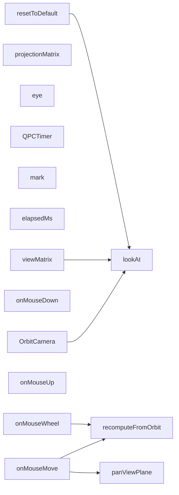

# 代码骨架：d-016（cpp）

> 状态：stale: false · 生成：2026-09-09T11:44:41+08:00

## 导出接口（15）
- `fn OrbitCamera`（camera.cpp:4:1）

```cpp
OrbitCamera::OrbitCamera() : target_(0.0f, 0.0f, 0.0f) , up_(0.0f, 1.0f, 0.0f) , eye_(0.0f, 0.0f, 5.0f) , radius_(5.0f) , yaw_(0.0f) , pitch_(0.0f) , dragMode_(CameraDragMode::None) , lastX_(0) , lastY_(0) , sensitivity_(0.005f) , sensitivityScale_(1.0f)
```

- `fn lookAt`（camera.cpp:19:1）

```cpp
void OrbitCamera::lookAt(const Vec3& eye, const Vec3& target, const Vec3& up)
```

- `fn recomputeFromOrbit`（camera.cpp:33:1）

```cpp
void OrbitCamera::recomputeFromOrbit()
```

- `fn onMouseDown`（camera.cpp:47:1）

```cpp
void OrbitCamera::onMouseDown(int x, int y, int button)
```

- `fn onMouseMove`（camera.cpp:58:1）

```cpp
void OrbitCamera::onMouseMove(int x, int y)
```

- `fn onMouseUp`（camera.cpp:85:1）

```cpp
void OrbitCamera::onMouseUp()
```

- `fn onMouseWheel`（camera.cpp:89:1）

```cpp
void OrbitCamera::onMouseWheel(float delta)
```

- `fn panViewPlane`（camera.cpp:95:1）

```cpp
void OrbitCamera::panViewPlane(float dx, float dy)
```

- `fn resetToDefault`（camera.cpp:105:1）

```cpp
void OrbitCamera::resetToDefault()
```

- `fn viewMatrix`（camera.cpp:109:1）

```cpp
Mat4 OrbitCamera::viewMatrix() const
```

- `fn projectionMatrix`（camera.cpp:113:1）

```cpp
Mat4 OrbitCamera::projectionMatrix(float aspect, float fovDeg, float nearZ, float farZ) const
```

- `fn eye`（camera.cpp:117:1）

```cpp
Vec3 OrbitCamera::eye() const
```

- `fn QPCTimer`（timer.cpp:3:1）

```cpp
QPCTimer::QPCTimer()
```

- `fn mark`（timer.cpp:8:1）

```cpp
void QPCTimer::mark(const char* label)
```

- `fn elapsedMs`（timer.cpp:14:1）

```cpp
double QPCTimer::elapsedMs() const
```

## 调用关系



## 调用边（7）
- OrbitCamera → lookAt（camera.cpp:16:5）
- onMouseMove → recomputeFromOrbit（camera.cpp:72:13）
- onMouseMove → panViewPlane（camera.cpp:75:13）
- onMouseMove → recomputeFromOrbit（camera.cpp:79:13）
- onMouseWheel → recomputeFromOrbit（camera.cpp:92:5）
- resetToDefault → lookAt（camera.cpp:106:5）
- viewMatrix → lookAt（camera.cpp:110:12）