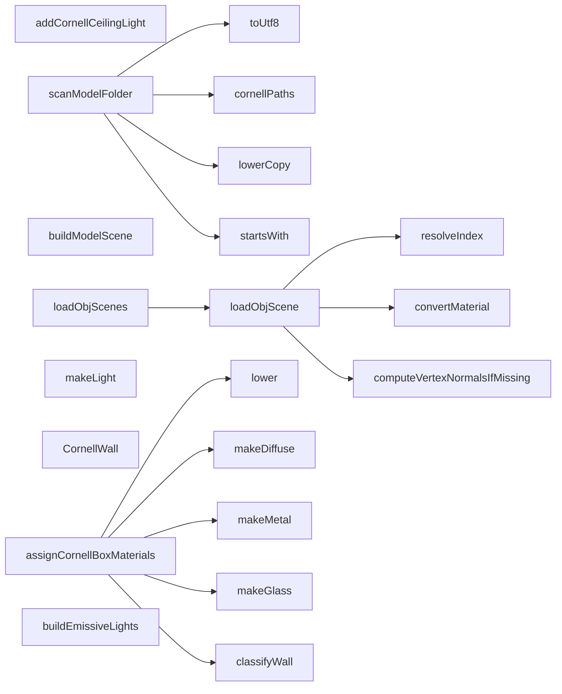

# 代码骨架：d-017（cpp）

> 状态：stale: false · 生成：2026-09-09T11:44:41+08:00

## 导出接口（21）
- `fn lower`（cornell_materials.cpp:11:1）

```cpp
inline std::string lower(const std::string& s)
```

- `fn makeDiffuse`（cornell_materials.cpp:18:1）

```cpp
Material makeDiffuse(const Vec3& color)
```

- `fn makeLight`（cornell_materials.cpp:25:1）

```cpp
Material makeLight(const Vec3& color, float intensity)
```

- `fn makeMetal`（cornell_materials.cpp:33:1）

```cpp
Material makeMetal(const Vec3& color)
```

- `fn makeGlass`（cornell_materials.cpp:48:1）

```cpp
Material makeGlass()
```

- `enum CornellWall`（cornell_materials.cpp:57:1）

```cpp
enum CornellWall { WALL_FLOOR = 0, WALL_CEILING, WALL_BACK, WALL_LEFT, WALL_RIGHT }
```

- `fn classifyWall`（cornell_materials.cpp:65:1）

```cpp
int classifyWall(const Vec3& n)
```

- `fn assignCornellBoxMaterials`（cornell_materials.cpp:76:1）

```cpp
void assignCornellBoxMaterials(Scene& scene)
```

- `fn buildEmissiveLights`（cornell_materials.cpp:127:1）

```cpp
void buildEmissiveLights(Scene& scene)
```

- `fn addCornellCeilingLight`（cornell_materials.cpp:143:1）

```cpp
void addCornellCeilingLight(Scene& scene)
```

- `fn toUtf8`（model_library.cpp:18:1）

```cpp
std::string toUtf8(const std::wstring& w)
```

- `fn cornellPaths`（model_library.cpp:30:1）

```cpp
std::vector<std::string> cornellPaths()
```

- `fn lowerCopy`（model_library.cpp:38:1）

```cpp
std::string lowerCopy(const std::string& s)
```

- `fn startsWith`（model_library.cpp:45:1）

```cpp
bool startsWith(const std::string& s, const std::string& prefix)
```

- `fn scanModelFolder`（model_library.cpp:52:1）

```cpp
std::vector<ModelEntry> scanModelFolder(const std::string& folder)
```

- `fn buildModelScene`（model_library.cpp:91:1）

```cpp
bool buildModelScene(const ModelEntry& entry, Scene& scene)
```

- `fn resolveIndex`（obj_loader.cpp:16:1）

```cpp
inline uint32_t resolveIndex(int idx, size_t count)
```

- `fn convertMaterial`（obj_loader.cpp:27:1）

```cpp
Material convertMaterial(const rapidobj::Material& src)
```

- `fn loadObjScenes`（obj_loader.cpp:54:1）

```cpp
bool loadObjScenes(const std::vector<std::string>& filepaths, Scene& scene)
```

- `fn loadObjScene`（obj_loader.cpp:70:1）

```cpp
bool loadObjScene(const std::string& filepath, Scene& scene, uint32_t materialIndexOffset)
```

- `fn computeVertexNormalsIfMissing`（obj_loader.cpp:216:1）

```cpp
void computeVertexNormalsIfMissing(Mesh& mesh)
```

## 调用关系



## 调用边（20）
- assignCornellBoxMaterials → makeDiffuse（cornell_materials.cpp:78:9）
- assignCornellBoxMaterials → makeDiffuse（cornell_materials.cpp:79:9）
- assignCornellBoxMaterials → makeDiffuse（cornell_materials.cpp:80:9）
- assignCornellBoxMaterials → makeDiffuse（cornell_materials.cpp:81:9）
- assignCornellBoxMaterials → makeDiffuse（cornell_materials.cpp:82:9）
- assignCornellBoxMaterials → makeMetal（cornell_materials.cpp:94:31）
- assignCornellBoxMaterials → makeGlass（cornell_materials.cpp:98:31）
- assignCornellBoxMaterials → lower（cornell_materials.cpp:102:28）
- assignCornellBoxMaterials → classifyWall（cornell_materials.cpp:114:27）
- scanModelFolder → cornellPaths（model_library.cpp:58:24）
- scanModelFolder → toUtf8（model_library.cpp:72:34）
- scanModelFolder → lowerCopy（model_library.cpp:73:35）
- scanModelFolder → startsWith（model_library.cpp:75:13）
- scanModelFolder → toUtf8（model_library.cpp:79:30）
- loadObjScenes → loadObjScene（obj_loader.cpp:59:14）
- loadObjScene → convertMaterial（obj_loader.cpp:106:35）
- loadObjScene → resolveIndex（obj_loader.cpp:151:31）
- loadObjScene → resolveIndex（obj_loader.cpp:153:23）
- loadObjScene → resolveIndex（obj_loader.cpp:156:23）
- loadObjScene → computeVertexNormalsIfMissing（obj_loader.cpp:206:5）