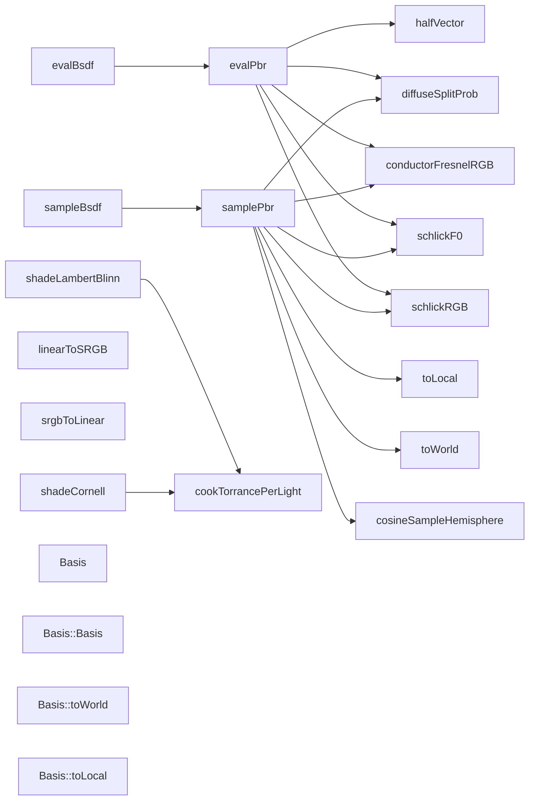

# 代码骨架：d-018（cpp）

> 状态：stale: false · 生成：2026-09-09T11:44:41+08:00

## 导出接口（19）
- `fn halfVector`（bsdf.cpp:16:1）

```cpp
bool halfVector(const Vec3& wi, const Vec3& wo, Vec3& h)
```

- `struct Basis`（bsdf.cpp:24:1）

```cpp
struct Basis { Vec3 s, n, t; explicit Basis(const Vec3& normal) : n(normal) { if (std::fabs(normal.z) < 0.999f) { s = glm::normalize(glm::cross(Vec3(0.0f, 0.0f, 1.0f), normal)); } else { s = Vec3(1.0f, 0.0f, 0.0f); } t = glm::cross(normal, s); } Vec3 toWorld(const Vec3& local) const { return local.x
```

- `fn Basis::Basis`（bsdf.cpp:26:5）

```cpp
explicit Basis(const Vec3& normal) : n(normal)
```

- `fn Basis::toWorld`（bsdf.cpp:34:5）

```cpp
Vec3 toWorld(const Vec3& local) const
```

- `fn Basis::toLocal`（bsdf.cpp:37:5）

```cpp
Vec3 toLocal(const Vec3& world) const
```

- `fn cosineSampleHemisphere`（bsdf.cpp:42:1）

```cpp
Vec3 cosineSampleHemisphere(float u1, float u2)
```

- `fn conductorFresnelRGB`（bsdf.cpp:49:1）

```cpp
Vec3 conductorFresnelRGB(const Vec3& eta, const Vec3& k, float cosThetaI)
```

- `fn schlickF0`（bsdf.cpp:56:1）

```cpp
Vec3 schlickF0(const Material& m)
```

- `fn schlickRGB`（bsdf.cpp:61:1）

```cpp
Vec3 schlickRGB(const Vec3& f0, float cosTheta)
```

- `fn diffuseSplitProb`（bsdf.cpp:70:1）

```cpp
float diffuseSplitProb(const Vec3& f0)
```

- `fn evalPbr`（bsdf.cpp:78:1）

```cpp
BsdfEval evalPbr(const BsdfQuery& q, const Vec3& wi)
```

- `fn samplePbr`（bsdf.cpp:149:1）

```cpp
BsdfSample samplePbr(const BsdfQuery& q, float u1, float u2, float u3)
```

- `fn evalBsdf`（bsdf.cpp:285:1）

```cpp
BsdfEval evalBsdf(const BsdfQuery& q, const Vec3& wi)
```

- `fn sampleBsdf`（bsdf.cpp:301:1）

```cpp
BsdfSample sampleBsdf(const BsdfQuery& q, float u1, float u2, float u3)
```

- `fn cookTorrancePerLight`（lambert_blinn.cpp:17:1）

```cpp
Vec3 cookTorrancePerLight(const BsdfQuery& query, const Vec3& n, const Vec3& l)
```

- `fn shadeLambertBlinn`（lambert_blinn.cpp:26:1）

```cpp
Vec3 shadeLambertBlinn(const Vec3& n, const Vec3& v, const Vec3& albedo, float roughness, const ShadingParams& params)
```

- `fn linearToSRGB`（lambert_blinn.cpp:43:1）

```cpp
Vec3 linearToSRGB(const Vec3& c)
```

- `fn srgbToLinear`（lambert_blinn.cpp:51:1）

```cpp
Vec3 srgbToLinear(const Vec3& c)
```

- `fn shadeCornell`（lambert_blinn.cpp:58:1）

```cpp
Vec3 shadeCornell(const Vec3& n, const Vec3& v, const Vec3& albedo, const Material& mat, const ShadingParams& params, const Scene& scene, const Vec3& worldPos)
```

## 调用关系



## 调用边（30）
- evalPbr → halfVector（bsdf.cpp:88:14）
- evalPbr → conductorFresnelRGB（bsdf.cpp:92:24）
- evalPbr → conductorFresnelRGB（bsdf.cpp:95:25）
- evalPbr → halfVector（bsdf.cpp:110:14）
- evalPbr → halfVector（bsdf.cpp:127:10）
- evalPbr → schlickF0（bsdf.cpp:130:21）
- evalPbr → schlickRGB（bsdf.cpp:131:20）
- evalPbr → diffuseSplitProb（bsdf.cpp:139:22）
- samplePbr → toLocal（bsdf.cpp:157:26）
- samplePbr → conductorFresnelRGB（bsdf.cpp:171:25）
- samplePbr → conductorFresnelRGB（bsdf.cpp:172:25）
- samplePbr → toWorld（bsdf.cpp:176:20）
- samplePbr → toLocal（bsdf.cpp:191:26）
- samplePbr → toWorld（bsdf.cpp:217:24）
- samplePbr → toWorld（bsdf.cpp:232:29）
- samplePbr → toLocal（bsdf.cpp:245:22）
- samplePbr → schlickF0（bsdf.cpp:246:21）
- samplePbr → diffuseSplitProb（bsdf.cpp:247:22）
- samplePbr → cosineSampleHemisphere（bsdf.cpp:250:26）
- samplePbr → schlickRGB（bsdf.cpp:252:24）
- samplePbr → toWorld（bsdf.cpp:253:20）
- samplePbr → schlickRGB（bsdf.cpp:272:20）
- samplePbr → toWorld（bsdf.cpp:275:16）
- evalBsdf → evalPbr（bsdf.cpp:287:40）
- evalBsdf → evalPbr（bsdf.cpp:295:20）
- sampleBsdf → samplePbr（bsdf.cpp:303:40）
- sampleBsdf → samplePbr（bsdf.cpp:310:20）
- shadeLambertBlinn → cookTorrancePerLight（lambert_blinn.cpp:38:14）
- shadeCornell → cookTorrancePerLight（lambert_blinn.cpp:76:18）
- shadeCornell → cookTorrancePerLight（lambert_blinn.cpp:91:18）