# 代码骨架：d-019（cpp）

> 状态：stale: false · 生成：2026-09-09T11:44:41+08:00

## 导出接口（158）
- `fn build`（bvh.cpp:11:1）

```cpp
void BVH::build(std::vector<FlatTriangle>&& tris)
```

- `fn recursiveSplit`（bvh.cpp:52:1）

```cpp
void BVH::recursiveSplit(BuildNode* node)
```

- `fn recursiveFlatten`（bvh.cpp:174:1）

```cpp
size_t BVH::recursiveFlatten(BuildNode* node)
```

- `fn intersect`（bvh.cpp:213:1）

```cpp
std::optional<BVH::HitResult> BVH::intersect(const Vec3& orig, const Vec3& dir, float tMin, float tMax) const
```

- `fn occluded`（bvh.cpp:276:1）

```cpp
bool BVH::occluded(const Vec3& orig, const Vec3& dir, float tMin, float tMax) const
```

- `fn packColor`（path_trace_cpu_backend.cpp:28:1）

```cpp
inline uint32_t packColor(const Vec3& c)
```

- `fn powerHeuristic`（path_trace_cpu_backend.cpp:55:1）

```cpp
float powerHeuristic(float pdfJ, float pdfK)
```

- `fn initialize`（path_trace_cpu_backend.cpp:61:1）

```cpp
bool PathTraceCpuBackend::initialize(int width, int height, Display* display)
```

- `fn loadScene`（path_trace_cpu_backend.cpp:74:1）

```cpp
bool PathTraceCpuBackend::loadScene(const Scene& scene)
```

- `fn setCamera`（path_trace_cpu_backend.cpp:138:1）

```cpp
void PathTraceCpuBackend::setCamera(const OrbitCamera& camera)
```

- `fn resetAccumulation`（path_trace_cpu_backend.cpp:155:1）

```cpp
void PathTraceCpuBackend::resetAccumulation()
```

- `fn sampleAreaLight`（path_trace_cpu_backend.cpp:161:1）

```cpp
Vec3 PathTraceCpuBackend::sampleAreaLight(const Vec3& worldPos, const Vec3& normal, PCG32& rng, Vec3& lightDir, Vec3& lightNormal, float& lightPdf, float& lightDist)
```

- `fn areaLightPdf`（path_trace_cpu_backend.cpp:206:1）

```cpp
float PathTraceCpuBackend::areaLightPdf(const Vec3& worldPos, const Vec3& normal, const Vec3& dir, uint32_t emissiveTriIndex) const
```

- `fn traceRay`（path_trace_cpu_backend.cpp:243:1）

```cpp
Vec3 PathTraceCpuBackend::traceRay(const Vec3& orig, const Vec3& dir, PCG32& rng)
```

- `fn renderScanline`（path_trace_cpu_backend.cpp:336:1）

```cpp
void PathTraceCpuBackend::renderScanline(int y, int passIndex, PCG32& rng)
```

- `fn renderOnePass`（path_trace_cpu_backend.cpp:366:1）

```cpp
void PathTraceCpuBackend::renderOnePass(int passIndex)
```

- `fn uploadCurrentFrame`（path_trace_cpu_backend.cpp:376:1）

```cpp
void PathTraceCpuBackend::uploadCurrentFrame()
```

- `fn renderFrame`（path_trace_cpu_backend.cpp:380:1）

```cpp
void PathTraceCpuBackend::renderFrame(float deltaTime)
```

- `fn getOutput`（path_trace_cpu_backend.cpp:444:1）

```cpp
RenderOutput PathTraceCpuBackend::getOutput() const
```

- `fn captureFrame`（path_trace_cpu_backend.cpp:449:1）

```cpp
bool PathTraceCpuBackend::captureFrame(const char* bmpPath) const
```

- `fn dumpFrame`（path_trace_cpu_backend.cpp:463:1）

```cpp
bool PathTraceCpuBackend::dumpFrame(const char* base) const
```

- `fn setConvergenceTarget`（path_trace_cpu_backend.cpp:478:1）

```cpp
void PathTraceCpuBackend::setConvergenceTarget(const char* refPfmPath)
```

- `fn setPassBudget`（path_trace_cpu_backend.cpp:513:1）

```cpp
void PathTraceCpuBackend::setPassBudget(int passes)
```

- `fn isProgressComplete`（path_trace_cpu_backend.cpp:518:1）

```cpp
bool PathTraceCpuBackend::isProgressComplete() const
```

- `fn progress`（path_trace_cpu_backend.cpp:522:1）

```cpp
float PathTraceCpuBackend::progress() const
```

- `fn updateMaterial`（path_trace_cpu_backend.cpp:527:1）

```cpp
void PathTraceCpuBackend::updateMaterial(int index, const Material& mat)
```

- `fn setShadingModel`（path_trace_cpu_backend.cpp:534:1）

```cpp
void PathTraceCpuBackend::setShadingModel(ShadingModel model)
```

- `fn shutdown`（path_trace_cpu_backend.cpp:540:1）

```cpp
void PathTraceCpuBackend::shutdown()
```

- `fn initialize`（path_trace_gpu_backend.cpp:167:1）

```cpp
bool PathTraceGpuBackend::initialize(int width, int height, Display* display)
```

- `fn loadScene`（path_trace_gpu_backend.cpp:327:1）

```cpp
bool PathTraceGpuBackend::loadScene(const Scene& scene)
```

- `fn setCamera`（path_trace_gpu_backend.cpp:493:1）

```cpp
void PathTraceGpuBackend::setCamera(const OrbitCamera& camera)
```

- `fn renderFrame`（path_trace_gpu_backend.cpp:520:1）

```cpp
void PathTraceGpuBackend::renderFrame(float deltaTime)
```

- `fn getOutput`（path_trace_gpu_backend.cpp:869:1）

```cpp
RenderOutput PathTraceGpuBackend::getOutput() const
```

- `fn isProgressComplete`（path_trace_gpu_backend.cpp:873:1）

```cpp
bool PathTraceGpuBackend::isProgressComplete() const
```

- `fn progress`（path_trace_gpu_backend.cpp:877:1）

```cpp
float PathTraceGpuBackend::progress() const
```

- `fn freeDeviceData`（path_trace_gpu_backend.cpp:881:1）

```cpp
void PathTraceGpuBackend::freeDeviceData()
```

- `fn freeFrameBuffers`（path_trace_gpu_backend.cpp:894:1）

```cpp
void PathTraceGpuBackend::freeFrameBuffers()
```

- `fn onCameraChanged`（path_trace_gpu_backend.cpp:931:1）

```cpp
void PathTraceGpuBackend::onCameraChanged()
```

- `fn updateMaterial`（path_trace_gpu_backend.cpp:947:1）

```cpp
void PathTraceGpuBackend::updateMaterial(int index, const Material& mat)
```

- `fn setShadingModel`（path_trace_gpu_backend.cpp:972:1）

```cpp
void PathTraceGpuBackend::setShadingModel(ShadingModel model)
```

- `fn setAccumMode`（path_trace_gpu_backend.cpp:981:1）

```cpp
void PathTraceGpuBackend::setAccumMode(bool on)
```

- `fn setSvgfTemporal`（path_trace_gpu_backend.cpp:997:1）

```cpp
void PathTraceGpuBackend::setSvgfTemporal(bool on)
```

- `fn setSvgfSpatial`（path_trace_gpu_backend.cpp:1002:1）

```cpp
void PathTraceGpuBackend::setSvgfSpatial(bool on)
```

- `fn setAutoExposure`（path_trace_gpu_backend.cpp:1009:1）

```cpp
void PathTraceGpuBackend::setAutoExposure(bool on)
```

- `fn getRestirStats`（path_trace_gpu_backend.cpp:1017:1）

```cpp
bool PathTraceGpuBackend::getRestirStats(float& avgMdi, float& avgMgi, float& meanL, float& varL) const
```

- `fn dumpFrame`（path_trace_gpu_backend.cpp:1032:1）

```cpp
bool PathTraceGpuBackend::dumpFrame(const char* base) const
```

- `fn captureFrame`（path_trace_gpu_backend.cpp:1049:1）

```cpp
bool PathTraceGpuBackend::captureFrame(const char* bmpPath) const
```

- `fn shutdown`（path_trace_gpu_backend.cpp:1067:1）

```cpp
void PathTraceGpuBackend::shutdown()
```

- `struct TuneParam`（path_trace_gpu_backend.cpp:1082:1）

```cpp
struct TuneParam { const char* name; const char* group; // [t-017/M3] 面板分组 (ARCHITECTURE.md §3) float minV, maxV, step; }
```

- `fn tuneCount`（path_trace_gpu_backend.cpp:1103:1）

```cpp
int PathTraceGpuBackend::tuneCount() const
```

- `fn tuneValue`（path_trace_gpu_backend.cpp:1110:1）

```cpp
float PathTraceGpuBackend::tuneValue(int index) const
```

- `fn tuneAdjust`（path_trace_gpu_backend.cpp:1128:1）

```cpp
void PathTraceGpuBackend::tuneAdjust(int index, float delta)
```

- `fn tuneSetValue`（path_trace_gpu_backend.cpp:1136:1）

```cpp
void PathTraceGpuBackend::tuneSetValue(int index, float value)
```

- `fn tuneRange`（path_trace_gpu_backend.cpp:1157:1）

```cpp
void PathTraceGpuBackend::tuneRange(int index, float& minV, float& maxV, float& step) const
```

- `fn sampleBlueNoise`（path_trace_gpu_backend.cu:12:1）

```cpp
__device__ inline float2 sampleBlueNoise(int pixelX, int pixelY, int frameIndex)
```

- `fn setRtTunables`（path_trace_gpu_backend.cu:44:12）

```cpp
void setRtTunables(const RtTunables* t)
```

- `struct PCG32`（path_trace_gpu_backend.cu:51:1）

```cpp
struct PCG32 { uint64_t state, inc; __device__ void setState(uint64_t init_state, uint64_t init_seq) { state = 0u; inc = (init_seq << 1u) | 1u; next(); state += init_state; next(); } __device__ uint32_t next() { uint64_t old_state = state; state = old_state * 6364136223846793005ull + inc; uint32_t x
```

- `fn PCG32::setState`（path_trace_gpu_backend.cu:54:5）

```cpp
__device__ void setState(uint64_t init_state, uint64_t init_seq)
```

- `fn PCG32::next`（path_trace_gpu_backend.cu:62:5）

```cpp
__device__ uint32_t next()
```

- `fn PCG32::uniform`（path_trace_gpu_backend.cu:70:5）

```cpp
__device__ float uniform()
```

- `fn restirLum`（path_trace_gpu_backend.cu:75:1）

```cpp
__device__ inline float restirLum(float3 c)
```

- `struct Frame`（path_trace_gpu_backend.cu:82:1）

```cpp
struct Frame { float3 n, s, t; __device__ explicit Frame(const float3& normal) : n(normal) { if (fabsf(normal.z) < 0.999f) { s = normalize(cross(make_float3(0.0f, 0.0f, 1.0f), normal)); } else { s = make_float3(1.0f, 0.0f, 0.0f); } t = cross(normal, s); } __device__ float3 toWorld(const float3& loca
```

- `fn Frame::Frame`（path_trace_gpu_backend.cu:85:25）

```cpp
Frame(const float3& normal) : n(normal)
```

- `fn Frame::toWorld`（path_trace_gpu_backend.cu:94:5）

```cpp
__device__ float3 toWorld(const float3& local) const
```

- `fn Frame::toLocal`（path_trace_gpu_backend.cu:98:5）

```cpp
__device__ float3 toLocal(const float3& world) const
```

- `fn cosineSampleHemisphere`（path_trace_gpu_backend.cu:106:1）

```cpp
__device__ float3 cosineSampleHemisphere(float u1, float u2)
```

- `fn powerHeuristic`（path_trace_gpu_backend.cu:117:1）

```cpp
__device__ float powerHeuristic(float pdfJ, float pdfK)
```

- `fn cxAdd`（path_trace_gpu_backend.cu:130:1）

```cpp
__device__ ComplexF cxAdd(ComplexF a, ComplexF b)
```

- `fn cxSub`（path_trace_gpu_backend.cu:131:1）

```cpp
__device__ ComplexF cxSub(ComplexF a, ComplexF b)
```

- `fn cxMul`（path_trace_gpu_backend.cu:132:1）

```cpp
__device__ ComplexF cxMul(ComplexF a, ComplexF b)
```

- `fn cxMulS`（path_trace_gpu_backend.cu:135:1）

```cpp
__device__ ComplexF cxMulS(ComplexF a, float s)
```

- `fn cxDiv`（path_trace_gpu_backend.cu:136:1）

```cpp
__device__ ComplexF cxDiv(ComplexF a, ComplexF b)
```

- `fn cxNorm2`（path_trace_gpu_backend.cu:141:1）

```cpp
__device__ float cxNorm2(ComplexF a)
```

- `fn cxLength`（path_trace_gpu_backend.cu:142:1）

```cpp
__device__ float cxLength(ComplexF a)
```

- `fn cxSqrt`（path_trace_gpu_backend.cu:143:1）

```cpp
__device__ ComplexF cxSqrt(ComplexF a)
```

- `fn conductorFresnel3`（path_trace_gpu_backend.cu:152:1）

```cpp
__device__ float3 conductorFresnel3(const float3& eta, const float3& k, float cosThetaI)
```

- `fn dielectricFresnel`（path_trace_gpu_backend.cu:184:1）

```cpp
__device__ float dielectricFresnel(float etaiDivEtat, float cosThetaT, float& cosThetaI)
```

- `fn boundsIntersect`（path_trace_gpu_backend.cu:197:1）

```cpp
__device__ bool boundsIntersect( const BvhNodePod& node, const float3& orig, const float3& invDir, float tMin, float tMax)
```

- `fn mollerTrumbore`（path_trace_gpu_backend.cu:213:1）

```cpp
__device__ bool mollerTrumbore( const FlatTriPod& tri, const float3& orig, const float3& dir, float& t, float& u, float& v)
```

- `struct PtHit`（path_trace_gpu_backend.cu:239:1）

```cpp
struct PtHit { float t; float3 point; float3 normal; uint32_t materialIndex; uint32_t emissiveTriIndex; }
```

- `fn bvhIntersect`（path_trace_gpu_backend.cu:247:1）

```cpp
__device__ bool bvhIntersect( const BvhNodePod* __restrict__ nodes, const FlatTriPod* __restrict__ tris, const float3& orig, const float3& dir, int numNodes, int numTris, PtHit& hit)
```

- `fn bvhOccluded`（path_trace_gpu_backend.cu:306:1）

```cpp
__device__ bool bvhOccluded( const BvhNodePod* __restrict__ nodes, const FlatTriPod* __restrict__ tris, const float3& orig, const float3& dir, float tMin, float tMax, int numNodes, int numTris, const EmissiveTriPod* __restrict__ emissiveTris, int numEmissive)
```

- `fn bvhOccludedGlassTransparent`（path_trace_gpu_backend.cu:381:1）

```cpp
__device__ bool bvhOccludedGlassTransparent( const BvhNodePod* __restrict__ nodes, const FlatTriPod* __restrict__ tris, const PtMaterialPod* __restrict__ materials, int numMaterials, const float3& orig, const float3& dir, float tMin, float tMax, int numNodes, int numTris, const EmissiveTriPod* __res
```

- `fn sampleAreaLight`（path_trace_gpu_backend.cu:457:1）

```cpp
__device__ float3 sampleAreaLight( const EmissiveTriPod* __restrict__ emissiveTris, int numEmissive, const float3& worldPos, PCG32& rng, int pixelX, int pixelY, int frameIndex, float3& lightDir, float3& lightNormal, float& lightPdf, float& lightDist)
```

- `fn areaLightPdf`（path_trace_gpu_backend.cu:502:1）

```cpp
__device__ float areaLightPdf( const EmissiveTriPod* __restrict__ emissiveTris, int numEmissive, const float3& worldPos, const float3& dir, uint32_t emissiveTriIndex)
```

- `fn traceRay`（path_trace_gpu_backend.cu:541:1）

```cpp
__device__ float3 traceRay( const BvhNodePod* __restrict__ nodes, const FlatTriPod* __restrict__ tris, const PtMaterialPod* __restrict__ materials, const EmissiveTriPod* __restrict__ emissiveTris, int numNodes, int numTris, int numMaterials, int numEmissive, float3 orig, float3 dir, int maxDepth, PC
```

- `fn ptGpuKernel`（path_trace_gpu_backend.cu:668:1）

```cpp
__global__ void __launch_bounds__(256, 4) ptGpuKernel( float3* __restrict__ d_normal, float* __restrict__ d_depth, float3* __restrict__ d_albedo, float3* __restrict__ d_worldPos, uint8_t* __restrict__ d_matFlags, const BvhNodePod* __restrict__ d_nodes, const FlatTriPod* __restrict__ d_triangles, con
```

- `fn restirCandidateKernel`（path_trace_gpu_backend.cu:788:1）

```cpp
__global__ void restirCandidateKernel( RestirReservoir* __restrict__ d_reservoir, const float3* __restrict__ worldPos, const float3* __restrict__ normal, const float3* __restrict__ albedo, const uint8_t* __restrict__ matFlags, const EmissiveTriPod* __restrict__ emissiveTris, const BvhNodePod* __rest
```

- `fn restirShadeKernel`（path_trace_gpu_backend.cu:876:1）

```cpp
__global__ void restirShadeKernel( float3* __restrict__ ioRadiance, const RestirReservoir* __restrict__ reservoir, const float3* __restrict__ albedo, const float3* __restrict__ worldPos, const float3* __restrict__ normal, const BvhNodePod* __restrict__ nodes, const FlatTriPod* __restrict__ tris, con
```

- `fn restirTemporalReuseKernel`（path_trace_gpu_backend.cu:952:1）

```cpp
__global__ void restirTemporalReuseKernel( RestirReservoir* __restrict__ ioReservoir, const RestirReservoir* __restrict__ prevReservoir, const float3* __restrict__ worldPos, const float3* __restrict__ normal, const float* __restrict__ depth, const float3* __restrict__ prevNormal, const float* __rest
```

- `fn restirSpatialReuseKernel`（path_trace_gpu_backend.cu:1077:1）

```cpp
__global__ void restirSpatialReuseKernel( const RestirReservoir* __restrict__ inReservoir, RestirReservoir* __restrict__ outReservoir, const float3* __restrict__ worldPos, const float3* __restrict__ normal, const float* __restrict__ depth, const float3* __restrict__ albedo, const EmissiveTriPod* __r
```

- `fn halfTonemapKernel`（path_trace_gpu_backend.cu:1178:1）

```cpp
__global__ void halfTonemapKernel( const float3* __restrict__ inColor, float3* __restrict__ outLdr, float exposure, int width, int height)
```

- `fn halfAlbedoKernel`（path_trace_gpu_backend.cu:1204:1）

```cpp
__global__ void halfAlbedoKernel( const float3* __restrict__ inAlbedo, float3* __restrict__ outAlbedo, int width, int height)
```

- `fn halfNormalFlowKernel`（path_trace_gpu_backend.cu:1226:1）

```cpp
__global__ void halfNormalFlowKernel( const float3* __restrict__ inNormal, float3* __restrict__ outNormalView, float2* __restrict__ outFlow, const float* __restrict__ viewMat, const float* __restrict__ vpMatrix, int width, int height)
```

- `fn inverseTonemapKernel`（path_trace_gpu_backend.cu:1269:1）

```cpp
__global__ void inverseTonemapKernel( const float3* __restrict__ inLdr, float3* __restrict__ outHdr, float exposure, int width, int height)
```

- `fn logLumReduceKernel`（path_trace_gpu_backend.cu:1289:1）

```cpp
__global__ void logLumReduceKernel( const float3* __restrict__ src, float* __restrict__ d_sum, // single float, MUST be zeroed before launch int width, int height)
```

- `fn packColorToRGBA8Kernel`（path_trace_gpu_backend.cu:1316:1）

```cpp
__global__ void packColorToRGBA8Kernel( const float3* __restrict__ src, uint32_t* __restrict__ dst, int width, int height)
```

- `fn ptAccumulateKernel`（path_trace_gpu_backend.cu:1352:1）

```cpp
__global__ void ptAccumulateKernel( float3* __restrict__ d_accum, const float3* __restrict__ d_radiance, int width, int height, int spp)
```

- `fn launchPtGpuKernel`（path_trace_gpu_backend.cu:1375:1）

```cpp
extern "C" void launchPtGpuKernel( void* d_normal, void* d_depth, float* d_accum, void* d_albedo, void* d_worldPos, void* d_matFlags, const BvhNodePod* d_nodes, const FlatTriPod* d_triangles, const PtMaterialPod* d_materials, const EmissiveTriPod* d_emissiveTris, int width, int height, const PtGpuPa
```

- `fn giMisWeight`（path_trace_gpu_backend.cu:1415:1）

```cpp
__device__ float giMisWeight(float ndotl, float cosLight, float dist2, float numEmissive, float area)
```

- `fn restirGiCandidateKernel`（path_trace_gpu_backend.cu:1427:1）

```cpp
__global__ void restirGiCandidateKernel( RestirGiReservoir* __restrict__ d_reservoir, const float3* __restrict__ worldPos, const float3* __restrict__ normal, const float3* __restrict__ albedo, const uint8_t* __restrict__ matFlags, const PtMaterialPod* __restrict__ materials, const BvhNodePod* __rest
```

- `fn restirGiTemporalReuseKernel`（path_trace_gpu_backend.cu:1820:1）

```cpp
__global__ void restirGiTemporalReuseKernel( RestirGiReservoir* __restrict__ ioReservoir, const RestirGiReservoir* __restrict__ prevReservoir, const float3* __restrict__ worldPos, const float3* __restrict__ normal, const float* __restrict__ depth, const float3* __restrict__ prevNormal, const float* 
```

- `fn restirGiSpatialReuseKernel`（path_trace_gpu_backend.cu:2049:1）

```cpp
__global__ void restirGiSpatialReuseKernel( const RestirGiReservoir* __restrict__ inReservoir, RestirGiReservoir* __restrict__ outReservoir, const float3* __restrict__ worldPos, const float3* __restrict__ normal, const float* __restrict__ depth, const float3* __restrict__ albedo, const EmissiveTriPo
```

- `fn restirGiShadeKernel`（path_trace_gpu_backend.cu:2153:1）

```cpp
__global__ void restirGiShadeKernel( float3* __restrict__ ioRadiance, const RestirGiReservoir* __restrict__ reservoir, const float3* __restrict__ albedo, const float3* __restrict__ worldPos, const float3* __restrict__ normal, const uint8_t* __restrict__ matFlags, const EmissiveTriPod* __restrict__ e
```

- `fn launchRestirCandidate`（path_trace_gpu_backend.cu:2285:1）

```cpp
extern "C" void launchRestirCandidate( void* d_reservoir, const void* d_worldPos, const void* d_normal, const void* d_albedo, const void* d_matFlags, const EmissiveTriPod* d_emissiveTris, const BvhNodePod* d_nodes, const FlatTriPod* d_triangles, int numNodes, int numTris, int numEmissive, int width,
```

- `fn launchRestirShade`（path_trace_gpu_backend.cu:2310:1）

```cpp
extern "C" void launchRestirShade( void* io_radiance, const void* d_reservoir, const void* d_albedo, const void* d_worldPos, const void* d_normal, const BvhNodePod* d_nodes, const FlatTriPod* d_triangles, const EmissiveTriPod* d_emissiveTris, int numNodes, int numTris, int numEmissive, int width, in
```

- `fn restirStatsKernel`（path_trace_gpu_backend.cu:2341:1）

```cpp
__global__ void restirStatsKernel( const float3* __restrict__ radiance, const RestirReservoir* __restrict__ diRes, const RestirGiReservoir* __restrict__ giRes, float* __restrict__ outSum, int width, int height)
```

- `fn launchRestirStats`（path_trace_gpu_backend.cu:2382:1）

```cpp
extern "C" void launchRestirStats( const void* d_radiance, const void* d_diFinal, const void* d_giFinal, float* d_outSum4, int width, int height)
```

- `fn launchRestirTemporalReuse`（path_trace_gpu_backend.cu:2399:1）

```cpp
extern "C" void launchRestirTemporalReuse( void* io_reservoir, const void* d_prevReservoir, const void* d_worldPos, const void* d_normal, const void* d_depth, const void* d_prevNormal, const void* d_prevDepth, const void* d_albedo, const EmissiveTriPod* d_emissiveTris, const BvhNodePod* d_nodes, con
```

- `fn launchRestirSpatialReuse`（path_trace_gpu_backend.cu:2432:1）

```cpp
extern "C" void launchRestirSpatialReuse( const void* d_inReservoir, void* d_outReservoir, const void* d_worldPos, const void* d_normal, const void* d_depth, const void* d_albedo, const EmissiveTriPod* d_emissiveTris, int numEmissive, int width, int height, unsigned int frameIndex)
```

- `fn launchHalfTonemap`（path_trace_gpu_backend.cu:2457:1）

```cpp
extern "C" void launchHalfTonemap( const void* d_inColor, void* d_outLdr, float exposure, int width, int height)
```

- `fn launchHalfAlbedo`（path_trace_gpu_backend.cu:2467:1）

```cpp
extern "C" void launchHalfAlbedo( const void* d_inAlbedo, void* d_outAlbedo, int width, int height)
```

- `fn launchHalfNormalFlow`（path_trace_gpu_backend.cu:2477:1）

```cpp
extern "C" void launchHalfNormalFlow( const void* d_inNormal, void* d_outNormalView, void* d_outFlow, const float* d_viewMat, const float* d_vpMatrix, int width, int height)
```

- `fn launchInverseTonemap`（path_trace_gpu_backend.cu:2491:1）

```cpp
extern "C" void launchInverseTonemap( const void* d_inLdr, void* d_outHdr, float exposure, int width, int height)
```

- `fn launchLogLumReduce`（path_trace_gpu_backend.cu:2501:1）

```cpp
extern "C" void launchLogLumReduce( const void* src, float* d_sum, int width, int height)
```

- `fn launchRestirGiCandidate`（path_trace_gpu_backend.cu:2510:1）

```cpp
extern "C" void launchRestirGiCandidate( void* d_reservoir, const void* d_worldPos, const void* d_normal, const void* d_albedo, const void* d_matFlags, const PtMaterialPod* d_materials, const BvhNodePod* d_nodes, const FlatTriPod* d_triangles, const EmissiveTriPod* d_emissiveTris, int numNodes, int 
```

- `fn launchRestirGiTemporalReuse`（path_trace_gpu_backend.cu:2538:1）

```cpp
extern "C" void launchRestirGiTemporalReuse( void* io_reservoir, const void* d_prevReservoir, const void* d_worldPos, const void* d_normal, const void* d_depth, const void* d_prevNormal, const void* d_prevDepth, const void* d_albedo, const BvhNodePod* d_nodes, const FlatTriPod* d_triangles, const Pt
```

- `fn launchRestirGiSpatialReuse`（path_trace_gpu_backend.cu:2573:1）

```cpp
extern "C" void launchRestirGiSpatialReuse( const void* d_inReservoir, void* d_outReservoir, const void* d_worldPos, const void* d_normal, const void* d_depth, const void* d_albedo, const EmissiveTriPod* d_emissiveTris, const BvhNodePod* d_nodes, const FlatTriPod* d_triangles, int numNodes, int numT
```

- `fn launchRestirGiShade`（path_trace_gpu_backend.cu:2600:1）

```cpp
extern "C" void launchRestirGiShade( void* io_radiance, const void* d_reservoir, const void* d_albedo, const void* d_worldPos, const void* d_normal, const void* d_matFlags, const EmissiveTriPod* d_emissiveTris, const BvhNodePod* d_nodes, const FlatTriPod* d_triangles, const PtMaterialPod* d_material
```

- `fn launchPtAccumulate`（path_trace_gpu_backend.cu:2629:1）

```cpp
extern "C" void launchPtAccumulate( float* d_accum, const float* d_radiance, int width, int height, int spp)
```

- `fn launchPackColorToRGBA8`（path_trace_gpu_backend.cu:2643:1）

```cpp
extern "C" void launchPackColorToRGBA8( const void* src, uint32_t* dst, int width, int height)
```

- `fn packColor`（raster_cpu_backend.cpp:14:1）

```cpp
inline uint32_t packColor(const Vec3& c)
```

- `fn barycentric`（raster_cpu_backend.cpp:22:1）

```cpp
inline bool barycentric(float px, float py, float ax, float ay, float bx, float by, float cx, float cy, float& u, float& v, float& w)
```

- `fn initialize`（raster_cpu_backend.cpp:49:1）

```cpp
bool RasterCpuBackend::initialize(int width, int height, Display* display)
```

- `fn loadScene`（raster_cpu_backend.cpp:65:1）

```cpp
bool RasterCpuBackend::loadScene(const Scene& scene)
```

- `fn setCamera`（raster_cpu_backend.cpp:72:1）

```cpp
void RasterCpuBackend::setCamera(const OrbitCamera& camera)
```

- `fn renderFrame`（raster_cpu_backend.cpp:79:1）

```cpp
void RasterCpuBackend::renderFrame(float deltaTime)
```

- `fn rasterizeTriangleSSAA`（raster_cpu_backend.cpp:119:1）

```cpp
void RasterCpuBackend::rasterizeTriangleSSAA( const Vec3& a, const Vec3& b, const Vec3& c, const Vertex& va, const Vertex& vb, const Vertex& vc, const Material& mat)
```

- `fn getOutput`（raster_cpu_backend.cpp:173:1）

```cpp
RenderOutput RasterCpuBackend::getOutput() const
```

- `fn dumpFrame`（raster_cpu_backend.cpp:179:1）

```cpp
bool RasterCpuBackend::dumpFrame(const char* base) const
```

- `fn captureFrame`（raster_cpu_backend.cpp:192:1）

```cpp
bool RasterCpuBackend::captureFrame(const char* bmpPath) const
```

- `fn updateMaterial`（raster_cpu_backend.cpp:205:1）

```cpp
void RasterCpuBackend::updateMaterial(int index, const Material& mat)
```

- `fn shutdown`（raster_cpu_backend.cpp:210:1）

```cpp
void RasterCpuBackend::shutdown()
```

- `fn initialize`（raster_gpu_backend.cpp:27:1）

```cpp
bool RasterGpuBackend::initialize(int width, int height, Display* display)
```

- `fn loadScene`（raster_gpu_backend.cpp:44:1）

```cpp
bool RasterGpuBackend::loadScene(const Scene& scene)
```

- `fn setCamera`（raster_gpu_backend.cpp:134:1）

```cpp
void RasterGpuBackend::setCamera(const OrbitCamera& camera)
```

- `fn renderFrame`（raster_gpu_backend.cpp:140:1）

```cpp
void RasterGpuBackend::renderFrame(float deltaTime)
```

- `fn getOutput`（raster_gpu_backend.cpp:179:1）

```cpp
RenderOutput RasterGpuBackend::getOutput() const
```

- `fn dumpFrame`（raster_gpu_backend.cpp:184:1）

```cpp
bool RasterGpuBackend::dumpFrame(const char* base) const
```

- `fn captureFrame`（raster_gpu_backend.cpp:203:1）

```cpp
bool RasterGpuBackend::captureFrame(const char* bmpPath) const
```

- `fn freeDeviceData`（raster_gpu_backend.cpp:221:1）

```cpp
void RasterGpuBackend::freeDeviceData()
```

- `fn updateMaterial`（raster_gpu_backend.cpp:234:1）

```cpp
void RasterGpuBackend::updateMaterial(int index, const Material& mat)
```

- `fn shutdown`（raster_gpu_backend.cpp:239:1）

```cpp
void RasterGpuBackend::shutdown()
```

- `struct Material`（raster_gpu_backend.cu:12:1）

```cpp
struct Material { float3 baseColor; float3 emission; float3 conductorEta; float3 conductorK; float roughness; float metallic; float ior; uint8_t isEmissive; uint8_t isMetal; uint8_t isGlass; }
```

- `fn mulMatVec`（raster_gpu_backend.cu:26:1）

```cpp
__device__ float4 mulMatVec(const float* m, const float4& v)
```

- `fn dot`（raster_gpu_backend.cu:43:1）

```cpp
__device__ float dot(const float3& a, const float3& b)
```

- `fn normalize`（raster_gpu_backend.cu:47:1）

```cpp
__device__ float3 normalize(const float3& v)
```

- `fn packColor`（raster_gpu_backend.cu:53:1）

```cpp
__device__ uint32_t packColor(const float3& c)
```

- `fn toPod`（raster_gpu_backend.cu:67:1）

```cpp
__device__ PtMaterialPod toPod(const Material& mat, const float3& albedo)
```

- `fn shadeCookTorranceDevice`（raster_gpu_backend.cu:79:1）

```cpp
__device__ float3 shadeCookTorranceDevice( const dsh::Query& query, const float3& n, const float3& albedo, const float3& lightDir, const float3& lightColor, float lightIntensity, const float3& ambientColor)
```

- `fn barycentric`（raster_gpu_backend.cu:97:1）

```cpp
__device__ bool barycentric(int px, int py, float ax, float ay, float bx, float by, float cx, float cy, float& u, float& v, float& w)
```

- `fn rasterGpuKernel`（raster_gpu_backend.cu:122:1）

```cpp
__global__ void rasterGpuKernel(uint32_t* pixels, int width, int height, const VertexPod* vertices, int numVertices, const TrianglePod* triangles, int numTriangles, const Material* materials, int numMaterials, RasterGpuParams params, const TrianglePod* emissiveTris, int numEmissive)
```

- `fn launchRasterGpuKernel`（raster_gpu_backend.cu:240:12）

```cpp
void launchRasterGpuKernel(uint32_t* d_pixels, int width, int height, const void* d_vertices, int numVertices, const void* d_triangles, int numTriangles, const void* d_materials, int numMaterials, const RasterGpuParams* params, const void* d_emissiveTris, int numEmissive)
```

- `fn ThreadPool`（thread_pool.cpp:4:1）

```cpp
ThreadPool::ThreadPool(size_t threadCount)
```

- `fn ThreadPool`（thread_pool.cpp:14:1）

```cpp
ThreadPool::~ThreadPool()
```

- `fn workerLoop`（thread_pool.cpp:20:1）

```cpp
void ThreadPool::workerLoop()
```

- `fn parallelForTiles`（thread_pool.cpp:36:1）

```cpp
void ThreadPool::parallelForTiles(int width, int height, const std::function<void(int, int, int, int)>& lambda)
```

- `fn wait`（thread_pool.cpp:77:1）

```cpp
void ThreadPool::wait()
```

## 调用关系

```mermaid
flowchart LR
  n100["launchRestirGiCandidate"]
  n101["launchRestirGiTemporalReuse"]
  n102["launchRestirGiSpatialReuse"]
  n103["launchRestirGiShade"]
  n104["launchPtAccumulate"]
  n105["launchPackColorToRGBA8"]
  n106["barycentric"]
  n107["rasterizeTriangleSSAA"]
  n108["Material"]
  n109["mulMatVec"]
  n10["setCamera"]
  n110["dot"]
  n111["normalize"]
  n112["toPod"]
  n113["shadeCookTorranceDevice"]
  n114["rasterGpuKernel"]
  n115["launchRasterGpuKernel"]
  n116["ThreadPool"]
  n117["workerLoop"]
  n118["parallelForTiles"]
  n119["wait"]
  n11["resetAccumulation"]
  n120["toMaterialPod"]
  n121["next"]
  n122["uniform"]
  n123["setState"]
  n124["toLocal"]
  n125["toWorld"]
  n12["sampleAreaLight"]
  n13["areaLightPdf"]
  n14["traceRay"]
  n15["renderScanline"]
  n16["renderOnePass"]
  n17["uploadCurrentFrame"]
  n18["renderFrame"]
  n19["getOutput"]
  n1["build"]
  n20["captureFrame"]
  n21["dumpFrame"]
  n22["setConvergenceTarget"]
  n23["setPassBudget"]
  n24["isProgressComplete"]
  n25["progress"]
  n26["updateMaterial"]
  n27["setShadingModel"]
  n28["shutdown"]
  n29["freeDeviceData"]
  n2["recursiveSplit"]
  n30["freeFrameBuffers"]
  n31["onCameraChanged"]
  n32["setAccumMode"]
  n33["setSvgfTemporal"]
  n34["setSvgfSpatial"]
  n35["setAutoExposure"]
  n36["getRestirStats"]
  n37["TuneParam"]
  n38["tuneCount"]
  n39["tuneValue"]
  n3["recursiveFlatten"]
  n40["tuneAdjust"]
  n41["tuneSetValue"]
  n42["tuneRange"]
  n43["sampleBlueNoise"]
  n44["setRtTunables"]
  n45["PCG32"]
  n46["PCG32::setState"]
  n47["PCG32::next"]
  n48["PCG32::uniform"]
  n49["restirLum"]
  n4["intersect"]
  n50["Frame"]
  n51["Frame::Frame"]
  n52["Frame::toWorld"]
  n53["Frame::toLocal"]
  n54["cosineSampleHemisphere"]
  n55["cxAdd"]
  n56["cxSub"]
  n57["cxMul"]
  n58["cxMulS"]
  n59["cxDiv"]
  n5["occluded"]
  n60["cxNorm2"]
  n61["cxLength"]
  n62["cxSqrt"]
  n63["conductorFresnel3"]
  n64["dielectricFresnel"]
  n65["boundsIntersect"]
  n66["mollerTrumbore"]
  n67["PtHit"]
  n68["bvhIntersect"]
  n69["bvhOccluded"]
  n6["packColor"]
  n70["bvhOccludedGlassTransparent"]
  n71["ptGpuKernel"]
  n72["restirCandidateKernel"]
  n73["restirShadeKernel"]
  n74["restirTemporalReuseKernel"]
  n75["restirSpatialReuseKernel"]
  n76["halfTonemapKernel"]
  n77["halfAlbedoKernel"]
  n78["halfNormalFlowKernel"]
  n79["inverseTonemapKernel"]
  n7["powerHeuristic"]
  n80["logLumReduceKernel"]
  n81["packColorToRGBA8Kernel"]
  n82["ptAccumulateKernel"]
  n83["launchPtGpuKernel"]
  n84["giMisWeight"]
  n85["restirGiCandidateKernel"]
  n86["restirGiTemporalReuseKernel"]
  n87["restirGiSpatialReuseKernel"]
  n88["restirGiShadeKernel"]
  n89["launchRestirCandidate"]
  n8["initialize"]
  n90["launchRestirShade"]
  n91["restirStatsKernel"]
  n92["launchRestirStats"]
  n93["launchRestirTemporalReuse"]
  n94["launchRestirSpatialReuse"]
  n95["launchHalfTonemap"]
  n96["launchHalfAlbedo"]
  n97["launchHalfNormalFlow"]
  n98["launchInverseTonemap"]
  n99["launchLogLumReduce"]
  n9["loadScene"]
  n1 --> n2
  n1 --> n3
  n10 --> n11
  n107 --> n106
  n107 --> n6
  n111 --> n110
  n113 --> n110
  n113 --> n111
  n114 --> n106
  n114 --> n109
  n114 --> n110
  n114 --> n111
  n114 --> n112
  n114 --> n113
  n114 --> n6
  n117 --> n119
  n118 --> n119
  n12 --> n122
  n12 --> n43
  n14 --> n12
  n14 --> n122
  n14 --> n13
  n14 --> n68
  n14 --> n69
  n14 --> n7
  n15 --> n14
  n15 --> n6
  n16 --> n15
  n18 --> n107
  n18 --> n16
  n18 --> n17
  n26 --> n11
  n26 --> n120
  n27 --> n11
  n28 --> n29
  n28 --> n30
  n4 --> n66
  n40 --> n39
  n40 --> n41
  n41 --> n39
  n46 --> n121
  n48 --> n121
  n5 --> n66
  n61 --> n60
  n62 --> n61
  n63 --> n55
  n63 --> n56
  n63 --> n57
  n63 --> n58
  n63 --> n59
  n63 --> n60
  n63 --> n62
  n68 --> n65
  n68 --> n66
  n69 --> n65
  n69 --> n66
  n70 --> n65
  n70 --> n66
  n71 --> n43
  n71 --> n68
  n72 --> n122
  n72 --> n123
  n72 --> n49
  n72 --> n69
  n73 --> n49
  n74 --> n122
  n74 --> n123
  n74 --> n49
  n74 --> n69
  n75 --> n122
  n75 --> n123
  n75 --> n49
  n8 --> n30
  n85 --> n122
  n85 --> n123
  n85 --> n124
  n85 --> n125
  n85 --> n43
  n85 --> n49
  n85 --> n54
  n85 --> n63
  n85 --> n64
  n85 --> n68
  n85 --> n70
  n85 --> n84
  n86 --> n122
  n86 --> n123
  n86 --> n49
  n86 --> n70
  n86 --> n84
  n87 --> n122
  n87 --> n123
  n87 --> n49
  n88 --> n49
  n88 --> n70
  n88 --> n84
  n9 --> n11
  n9 --> n120
  n9 --> n29
```



## 调用边（211）
- build → recursiveSplit（bvh.cpp:33:5）
- build → recursiveFlatten（bvh.cpp:36:5）
- intersect → mollerTrumbore（bvh.cpp:257:21）
- occluded → mollerTrumbore（bvh.cpp:318:21）
- loadScene → resetAccumulation（path_trace_cpu_backend.cpp:134:5）
- setCamera → resetAccumulation（path_trace_cpu_backend.cpp:151:9）
- traceRay → areaLightPdf（path_trace_cpu_backend.cpp:267:40）
- traceRay → powerHeuristic（path_trace_cpu_backend.cpp:269:30）
- traceRay → sampleAreaLight（path_trace_cpu_backend.cpp:294:29）
- traceRay → powerHeuristic（path_trace_cpu_backend.cpp:302:41）
- renderScanline → traceRay（path_trace_cpu_backend.cpp:358:28）
- renderScanline → packColor（path_trace_cpu_backend.cpp:362:29）
- renderOnePass → renderScanline（path_trace_cpu_backend.cpp:371:17）
- renderFrame → renderOnePass（path_trace_cpu_backend.cpp:383:5）
- renderFrame → uploadCurrentFrame（path_trace_cpu_backend.cpp:385:5）
- updateMaterial → resetAccumulation（path_trace_cpu_backend.cpp:530:5）
- setShadingModel → resetAccumulation（path_trace_cpu_backend.cpp:537:5）
- initialize → freeFrameBuffers（path_trace_gpu_backend.cpp:195:9）
- initialize → freeFrameBuffers（path_trace_gpu_backend.cpp:204:9）
- initialize → freeFrameBuffers（path_trace_gpu_backend.cpp:212:9）
- initialize → freeFrameBuffers（path_trace_gpu_backend.cpp:217:31）
- initialize → freeFrameBuffers（path_trace_gpu_backend.cpp:220:31）
- initialize → freeFrameBuffers（path_trace_gpu_backend.cpp:223:31）
- initialize → freeFrameBuffers（path_trace_gpu_backend.cpp:226:31）
- initialize → freeFrameBuffers（path_trace_gpu_backend.cpp:229:31）
- initialize → freeFrameBuffers（path_trace_gpu_backend.cpp:232:31）
- initialize → freeFrameBuffers（path_trace_gpu_backend.cpp:235:31）
- initialize → freeFrameBuffers（path_trace_gpu_backend.cpp:238:31）
- initialize → freeFrameBuffers（path_trace_gpu_backend.cpp:242:31）
- initialize → freeFrameBuffers（path_trace_gpu_backend.cpp:244:31）
- initialize → freeFrameBuffers（path_trace_gpu_backend.cpp:246:31）
- initialize → freeFrameBuffers（path_trace_gpu_backend.cpp:248:31）
- initialize → freeFrameBuffers（path_trace_gpu_backend.cpp:251:31）
- initialize → freeFrameBuffers（path_trace_gpu_backend.cpp:253:31）
- initialize → freeFrameBuffers（path_trace_gpu_backend.cpp:255:31）
- initialize → freeFrameBuffers（path_trace_gpu_backend.cpp:257:31）
- initialize → freeFrameBuffers（path_trace_gpu_backend.cpp:259:31）
- initialize → freeFrameBuffers（path_trace_gpu_backend.cpp:262:31）
- initialize → freeFrameBuffers（path_trace_gpu_backend.cpp:264:31）
- initialize → freeFrameBuffers（path_trace_gpu_backend.cpp:266:31）
- initialize → freeFrameBuffers（path_trace_gpu_backend.cpp:269:31）
- initialize → freeFrameBuffers（path_trace_gpu_backend.cpp:273:31）
- initialize → freeFrameBuffers（path_trace_gpu_backend.cpp:275:31）
- initialize → freeFrameBuffers（path_trace_gpu_backend.cpp:277:31）
- initialize → freeFrameBuffers（path_trace_gpu_backend.cpp:279:31）
- initialize → freeFrameBuffers（path_trace_gpu_backend.cpp:281:31）
- initialize → freeFrameBuffers（path_trace_gpu_backend.cpp:283:31）
- initialize → freeFrameBuffers（path_trace_gpu_backend.cpp:286:31）
- initialize → freeFrameBuffers（path_trace_gpu_backend.cpp:288:31）
- loadScene → freeDeviceData（path_trace_gpu_backend.cpp:329:5）
- loadScene → freeDeviceData（path_trace_gpu_backend.cpp:392:31）
- loadScene → freeDeviceData（path_trace_gpu_backend.cpp:395:31）
- loadScene → freeDeviceData（path_trace_gpu_backend.cpp:414:31）
- loadScene → freeDeviceData（path_trace_gpu_backend.cpp:417:31）
- loadScene → toMaterialPod（path_trace_gpu_backend.cpp:423:22）
- loadScene → freeDeviceData（path_trace_gpu_backend.cpp:427:31）
- loadScene → freeDeviceData（path_trace_gpu_backend.cpp:430:31）
- loadScene → freeDeviceData（path_trace_gpu_backend.cpp:482:35）
- loadScene → freeDeviceData（path_trace_gpu_backend.cpp:485:35）
- updateMaterial → toMaterialPod（path_trace_gpu_backend.cpp:949:31）
- shutdown → freeDeviceData（path_trace_gpu_backend.cpp:1072:5）
- shutdown → freeFrameBuffers（path_trace_gpu_backend.cpp:1073:5）
- tuneAdjust → tuneSetValue（path_trace_gpu_backend.cpp:1132:5）
- tuneAdjust → tuneValue（path_trace_gpu_backend.cpp:1132:25）
- tuneSetValue → tuneValue（path_trace_gpu_backend.cpp:1154:48）
- PCG32::setState → next（path_trace_gpu_backend.cu:57:9）
- PCG32::setState → next（path_trace_gpu_backend.cu:59:9）
- PCG32::uniform → next（path_trace_gpu_backend.cu:71:35）
- cxLength → cxNorm2（path_trace_gpu_backend.cu:142:54）
- cxSqrt → cxLength（path_trace_gpu_backend.cu:144:17）
- conductorFresnel3 → cxDiv（path_trace_gpu_backend.cu:161:27）
- conductorFresnel3 → cxMul（path_trace_gpu_backend.cu:161:57）
- conductorFresnel3 → cxSqrt（path_trace_gpu_backend.cu:162:27）
- conductorFresnel3 → cxSub（path_trace_gpu_backend.cu:162:34）
- conductorFresnel3 → cxDiv（path_trace_gpu_backend.cu:163:27）
- conductorFresnel3 → cxSub（path_trace_gpu_backend.cu:163:33）
- conductorFresnel3 → cxMulS（path_trace_gpu_backend.cu:163:39）
- conductorFresnel3 → cxAdd（path_trace_gpu_backend.cu:164:33）
- conductorFresnel3 → cxMulS（path_trace_gpu_backend.cu:164:39）
- conductorFresnel3 → cxDiv（path_trace_gpu_backend.cu:165:27）
- conductorFresnel3 → cxSub（path_trace_gpu_backend.cu:165:33）
- conductorFresnel3 → cxMulS（path_trace_gpu_backend.cu:165:59）
- conductorFresnel3 → cxAdd（path_trace_gpu_backend.cu:166:33）
- conductorFresnel3 → cxMulS（path_trace_gpu_backend.cu:166:59）
- conductorFresnel3 → cxMul（path_trace_gpu_backend.cu:169:26）
- conductorFresnel3 → cxDiv（path_trace_gpu_backend.cu:170:18）
- conductorFresnel3 → cxSub（path_trace_gpu_backend.cu:170:24）
- conductorFresnel3 → cxAdd（path_trace_gpu_backend.cu:171:24）
- conductorFresnel3 → cxNorm2（path_trace_gpu_backend.cu:173:32）
- conductorFresnel3 → cxNorm2（path_trace_gpu_backend.cu:173:50）
- conductorFresnel3 → cxNorm2（path_trace_gpu_backend.cu:174:32）
- conductorFresnel3 → cxNorm2（path_trace_gpu_backend.cu:174:50）
- conductorFresnel3 → cxNorm2（path_trace_gpu_backend.cu:175:32）
- conductorFresnel3 → cxNorm2（path_trace_gpu_backend.cu:175:50）
- bvhIntersect → boundsIntersect（path_trace_gpu_backend.cu:265:14）
- bvhIntersect → mollerTrumbore（path_trace_gpu_backend.cu:282:21）
- bvhOccluded → boundsIntersect（path_trace_gpu_backend.cu:349:14）
- bvhOccluded → mollerTrumbore（path_trace_gpu_backend.cu:366:21）
- bvhOccludedGlassTransparent → boundsIntersect（path_trace_gpu_backend.cu:423:14）
- bvhOccludedGlassTransparent → mollerTrumbore（path_trace_gpu_backend.cu:443:21）
- sampleAreaLight → uniform（path_trace_gpu_backend.cu:471:32）
- sampleAreaLight → sampleBlueNoise（path_trace_gpu_backend.cu:482:17）
- traceRay → bvhIntersect（path_trace_gpu_backend.cu:567:21）
- traceRay → areaLightPdf（path_trace_gpu_backend.cu:580:34）
- traceRay → powerHeuristic（path_trace_gpu_backend.cu:583:30）
- traceRay → uniform（path_trace_gpu_backend.cu:596:21）
- traceRay → sampleAreaLight（path_trace_gpu_backend.cu:614:29）
- traceRay → bvhOccluded（path_trace_gpu_backend.cu:619:26）
- traceRay → powerHeuristic（path_trace_gpu_backend.cu:626:45）
- traceRay → uniform（path_trace_gpu_backend.cu:635:24）
- traceRay → uniform（path_trace_gpu_backend.cu:635:39）
- traceRay → uniform（path_trace_gpu_backend.cu:635:54）
- ptGpuKernel → sampleBlueNoise（path_trace_gpu_backend.cu:705:21）
- ptGpuKernel → bvhIntersect（path_trace_gpu_backend.cu:721:25）
- restirCandidateKernel → restirLum（path_trace_gpu_backend.cu:811:9）
- restirCandidateKernel → setState（path_trace_gpu_backend.cu:813:9）
- restirCandidateKernel → uniform（path_trace_gpu_backend.cu:823:44）
- restirCandidateKernel → uniform（path_trace_gpu_backend.cu:826:23）
- restirCandidateKernel → uniform（path_trace_gpu_backend.cu:827:23）
- restirCandidateKernel → bvhOccluded（path_trace_gpu_backend.cu:846:23）
- restirCandidateKernel → restirLum（path_trace_gpu_backend.cu:851:28）
- restirCandidateKernel → restirLum（path_trace_gpu_backend.cu:852:27）
- restirCandidateKernel → uniform（path_trace_gpu_backend.cu:859:25）
- restirShadeKernel → restirLum（path_trace_gpu_backend.cu:919:9）
- restirShadeKernel → restirLum（path_trace_gpu_backend.cu:921:19）
- restirShadeKernel → restirLum（path_trace_gpu_backend.cu:930:20）
- restirTemporalReuseKernel → restirLum（path_trace_gpu_backend.cu:1030:20）
- restirTemporalReuseKernel → bvhOccluded（path_trace_gpu_backend.cu:1032:17）
- restirTemporalReuseKernel → setState（path_trace_gpu_backend.cu:1054:5）
- restirTemporalReuseKernel → uniform（path_trace_gpu_backend.cu:1059:17）
- restirSpatialReuseKernel → restirLum（path_trace_gpu_backend.cu:1105:20）
- restirSpatialReuseKernel → setState（path_trace_gpu_backend.cu:1112:5）
- restirSpatialReuseKernel → restirLum（path_trace_gpu_backend.cu:1153:23）
- restirSpatialReuseKernel → uniform（path_trace_gpu_backend.cu:1161:21）
- restirGiCandidateKernel → setState（path_trace_gpu_backend.cu:1474:9）
- restirGiCandidateKernel → toLocal（path_trace_gpu_backend.cu:1491:30）
- restirGiCandidateKernel → toWorld（path_trace_gpu_backend.cu:1493:23）
- restirGiCandidateKernel → conductorFresnel3（path_trace_gpu_backend.cu:1500:26）
- restirGiCandidateKernel → toLocal（path_trace_gpu_backend.cu:1504:30）
- restirGiCandidateKernel → dielectricFresnel（path_trace_gpu_backend.cu:1510:24）
- restirGiCandidateKernel → setState（path_trace_gpu_backend.cu:1512:13）
- restirGiCandidateKernel → uniform（path_trace_gpu_backend.cu:1517:17）
- restirGiCandidateKernel → toWorld（path_trace_gpu_backend.cu:1519:27）
- restirGiCandidateKernel → toWorld（path_trace_gpu_backend.cu:1525:27）
- restirGiCandidateKernel → bvhIntersect（path_trace_gpu_backend.cu:1540:26）
- restirGiCandidateKernel → toLocal（path_trace_gpu_backend.cu:1547:34）
- restirGiCandidateKernel → toWorld（path_trace_gpu_backend.cu:1567:28）
- restirGiCandidateKernel → sampleBlueNoise（path_trace_gpu_backend.cu:1578:26）
- restirGiCandidateKernel → cosineSampleHemisphere（path_trace_gpu_backend.cu:1579:30）
- restirGiCandidateKernel → toWorld（path_trace_gpu_backend.cu:1580:23）
- restirGiCandidateKernel → bvhIntersect（path_trace_gpu_backend.cu:1607:22）
- restirGiCandidateKernel → uniform（path_trace_gpu_backend.cu:1645:17）
- restirGiCandidateKernel → uniform（path_trace_gpu_backend.cu:1647:44）
- restirGiCandidateKernel → uniform（path_trace_gpu_backend.cu:1650:27）
- restirGiCandidateKernel → uniform（path_trace_gpu_backend.cu:1651:27）
- restirGiCandidateKernel → bvhOccludedGlassTransparent（path_trace_gpu_backend.cu:1669:29）
- restirGiCandidateKernel → giMisWeight（path_trace_gpu_backend.cu:1675:30）
- restirGiCandidateKernel → sampleBlueNoise（path_trace_gpu_backend.cu:1687:31）
- restirGiCandidateKernel → cosineSampleHemisphere（path_trace_gpu_backend.cu:1688:35）
- restirGiCandidateKernel → toWorld（path_trace_gpu_backend.cu:1689:35）
- restirGiCandidateKernel → bvhIntersect（path_trace_gpu_backend.cu:1697:30）
- restirGiCandidateKernel → uniform（path_trace_gpu_backend.cu:1720:52）
- restirGiCandidateKernel → uniform（path_trace_gpu_backend.cu:1723:35）
- restirGiCandidateKernel → uniform（path_trace_gpu_backend.cu:1724:35）
- restirGiCandidateKernel → bvhOccludedGlassTransparent（path_trace_gpu_backend.cu:1742:37）
- restirGiCandidateKernel → giMisWeight（path_trace_gpu_backend.cu:1747:38）
- restirGiCandidateKernel → restirLum（path_trace_gpu_backend.cu:1787:46）
- restirGiCandidateKernel → uniform（path_trace_gpu_backend.cu:1793:44）
- restirGiTemporalReuseKernel → bvhOccludedGlassTransparent（path_trace_gpu_backend.cu:1887:9）
- restirGiTemporalReuseKernel → bvhOccludedGlassTransparent（path_trace_gpu_backend.cu:1918:13）
- restirGiTemporalReuseKernel → bvhOccludedGlassTransparent（path_trace_gpu_backend.cu:1967:21）
- restirGiTemporalReuseKernel → giMisWeight（path_trace_gpu_backend.cu:1972:22）
- restirGiTemporalReuseKernel → restirLum（path_trace_gpu_backend.cu:2001:19）
- restirGiTemporalReuseKernel → setState（path_trace_gpu_backend.cu:2016:5）
- restirGiTemporalReuseKernel → uniform（path_trace_gpu_backend.cu:2021:17）
- restirGiSpatialReuseKernel → restirLum（path_trace_gpu_backend.cu:2078:9）
- restirGiSpatialReuseKernel → setState（path_trace_gpu_backend.cu:2084:5）
- restirGiSpatialReuseKernel → uniform（path_trace_gpu_backend.cu:2130:21）
- restirGiShadeKernel → bvhOccludedGlassTransparent（path_trace_gpu_backend.cu:2258:21）
- restirGiShadeKernel → giMisWeight（path_trace_gpu_backend.cu:2263:22）
- restirGiShadeKernel → restirLum（path_trace_gpu_backend.cu:2279:18）
- renderFrame → rasterizeTriangleSSAA（raster_cpu_backend.cpp:111:13）
- rasterizeTriangleSSAA → barycentric（raster_cpu_backend.cpp:148:26）
- rasterizeTriangleSSAA → packColor（raster_cpu_backend.cpp:167:37）
- loadScene → freeDeviceData（raster_gpu_backend.cpp:45:5）
- loadScene → freeDeviceData（raster_gpu_backend.cpp:80:31）
- loadScene → freeDeviceData（raster_gpu_backend.cpp:83:31）
- loadScene → freeDeviceData（raster_gpu_backend.cpp:86:31）
- loadScene → freeDeviceData（raster_gpu_backend.cpp:90:31）
- loadScene → freeDeviceData（raster_gpu_backend.cpp:94:31）
- loadScene → freeDeviceData（raster_gpu_backend.cpp:98:31）
- loadScene → freeDeviceData（raster_gpu_backend.cpp:122:35）
- loadScene → freeDeviceData（raster_gpu_backend.cpp:126:35）
- shutdown → freeDeviceData（raster_gpu_backend.cpp:240:5）
- normalize → dot（raster_gpu_backend.cu:48:23）
- shadeCookTorranceDevice → normalize（raster_gpu_backend.cu:84:22）
- shadeCookTorranceDevice → dot（raster_gpu_backend.cu:86:31）
- rasterGpuKernel → mulMatVec（raster_gpu_backend.cu:149:21）
- rasterGpuKernel → mulMatVec（raster_gpu_backend.cu:150:21）
- rasterGpuKernel → mulMatVec（raster_gpu_backend.cu:151:21）
- rasterGpuKernel → barycentric（raster_gpu_backend.cu:167:14）
- rasterGpuKernel → normalize（raster_gpu_backend.cu:173:25）
- rasterGpuKernel → normalize（raster_gpu_backend.cu:181:26）
- rasterGpuKernel → toPod（raster_gpu_backend.cu:202:23）
- rasterGpuKernel → shadeCookTorranceDevice（raster_gpu_backend.cu:206:17）
- rasterGpuKernel → dot（raster_gpu_backend.cu:224:27）
- rasterGpuKernel → normalize（raster_gpu_backend.cu:225:24）
- rasterGpuKernel → dot（raster_gpu_backend.cu:226:33）
- rasterGpuKernel → packColor（raster_gpu_backend.cu:237:19）
- workerLoop → wait（thread_pool.cpp:26:17）
- parallelForTiles → wait（thread_pool.cpp:74:5）