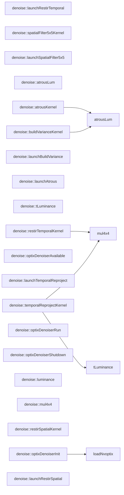

# 代码骨架：d-020（cpp）

> 状态：stale: false · 生成：2026-09-09T11:44:41+08:00

## 导出接口（25）
- `fn denoise::optixDenoiserAvailable`（optix_denoiser.cpp:68:1）

```cpp
bool optixDenoiserAvailable()
```

- `fn denoise::optixDenoiserInit`（optix_denoiser.cpp:70:1）

```cpp
bool optixDenoiserInit(int inWidth, int inHeight)
```

- `fn denoise::optixDenoiserRun`（optix_denoiser.cpp:154:1）

```cpp
bool optixDenoiserRun(const void* d_colorLdrIn, void* d_colorOut, const void* d_albedo, const void* d_normal, const void* d_flow, bool newSequence)
```

- `fn denoise::optixDenoiserShutdown`（optix_denoiser.cpp:234:1）

```cpp
void optixDenoiserShutdown()
```

- `fn denoise::optixDenoiserAvailable`（optix_denoiser.cpp:253:1）

```cpp
bool optixDenoiserAvailable()
```

- `fn denoise::optixDenoiserInit`（optix_denoiser.cpp:255:1）

```cpp
bool optixDenoiserInit(int inWidth, int inHeight)
```

- `fn denoise::optixDenoiserRun`（optix_denoiser.cpp:260:1）

```cpp
bool optixDenoiserRun(const void* d_colorLdrIn, void* d_colorOut, const void* d_albedo, const void* d_normal, const void* d_flow, bool newSequence)
```

- `fn denoise::optixDenoiserShutdown`（optix_denoiser.cpp:268:1）

```cpp
void optixDenoiserShutdown()
```

- `fn denoise::luminance`（restir_simplified.cu:8:1）

```cpp
__device__ inline float luminance(float3 c)
```

- `fn denoise::mul4x4`（restir_simplified.cu:12:1）

```cpp
__device__ inline float4 mul4x4(const float* M, float4 v)
```

- `fn denoise::restirSpatialKernel`（restir_simplified.cu:20:1）

```cpp
__global__ void restirSpatialKernel( const float3* __restrict__ inR, float3* __restrict__ outR, const float3* __restrict__ inN, const float* __restrict__ inD, int width, int height, int frameIndex)
```

- `fn denoise::restirTemporalKernel`（restir_simplified.cu:70:1）

```cpp
__global__ void restirTemporalKernel( const float3* __restrict__ inR, const float3* __restrict__ histR, float3* __restrict__ outR, const float3* __restrict__ cNbuf, const float* __restrict__ cDbuf, const float3* __restrict__ hNbuf, const float* __restrict__ hDbuf, int width, int height, const float*
```

- `fn denoise::launchRestirSpatial`（restir_simplified.cu:150:1）

```cpp
void launchRestirSpatial( const void* d_radianceIn, void* d_radianceOut, const void* d_normal, const void* d_depth, int width, int height, int frameIndex)
```

- `fn denoise::launchRestirTemporal`（restir_simplified.cu:165:1）

```cpp
void launchRestirTemporal( const void* d_radianceIn, const void* d_historyR, void* d_radianceOut, const void* d_currNormal, const void* d_currDepth, const void* d_histNormal, const void* d_histDepth, int width, int height, const float* vpMatrix)
```

- `fn denoise::spatialFilter5x5Kernel`（spatial_filter.cu:17:1）

```cpp
__global__ void spatialFilter5x5Kernel( const float3* __restrict__ src, float3* __restrict__ dst, int width, int height)
```

- `fn denoise::launchSpatialFilter5x5`（spatial_filter.cu:66:1）

```cpp
void launchSpatialFilter5x5( const void* srcRadiance, void* dstRadiance, int width, int height)
```

- `fn denoise::atrousLum`（svgf_atrous.cu:8:1）

```cpp
__device__ inline float atrousLum(float3 c)
```

- `fn denoise::buildVarianceKernel`（svgf_atrous.cu:17:1）

```cpp
__global__ void buildVarianceKernel( const float3* __restrict__ accumColor, const float* __restrict__ moment, float4* __restrict__ colorVariance, int width, int height)
```

- `fn denoise::atrousKernel`（svgf_atrous.cu:45:1）

```cpp
__global__ void atrousKernel( const float4* __restrict__ inCv, float4* __restrict__ outCv, float3* __restrict__ finalColor, const float3* __restrict__ normal, const float* __restrict__ depth, const uint8_t* __restrict__ matFlags, float colorPhi, float varFloor, float centerW, int width, int height, 
```

- `fn denoise::launchBuildVariance`（svgf_atrous.cu:126:1）

```cpp
void launchBuildVariance( const void* d_accumColor, const void* d_moment, void* d_colorVariance, int width, int height)
```

- `fn denoise::launchAtrous`（svgf_atrous.cu:139:1）

```cpp
void launchAtrous( const void* d_inCv, void* d_outCv, void* d_finalColor, const void* d_normal, const void* d_depth, const void* d_matFlags, float colorPhi, float varFloor, float centerW, int width, int height, int stepSize, bool last)
```

- `fn denoise::mul4x4`（temporal_reproject.cu:9:1）

```cpp
__device__ inline float4 mul4x4(const float* M, float4 v)
```

- `fn denoise::tLuminance`（temporal_reproject.cu:17:1）

```cpp
__device__ inline float tLuminance(float3 c)
```

- `fn denoise::temporalReprojectKernel`（temporal_reproject.cu:21:1）

```cpp
__global__ void temporalReprojectKernel( const float3* __restrict__ currR, const float3* __restrict__ currN, const float* __restrict__ currD, const float3* __restrict__ histR, const float3* __restrict__ histN, const float* __restrict__ histD, const float* __restrict__ histM, float3* __restrict__ out
```

- `fn denoise::launchTemporalReproject`（temporal_reproject.cu:168:1）

```cpp
void launchTemporalReproject( const void* d_currRadiance, const void* d_currNormal, const void* d_currDepth, const void* d_histRadiance, const void* d_histNormal, const void* d_histDepth, const void* d_histMoment, void* d_outputRadiance, void* d_outputMoment, const TemporalReprojectParams& params, u
```

## 调用关系



## 调用边（7）
- denoise::optixDenoiserInit → loadNvoptix（optix_denoiser.cpp:74:10）
- denoise::restirTemporalKernel → mul4x4（restir_simplified.cu:104:20）
- denoise::buildVarianceKernel → atrousLum（svgf_atrous.cu:29:17）
- denoise::atrousKernel → atrousLum（svgf_atrous.cu:72:19）
- denoise::atrousKernel → atrousLum（svgf_atrous.cu:105:26）
- denoise::temporalReprojectKernel → tLuminance（temporal_reproject.cu:51:18）
- denoise::temporalReprojectKernel → mul4x4（temporal_reproject.cu:64:20）