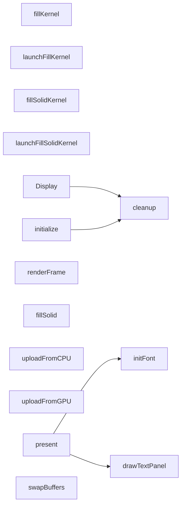

# 代码骨架：d-021（cpp）

> 状态：stale: false · 生成：2026-09-09T11:44:41+08:00

## 导出接口（16）
- `fn Display`（display.cpp:12:1）

```cpp
Display::Display(int width, int height) : width_(width) , height_(height) , pbos_{0, 0} , displayTexture_(0) , cudaResources_{nullptr, nullptr} , writeIdx_(0) , displayIdx_(0) , ready_(false) , cpuUploaded_(false)
```

- `fn Display`（display.cpp:23:1）

```cpp
Display::~Display()
```

- `fn initialize`（display.cpp:27:1）

```cpp
bool Display::initialize()
```

- `fn cleanup`（display.cpp:70:1）

```cpp
void Display::cleanup()
```

- `fn renderFrame`（display.cpp:91:1）

```cpp
void Display::renderFrame(float time)
```

- `fn fillSolid`（display.cpp:103:1）

```cpp
void Display::fillSolid(uint8_t r, uint8_t g, uint8_t b)
```

- `fn uploadFromCPU`（display.cpp:113:1）

```cpp
void Display::uploadFromCPU(const uint32_t* pixels)
```

- `fn uploadFromGPU`（display.cpp:123:1）

```cpp
void Display::uploadFromGPU(const uint32_t* d_pixels)
```

- `fn present`（display.cpp:158:1）

```cpp
void Display::present(HDC hdc, const char* statusText, const char* toastText, const char* tuneText)
```

- `fn swapBuffers`（display.cpp:206:1）

```cpp
void Display::swapBuffers(HDC hdc)
```

- `fn initFont`（display.cpp:210:1）

```cpp
bool Display::initFont(HDC hdc)
```

- `fn drawTextPanel`（display.cpp:234:1）

```cpp
void Display::drawTextPanel(const char* text, int x, int y)
```

- `fn fillKernel`（display.cu:8:1）

```cpp
__global__ void fillKernel(uint32_t* pixels, int width, int height, float time)
```

- `fn launchFillKernel`（display.cu:32:1）

```cpp
void launchFillKernel(cudaGraphicsResource_t resource, int width, int height, float time)
```

- `fn fillSolidKernel`（display.cu:57:1）

```cpp
__global__ void fillSolidKernel(uint32_t* pixels, int width, int height, uint8_t r, uint8_t g, uint8_t b)
```

- `fn launchFillSolidKernel`（display.cu:65:1）

```cpp
void launchFillSolidKernel(cudaGraphicsResource_t resource, int width, int height, uint8_t r, uint8_t g, uint8_t b)
```

## 调用关系



## 调用边（6）
- Display → cleanup（display.cpp:24:5）
- initialize → cleanup（display.cpp:51:13）
- present → initFont（display.cpp:188:9）
- present → drawTextPanel（display.cpp:190:13）
- present → drawTextPanel（display.cpp:194:13）
- present → drawTextPanel（display.cpp:198:13）