# 代码骨架：d-002（csharp）

> 状态：stale: false · 生成：2026-09-09T11:44:42+08:00

## 导出接口（48）
- `class RTResourceManager`（Sky/Core/RTResourceManager.cs:10:1）

```csharp
public class RTResourceManager { public RTHandle TransmittanceLUT; // 256×64 (球形 (r,μ)) public RTHandle MultiScatterLUT; // 32×32 (多散射, 最终) public RTHandle MultiScatterLUTPrev; // 32×32 (迭代中间缓冲) public RTHandle SkyCubemap; // N×N×6 Texture2DArray private int _cubemapS
```

- `fn RTResourceManager::InitStaticResources`（Sky/Core/RTResourceManager.cs:19:5）

```csharp
public void InitStaticResources(int cubemapSize)
```

- `fn RTResourceManager::Dispose`（Sky/Core/RTResourceManager.cs:67:5）

```csharp
public void Dispose()
```

- `class VolumetricSkyManager`（Sky/Core/VolumetricSkyManager.cs:18:1）

```csharp
[ExecuteInEditMode] public class VolumetricSkyManager : MonoBehaviour { [Header("参数引用")] public VolumetricSkyParams skyParams; [Header("Compute Shaders")] public ComputeShader transmittanceLUTCompute; public ComputeShader multiScatterLUTCompute; public ComputeShader skyCubemapCompute; [Heade
```

- `class VolumetricSkyParams`（Sky/Core/VolumetricSkyParams.cs:20:1）

```csharp
[CreateAssetMenu(fileName = "VolumetricSkyParams", menuName = "Sky/Volumetric Sky Params")] public class VolumetricSkyParams : ScriptableObject { // ================================================================ // Layer 1: 太阳 (Artist) // =======================================================
```

- `enum VolumetricSkyParams::CubemapUpdateMode`（Sky/Core/VolumetricSkyParams.cs:69:5）

```csharp
[Header("Performance")] public enum CubemapUpdateMode { OnParameterChange = 0, // 静态太阳: 参数变化才重算 (推荐) SunAngleThreshold = 1, // 预留动态太阳: 角度变化超阈值重算 EveryFrame = 2 // 旧行为: 每帧重算 (调试用) }
```

- `enum VolumetricSkyParams::SkyPreset`（Sky/Core/VolumetricSkyParams.cs:102:5）

```csharp
public enum SkyPreset { Noon, Sunset, Sunrise, Night }
```

- `fn VolumetricSkyParams::ApplyPreset`（Sky/Core/VolumetricSkyParams.cs:104:5）

```csharp
public void ApplyPreset(SkyPreset preset)
```

- `property VolumetricSkyParams::IsDirty`（Sky/Core/VolumetricSkyParams.cs:136:5）

```csharp
public bool IsDirty => m_IsDirty;
```

- `fn VolumetricSkyParams::MarkDirty`（Sky/Core/VolumetricSkyParams.cs:137:5）

```csharp
public void MarkDirty()
```

- `fn VolumetricSkyParams::ClearDirty`（Sky/Core/VolumetricSkyParams.cs:138:5）

```csharp
public void ClearDirty()
```

- `fn VolumetricSkyParams::DerivePhysicalParams`（Sky/Core/VolumetricSkyParams.cs:146:5）

```csharp
public void DerivePhysicalParams()
```

- `fn VolumetricSkyParams::ApplyToShader`（Sky/Core/VolumetricSkyParams.cs:161:5）

```csharp
public void ApplyToShader()
```

- `class TAAUpscalePass`（Sky/Deprecated/TAAUpscalePass.cs:12:1）

```csharp
public class TAAUpscalePass : ScriptableRenderPass { private Material _compositeMaterial; private RTHandle _skyColorRT; private RTHandle _cameraColorRT; public void Setup(Material compositeMaterial, RTHandle skyColorRT) { _compositeMaterial = compositeMaterial; _skyColorRT = skyColorRT; renderPassEv
```

- `fn TAAUpscalePass::Setup`（Sky/Deprecated/TAAUpscalePass.cs:18:5）

```csharp
public void Setup(Material compositeMaterial, RTHandle skyColorRT)
```

- `fn TAAUpscalePass::OnCameraSetup`（Sky/Deprecated/TAAUpscalePass.cs:25:5）

```csharp
public override void OnCameraSetup(CommandBuffer cmd, ref RenderingData renderingData)
```

- `fn TAAUpscalePass::Execute`（Sky/Deprecated/TAAUpscalePass.cs:31:5）

```csharp
public override void Execute(ScriptableRenderContext context, ref RenderingData renderingData)
```

- `fn TAAUpscalePass::OnCameraCleanup`（Sky/Deprecated/TAAUpscalePass.cs:48:5）

```csharp
public override void OnCameraCleanup(CommandBuffer cmd)
```

- `class SkyComputeVerifier`（Sky/Verification/SkyComputeVerifier.cs:13:1）

```csharp
[ExecuteInEditMode] public class SkyComputeVerifier : MonoBehaviour { [Header("Compute Shader")] public ComputeShader verifyCompute; [Header("Test Config")] public int noiseSize = 128; public int cubemapSize = 128; [Header("Results (Auto)")] [TextArea(3, 20)] public string resultsLog = ""; private b
```

- `class SkyInjectionVerifyFeature`（Sky/Verification/SkyInjectionVerifyFeature.cs:14:1）

```csharp
public class SkyInjectionVerifyFeature : ScriptableRendererFeature { [System.Serializable] public class Settings { public bool enableAfterOpaquesTest = true; // A1.1 + A1.2 public bool enableBeforeTransparentsTest = true; // A1.3 public bool enableBloomTest = true; // A1.4 } public Settings settings
```

- `class SkyInjectionVerifyFeature::Settings`（Sky/Verification/SkyInjectionVerifyFeature.cs:16:5）

```csharp
[System.Serializable] public class Settings { public bool enableAfterOpaquesTest = true; // A1.1 + A1.2 public bool enableBeforeTransparentsTest = true; // A1.3 public bool enableBloomTest = true; // A1.4 }
```

- `fn SkyInjectionVerifyFeature::Create`（Sky/Verification/SkyInjectionVerifyFeature.cs:29:5）

```csharp
public override void Create()
```

- `fn SkyInjectionVerifyFeature::AddRenderPasses`（Sky/Verification/SkyInjectionVerifyFeature.cs:36:5）

```csharp
public override void AddRenderPasses(ScriptableRenderer renderer, ref RenderingData renderingData)
```

- `fn SkyInjectionVerifyFeature::Dispose`（Sky/Verification/SkyInjectionVerifyFeature.cs:57:5）

```csharp
protected override void Dispose(bool disposing)
```

- `class SkyAfterOpaquesPass`（Sky/Verification/SkyInjectionVerifyFeature.cs:63:1）

```csharp
public class SkyAfterOpaquesPass : ScriptableRenderPass { private static bool _logged = false; private static int _frameCount = 0; public override void OnCameraSetup(CommandBuffer cmd, ref RenderingData renderingData) { // 关键: 请求深度纹理输入 ConfigureInput(ScriptableRenderPassInput.Dep
```

- `fn SkyAfterOpaquesPass::OnCameraSetup`（Sky/Verification/SkyInjectionVerifyFeature.cs:68:5）

```csharp
public override void OnCameraSetup(CommandBuffer cmd, ref RenderingData renderingData)
```

- `fn SkyAfterOpaquesPass::Execute`（Sky/Verification/SkyInjectionVerifyFeature.cs:74:5）

```csharp
public override void Execute(ScriptableRenderContext context, ref RenderingData renderingData)
```

- `class SkyBeforeTransparentsPass`（Sky/Verification/SkyInjectionVerifyFeature.cs:149:1）

```csharp
public class SkyBeforeTransparentsPass : ScriptableRenderPass { private static bool _logged = false; public override void Execute(ScriptableRenderContext context, ref RenderingData renderingData) { if (_logged) return; Debug.Log($"[A1.3] ═══ BeforeRenderingTransparents 注入验证 ═══")
```

- `fn SkyBeforeTransparentsPass::Execute`（Sky/Verification/SkyInjectionVerifyFeature.cs:153:5）

```csharp
public override void Execute(ScriptableRenderContext context, ref RenderingData renderingData)
```

- `class BloomTestPass`（Sky/Verification/SkyInjectionVerifyFeature.cs:178:1）

```csharp
public class BloomTestPass : ScriptableRenderPass { private static bool _logged = false; private RTHandle _testHDR; private int _testWidth = 960; private int _testHeight = 540; public override void OnCameraSetup(CommandBuffer cmd, ref RenderingData renderingData) { var desc = new RenderTextureDescri
```

- `fn BloomTestPass::OnCameraSetup`（Sky/Verification/SkyInjectionVerifyFeature.cs:185:5）

```csharp
public override void OnCameraSetup(CommandBuffer cmd, ref RenderingData renderingData)
```

- `fn BloomTestPass::Execute`（Sky/Verification/SkyInjectionVerifyFeature.cs:191:5）

```csharp
public override void Execute(ScriptableRenderContext context, ref RenderingData renderingData)
```

- `fn BloomTestPass::Dispose`（Sky/Verification/SkyInjectionVerifyFeature.cs:224:5）

```csharp
public void Dispose()
```

- `class SeaFloorGen`（Water/Core/SeaFloorGen.cs:7:1）

```csharp
[RequireComponent(typeof(MeshFilter))] public class SeaFloorGen : MonoBehaviour { [Header("地形参数")] [Tooltip("水平缩放 - 值越大起伏越平缓")] public float scale = 20f; [Tooltip("基础起伏高度")] public float height = 3f; [Tooltip("细节层数 - 叠加的高频噪波倍数")] 
```

- `class WaterRenderSystemV2`（Water/Core/WaterRenderSystemV2.cs:29:1）

```csharp
[ExecuteInEditMode] public class WaterRenderSystemV2 : MonoBehaviour { // ===== LOD 层级定义 ===== [System.Serializable] public class LODLevel { [Header("Mesh")] public int resolution = 65; public float spacing = 6f; [Header("Render")] public bool enabled = true; [Header("V2.6 Inner Cut")] publi
```

- `class WaterRenderSystemV2::LODLevel`（Water/Core/WaterRenderSystemV2.cs:33:5）

```csharp
[System.Serializable] public class LODLevel { [Header("Mesh")] public int resolution = 65; public float spacing = 6f; [Header("Render")] public bool enabled = true; [Header("V2.6 Inner Cut")] public float innerRadius = 0f; [System.NonSerialized] public ComputeBuffer positionBuffer; [System.NonSerial
```

- `property WaterRenderSystemV2::CameraIsUnderwater`（Water/Core/WaterRenderSystemV2.cs:170:5）

```csharp
public bool CameraIsUnderwater => _cameraIsUnderwater;
```

- `property WaterRenderSystemV2::VolumeBoxMesh`（Water/Core/WaterRenderSystemV2.cs:173:5）

```csharp
public Mesh VolumeBoxMesh => _volumeBoxMesh;
```

- `class WaterRenderSystemV2::IDs`（Water/Core/WaterRenderSystemV2.cs:176:5）

```csharp
private static class IDs { // --- FFT Textures --- public static readonly int DisplacementMap0 = Shader.PropertyToID("_DisplacementMap0"); public static readonly int DisplacementMap1 = Shader.PropertyToID("_DisplacementMap1"); public static readonly int DisplacementMap2 = Shader.PropertyToID("_Displ
```

- `fn WaterRenderSystemV2::AddRipple`（Water/Core/WaterRenderSystemV2.cs:863:5）

```csharp
public void AddRipple(Vector2 centerWorldXZ, float amplitude = 0.05f)
```

- `fn WaterRenderSystemV2::ClearAllRipples`（Water/Core/WaterRenderSystemV2.cs:881:5）

```csharp
public void ClearAllRipples()
```

- `fn WaterRenderSystemV2::RedistributeRipples`（Water/Core/WaterRenderSystemV2.cs:890:5）

```csharp
public void RedistributeRipples(Camera cam)
```

- `fn WaterRenderSystemV2::ExecuteRender`（Water/Core/WaterRenderSystemV2.cs:1088:5）

```csharp
public void ExecuteRender(Camera cam)
```

- `class WaterDebugDrawProcedural`（Water/Debug/WaterDebugDrawProcedural.cs:14:1）

```csharp
[ExecuteInEditMode] public class WaterDebugDrawProcedural : MonoBehaviour { private Material _mat; private int _frameCount; void OnEnable() { Shader s = Shader.Find("Hidden/TestDrawProcedural"); if (s == null) { Debug.LogError("[TestDraw] 找不到 'Hidden/TestDrawProcedural'! 请确认 shader 文
```

- `class OceanFFTGenerator`（Water/Utils/OceanFFTGenerator.cs:16:1）

```csharp
[ExecuteInEditMode] public class OceanFFTGenerator : MonoBehaviour { [Header("═══ FFT 分辨率 ═══")] [Tooltip("贴图分辨率 (2的幂次: 64/128/256)。越高细节越丰富, 但性能开销越大")] public int fftSize = 128; [Header("═══ Compute Shader 引用 ═══")] [Too
```

- `class OceanFFTGenerator::OctaveSettings`（Water/Utils/OceanFFTGenerator.cs:72:5）

```csharp
[System.Serializable] public class OctaveSettings { [Tooltip("海洋长度(m) — 决定该八度的最大波长")] public float oceanLength = 200f; [Tooltip("振幅倍增 — artistic override (JONSWAP已提供物理能量分布, 默认1.0)")] public float amplitude = 1.0f; }
```

- `class OceanFFTGenerator::SwellSettings`（Water/Utils/OceanFFTGenerator.cs:82:5）

```csharp
[System.Serializable] public class SwellSettings { [Tooltip("涌浪方向 (XZ平面)")] public Vector2 direction = new Vector2(1f, 0f); [Tooltip("源区风速 (m/s) — 影响JONSWAP能量和峰值频率")] public float windSpeed = 10f; [Tooltip("风区长度 fetch (m) — 短fetch=近岸风浪, 长
```

- `class OceanFFTGenerator::ID`（Water/Utils/OceanFFTGenerator.cs:153:5）

```csharp
private static class ID { public static readonly int Spectrum = Shader.PropertyToID("_Spectrum"); public static readonly int BufferA = Shader.PropertyToID("_BufferA"); public static readonly int BufferB = Shader.PropertyToID("_BufferB"); public static readonly int Input = Shader.PropertyToID("_Input
```

## 调用关系

```mermaid
flowchart LR
  n10["VolumetricSkyParams::MarkDirty"]
  n11["VolumetricSkyParams::ClearDirty"]
  n12["VolumetricSkyParams::DerivePhysicalParams"]
  n13["VolumetricSkyParams::ApplyToShader"]
  n14["TAAUpscalePass"]
  n15["TAAUpscalePass::Setup"]
  n16["TAAUpscalePass::OnCameraSetup"]
  n17["TAAUpscalePass::Execute"]
  n18["TAAUpscalePass::OnCameraCleanup"]
  n19["SkyComputeVerifier"]
  n1["RTResourceManager"]
  n20["SkyInjectionVerifyFeature"]
  n21["SkyInjectionVerifyFeature::Settings"]
  n22["SkyInjectionVerifyFeature::Create"]
  n23["SkyInjectionVerifyFeature::AddRenderPasses"]
  n24["SkyInjectionVerifyFeature::Dispose"]
  n25["SkyAfterOpaquesPass"]
  n26["SkyAfterOpaquesPass::OnCameraSetup"]
  n27["SkyAfterOpaquesPass::Execute"]
  n28["SkyBeforeTransparentsPass"]
  n29["SkyBeforeTransparentsPass::Execute"]
  n2["RTResourceManager::InitStaticResources"]
  n30["BloomTestPass"]
  n31["BloomTestPass::OnCameraSetup"]
  n32["BloomTestPass::Execute"]
  n33["BloomTestPass::Dispose"]
  n34["SeaFloorGen"]
  n35["WaterRenderSystemV2"]
  n36["WaterRenderSystemV2::LODLevel"]
  n37["WaterRenderSystemV2::CameraIsUnderwater"]
  n38["WaterRenderSystemV2::VolumeBoxMesh"]
  n39["WaterRenderSystemV2::IDs"]
  n3["RTResourceManager::Dispose"]
  n40["WaterRenderSystemV2::AddRipple"]
  n41["WaterRenderSystemV2::ClearAllRipples"]
  n42["WaterRenderSystemV2::RedistributeRipples"]
  n43["WaterRenderSystemV2::ExecuteRender"]
  n44["WaterDebugDrawProcedural"]
  n45["OceanFFTGenerator"]
  n46["OceanFFTGenerator::OctaveSettings"]
  n47["OceanFFTGenerator::SwellSettings"]
  n48["OceanFFTGenerator::ID"]
  n49["MarkDirty"]
  n4["VolumetricSkyManager"]
  n50["DerivePhysicalParams"]
  n51["ClearDirty"]
  n52["GetRendererData"]
  n53["Initialize"]
  n54["RegisterCommandBuffer"]
  n55["UnregisterCommandBuffer"]
  n56["ReleaseBuffers"]
  n57["ReleaseCausticsRT"]
  n58["ReleaseVolumeBox"]
  n59["ReleaseHorizonQuad"]
  n5["VolumetricSkyParams"]
  n60["RebuildCommandBuffer"]
  n61["SubmitDirectDrawProcedural"]
  n62["ValidateLODBuffers"]
  n63["CreateLODBuffers"]
  n64["CreateCausticsRT"]
  n65["CreateVolumeBoxMesh"]
  n66["CreateHorizonQuad"]
  n67["InitializeRippleSystem"]
  n68["FillDefaultData"]
  n69["SafeRelease"]
  n6["VolumetricSkyParams::CubemapUpdateMode"]
  n70["CleanupExpiredRipples"]
  n71["ReleaseRippleSystem"]
  n72["GetStableCamera"]
  n73["UpdateUnderwaterState"]
  n74["DispatchCaustics"]
  n75["RunMeshComputeAllLODs"]
  n76["SetWaterSurfaceMaterialParams"]
  n77["SetUnderwaterVolumeMaterialParams"]
  n78["SetHorizonMaterialParams"]
  n79["AddRipple"]
  n7["VolumetricSkyParams::SkyPreset"]
  n80["SetTextureFromMat"]
  n81["TryGetFloat"]
  n82["SetTextureSelf"]
  n83["CopyFloat"]
  n84["CopyColor"]
  n85["UpdateRippleSystemToGPU"]
  n86["TransferTexture"]
  n87["CopyFloatFromSource"]
  n88["CopyColorFromSource"]
  n89["BuildUnderwaterCommands"]
  n8["VolumetricSkyParams::ApplyPreset"]
  n90["UpdateVolumeBoxIfNeeded"]
  n9["VolumetricSkyParams::IsDirty"]
  n11 --> n49
  n13 --> n50
  n13 --> n51
  n27 --> n52
  n38 --> n53
  n38 --> n54
  n38 --> n55
  n38 --> n56
  n38 --> n57
  n38 --> n58
  n38 --> n59
  n38 --> n60
  n38 --> n61
  n38 --> n62
  n38 --> n63
  n38 --> n64
  n38 --> n65
  n38 --> n66
  n38 --> n67
  n38 --> n68
  n38 --> n69
  n40 --> n70
  n42 --> n55
  n42 --> n56
  n42 --> n57
  n42 --> n58
  n42 --> n59
  n42 --> n60
  n42 --> n69
  n42 --> n71
  n42 --> n72
  n42 --> n73
  n42 --> n74
  n42 --> n75
  n42 --> n76
  n42 --> n77
  n42 --> n78
  n42 --> n79
  n43 --> n60
  n43 --> n62
  n43 --> n72
  n43 --> n80
  n43 --> n81
  n43 --> n82
  n43 --> n83
  n43 --> n84
  n43 --> n85
  n43 --> n86
  n43 --> n87
  n43 --> n88
  n43 --> n89
  n43 --> n90
  n8 --> n49
```



## 调用边（248）
- VolumetricSkyParams::ApplyPreset → MarkDirty（Sky/Core/VolumetricSkyParams.cs:129:9）
- VolumetricSkyParams::ClearDirty → MarkDirty（Sky/Core/VolumetricSkyParams.cs:142:9）
- VolumetricSkyParams::ApplyToShader → DerivePhysicalParams（Sky/Core/VolumetricSkyParams.cs:163:9）
- VolumetricSkyParams::ApplyToShader → ClearDirty（Sky/Core/VolumetricSkyParams.cs:191:9）
- SkyAfterOpaquesPass::Execute → GetRendererData（Sky/Verification/SkyInjectionVerifyFeature.cs:91:28）
- WaterRenderSystemV2::VolumeBoxMesh → Initialize（Water/Core/WaterRenderSystemV2.cs:350:9）
- WaterRenderSystemV2::VolumeBoxMesh → RegisterCommandBuffer（Water/Core/WaterRenderSystemV2.cs:351:9）
- WaterRenderSystemV2::VolumeBoxMesh → UnregisterCommandBuffer（Water/Core/WaterRenderSystemV2.cs:356:9）
- WaterRenderSystemV2::VolumeBoxMesh → ReleaseBuffers（Water/Core/WaterRenderSystemV2.cs:357:9）
- WaterRenderSystemV2::VolumeBoxMesh → ReleaseCausticsRT（Water/Core/WaterRenderSystemV2.cs:358:9）
- WaterRenderSystemV2::VolumeBoxMesh → ReleaseVolumeBox（Water/Core/WaterRenderSystemV2.cs:359:9）
- WaterRenderSystemV2::VolumeBoxMesh → ReleaseHorizonQuad（Water/Core/WaterRenderSystemV2.cs:360:9）
- WaterRenderSystemV2::VolumeBoxMesh → RebuildCommandBuffer（Water/Core/WaterRenderSystemV2.cs:441:9）
- WaterRenderSystemV2::VolumeBoxMesh → SubmitDirectDrawProcedural（Water/Core/WaterRenderSystemV2.cs:444:9）
- WaterRenderSystemV2::VolumeBoxMesh → ValidateLODBuffers（Water/Core/WaterRenderSystemV2.cs:460:18）
- WaterRenderSystemV2::VolumeBoxMesh → ValidateLODBuffers（Water/Core/WaterRenderSystemV2.cs:511:101）
- WaterRenderSystemV2::VolumeBoxMesh → ReleaseBuffers（Water/Core/WaterRenderSystemV2.cs:575:9）
- WaterRenderSystemV2::VolumeBoxMesh → CreateLODBuffers（Water/Core/WaterRenderSystemV2.cs:579:13）
- WaterRenderSystemV2::VolumeBoxMesh → CreateCausticsRT（Water/Core/WaterRenderSystemV2.cs:582:9）
- WaterRenderSystemV2::VolumeBoxMesh → CreateVolumeBoxMesh（Water/Core/WaterRenderSystemV2.cs:583:9）
- WaterRenderSystemV2::VolumeBoxMesh → CreateHorizonQuad（Water/Core/WaterRenderSystemV2.cs:586:13）
- WaterRenderSystemV2::VolumeBoxMesh → InitializeRippleSystem（Water/Core/WaterRenderSystemV2.cs:589:9）
- WaterRenderSystemV2::VolumeBoxMesh → FillDefaultData（Water/Core/WaterRenderSystemV2.cs:652:9）
- WaterRenderSystemV2::VolumeBoxMesh → ReleaseCausticsRT（Water/Core/WaterRenderSystemV2.cs:699:9）
- WaterRenderSystemV2::VolumeBoxMesh → SafeRelease（Water/Core/WaterRenderSystemV2.cs:814:13）
- WaterRenderSystemV2::VolumeBoxMesh → SafeRelease（Water/Core/WaterRenderSystemV2.cs:815:13）
- WaterRenderSystemV2::VolumeBoxMesh → SafeRelease（Water/Core/WaterRenderSystemV2.cs:816:13）
- WaterRenderSystemV2::VolumeBoxMesh → SafeRelease（Water/Core/WaterRenderSystemV2.cs:817:13）
- WaterRenderSystemV2::VolumeBoxMesh → SafeRelease（Water/Core/WaterRenderSystemV2.cs:818:13）
- WaterRenderSystemV2::VolumeBoxMesh → SafeRelease（Water/Core/WaterRenderSystemV2.cs:819:13）
- WaterRenderSystemV2::VolumeBoxMesh → SafeRelease（Water/Core/WaterRenderSystemV2.cs:820:13）
- WaterRenderSystemV2::VolumeBoxMesh → SafeRelease（Water/Core/WaterRenderSystemV2.cs:821:13）
- WaterRenderSystemV2::VolumeBoxMesh → SafeRelease（Water/Core/WaterRenderSystemV2.cs:842:9）
- WaterRenderSystemV2::AddRipple → CleanupExpiredRipples（Water/Core/WaterRenderSystemV2.cs:871:9）
- WaterRenderSystemV2::RedistributeRipples → SafeRelease（Water/Core/WaterRenderSystemV2.cs:958:9）
- WaterRenderSystemV2::RedistributeRipples → UnregisterCommandBuffer（Water/Core/WaterRenderSystemV2.cs:964:9）
- WaterRenderSystemV2::RedistributeRipples → ReleaseBuffers（Water/Core/WaterRenderSystemV2.cs:965:9）
- WaterRenderSystemV2::RedistributeRipples → ReleaseRippleSystem（Water/Core/WaterRenderSystemV2.cs:966:9）
- WaterRenderSystemV2::RedistributeRipples → ReleaseCausticsRT（Water/Core/WaterRenderSystemV2.cs:967:9）
- WaterRenderSystemV2::RedistributeRipples → ReleaseVolumeBox（Water/Core/WaterRenderSystemV2.cs:968:9）
- WaterRenderSystemV2::RedistributeRipples → ReleaseHorizonQuad（Water/Core/WaterRenderSystemV2.cs:969:9）
- WaterRenderSystemV2::RedistributeRipples → GetStableCamera（Water/Core/WaterRenderSystemV2.cs:985:22）
- WaterRenderSystemV2::RedistributeRipples → UpdateUnderwaterState（Water/Core/WaterRenderSystemV2.cs:989:9）
- WaterRenderSystemV2::RedistributeRipples → DispatchCaustics（Water/Core/WaterRenderSystemV2.cs:992:9）
- WaterRenderSystemV2::RedistributeRipples → RunMeshComputeAllLODs（Water/Core/WaterRenderSystemV2.cs:995:9）
- WaterRenderSystemV2::RedistributeRipples → SetWaterSurfaceMaterialParams（Water/Core/WaterRenderSystemV2.cs:999:13）
- WaterRenderSystemV2::RedistributeRipples → SetUnderwaterVolumeMaterialParams（Water/Core/WaterRenderSystemV2.cs:1003:13）
- WaterRenderSystemV2::RedistributeRipples → SetHorizonMaterialParams（Water/Core/WaterRenderSystemV2.cs:1007:13）
- WaterRenderSystemV2::RedistributeRipples → AddRipple（Water/Core/WaterRenderSystemV2.cs:1023:17）
- WaterRenderSystemV2::RedistributeRipples → RebuildCommandBuffer（Water/Core/WaterRenderSystemV2.cs:1084:9）
- WaterRenderSystemV2::ExecuteRender → RebuildCommandBuffer（Water/Core/WaterRenderSystemV2.cs:1090:9）
- WaterRenderSystemV2::ExecuteRender → ValidateLODBuffers（Water/Core/WaterRenderSystemV2.cs:1109:18）
- WaterRenderSystemV2::ExecuteRender → SetTextureFromMat（Water/Core/WaterRenderSystemV2.cs:1163:13）
- WaterRenderSystemV2::ExecuteRender → SetTextureFromMat（Water/Core/WaterRenderSystemV2.cs:1164:13）
- WaterRenderSystemV2::ExecuteRender → SetTextureFromMat（Water/Core/WaterRenderSystemV2.cs:1165:13）
- WaterRenderSystemV2::ExecuteRender → SetTextureFromMat（Water/Core/WaterRenderSystemV2.cs:1166:13）
- WaterRenderSystemV2::ExecuteRender → SetTextureFromMat（Water/Core/WaterRenderSystemV2.cs:1167:13）
- WaterRenderSystemV2::ExecuteRender → SetTextureFromMat（Water/Core/WaterRenderSystemV2.cs:1168:13）
- WaterRenderSystemV2::ExecuteRender → SetTextureFromMat（Water/Core/WaterRenderSystemV2.cs:1169:13）
- WaterRenderSystemV2::ExecuteRender → SetTextureFromMat（Water/Core/WaterRenderSystemV2.cs:1170:13）
- WaterRenderSystemV2::ExecuteRender → SetTextureFromMat（Water/Core/WaterRenderSystemV2.cs:1185:25）
- WaterRenderSystemV2::ExecuteRender → SetTextureFromMat（Water/Core/WaterRenderSystemV2.cs:1190:21）
- WaterRenderSystemV2::ExecuteRender → SetTextureFromMat（Water/Core/WaterRenderSystemV2.cs:1195:17）
- WaterRenderSystemV2::ExecuteRender → TryGetFloat（Water/Core/WaterRenderSystemV2.cs:1199:43）
- WaterRenderSystemV2::ExecuteRender → TryGetFloat（Water/Core/WaterRenderSystemV2.cs:1200:43）
- WaterRenderSystemV2::ExecuteRender → TryGetFloat（Water/Core/WaterRenderSystemV2.cs:1201:43）
- WaterRenderSystemV2::ExecuteRender → TryGetFloat（Water/Core/WaterRenderSystemV2.cs:1202:43）
- WaterRenderSystemV2::ExecuteRender → TryGetFloat（Water/Core/WaterRenderSystemV2.cs:1203:44）
- WaterRenderSystemV2::ExecuteRender → TryGetFloat（Water/Core/WaterRenderSystemV2.cs:1204:44）
- WaterRenderSystemV2::ExecuteRender → TryGetFloat（Water/Core/WaterRenderSystemV2.cs:1205:44）
- WaterRenderSystemV2::ExecuteRender → TryGetFloat（Water/Core/WaterRenderSystemV2.cs:1206:44）
- WaterRenderSystemV2::ExecuteRender → TryGetFloat（Water/Core/WaterRenderSystemV2.cs:1207:36）
- WaterRenderSystemV2::ExecuteRender → TryGetFloat（Water/Core/WaterRenderSystemV2.cs:1208:39）
- WaterRenderSystemV2::ExecuteRender → TryGetFloat（Water/Core/WaterRenderSystemV2.cs:1209:43）
- WaterRenderSystemV2::ExecuteRender → TryGetFloat（Water/Core/WaterRenderSystemV2.cs:1210:43）
- WaterRenderSystemV2::ExecuteRender → TryGetFloat（Water/Core/WaterRenderSystemV2.cs:1211:43）
- WaterRenderSystemV2::ExecuteRender → TryGetFloat（Water/Core/WaterRenderSystemV2.cs:1212:43）
- WaterRenderSystemV2::ExecuteRender → TryGetFloat（Water/Core/WaterRenderSystemV2.cs:1215:43）
- WaterRenderSystemV2::ExecuteRender → TryGetFloat（Water/Core/WaterRenderSystemV2.cs:1216:48）
- WaterRenderSystemV2::ExecuteRender → TryGetFloat（Water/Core/WaterRenderSystemV2.cs:1217:44）
- WaterRenderSystemV2::ExecuteRender → TryGetFloat（Water/Core/WaterRenderSystemV2.cs:1220:48）
- WaterRenderSystemV2::ExecuteRender → TryGetFloat（Water/Core/WaterRenderSystemV2.cs:1221:48）
- WaterRenderSystemV2::ExecuteRender → TryGetFloat（Water/Core/WaterRenderSystemV2.cs:1222:48）
- WaterRenderSystemV2::ExecuteRender → TryGetFloat（Water/Core/WaterRenderSystemV2.cs:1223:48）
- WaterRenderSystemV2::ExecuteRender → TryGetFloat（Water/Core/WaterRenderSystemV2.cs:1224:49）
- WaterRenderSystemV2::ExecuteRender → SetTextureSelf（Water/Core/WaterRenderSystemV2.cs:1262:9）
- WaterRenderSystemV2::ExecuteRender → SetTextureSelf（Water/Core/WaterRenderSystemV2.cs:1263:9）
- WaterRenderSystemV2::ExecuteRender → SetTextureSelf（Water/Core/WaterRenderSystemV2.cs:1264:9）
- WaterRenderSystemV2::ExecuteRender → SetTextureSelf（Water/Core/WaterRenderSystemV2.cs:1265:9）
- WaterRenderSystemV2::ExecuteRender → SetTextureSelf（Water/Core/WaterRenderSystemV2.cs:1266:9）
- WaterRenderSystemV2::ExecuteRender → SetTextureSelf（Water/Core/WaterRenderSystemV2.cs:1267:9）
- WaterRenderSystemV2::ExecuteRender → SetTextureSelf（Water/Core/WaterRenderSystemV2.cs:1268:9）
- WaterRenderSystemV2::ExecuteRender → SetTextureSelf（Water/Core/WaterRenderSystemV2.cs:1269:9）
- WaterRenderSystemV2::ExecuteRender → SetTextureSelf（Water/Core/WaterRenderSystemV2.cs:1271:9）
- WaterRenderSystemV2::ExecuteRender → ValidateLODBuffers（Water/Core/WaterRenderSystemV2.cs:1274:37）
- WaterRenderSystemV2::ExecuteRender → CopyFloat（Water/Core/WaterRenderSystemV2.cs:1286:9）
- WaterRenderSystemV2::ExecuteRender → CopyFloat（Water/Core/WaterRenderSystemV2.cs:1287:9）
- WaterRenderSystemV2::ExecuteRender → CopyFloat（Water/Core/WaterRenderSystemV2.cs:1288:9）
- WaterRenderSystemV2::ExecuteRender → CopyFloat（Water/Core/WaterRenderSystemV2.cs:1289:9）
- WaterRenderSystemV2::ExecuteRender → CopyFloat（Water/Core/WaterRenderSystemV2.cs:1290:9）
- WaterRenderSystemV2::ExecuteRender → CopyFloat（Water/Core/WaterRenderSystemV2.cs:1291:9）
- WaterRenderSystemV2::ExecuteRender → CopyFloat（Water/Core/WaterRenderSystemV2.cs:1292:9）
- WaterRenderSystemV2::ExecuteRender → CopyFloat（Water/Core/WaterRenderSystemV2.cs:1293:9）
- WaterRenderSystemV2::ExecuteRender → CopyFloat（Water/Core/WaterRenderSystemV2.cs:1294:9）
- WaterRenderSystemV2::ExecuteRender → CopyFloat（Water/Core/WaterRenderSystemV2.cs:1295:9）
- WaterRenderSystemV2::ExecuteRender → CopyFloat（Water/Core/WaterRenderSystemV2.cs:1296:9）
- WaterRenderSystemV2::ExecuteRender → CopyFloat（Water/Core/WaterRenderSystemV2.cs:1297:9）
- WaterRenderSystemV2::ExecuteRender → CopyFloat（Water/Core/WaterRenderSystemV2.cs:1298:9）
- WaterRenderSystemV2::ExecuteRender → CopyFloat（Water/Core/WaterRenderSystemV2.cs:1299:9）
- WaterRenderSystemV2::ExecuteRender → CopyColor（Water/Core/WaterRenderSystemV2.cs:1300:9）
- WaterRenderSystemV2::ExecuteRender → CopyColor（Water/Core/WaterRenderSystemV2.cs:1301:9）
- WaterRenderSystemV2::ExecuteRender → CopyFloat（Water/Core/WaterRenderSystemV2.cs:1302:9）
- WaterRenderSystemV2::ExecuteRender → CopyFloat（Water/Core/WaterRenderSystemV2.cs:1303:9）
- WaterRenderSystemV2::ExecuteRender → CopyFloat（Water/Core/WaterRenderSystemV2.cs:1304:9）
- WaterRenderSystemV2::ExecuteRender → CopyFloat（Water/Core/WaterRenderSystemV2.cs:1305:9）
- WaterRenderSystemV2::ExecuteRender → CopyFloat（Water/Core/WaterRenderSystemV2.cs:1306:9）
- WaterRenderSystemV2::ExecuteRender → CopyFloat（Water/Core/WaterRenderSystemV2.cs:1309:9）
- WaterRenderSystemV2::ExecuteRender → CopyFloat（Water/Core/WaterRenderSystemV2.cs:1310:9）
- WaterRenderSystemV2::ExecuteRender → CopyFloat（Water/Core/WaterRenderSystemV2.cs:1311:9）
- WaterRenderSystemV2::ExecuteRender → CopyFloat（Water/Core/WaterRenderSystemV2.cs:1313:9）
- WaterRenderSystemV2::ExecuteRender → CopyFloat（Water/Core/WaterRenderSystemV2.cs:1314:9）
- WaterRenderSystemV2::ExecuteRender → CopyFloat（Water/Core/WaterRenderSystemV2.cs:1315:9）
- WaterRenderSystemV2::ExecuteRender → CopyFloat（Water/Core/WaterRenderSystemV2.cs:1316:9）
- WaterRenderSystemV2::ExecuteRender → CopyFloat（Water/Core/WaterRenderSystemV2.cs:1317:9）
- WaterRenderSystemV2::ExecuteRender → CopyFloat（Water/Core/WaterRenderSystemV2.cs:1318:9）
- WaterRenderSystemV2::ExecuteRender → CopyFloat（Water/Core/WaterRenderSystemV2.cs:1319:9）
- WaterRenderSystemV2::ExecuteRender → CopyFloat（Water/Core/WaterRenderSystemV2.cs:1320:9）
- WaterRenderSystemV2::ExecuteRender → CopyFloat（Water/Core/WaterRenderSystemV2.cs:1321:9）
- WaterRenderSystemV2::ExecuteRender → CopyFloat（Water/Core/WaterRenderSystemV2.cs:1322:9）
- WaterRenderSystemV2::ExecuteRender → CopyFloat（Water/Core/WaterRenderSystemV2.cs:1327:9）
- WaterRenderSystemV2::ExecuteRender → CopyFloat（Water/Core/WaterRenderSystemV2.cs:1328:9）
- WaterRenderSystemV2::ExecuteRender → CopyFloat（Water/Core/WaterRenderSystemV2.cs:1329:9）
- WaterRenderSystemV2::ExecuteRender → CopyFloat（Water/Core/WaterRenderSystemV2.cs:1330:9）
- WaterRenderSystemV2::ExecuteRender → CopyFloat（Water/Core/WaterRenderSystemV2.cs:1351:9）
- WaterRenderSystemV2::ExecuteRender → CopyFloat（Water/Core/WaterRenderSystemV2.cs:1352:9）
- WaterRenderSystemV2::ExecuteRender → CopyFloat（Water/Core/WaterRenderSystemV2.cs:1353:9）
- WaterRenderSystemV2::ExecuteRender → CopyFloat（Water/Core/WaterRenderSystemV2.cs:1354:9）
- WaterRenderSystemV2::ExecuteRender → CopyFloat（Water/Core/WaterRenderSystemV2.cs:1355:9）
- WaterRenderSystemV2::ExecuteRender → SetTextureSelf（Water/Core/WaterRenderSystemV2.cs:1372:9）
- WaterRenderSystemV2::ExecuteRender → CopyFloat（Water/Core/WaterRenderSystemV2.cs:1373:9）
- WaterRenderSystemV2::ExecuteRender → CopyFloat（Water/Core/WaterRenderSystemV2.cs:1374:9）
- WaterRenderSystemV2::ExecuteRender → CopyFloat（Water/Core/WaterRenderSystemV2.cs:1375:9）
- WaterRenderSystemV2::ExecuteRender → CopyFloat（Water/Core/WaterRenderSystemV2.cs:1378:9）
- WaterRenderSystemV2::ExecuteRender → CopyFloat（Water/Core/WaterRenderSystemV2.cs:1379:9）
- WaterRenderSystemV2::ExecuteRender → CopyFloat（Water/Core/WaterRenderSystemV2.cs:1380:9）
- WaterRenderSystemV2::ExecuteRender → CopyFloat（Water/Core/WaterRenderSystemV2.cs:1397:9）
- WaterRenderSystemV2::ExecuteRender → CopyFloat（Water/Core/WaterRenderSystemV2.cs:1398:9）
- WaterRenderSystemV2::ExecuteRender → CopyFloat（Water/Core/WaterRenderSystemV2.cs:1399:9）
- WaterRenderSystemV2::ExecuteRender → CopyFloat（Water/Core/WaterRenderSystemV2.cs:1400:9）
- WaterRenderSystemV2::ExecuteRender → CopyFloat（Water/Core/WaterRenderSystemV2.cs:1403:9）
- WaterRenderSystemV2::ExecuteRender → CopyFloat（Water/Core/WaterRenderSystemV2.cs:1404:9）
- WaterRenderSystemV2::ExecuteRender → CopyFloat（Water/Core/WaterRenderSystemV2.cs:1405:9）
- WaterRenderSystemV2::ExecuteRender → CopyFloat（Water/Core/WaterRenderSystemV2.cs:1408:9）
- WaterRenderSystemV2::ExecuteRender → CopyFloat（Water/Core/WaterRenderSystemV2.cs:1417:9）
- WaterRenderSystemV2::ExecuteRender → CopyFloat（Water/Core/WaterRenderSystemV2.cs:1418:9）
- WaterRenderSystemV2::ExecuteRender → CopyFloat（Water/Core/WaterRenderSystemV2.cs:1419:9）
- WaterRenderSystemV2::ExecuteRender → CopyFloat（Water/Core/WaterRenderSystemV2.cs:1420:9）
- WaterRenderSystemV2::ExecuteRender → CopyFloat（Water/Core/WaterRenderSystemV2.cs:1421:9）
- WaterRenderSystemV2::ExecuteRender → CopyFloat（Water/Core/WaterRenderSystemV2.cs:1422:9）
- WaterRenderSystemV2::ExecuteRender → UpdateRippleSystemToGPU（Water/Core/WaterRenderSystemV2.cs:1425:9）
- WaterRenderSystemV2::ExecuteRender → TransferTexture（Water/Core/WaterRenderSystemV2.cs:1439:13）
- WaterRenderSystemV2::ExecuteRender → TransferTexture（Water/Core/WaterRenderSystemV2.cs:1440:13）
- WaterRenderSystemV2::ExecuteRender → TransferTexture（Water/Core/WaterRenderSystemV2.cs:1441:13）
- WaterRenderSystemV2::ExecuteRender → TransferTexture（Water/Core/WaterRenderSystemV2.cs:1442:13）
- WaterRenderSystemV2::ExecuteRender → TransferTexture（Water/Core/WaterRenderSystemV2.cs:1443:13）
- WaterRenderSystemV2::ExecuteRender → TransferTexture（Water/Core/WaterRenderSystemV2.cs:1444:13）
- WaterRenderSystemV2::ExecuteRender → TransferTexture（Water/Core/WaterRenderSystemV2.cs:1445:13）
- WaterRenderSystemV2::ExecuteRender → TransferTexture（Water/Core/WaterRenderSystemV2.cs:1446:13）
- WaterRenderSystemV2::ExecuteRender → CopyFloatFromSource（Water/Core/WaterRenderSystemV2.cs:1450:9）
- WaterRenderSystemV2::ExecuteRender → CopyFloatFromSource（Water/Core/WaterRenderSystemV2.cs:1451:9）
- WaterRenderSystemV2::ExecuteRender → CopyFloatFromSource（Water/Core/WaterRenderSystemV2.cs:1452:9）
- WaterRenderSystemV2::ExecuteRender → CopyFloatFromSource（Water/Core/WaterRenderSystemV2.cs:1453:9）
- WaterRenderSystemV2::ExecuteRender → CopyFloatFromSource（Water/Core/WaterRenderSystemV2.cs:1454:9）
- WaterRenderSystemV2::ExecuteRender → CopyFloatFromSource（Water/Core/WaterRenderSystemV2.cs:1455:9）
- WaterRenderSystemV2::ExecuteRender → CopyFloatFromSource（Water/Core/WaterRenderSystemV2.cs:1456:9）
- WaterRenderSystemV2::ExecuteRender → CopyFloatFromSource（Water/Core/WaterRenderSystemV2.cs:1457:9）
- WaterRenderSystemV2::ExecuteRender → CopyFloatFromSource（Water/Core/WaterRenderSystemV2.cs:1458:9）
- WaterRenderSystemV2::ExecuteRender → CopyFloatFromSource（Water/Core/WaterRenderSystemV2.cs:1459:9）
- WaterRenderSystemV2::ExecuteRender → CopyFloatFromSource（Water/Core/WaterRenderSystemV2.cs:1460:9）
- WaterRenderSystemV2::ExecuteRender → CopyFloatFromSource（Water/Core/WaterRenderSystemV2.cs:1461:9）
- WaterRenderSystemV2::ExecuteRender → CopyFloatFromSource（Water/Core/WaterRenderSystemV2.cs:1462:9）
- WaterRenderSystemV2::ExecuteRender → CopyFloatFromSource（Water/Core/WaterRenderSystemV2.cs:1463:9）
- WaterRenderSystemV2::ExecuteRender → CopyColorFromSource（Water/Core/WaterRenderSystemV2.cs:1464:9）
- WaterRenderSystemV2::ExecuteRender → CopyColorFromSource（Water/Core/WaterRenderSystemV2.cs:1465:9）
- WaterRenderSystemV2::ExecuteRender → CopyFloatFromSource（Water/Core/WaterRenderSystemV2.cs:1466:9）
- WaterRenderSystemV2::ExecuteRender → CopyFloatFromSource（Water/Core/WaterRenderSystemV2.cs:1467:9）
- WaterRenderSystemV2::ExecuteRender → CopyFloatFromSource（Water/Core/WaterRenderSystemV2.cs:1468:9）
- WaterRenderSystemV2::ExecuteRender → CopyFloatFromSource（Water/Core/WaterRenderSystemV2.cs:1469:9）
- WaterRenderSystemV2::ExecuteRender → CopyFloatFromSource（Water/Core/WaterRenderSystemV2.cs:1470:9）
- WaterRenderSystemV2::ExecuteRender → CopyFloatFromSource（Water/Core/WaterRenderSystemV2.cs:1471:9）
- WaterRenderSystemV2::ExecuteRender → CopyFloatFromSource（Water/Core/WaterRenderSystemV2.cs:1472:9）
- WaterRenderSystemV2::ExecuteRender → CopyFloatFromSource（Water/Core/WaterRenderSystemV2.cs:1473:9）
- WaterRenderSystemV2::ExecuteRender → CopyFloatFromSource（Water/Core/WaterRenderSystemV2.cs:1474:9）
- WaterRenderSystemV2::ExecuteRender → CopyFloatFromSource（Water/Core/WaterRenderSystemV2.cs:1475:9）
- WaterRenderSystemV2::ExecuteRender → CopyFloatFromSource（Water/Core/WaterRenderSystemV2.cs:1476:9）
- WaterRenderSystemV2::ExecuteRender → CopyFloatFromSource（Water/Core/WaterRenderSystemV2.cs:1477:9）
- WaterRenderSystemV2::ExecuteRender → CopyFloatFromSource（Water/Core/WaterRenderSystemV2.cs:1478:9）
- WaterRenderSystemV2::ExecuteRender → CopyFloatFromSource（Water/Core/WaterRenderSystemV2.cs:1479:9）
- WaterRenderSystemV2::ExecuteRender → CopyFloatFromSource（Water/Core/WaterRenderSystemV2.cs:1480:9）
- WaterRenderSystemV2::ExecuteRender → CopyColorFromSource（Water/Core/WaterRenderSystemV2.cs:1514:9）
- WaterRenderSystemV2::ExecuteRender → CopyColorFromSource（Water/Core/WaterRenderSystemV2.cs:1515:9）
- WaterRenderSystemV2::ExecuteRender → CopyFloatFromSource（Water/Core/WaterRenderSystemV2.cs:1516:9）
- WaterRenderSystemV2::ExecuteRender → CopyFloatFromSource（Water/Core/WaterRenderSystemV2.cs:1517:9）
- WaterRenderSystemV2::ExecuteRender → CopyFloatFromSource（Water/Core/WaterRenderSystemV2.cs:1518:9）
- WaterRenderSystemV2::ExecuteRender → CopyFloatFromSource（Water/Core/WaterRenderSystemV2.cs:1519:9）
- WaterRenderSystemV2::ExecuteRender → CopyFloatFromSource（Water/Core/WaterRenderSystemV2.cs:1520:9）
- WaterRenderSystemV2::ExecuteRender → CopyFloatFromSource（Water/Core/WaterRenderSystemV2.cs:1521:9）
- WaterRenderSystemV2::ExecuteRender → CopyFloatFromSource（Water/Core/WaterRenderSystemV2.cs:1522:9）
- WaterRenderSystemV2::ExecuteRender → CopyFloatFromSource（Water/Core/WaterRenderSystemV2.cs:1523:9）
- WaterRenderSystemV2::ExecuteRender → CopyFloatFromSource（Water/Core/WaterRenderSystemV2.cs:1524:9）
- WaterRenderSystemV2::ExecuteRender → CopyFloatFromSource（Water/Core/WaterRenderSystemV2.cs:1525:9）
- WaterRenderSystemV2::ExecuteRender → CopyFloatFromSource（Water/Core/WaterRenderSystemV2.cs:1526:9）
- WaterRenderSystemV2::ExecuteRender → CopyFloatFromSource（Water/Core/WaterRenderSystemV2.cs:1527:9）
- WaterRenderSystemV2::ExecuteRender → CopyFloatFromSource（Water/Core/WaterRenderSystemV2.cs:1528:9）
- WaterRenderSystemV2::ExecuteRender → CopyFloatFromSource（Water/Core/WaterRenderSystemV2.cs:1529:9）
- WaterRenderSystemV2::ExecuteRender → CopyFloatFromSource（Water/Core/WaterRenderSystemV2.cs:1530:9）
- WaterRenderSystemV2::ExecuteRender → CopyFloatFromSource（Water/Core/WaterRenderSystemV2.cs:1532:9）
- WaterRenderSystemV2::ExecuteRender → CopyFloatFromSource（Water/Core/WaterRenderSystemV2.cs:1533:9）
- WaterRenderSystemV2::ExecuteRender → CopyFloatFromSource（Water/Core/WaterRenderSystemV2.cs:1535:9）
- WaterRenderSystemV2::ExecuteRender → CopyFloatFromSource（Water/Core/WaterRenderSystemV2.cs:1536:9）
- WaterRenderSystemV2::ExecuteRender → CopyFloatFromSource（Water/Core/WaterRenderSystemV2.cs:1537:9）
- WaterRenderSystemV2::ExecuteRender → CopyFloatFromSource（Water/Core/WaterRenderSystemV2.cs:1538:9）
- WaterRenderSystemV2::ExecuteRender → CopyFloatFromSource（Water/Core/WaterRenderSystemV2.cs:1539:9）
- WaterRenderSystemV2::ExecuteRender → CopyFloatFromSource（Water/Core/WaterRenderSystemV2.cs:1540:9）
- WaterRenderSystemV2::ExecuteRender → SetTextureFromMat（Water/Core/WaterRenderSystemV2.cs:1565:9）
- WaterRenderSystemV2::ExecuteRender → SetTextureFromMat（Water/Core/WaterRenderSystemV2.cs:1566:9）
- WaterRenderSystemV2::ExecuteRender → SetTextureFromMat（Water/Core/WaterRenderSystemV2.cs:1567:9）
- WaterRenderSystemV2::ExecuteRender → SetTextureFromMat（Water/Core/WaterRenderSystemV2.cs:1568:9）
- WaterRenderSystemV2::ExecuteRender → TryGetFloat（Water/Core/WaterRenderSystemV2.cs:1570:39）
- WaterRenderSystemV2::ExecuteRender → TryGetFloat（Water/Core/WaterRenderSystemV2.cs:1571:39）
- WaterRenderSystemV2::ExecuteRender → TryGetFloat（Water/Core/WaterRenderSystemV2.cs:1572:39）
- WaterRenderSystemV2::ExecuteRender → TryGetFloat（Water/Core/WaterRenderSystemV2.cs:1573:39）
- WaterRenderSystemV2::ExecuteRender → TryGetFloat（Water/Core/WaterRenderSystemV2.cs:1574:40）
- WaterRenderSystemV2::ExecuteRender → TryGetFloat（Water/Core/WaterRenderSystemV2.cs:1575:40）
- WaterRenderSystemV2::ExecuteRender → TryGetFloat（Water/Core/WaterRenderSystemV2.cs:1576:40）
- WaterRenderSystemV2::ExecuteRender → TryGetFloat（Water/Core/WaterRenderSystemV2.cs:1577:40）
- WaterRenderSystemV2::ExecuteRender → TryGetFloat（Water/Core/WaterRenderSystemV2.cs:1578:32）
- WaterRenderSystemV2::ExecuteRender → TryGetFloat（Water/Core/WaterRenderSystemV2.cs:1579:35）
- WaterRenderSystemV2::ExecuteRender → TryGetFloat（Water/Core/WaterRenderSystemV2.cs:1580:39）
- WaterRenderSystemV2::ExecuteRender → TryGetFloat（Water/Core/WaterRenderSystemV2.cs:1581:39）
- WaterRenderSystemV2::ExecuteRender → TryGetFloat（Water/Core/WaterRenderSystemV2.cs:1582:39）
- WaterRenderSystemV2::ExecuteRender → TryGetFloat（Water/Core/WaterRenderSystemV2.cs:1583:39）
- WaterRenderSystemV2::ExecuteRender → BuildUnderwaterCommands（Water/Core/WaterRenderSystemV2.cs:1686:13）
- WaterRenderSystemV2::ExecuteRender → ValidateLODBuffers（Water/Core/WaterRenderSystemV2.cs:1704:18）
- WaterRenderSystemV2::ExecuteRender → UpdateVolumeBoxIfNeeded（Water/Core/WaterRenderSystemV2.cs:1756:9）
- WaterRenderSystemV2::ExecuteRender → ValidateLODBuffers（Water/Core/WaterRenderSystemV2.cs:1780:18）
- WaterRenderSystemV2::ExecuteRender → UpdateVolumeBoxIfNeeded（Water/Core/WaterRenderSystemV2.cs:1827:9）
- WaterRenderSystemV2::ExecuteRender → GetStableCamera（Water/Core/WaterRenderSystemV2.cs:1855:22）