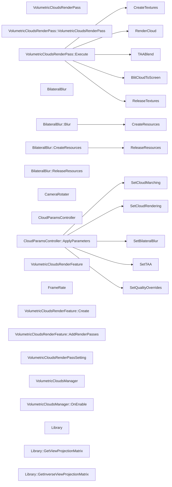

# 代码骨架：d-010（csharp）

> 状态：stale: false · 生成：2026-09-09T11:44:42+08:00

## 导出接口（20）
- `class VolumetricCloudsRenderFeature`（Module02_RenderFeature/VolumetricCloudsRenderFeature.cs:11:1）

```csharp
public class VolumetricCloudsRenderFeature : ScriptableRendererFeature { public VolumetricCloudsRenderPassSetting setting; private VolumetricCloudsRenderPass pass; public override void Create() { } public override void AddRenderPasses(ScriptableRenderer renderer, ref RenderingData renderingData) { i
```

- `fn VolumetricCloudsRenderFeature::Create`（Module02_RenderFeature/VolumetricCloudsRenderFeature.cs:16:5）

```csharp
public override void Create()
```

- `fn VolumetricCloudsRenderFeature::AddRenderPasses`（Module02_RenderFeature/VolumetricCloudsRenderFeature.cs:20:5）

```csharp
public override void AddRenderPasses(ScriptableRenderer renderer, ref RenderingData renderingData)
```

- `class VolumetricCloudsRenderPassSetting`（Module02_RenderFeature/VolumetricCloudsRenderPassSetting.cs:8:1）

```csharp
[Serializable] public class VolumetricCloudsRenderPassSetting { public RenderPassEvent renderPassEvent; public int cloudDownSample = 2; public Material cloudRenderingMaterial; public Material bilateralBlurMaterial; public Material taaBlendMaterial; public Material finalBlendMaterial; public int bila
```

- `class VolumetricCloudsManager`（Module03_CloudContainer/VolumetricCloudsManager.cs:10:1）

```csharp
[ExecuteInEditMode] public class VolumetricCloudsManager : MonoBehaviour { public static VolumetricCloudsManager instance; public Light directionalLight; public List<MeshRenderer> cloudMeshRenderer; public void OnEnable() { instance = this; } }
```

- `fn VolumetricCloudsManager::OnEnable`（Module03_CloudContainer/VolumetricCloudsManager.cs:17:5）

```csharp
public void OnEnable()
```

- `class Library`（Module06_CloudLighting/Library_ViewProjectionMatrix.cs:5:1）

```csharp
public partial class Library { public static Matrix4x4 GetViewProjectionMatrix(Camera cam) { return GL.GetGPUProjectionMatrix(cam.projectionMatrix, false) * cam.worldToCameraMatrix; } public static Matrix4x4 GetInverseViewProjectionMatrix(Camera cam) { return cam.cameraToWorldMatrix * GL.GetGPUProje
```

- `fn Library::GetViewProjectionMatrix`（Module06_CloudLighting/Library_ViewProjectionMatrix.cs:6:5）

```csharp
public static Matrix4x4 GetViewProjectionMatrix(Camera cam)
```

- `fn Library::GetInverseViewProjectionMatrix`（Module06_CloudLighting/Library_ViewProjectionMatrix.cs:10:5）

```csharp
public static Matrix4x4 GetInverseViewProjectionMatrix(Camera cam)
```

- `class VolumetricCloudsRenderPass`（Module06_CloudLighting/VolumetricCloudsRenderPass.cs:17:1）

```csharp
public class VolumetricCloudsRenderPass : ScriptableRenderPass { public static RenderTexture currentCameraTarget0; public static RenderTexture currentCameraTarget1; public static RenderTexture currentCloudColor; public static RenderTexture taaBlendCloudColor; public static RenderTexture volumeLightC
```

- `fn VolumetricCloudsRenderPass::VolumetricCloudsRenderPass`（Module06_CloudLighting/VolumetricCloudsRenderPass.cs:35:5）

```csharp
public VolumetricCloudsRenderPass(VolumetricCloudsRenderPassSetting setting)
```

- `fn VolumetricCloudsRenderPass::Execute`（Module06_CloudLighting/VolumetricCloudsRenderPass.cs:40:5）

```csharp
public override void Execute(ScriptableRenderContext context, ref RenderingData renderingData)
```

- `class BilateralBlur`（Module09_BilateralBlur/BilateralBlur.cs:6:1）

```csharp
public class BilateralBlur { private RenderTexture tempRT0; private RenderTexture tempRT1; public void Blur(Material material, CommandBuffer cmd, RenderTexture target, int downsample, int iteration) { CreateResources(target, downsample); RenderTexture currentRT = tempRT0; RenderTexture nextRT = temp
```

- `fn BilateralBlur::Blur`（Module09_BilateralBlur/BilateralBlur.cs:10:5）

```csharp
public void Blur(Material material, CommandBuffer cmd, RenderTexture target, int downsample, int iteration)
```

- `fn BilateralBlur::CreateResources`（Module09_BilateralBlur/BilateralBlur.cs:29:5）

```csharp
public void CreateResources(RenderTexture target, int downsample)
```

- `fn BilateralBlur::ReleaseResources`（Module09_BilateralBlur/BilateralBlur.cs:48:5）

```csharp
public void ReleaseResources()
```

- `class CameraRotater`（Module11_Final/CameraRotater.cs:5:1）

```csharp
public class CameraRotater : MonoBehaviour { public float moveSpeed; public float rotateSpeed; public Transform cam; private void Update() { if (Input.GetKey(KeyCode.A)) { cam.Translate(Vector3.forward * moveSpeed * 0.2f, Space.World); } if (Input.GetKey(KeyCode.D)) { cam.Translate(Vector3.back * mo
```

- `class CloudParamsController`（Module11_Final/CloudParamsController.cs:10:1）

```csharp
[ExecuteInEditMode] public class CloudParamsController : MonoBehaviour { [Header("材质引用 (留空自动查找 CloudMarching, 其余建议手动拖入)")] [Tooltip("云步进材质 — 留空自动从 VolumetricCloudsManager 的云容器获取")] public Material cloudMarchingMaterial; [Tooltip("
```

- `fn CloudParamsController::ApplyParameters`（Module11_Final/CloudParamsController.cs:89:5）

```csharp
public void ApplyParameters()
```

- `class FrameRate`（Module11_Final/FrameRate.cs:5:1）

```csharp
public class FrameRate : MonoBehaviour { public int targetFrameRate = 165; private void Awake() { Application.targetFrameRate = targetFrameRate; } }
```

## 调用关系



## 调用边（12）
- VolumetricCloudsRenderPass::Execute → CreateTextures（Module06_CloudLighting/VolumetricCloudsRenderPass.cs:45:9）
- VolumetricCloudsRenderPass::Execute → RenderCloud（Module06_CloudLighting/VolumetricCloudsRenderPass.cs:49:9）
- VolumetricCloudsRenderPass::Execute → TAABlend（Module06_CloudLighting/VolumetricCloudsRenderPass.cs:50:9）
- VolumetricCloudsRenderPass::Execute → BlitCloudToScreen（Module06_CloudLighting/VolumetricCloudsRenderPass.cs:51:9）
- VolumetricCloudsRenderPass::Execute → ReleaseTextures（Module06_CloudLighting/VolumetricCloudsRenderPass.cs:144:9）
- BilateralBlur::Blur → CreateResources（Module09_BilateralBlur/BilateralBlur.cs:11:9）
- BilateralBlur::CreateResources → ReleaseResources（Module09_BilateralBlur/BilateralBlur.cs:38:9）
- CloudParamsController::ApplyParameters → SetCloudMarching（Module11_Final/CloudParamsController.cs:98:9）
- CloudParamsController::ApplyParameters → SetCloudRendering（Module11_Final/CloudParamsController.cs:99:9）
- CloudParamsController::ApplyParameters → SetBilateralBlur（Module11_Final/CloudParamsController.cs:100:9）
- CloudParamsController::ApplyParameters → SetTAA（Module11_Final/CloudParamsController.cs:101:9）
- CloudParamsController::ApplyParameters → SetQualityOverrides（Module11_Final/CloudParamsController.cs:102:9）