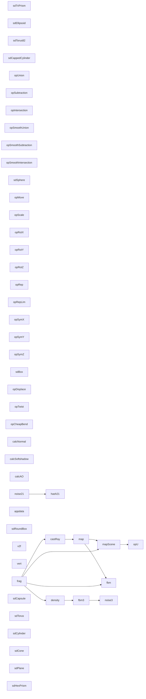

# 代码骨架：d-011（cpp）

> 状态：stale: false · 生成：2026-09-09T11:44:43+08:00

## 导出接口（138）
- `fn sdSphere`（SDFLib.cginc:18:1）

```cpp
float sdSphere(float3 p, float s)
```

- `fn sdBox`（SDFLib.cginc:21:1）

```cpp
float sdBox(float3 p, float3 b)
```

- `fn sdRoundBox`（SDFLib.cginc:28:1）

```cpp
float sdRoundBox(float3 p, float3 b, float r)
```

- `fn sdCapsule`（SDFLib.cginc:35:1）

```cpp
float sdCapsule(float3 p, float3 a, float3 b, float r)
```

- `fn sdTorus`（SDFLib.cginc:43:1）

```cpp
float sdTorus(float3 p, float2 t)
```

- `fn sdCylinder`（SDFLib.cginc:50:1）

```cpp
float sdCylinder(float3 p, float3 c)
```

- `fn sdCone`（SDFLib.cginc:56:1）

```cpp
float sdCone(float3 p, float2 c, float h)
```

- `fn sdPlane`（SDFLib.cginc:63:1）

```cpp
float sdPlane(float3 p, float4 n)
```

- `fn sdHexPrism`（SDFLib.cginc:66:1）

```cpp
float sdHexPrism(float3 p, float2 h)
```

- `fn sdTriPrism`（SDFLib.cginc:73:1）

```cpp
float sdTriPrism(float3 p, float2 h)
```

- `fn sdEllipsoid`（SDFLib.cginc:80:1）

```cpp
float sdEllipsoid(float3 p, float3 r)
```

- `fn sdTorus82`（SDFLib.cginc:88:1）

```cpp
float sdTorus82(float3 p, float2 t)
```

- `fn sdCappedCylinder`（SDFLib.cginc:95:1）

```cpp
float sdCappedCylinder(float3 p, float h, float r)
```

- `fn opUnion`（SDFLib.cginc:106:1）

```cpp
float opUnion(float d1, float d2)
```

- `fn opSubtraction`（SDFLib.cginc:109:1）

```cpp
float opSubtraction(float d1, float d2)
```

- `fn opIntersection`（SDFLib.cginc:112:1）

```cpp
float opIntersection(float d1, float d2)
```

- `fn opSmoothUnion`（SDFLib.cginc:115:1）

```cpp
float opSmoothUnion(float d1, float d2, float k)
```

- `fn opSmoothSubtraction`（SDFLib.cginc:122:1）

```cpp
float opSmoothSubtraction(float d1, float d2, float k)
```

- `fn opSmoothIntersection`（SDFLib.cginc:129:1）

```cpp
float opSmoothIntersection(float d1, float d2, float k)
```

- `fn opMove`（SDFLib.cginc:140:1）

```cpp
float3 opMove(float3 p, float3 t)
```

- `fn opScale`（SDFLib.cginc:143:1）

```cpp
float3 opScale(float3 p, float s)
```

- `fn opRotX`（SDFLib.cginc:146:1）

```cpp
float3 opRotX(float3 p, float a)
```

- `fn opRotY`（SDFLib.cginc:152:1）

```cpp
float3 opRotY(float3 p, float a)
```

- `fn opRotZ`（SDFLib.cginc:158:1）

```cpp
float3 opRotZ(float3 p, float a)
```

- `fn opRep`（SDFLib.cginc:169:1）

```cpp
float3 opRep(float3 p, float3 c)
```

- `fn opRepLim`（SDFLib.cginc:175:1）

```cpp
float3 opRepLim(float3 p, float c, float3 l)
```

- `fn opSymX`（SDFLib.cginc:181:1）

```cpp
float3 opSymX(float3 p)
```

- `fn opSymY`（SDFLib.cginc:183:1）

```cpp
float3 opSymY(float3 p)
```

- `fn opSymZ`（SDFLib.cginc:185:1）

```cpp
float3 opSymZ(float3 p)
```

- `fn opDisplace`（SDFLib.cginc:192:1）

```cpp
float3 opDisplace(float3 p, float3 q, float f)
```

- `fn opTwist`（SDFLib.cginc:195:1）

```cpp
float3 opTwist(float3 p, float k)
```

- `fn opCheapBend`（SDFLib.cginc:202:1）

```cpp
float3 opCheapBend(float3 p, float k)
```

- `fn calcNormal`（SDFLib.cginc:214:1）

```cpp
float3 calcNormal(float3 p, float eps)
```

- `fn calcSoftshadow`（SDFLib.cginc:225:1）

```cpp
float calcSoftshadow(float3 ro, float3 rd, float mint, float maxt, float k)
```

- `fn calcAO`（SDFLib.cginc:240:1）

```cpp
float calcAO(float3 pos, float3 nor)
```

- `fn hash21`（SDFLib.cginc:257:1）

```cpp
float hash21(float2 p)
```

- `fn noise21`（SDFLib.cginc:264:1）

```cpp
float noise21(float2 p)
```

- `fn map`（Shaders/L01_Raymarching.shader:24:13）

```cpp
float map(float3 p)
```

- `struct appdata`（Shaders/L01_Raymarching.shader:31:13）

```cpp
struct appdata { float4 vertex : POSITION; float2 uv : TEXCOORD0; }
```

- `struct v2f`（Shaders/L01_Raymarching.shader:37:13）

```cpp
struct v2f { float4 pos : SV_POSITION; float2 uv : TEXCOORD0; float3 ray : TEXCOORD1; }
```

- `fn vert`（Shaders/L01_Raymarching.shader:44:13）

```cpp
v2f vert(appdata v)
```

- `fn castRay`（Shaders/L01_Raymarching.shader:56:13）

```cpp
float castRay(float3 ro, float3 rd)
```

- `fn frag`（Shaders/L01_Raymarching.shader:70:13）

```cpp
float4 frag(v2f i) : SV_Target
```

- `fn map`（Shaders/L02_Primitives.shader:23:13）

```cpp
float map(float3 p)
```

- `struct appdata`（Shaders/L02_Primitives.shader:41:13）

```cpp
struct appdata { float4 vertex : POSITION; float2 uv : TEXCOORD0; }
```

- `struct v2f`（Shaders/L02_Primitives.shader:42:13）

```cpp
struct v2f { float4 pos : SV_POSITION; float2 uv : TEXCOORD0; float3 ray : TEXCOORD1; }
```

- `fn vert`（Shaders/L02_Primitives.shader:44:13）

```cpp
v2f vert(appdata v)
```

- `fn castRay`（Shaders/L02_Primitives.shader:55:13）

```cpp
float castRay(float3 ro, float3 rd)
```

- `fn frag`（Shaders/L02_Primitives.shader:68:13）

```cpp
float4 frag(v2f i) : SV_Target
```

- `fn map`（Shaders/L03_BooleanOps.shader:25:13）

```cpp
float map(float3 p)
```

- `struct appdata`（Shaders/L03_BooleanOps.shader:47:13）

```cpp
struct appdata { float4 vertex : POSITION; float2 uv : TEXCOORD0; }
```

- `struct v2f`（Shaders/L03_BooleanOps.shader:48:13）

```cpp
struct v2f { float4 pos : SV_POSITION; float2 uv : TEXCOORD0; float3 ray : TEXCOORD1; }
```

- `fn vert`（Shaders/L03_BooleanOps.shader:50:13）

```cpp
v2f vert(appdata v)
```

- `fn castRay`（Shaders/L03_BooleanOps.shader:61:13）

```cpp
float castRay(float3 ro, float3 rd)
```

- `fn frag`（Shaders/L03_BooleanOps.shader:74:13）

```cpp
float4 frag(v2f i) : SV_Target
```

- `fn map`（Shaders/L04_Transforms.shader:24:13）

```cpp
float map(float3 p)
```

- `struct appdata`（Shaders/L04_Transforms.shader:42:13）

```cpp
struct appdata { float4 vertex : POSITION; float2 uv : TEXCOORD0; }
```

- `struct v2f`（Shaders/L04_Transforms.shader:43:13）

```cpp
struct v2f { float4 pos : SV_POSITION; float2 uv : TEXCOORD0; float3 ray : TEXCOORD1; }
```

- `fn vert`（Shaders/L04_Transforms.shader:45:13）

```cpp
v2f vert(appdata v)
```

- `fn castRay`（Shaders/L04_Transforms.shader:56:13）

```cpp
float castRay(float3 ro, float3 rd)
```

- `fn frag`（Shaders/L04_Transforms.shader:69:13）

```cpp
float4 frag(v2f i) : SV_Target
```

- `fn map`（Shaders/L05_Repetition.shader:24:13）

```cpp
float map(float3 p)
```

- `struct appdata`（Shaders/L05_Repetition.shader:36:13）

```cpp
struct appdata { float4 vertex : POSITION; float2 uv : TEXCOORD0; }
```

- `struct v2f`（Shaders/L05_Repetition.shader:37:13）

```cpp
struct v2f { float4 pos : SV_POSITION; float2 uv : TEXCOORD0; float3 ray : TEXCOORD1; }
```

- `fn vert`（Shaders/L05_Repetition.shader:39:13）

```cpp
v2f vert(appdata v)
```

- `fn castRay`（Shaders/L05_Repetition.shader:50:13）

```cpp
float castRay(float3 ro, float3 rd)
```

- `fn frag`（Shaders/L05_Repetition.shader:63:13）

```cpp
float4 frag(v2f i) : SV_Target
```

- `fn map`（Shaders/L06_Symmetry.shader:24:13）

```cpp
float map(float3 p)
```

- `struct appdata`（Shaders/L06_Symmetry.shader:40:13）

```cpp
struct appdata { float4 vertex : POSITION; float2 uv : TEXCOORD0; }
```

- `struct v2f`（Shaders/L06_Symmetry.shader:41:13）

```cpp
struct v2f { float4 pos : SV_POSITION; float2 uv : TEXCOORD0; float3 ray : TEXCOORD1; }
```

- `fn vert`（Shaders/L06_Symmetry.shader:43:13）

```cpp
v2f vert(appdata v)
```

- `fn castRay`（Shaders/L06_Symmetry.shader:54:13）

```cpp
float castRay(float3 ro, float3 rd)
```

- `fn frag`（Shaders/L06_Symmetry.shader:67:13）

```cpp
float4 frag(v2f i) : SV_Target
```

- `fn map`（Shaders/L07_Deformations.shader:24:13）

```cpp
float map(float3 p)
```

- `struct appdata`（Shaders/L07_Deformations.shader:43:13）

```cpp
struct appdata { float4 vertex : POSITION; float2 uv : TEXCOORD0; }
```

- `struct v2f`（Shaders/L07_Deformations.shader:44:13）

```cpp
struct v2f { float4 pos : SV_POSITION; float2 uv : TEXCOORD0; float3 ray : TEXCOORD1; }
```

- `fn vert`（Shaders/L07_Deformations.shader:46:13）

```cpp
v2f vert(appdata v)
```

- `fn castRay`（Shaders/L07_Deformations.shader:57:13）

```cpp
float castRay(float3 ro, float3 rd)
```

- `fn frag`（Shaders/L07_Deformations.shader:70:13）

```cpp
float4 frag(v2f i) : SV_Target
```

- `fn map`（Shaders/L08_NormalsLighting.shader:24:13）

```cpp
float map(float3 p)
```

- `struct appdata`（Shaders/L08_NormalsLighting.shader:32:13）

```cpp
struct appdata { float4 vertex : POSITION; float2 uv : TEXCOORD0; }
```

- `struct v2f`（Shaders/L08_NormalsLighting.shader:33:13）

```cpp
struct v2f { float4 pos : SV_POSITION; float2 uv : TEXCOORD0; float3 ray : TEXCOORD1; }
```

- `fn vert`（Shaders/L08_NormalsLighting.shader:35:13）

```cpp
v2f vert(appdata v)
```

- `fn castRay`（Shaders/L08_NormalsLighting.shader:46:13）

```cpp
float castRay(float3 ro, float3 rd)
```

- `fn frag`（Shaders/L08_NormalsLighting.shader:59:13）

```cpp
float4 frag(v2f i) : SV_Target
```

- `fn map`（Shaders/L09_SoftShadowAO.shader:25:13）

```cpp
float map(float3 p)
```

- `struct appdata`（Shaders/L09_SoftShadowAO.shader:36:13）

```cpp
struct appdata { float4 vertex : POSITION; float2 uv : TEXCOORD0; }
```

- `struct v2f`（Shaders/L09_SoftShadowAO.shader:37:13）

```cpp
struct v2f { float4 pos : SV_POSITION; float2 uv : TEXCOORD0; float3 ray : TEXCOORD1; }
```

- `fn vert`（Shaders/L09_SoftShadowAO.shader:39:13）

```cpp
v2f vert(appdata v)
```

- `fn castRay`（Shaders/L09_SoftShadowAO.shader:50:13）

```cpp
float castRay(float3 ro, float3 rd)
```

- `fn frag`（Shaders/L09_SoftShadowAO.shader:63:13）

```cpp
float4 frag(v2f i) : SV_Target
```

- `fn opU`（Shaders/L10_Materials.shader:25:13）

```cpp
float2 opU(float2 d1, float2 d2)
```

- `fn mapScene`（Shaders/L10_Materials.shader:27:13）

```cpp
float2 mapScene(float3 p)
```

- `fn map`（Shaders/L10_Materials.shader:47:13）

```cpp
float map(float3 p)
```

- `struct appdata`（Shaders/L10_Materials.shader:50:13）

```cpp
struct appdata { float4 vertex : POSITION; float2 uv : TEXCOORD0; }
```

- `struct v2f`（Shaders/L10_Materials.shader:51:13）

```cpp
struct v2f { float4 pos : SV_POSITION; float2 uv : TEXCOORD0; float3 ray : TEXCOORD1; }
```

- `fn vert`（Shaders/L10_Materials.shader:53:13）

```cpp
v2f vert(appdata v)
```

- `fn castRay`（Shaders/L10_Materials.shader:64:13）

```cpp
float castRay(float3 ro, float3 rd)
```

- `fn frag`（Shaders/L10_Materials.shader:77:13）

```cpp
float4 frag(v2f i) : SV_Target
```

- `fn map`（Shaders/L11_Animation.shader:24:13）

```cpp
float map(float3 p)
```

- `struct appdata`（Shaders/L11_Animation.shader:44:13）

```cpp
struct appdata { float4 vertex : POSITION; float2 uv : TEXCOORD0; }
```

- `struct v2f`（Shaders/L11_Animation.shader:45:13）

```cpp
struct v2f { float4 pos : SV_POSITION; float2 uv : TEXCOORD0; float3 ray : TEXCOORD1; }
```

- `fn vert`（Shaders/L11_Animation.shader:47:13）

```cpp
v2f vert(appdata v)
```

- `fn castRay`（Shaders/L11_Animation.shader:58:13）

```cpp
float castRay(float3 ro, float3 rd)
```

- `fn frag`（Shaders/L11_Animation.shader:71:13）

```cpp
float4 frag(v2f i) : SV_Target
```

- `fn map`（Shaders/L12_PillarHall.shader:23:13）

```cpp
float map(float3 p)
```

- `struct appdata`（Shaders/L12_PillarHall.shader:42:13）

```cpp
struct appdata { float4 vertex : POSITION; float2 uv : TEXCOORD0; }
```

- `struct v2f`（Shaders/L12_PillarHall.shader:43:13）

```cpp
struct v2f { float4 pos : SV_POSITION; float2 uv : TEXCOORD0; float3 ray : TEXCOORD1; }
```

- `fn vert`（Shaders/L12_PillarHall.shader:45:13）

```cpp
v2f vert(appdata v)
```

- `fn castRay`（Shaders/L12_PillarHall.shader:56:13）

```cpp
float castRay(float3 ro, float3 rd)
```

- `fn frag`（Shaders/L12_PillarHall.shader:69:13）

```cpp
float4 frag(v2f i) : SV_Target
```

- `fn map`（Shaders/L13_Glow.shader:24:13）

```cpp
float map(float3 p)
```

- `struct appdata`（Shaders/L13_Glow.shader:33:13）

```cpp
struct appdata { float4 vertex : POSITION; float2 uv : TEXCOORD0; }
```

- `struct v2f`（Shaders/L13_Glow.shader:34:13）

```cpp
struct v2f { float4 pos : SV_POSITION; float2 uv : TEXCOORD0; float3 ray : TEXCOORD1; }
```

- `fn vert`（Shaders/L13_Glow.shader:36:13）

```cpp
v2f vert(appdata v)
```

- `fn castRay`（Shaders/L13_Glow.shader:47:13）

```cpp
float castRay(float3 ro, float3 rd)
```

- `fn frag`（Shaders/L13_Glow.shader:60:13）

```cpp
float4 frag(v2f i) : SV_Target
```

- `fn fbm`（Shaders/L14_Mountains.shader:27:13）

```cpp
float fbm(float2 p)
```

- `fn map`（Shaders/L14_Mountains.shader:39:13）

```cpp
float map(float3 p)
```

- `struct appdata`（Shaders/L14_Mountains.shader:45:13）

```cpp
struct appdata { float4 vertex : POSITION; float2 uv : TEXCOORD0; }
```

- `struct v2f`（Shaders/L14_Mountains.shader:46:13）

```cpp
struct v2f { float4 pos : SV_POSITION; float2 uv : TEXCOORD0; float3 ray : TEXCOORD1; }
```

- `fn vert`（Shaders/L14_Mountains.shader:48:13）

```cpp
v2f vert(appdata v)
```

- `fn castRay`（Shaders/L14_Mountains.shader:59:13）

```cpp
float castRay(float3 ro, float3 rd)
```

- `fn frag`（Shaders/L14_Mountains.shader:72:13）

```cpp
float4 frag(v2f i) : SV_Target
```

- `fn map`（Shaders/L15_VolumetricClouds.shader:23:13）

```cpp
float map(float3 p)
```

- `fn noise3`（Shaders/L15_VolumetricClouds.shader:28:13）

```cpp
float noise3(float3 p)
```

- `fn fbm3`（Shaders/L15_VolumetricClouds.shader:33:13）

```cpp
float fbm3(float3 p)
```

- `fn density`（Shaders/L15_VolumetricClouds.shader:45:13）

```cpp
float density(float3 p)
```

- `struct appdata`（Shaders/L15_VolumetricClouds.shader:53:13）

```cpp
struct appdata { float4 vertex : POSITION; float2 uv : TEXCOORD0; }
```

- `struct v2f`（Shaders/L15_VolumetricClouds.shader:54:13）

```cpp
struct v2f { float4 pos : SV_POSITION; float2 uv : TEXCOORD0; float3 ray : TEXCOORD1; }
```

- `fn vert`（Shaders/L15_VolumetricClouds.shader:56:13）

```cpp
v2f vert(appdata v)
```

- `fn frag`（Shaders/L15_VolumetricClouds.shader:67:13）

```cpp
float4 frag(v2f i) : SV_Target
```

- `fn map`（Shaders/L16_FinalScene.shader:27:13）

```cpp
float map(float3 p)
```

- `struct appdata`（Shaders/L16_FinalScene.shader:53:13）

```cpp
struct appdata { float4 vertex : POSITION; float2 uv : TEXCOORD0; }
```

- `struct v2f`（Shaders/L16_FinalScene.shader:54:13）

```cpp
struct v2f { float4 pos : SV_POSITION; float2 uv : TEXCOORD0; float3 ray : TEXCOORD1; }
```

- `fn vert`（Shaders/L16_FinalScene.shader:56:13）

```cpp
v2f vert(appdata v)
```

- `fn castRay`（Shaders/L16_FinalScene.shader:67:13）

```cpp
float castRay(float3 ro, float3 rd)
```

- `fn frag`（Shaders/L16_FinalScene.shader:80:13）

```cpp
float4 frag(v2f i) : SV_Target
```

## 调用关系



## 调用边（45）
- noise21 → hash21（SDFLib.cginc:269:14）
- noise21 → hash21（SDFLib.cginc:269:25）
- noise21 → hash21（SDFLib.cginc:270:14）
- noise21 → hash21（SDFLib.cginc:270:40）
- castRay → map（Shaders/L01_Raymarching.shader:62:31）
- frag → castRay（Shaders/L01_Raymarching.shader:75:27）
- castRay → map（Shaders/L02_Primitives.shader:60:31）
- frag → castRay（Shaders/L02_Primitives.shader:73:27）
- castRay → map（Shaders/L03_BooleanOps.shader:66:31）
- frag → castRay（Shaders/L03_BooleanOps.shader:78:27）
- castRay → map（Shaders/L04_Transforms.shader:61:31）
- frag → castRay（Shaders/L04_Transforms.shader:73:27）
- castRay → map（Shaders/L05_Repetition.shader:55:31）
- frag → castRay（Shaders/L05_Repetition.shader:67:27）
- castRay → map（Shaders/L06_Symmetry.shader:59:31）
- frag → castRay（Shaders/L06_Symmetry.shader:71:27）
- castRay → map（Shaders/L07_Deformations.shader:62:31）
- frag → castRay（Shaders/L07_Deformations.shader:74:27）
- castRay → map（Shaders/L08_NormalsLighting.shader:51:31）
- frag → castRay（Shaders/L08_NormalsLighting.shader:63:27）
- castRay → map（Shaders/L09_SoftShadowAO.shader:55:31）
- frag → castRay（Shaders/L09_SoftShadowAO.shader:67:27）
- mapScene → opU（Shaders/L10_Materials.shader:32:23）
- mapScene → opU（Shaders/L10_Materials.shader:35:23）
- mapScene → opU（Shaders/L10_Materials.shader:38:23）
- mapScene → opU（Shaders/L10_Materials.shader:41:23）
- map → mapScene（Shaders/L10_Materials.shader:47:42）
- castRay → map（Shaders/L10_Materials.shader:69:31）
- frag → castRay（Shaders/L10_Materials.shader:81:27）
- frag → mapScene（Shaders/L10_Materials.shader:87:31）
- castRay → map（Shaders/L11_Animation.shader:63:31）
- frag → castRay（Shaders/L11_Animation.shader:76:27）
- castRay → map（Shaders/L12_PillarHall.shader:61:31）
- frag → castRay（Shaders/L12_PillarHall.shader:73:27）
- castRay → map（Shaders/L13_Glow.shader:52:31）
- frag → castRay（Shaders/L13_Glow.shader:64:27）
- map → fbm（Shaders/L14_Mountains.shader:41:27）
- castRay → map（Shaders/L14_Mountains.shader:64:31）
- frag → castRay（Shaders/L14_Mountains.shader:81:27）
- frag → fbm（Shaders/L14_Mountains.shader:92:84）
- fbm3 → noise3（Shaders/L15_VolumetricClouds.shader:38:30）
- density → fbm3（Shaders/L15_VolumetricClouds.shader:47:30）
- frag → density（Shaders/L15_VolumetricClouds.shader:87:31）
- castRay → map（Shaders/L16_FinalScene.shader:72:31）
- frag → castRay（Shaders/L16_FinalScene.shader:84:27）