# 代码骨架：t-026（csharp）

> 状态：stale: false · 生成：2026-09-09T11:44:43+08:00

## 导出接口（20）
- `class CloudCameraController`（CloudCameraController.cs:7:1）

```csharp
public class CloudCameraController : MonoBehaviour { [Header("Target")] public GameObject cloudBoundingBox; [Header("Orbit Settings")] public float orbitSpeed = 3f; public float zoomSpeed = 5f; public float minDistance = 3f; public float maxDistance = 30f; public float smoothTime = 0.15f; public boo
```

- `class VolumetricCloud::VolumetricCloudInteractiveEditor`（VolumetricCloud/Editor/VolumetricCloudInteractiveEditor.cs:18:1）

```csharp
[CustomEditor(typeof(VolumetricCloudRenderer))] public class VolumetricCloudInteractiveEditor : Editor { // 面颜色：+X(红) -X(暗红) +Y(绿) -Y(暗绿) +Z(蓝) -Z(暗蓝) static readonly Color[] faceColors = new Color[] { new Color(1f, 0.4f, 0.4f, 0.6f), // +X new Color(0.7f, 0.2f, 0.2f, 0.6f)
```

- `fn VolumetricCloud::VolumetricCloudInteractiveEditor::OnInspectorGUI`（VolumetricCloud/Editor/VolumetricCloudInteractiveEditor.cs:45:5）

```csharp
public override void OnInspectorGUI()
```

- `class EditorTools::VolumetricCloudTextureGenerator`（VolumetricCloud/Editor/VolumetricCloudTextureGenerator.cs:16:5）

```csharp
public static class VolumetricCloudTextureGenerator { const string OutDir = "Assets/Textures/VolumetricCloud/Generated"; [MenuItem("Tools/VolumetricCloud/生成全部程序化贴图资产")] public static void GenerateAll() { EnsureDir(); GenerateShapeNoise(); // 128³ Perlin-Worley 四通道 Genera
```

- `fn EditorTools::VolumetricCloudTextureGenerator::GenerateAll`（VolumetricCloud/Editor/VolumetricCloudTextureGenerator.cs:20:9）

```csharp
[MenuItem("Tools/VolumetricCloud/生成全部程序化贴图资产")] public static void GenerateAll()
```

- `fn EditorTools::VolumetricCloudTextureGenerator::GenerateBlueOnly`（VolumetricCloud/Editor/VolumetricCloudTextureGenerator.cs:36:9）

```csharp
[MenuItem("Tools/VolumetricCloud/仅生成蓝噪声")] public static void GenerateBlueOnly()
```

- `class VolumetricCloud::VolumetricCloudFeature`（VolumetricCloud/VolumetricCloudFeature.cs:8:1）

```csharp
public class VolumetricCloudFeature : ScriptableRendererFeature { class VolumetricCloudPass : ScriptableRenderPass { static readonly int _InverseProjectionMatrix = Shader.PropertyToID("_InverseProjectionMatrix"); static readonly int _InverseViewMatrix = Shader.PropertyToID("_InverseViewMatrix"); pub
```

- `class VolumetricCloud::VolumetricCloudFeature::VolumetricCloudPass`（VolumetricCloud/VolumetricCloudFeature.cs:10:5）

```csharp
class VolumetricCloudPass : ScriptableRenderPass { static readonly int _InverseProjectionMatrix = Shader.PropertyToID("_InverseProjectionMatrix"); static readonly int _InverseViewMatrix = Shader.PropertyToID("_InverseViewMatrix"); public Material cloudMaterial; RTHandle tempRT; public VolumetricClou
```

- `fn VolumetricCloud::VolumetricCloudFeature::VolumetricCloudPass::VolumetricCloudPass`（VolumetricCloud/VolumetricCloudFeature.cs:18:9）

```csharp
public VolumetricCloudPass()
```

- `fn VolumetricCloud::VolumetricCloudFeature::VolumetricCloudPass::OnCameraSetup`（VolumetricCloud/VolumetricCloudFeature.cs:23:9）

```csharp
public override void OnCameraSetup(CommandBuffer cmd, ref RenderingData renderingData)
```

- `fn VolumetricCloud::VolumetricCloudFeature::VolumetricCloudPass::Execute`（VolumetricCloud/VolumetricCloudFeature.cs:31:9）

```csharp
public override void Execute(ScriptableRenderContext context, ref RenderingData renderingData)
```

- `fn VolumetricCloud::VolumetricCloudFeature::VolumetricCloudPass::OnCameraCleanup`（VolumetricCloud/VolumetricCloudFeature.cs:56:9）

```csharp
public override void OnCameraCleanup(CommandBuffer cmd)
```

- `fn VolumetricCloud::VolumetricCloudFeature::VolumetricCloudPass::Dispose`（VolumetricCloud/VolumetricCloudFeature.cs:58:9）

```csharp
public void Dispose()
```

- `fn VolumetricCloud::VolumetricCloudFeature::Create`（VolumetricCloud/VolumetricCloudFeature.cs:67:5）

```csharp
public override void Create()
```

- `fn VolumetricCloud::VolumetricCloudFeature::AddRenderPasses`（VolumetricCloud/VolumetricCloudFeature.cs:72:5）

```csharp
public override void AddRenderPasses(ScriptableRenderer renderer, ref RenderingData renderingData)
```

- `fn VolumetricCloud::VolumetricCloudFeature::Dispose`（VolumetricCloud/VolumetricCloudFeature.cs:83:5）

```csharp
protected override void Dispose(bool disposing)
```

- `class VolumetricCloud::VolumetricCloudRenderer`（VolumetricCloud/VolumetricCloudRenderer.cs:11:1）

```csharp
[ExecuteInEditMode] public class VolumetricCloudRenderer : MonoBehaviour { public static VolumetricCloudRenderer Instance { get; private set; } [Header("A 云层范围")] [Tooltip("启用后自动从 Transform 的位置和缩放计算云的包围盒范围，关闭则手动设置下方 Min/Max")] pub
```

- `property VolumetricCloud::VolumetricCloudRenderer::Instance`（VolumetricCloud/VolumetricCloudRenderer.cs:14:5）

```csharp
public static VolumetricCloudRenderer Instance { get; private set; }
```

- `property VolumetricCloud::VolumetricCloudRenderer::CloudMaterial`（VolumetricCloud/VolumetricCloudRenderer.cs:165:5）

```csharp
public Material CloudMaterial => cloudMaterial;
```

- `fn VolumetricCloud::VolumetricCloudRenderer::RegenerateAll`（VolumetricCloud/VolumetricCloudRenderer.cs:523:5）

```csharp
public void RegenerateAll()
```

## 调用关系

```mermaid
flowchart LR
  n10["VolumetricCloud::VolumetricCloudFeature::VolumetricCloudPass::OnCameraSetup"]
  n11["VolumetricCloud::VolumetricCloudFeature::VolumetricCloudPass::Execute"]
  n12["VolumetricCloud::VolumetricCloudFeature::VolumetricCloudPass::OnCameraCleanup"]
  n13["VolumetricCloud::VolumetricCloudFeature::VolumetricCloudPass::Dispose"]
  n14["VolumetricCloud::VolumetricCloudFeature::Create"]
  n15["VolumetricCloud::VolumetricCloudFeature::AddRenderPasses"]
  n16["VolumetricCloud::VolumetricCloudFeature::Dispose"]
  n17["VolumetricCloud::VolumetricCloudRenderer"]
  n18["VolumetricCloud::VolumetricCloudRenderer::Instance"]
  n19["VolumetricCloud::VolumetricCloudRenderer::CloudMaterial"]
  n1["CloudCameraController"]
  n20["VolumetricCloud::VolumetricCloudRenderer::RegenerateAll"]
  n21["GetBounds"]
  n22["DrawEdges"]
  n23["DrawFaceHandles"]
  n24["DrawCenterHandle"]
  n25["ApplyBounds"]
  n26["DrawSizeLabels"]
  n27["GetCorners"]
  n28["FaceSlider"]
  n29["MoveAxis"]
  n2["VolumetricCloud::VolumetricCloudInteractiveEditor"]
  n30["GetFaceCenter"]
  n31["EnsureDir"]
  n32["GenerateShapeNoise"]
  n33["GenerateDetailNoise"]
  n34["GenerateWeatherMap"]
  n35["GenerateMaskNoise"]
  n36["GenerateBlueNoise"]
  n37["SaveAsset"]
  n38["BakeNoise3D"]
  n39["Fbm2D"]
  n3["VolumetricCloud::VolumetricCloudInteractiveEditor::OnInspectorGUI"]
  n40["SetLinearNoSRGB"]
  n41["ComputeEnergy"]
  n42["MovePixel"]
  n43["AddKernel"]
  n44["LoadPreBakedTextures"]
  n45["LoadProceduralTextures"]
  n46["GenerateFallbackTexturesIfNeeded"]
  n47["CreateMaterial"]
  n48["ApplyParameters"]
  n49["Cleanup"]
  n4["EditorTools::VolumetricCloudTextureGenerator"]
  n50["GenerateFallbackNoiseTextures"]
  n51["GenerateFallbackDetailNoise"]
  n52["GenerateFallbackWeatherMap"]
  n53["GenerateFallbackMaskNoise"]
  n54["GenerateFallbackBlueNoise"]
  n5["EditorTools::VolumetricCloudTextureGenerator::GenerateAll"]
  n6["EditorTools::VolumetricCloudTextureGenerator::GenerateBlueOnly"]
  n7["VolumetricCloud::VolumetricCloudFeature"]
  n8["VolumetricCloud::VolumetricCloudFeature::VolumetricCloudPass"]
  n9["VolumetricCloud::VolumetricCloudFeature::VolumetricCloudPass::VolumetricCloudPass"]
  n19 --> n44
  n19 --> n45
  n19 --> n46
  n19 --> n47
  n19 --> n48
  n19 --> n49
  n19 --> n50
  n19 --> n51
  n19 --> n52
  n19 --> n53
  n19 --> n54
  n20 --> n44
  n20 --> n46
  n20 --> n47
  n20 --> n48
  n20 --> n49
  n3 --> n21
  n3 --> n22
  n3 --> n23
  n3 --> n24
  n3 --> n25
  n3 --> n26
  n3 --> n27
  n3 --> n28
  n3 --> n29
  n3 --> n30
  n5 --> n31
  n5 --> n32
  n5 --> n33
  n5 --> n34
  n5 --> n35
  n5 --> n36
  n6 --> n31
  n6 --> n36
  n6 --> n37
  n6 --> n38
  n6 --> n39
  n6 --> n40
  n6 --> n41
  n6 --> n42
  n6 --> n43
```



## 调用边（68）
- VolumetricCloud::VolumetricCloudInteractiveEditor::OnInspectorGUI → GetBounds（VolumetricCloud/Editor/VolumetricCloudInteractiveEditor.cs:78:9）
- VolumetricCloud::VolumetricCloudInteractiveEditor::OnInspectorGUI → DrawEdges（VolumetricCloud/Editor/VolumetricCloudInteractiveEditor.cs:81:9）
- VolumetricCloud::VolumetricCloudInteractiveEditor::OnInspectorGUI → DrawFaceHandles（VolumetricCloud/Editor/VolumetricCloudInteractiveEditor.cs:85:9）
- VolumetricCloud::VolumetricCloudInteractiveEditor::OnInspectorGUI → DrawCenterHandle（VolumetricCloud/Editor/VolumetricCloudInteractiveEditor.cs:91:29）
- VolumetricCloud::VolumetricCloudInteractiveEditor::OnInspectorGUI → ApplyBounds（VolumetricCloud/Editor/VolumetricCloudInteractiveEditor.cs:97:13）
- VolumetricCloud::VolumetricCloudInteractiveEditor::OnInspectorGUI → GetBounds（VolumetricCloud/Editor/VolumetricCloudInteractiveEditor.cs:102:13）
- VolumetricCloud::VolumetricCloudInteractiveEditor::OnInspectorGUI → ApplyBounds（VolumetricCloud/Editor/VolumetricCloudInteractiveEditor.cs:103:13）
- VolumetricCloud::VolumetricCloudInteractiveEditor::OnInspectorGUI → GetBounds（VolumetricCloud/Editor/VolumetricCloudInteractiveEditor.cs:109:13）
- VolumetricCloud::VolumetricCloudInteractiveEditor::OnInspectorGUI → DrawSizeLabels（VolumetricCloud/Editor/VolumetricCloudInteractiveEditor.cs:110:13）
- VolumetricCloud::VolumetricCloudInteractiveEditor::OnInspectorGUI → GetCorners（VolumetricCloud/Editor/VolumetricCloudInteractiveEditor.cs:119:23）
- VolumetricCloud::VolumetricCloudInteractiveEditor::OnInspectorGUI → FaceSlider（VolumetricCloud/Editor/VolumetricCloudInteractiveEditor.cs:135:19）
- VolumetricCloud::VolumetricCloudInteractiveEditor::OnInspectorGUI → MoveAxis（VolumetricCloud/Editor/VolumetricCloudInteractiveEditor.cs:136:39）
- VolumetricCloud::VolumetricCloudInteractiveEditor::OnInspectorGUI → FaceSlider（VolumetricCloud/Editor/VolumetricCloudInteractiveEditor.cs:140:13）
- VolumetricCloud::VolumetricCloudInteractiveEditor::OnInspectorGUI → MoveAxis（VolumetricCloud/Editor/VolumetricCloudInteractiveEditor.cs:141:39）
- VolumetricCloud::VolumetricCloudInteractiveEditor::OnInspectorGUI → FaceSlider（VolumetricCloud/Editor/VolumetricCloudInteractiveEditor.cs:145:13）
- VolumetricCloud::VolumetricCloudInteractiveEditor::OnInspectorGUI → MoveAxis（VolumetricCloud/Editor/VolumetricCloudInteractiveEditor.cs:146:39）
- VolumetricCloud::VolumetricCloudInteractiveEditor::OnInspectorGUI → FaceSlider（VolumetricCloud/Editor/VolumetricCloudInteractiveEditor.cs:150:13）
- VolumetricCloud::VolumetricCloudInteractiveEditor::OnInspectorGUI → MoveAxis（VolumetricCloud/Editor/VolumetricCloudInteractiveEditor.cs:151:39）
- VolumetricCloud::VolumetricCloudInteractiveEditor::OnInspectorGUI → FaceSlider（VolumetricCloud/Editor/VolumetricCloudInteractiveEditor.cs:155:13）
- VolumetricCloud::VolumetricCloudInteractiveEditor::OnInspectorGUI → MoveAxis（VolumetricCloud/Editor/VolumetricCloudInteractiveEditor.cs:156:39）
- VolumetricCloud::VolumetricCloudInteractiveEditor::OnInspectorGUI → FaceSlider（VolumetricCloud/Editor/VolumetricCloudInteractiveEditor.cs:160:13）
- VolumetricCloud::VolumetricCloudInteractiveEditor::OnInspectorGUI → MoveAxis（VolumetricCloud/Editor/VolumetricCloudInteractiveEditor.cs:161:39）
- VolumetricCloud::VolumetricCloudInteractiveEditor::OnInspectorGUI → GetFaceCenter（VolumetricCloud/Editor/VolumetricCloudInteractiveEditor.cs:166:30）
- EditorTools::VolumetricCloudTextureGenerator::GenerateAll → EnsureDir（VolumetricCloud/Editor/VolumetricCloudTextureGenerator.cs:23:13）
- EditorTools::VolumetricCloudTextureGenerator::GenerateAll → GenerateShapeNoise（VolumetricCloud/Editor/VolumetricCloudTextureGenerator.cs:25:13）
- EditorTools::VolumetricCloudTextureGenerator::GenerateAll → GenerateDetailNoise（VolumetricCloud/Editor/VolumetricCloudTextureGenerator.cs:26:13）
- EditorTools::VolumetricCloudTextureGenerator::GenerateAll → GenerateWeatherMap（VolumetricCloud/Editor/VolumetricCloudTextureGenerator.cs:27:13）
- EditorTools::VolumetricCloudTextureGenerator::GenerateAll → GenerateMaskNoise（VolumetricCloud/Editor/VolumetricCloudTextureGenerator.cs:28:13）
- EditorTools::VolumetricCloudTextureGenerator::GenerateAll → GenerateBlueNoise（VolumetricCloud/Editor/VolumetricCloudTextureGenerator.cs:29:13）
- EditorTools::VolumetricCloudTextureGenerator::GenerateBlueOnly → EnsureDir（VolumetricCloud/Editor/VolumetricCloudTextureGenerator.cs:39:13）
- EditorTools::VolumetricCloudTextureGenerator::GenerateBlueOnly → GenerateBlueNoise（VolumetricCloud/Editor/VolumetricCloudTextureGenerator.cs:40:13）
- EditorTools::VolumetricCloudTextureGenerator::GenerateBlueOnly → SaveAsset（VolumetricCloud/Editor/VolumetricCloudTextureGenerator.cs:116:13）
- EditorTools::VolumetricCloudTextureGenerator::GenerateBlueOnly → BakeNoise3D（VolumetricCloud/Editor/VolumetricCloudTextureGenerator.cs:123:13）
- EditorTools::VolumetricCloudTextureGenerator::GenerateBlueOnly → BakeNoise3D（VolumetricCloud/Editor/VolumetricCloudTextureGenerator.cs:129:13）
- EditorTools::VolumetricCloudTextureGenerator::GenerateBlueOnly → Fbm2D（VolumetricCloud/Editor/VolumetricCloudTextureGenerator.cs:152:29）
- EditorTools::VolumetricCloudTextureGenerator::GenerateBlueOnly → Fbm2D（VolumetricCloud/Editor/VolumetricCloudTextureGenerator.cs:156:30）
- EditorTools::VolumetricCloudTextureGenerator::GenerateBlueOnly → SaveAsset（VolumetricCloud/Editor/VolumetricCloudTextureGenerator.cs:163:13）
- EditorTools::VolumetricCloudTextureGenerator::GenerateBlueOnly → SetLinearNoSRGB（VolumetricCloud/Editor/VolumetricCloudTextureGenerator.cs:164:13）
- EditorTools::VolumetricCloudTextureGenerator::GenerateBlueOnly → Fbm2D（VolumetricCloud/Editor/VolumetricCloudTextureGenerator.cs:180:27）
- EditorTools::VolumetricCloudTextureGenerator::GenerateBlueOnly → Fbm2D（VolumetricCloud/Editor/VolumetricCloudTextureGenerator.cs:181:27）
- EditorTools::VolumetricCloudTextureGenerator::GenerateBlueOnly → SaveAsset（VolumetricCloud/Editor/VolumetricCloudTextureGenerator.cs:187:13）
- EditorTools::VolumetricCloudTextureGenerator::GenerateBlueOnly → SetLinearNoSRGB（VolumetricCloud/Editor/VolumetricCloudTextureGenerator.cs:188:13）
- EditorTools::VolumetricCloudTextureGenerator::GenerateBlueOnly → ComputeEnergy（VolumetricCloud/Editor/VolumetricCloudTextureGenerator.cs:208:13）
- EditorTools::VolumetricCloudTextureGenerator::GenerateBlueOnly → MovePixel（VolumetricCloud/Editor/VolumetricCloudTextureGenerator.cs:224:17）
- EditorTools::VolumetricCloudTextureGenerator::GenerateBlueOnly → MovePixel（VolumetricCloud/Editor/VolumetricCloudTextureGenerator.cs:225:17）
- EditorTools::VolumetricCloudTextureGenerator::GenerateBlueOnly → MovePixel（VolumetricCloud/Editor/VolumetricCloudTextureGenerator.cs:243:17）
- EditorTools::VolumetricCloudTextureGenerator::GenerateBlueOnly → SaveAsset（VolumetricCloud/Editor/VolumetricCloudTextureGenerator.cs:257:13）
- EditorTools::VolumetricCloudTextureGenerator::GenerateBlueOnly → SetLinearNoSRGB（VolumetricCloud/Editor/VolumetricCloudTextureGenerator.cs:258:13）
- EditorTools::VolumetricCloudTextureGenerator::GenerateBlueOnly → AddKernel（VolumetricCloud/Editor/VolumetricCloudTextureGenerator.cs:280:17）
- EditorTools::VolumetricCloudTextureGenerator::GenerateBlueOnly → AddKernel（VolumetricCloud/Editor/VolumetricCloudTextureGenerator.cs:300:13）
- VolumetricCloud::VolumetricCloudRenderer::CloudMaterial → LoadPreBakedTextures（VolumetricCloud/VolumetricCloudRenderer.cs:178:9）
- VolumetricCloud::VolumetricCloudRenderer::CloudMaterial → LoadProceduralTextures（VolumetricCloud/VolumetricCloudRenderer.cs:179:9）
- VolumetricCloud::VolumetricCloudRenderer::CloudMaterial → GenerateFallbackTexturesIfNeeded（VolumetricCloud/VolumetricCloudRenderer.cs:180:9）
- VolumetricCloud::VolumetricCloudRenderer::CloudMaterial → CreateMaterial（VolumetricCloud/VolumetricCloudRenderer.cs:181:9）
- VolumetricCloud::VolumetricCloudRenderer::CloudMaterial → ApplyParameters（VolumetricCloud/VolumetricCloudRenderer.cs:182:9）
- VolumetricCloud::VolumetricCloudRenderer::CloudMaterial → Cleanup（VolumetricCloud/VolumetricCloudRenderer.cs:188:9）
- VolumetricCloud::VolumetricCloudRenderer::CloudMaterial → ApplyParameters（VolumetricCloud/VolumetricCloudRenderer.cs:191:21）
- VolumetricCloud::VolumetricCloudRenderer::CloudMaterial → ApplyParameters（VolumetricCloud/VolumetricCloudRenderer.cs:192:49）
- VolumetricCloud::VolumetricCloudRenderer::CloudMaterial → GenerateFallbackNoiseTextures（VolumetricCloud/VolumetricCloudRenderer.cs:276:13）
- VolumetricCloud::VolumetricCloudRenderer::CloudMaterial → GenerateFallbackDetailNoise（VolumetricCloud/VolumetricCloudRenderer.cs:278:13）
- VolumetricCloud::VolumetricCloudRenderer::CloudMaterial → GenerateFallbackWeatherMap（VolumetricCloud/VolumetricCloudRenderer.cs:280:13）
- VolumetricCloud::VolumetricCloudRenderer::CloudMaterial → GenerateFallbackMaskNoise（VolumetricCloud/VolumetricCloudRenderer.cs:282:13）
- VolumetricCloud::VolumetricCloudRenderer::CloudMaterial → GenerateFallbackBlueNoise（VolumetricCloud/VolumetricCloudRenderer.cs:284:13）
- VolumetricCloud::VolumetricCloudRenderer::RegenerateAll → Cleanup（VolumetricCloud/VolumetricCloudRenderer.cs:525:9）
- VolumetricCloud::VolumetricCloudRenderer::RegenerateAll → LoadPreBakedTextures（VolumetricCloud/VolumetricCloudRenderer.cs:526:9）
- VolumetricCloud::VolumetricCloudRenderer::RegenerateAll → GenerateFallbackTexturesIfNeeded（VolumetricCloud/VolumetricCloudRenderer.cs:527:9）
- VolumetricCloud::VolumetricCloudRenderer::RegenerateAll → CreateMaterial（VolumetricCloud/VolumetricCloudRenderer.cs:528:9）
- VolumetricCloud::VolumetricCloudRenderer::RegenerateAll → ApplyParameters（VolumetricCloud/VolumetricCloudRenderer.cs:529:9）