# 代码骨架：FFT海洋渲染（unity）

> 状态：stale: false · 生成：2026-09-09T11:44:42+08:00

## 导出接口（94）
- `struct JONSWAP_parameters`（FFTOcean_Complete.compute:52:1）

```unity
struct JONSWAP_parameters { float scale; float angle; float spreadBlend; float swell; float alpha; float peakOmega; float gamma; float shortWavesFade; }
```

- `fn EnlerFormula`（FFTOcean_Complete.compute:69:1）

```unity
float2 EnlerFormula(float x)
```

- `fn ComplexMul`（FFTOcean_Complete.compute:70:1）

```unity
float2 ComplexMul(float2 a, float2 b)
```

- `fn hash`（FFTOcean_Complete.compute:72:1）

```unity
float hash(uint n)
```

- `fn gaussian`（FFTOcean_Complete.compute:79:1）

```unity
float2 gaussian(float u1, float u2)
```

- `fn Dispersion`（FFTOcean_Complete.compute:86:1）

```unity
float Dispersion(float k)
```

- `fn DispersionDerivative`（FFTOcean_Complete.compute:88:1）

```unity
float DispersionDerivative(float kMag)
```

- `fn NormalizationFactor`（FFTOcean_Complete.compute:95:1）

```unity
float NormalizationFactor(float s)
```

- `fn Cosine2s`（FFTOcean_Complete.compute:104:1）

```unity
float Cosine2s(float theta, float s)
```

- `fn SpreadPower`（FFTOcean_Complete.compute:109:1）

```unity
float SpreadPower(float omega, float peakOmega)
```

- `fn DirectionSpectrum`（FFTOcean_Complete.compute:116:1）

```unity
float DirectionSpectrum(float theta, float omega, JONSWAP_parameters p)
```

- `fn TMACorrection`（FFTOcean_Complete.compute:124:1）

```unity
float TMACorrection(float omega)
```

- `fn JONSWAP`（FFTOcean_Complete.compute:132:1）

```unity
float JONSWAP(float omega, JONSWAP_parameters p)
```

- `fn ShortWaveFade`（FFTOcean_Complete.compute:146:1）

```unity
float ShortWaveFade(float kLength, JONSWAP_parameters p)
```

- `fn CS_InitializeSpectrum`（FFTOcean_Complete.compute:155:1）

```unity
void CS_InitializeSpectrum(uint3 id : SV_DISPATCHTHREADID)
```

- `fn CS_PackSpectrumConjugate`（FFTOcean_Complete.compute:207:1）

```unity
void CS_PackSpectrumConjugate(uint3 id : SV_DISPATCHTHREADID)
```

- `fn CS_UpdateSpectrum`（FFTOcean_Complete.compute:225:1）

```unity
void CS_UpdateSpectrum(uint3 id : SV_DISPATCHTHREADID)
```

- `fn ButterFlyValues`（FFTOcean_Complete.compute:278:1）

```unity
void ButterFlyValues(uint step, uint index, out uint2 index2, out float2 twiddle)
```

- `fn IFFT`（FFTOcean_Complete.compute:289:1）

```unity
float4 IFFT(uint threadIndex, float4 input)
```

- `fn CS_HorizontalIFFT`（FFTOcean_Complete.compute:314:1）

```unity
void CS_HorizontalIFFT(uint3 id : SV_DISPATCHTHREADID)
```

- `fn CS_VerticalIFFT`（FFTOcean_Complete.compute:321:1）

```unity
void CS_VerticalIFFT(uint3 id : SV_DISPATCHTHREADID)
```

- `fn Permute`（FFTOcean_Complete.compute:332:1）

```unity
float4 Permute(float4 data, float3 id)
```

- `fn CS_AssembleTextures`（FFTOcean_Complete.compute:338:1）

```unity
void CS_AssembleTextures(uint3 id : SV_DISPATCHTHREADID)
```

- `class FFTVerify::FFTOcean_Complete`（FFTOcean_Complete.cs:11:5）

```unity
[ExecuteAlways] public class FFTOcean_Complete : MonoBehaviour { // ══════════════════════════════════════ // Inspector // ═════════════════════════════════
```

- `struct FFTVerify::FFTOcean_Complete::JONSWAP_ComputeSettings`（FFTOcean_Complete.cs:67:9）

```unity
[System.Serializable] public struct JONSWAP_ComputeSettings { public float scale, angle, spreadBlend, swell, alpha, peakOmega, gamma, shortWavesFade; }
```

- `struct FFTVerify::FFTOcean_Complete::JONSWAP_DisplaySettings`（FFTOcean_Complete.cs:73:9）

```unity
[System.Serializable] public struct JONSWAP_DisplaySettings { [Range(0, 5)] public float scale; public float windSpeed; [Range(0, 360)] public float windDirection; public float fetch; [Range(0, 1)] public float spreadBlend; [Range(0, 1)] public float swell; public float peakEnhancement; [Range(0, 1)
```

- `property FFTVerify::FFTOcean_Complete::IsInitialized`（FFTOcean_Complete.cs:112:9）

```unity
public bool IsInitialized => _initialized;
```

- `property FFTVerify::FFTOcean_Complete::HeightDisplacementTex`（FFTOcean_Complete.cs:113:9）

```unity
public RenderTexture HeightDisplacementTex => _heightDisplacementTex;
```

- `property FFTVerify::FFTOcean_Complete::NormalFoamTex`（FFTOcean_Complete.cs:114:9）

```unity
public RenderTexture NormalFoamTex => _normalFoamTex;
```

- `fn FFTVerify::FFTOcean_Complete::DebugDisplacementValues`（FFTOcean_Complete.cs:396:9）

```unity
[ContextMenu("Debug Displacement Values")] public void DebugDisplacementValues()
```

- `fn FFTVerify::FFTOcean_Complete::DebugIFFTIntermediate`（FFTOcean_Complete.cs:466:9）

```unity
[ContextMenu("Debug IFFT Intermediate")] public void DebugIFFTIntermediate()
```

- `class FFTVerify::FFTOcean_Render`（FFTOcean_Render.cs:19:5）

```unity
[RequireComponent(typeof(MeshFilter), typeof(MeshRenderer))] public class FFTOcean_Render : MonoBehaviour { // ══════════════════════════════════════ // 引用 // ════════════════════
```

- `struct TessellationFactors`（FFTOcean_Render.shader:83:13）

```unity
struct TessellationFactors { float edge[3] : SV_TESSFACTOR; float inside : SV_INSIDETESSFACTOR; }
```

- `fn TessellationHeuristic`（FFTOcean_Render.shader:90:13）

```unity
float TessellationHeuristic(float3 cp1, float3 cp2)
```

- `fn TriIsBelowClip`（FFTOcean_Render.shader:99:13）

```unity
bool TriIsBelowClip(float3 p0, float3 p1, float3 p2, int planeIndex, float bias)
```

- `fn cullTriangle`（FFTOcean_Render.shader:107:13）

```unity
bool cullTriangle(float3 p0, float3 p1, float3 p2, float bias)
```

- `struct a2h`（FFTOcean_Render.shader:118:13）

```unity
struct a2h { float4 vertex : POSITION; float2 uv : TEXCOORD0; float3 normal : NORMAL; }
```

- `struct h2d`（FFTOcean_Render.shader:125:13）

```unity
struct h2d { float4 vertex : INTERNALTESSPOS; float2 uv : TEXCOORD0; float3 normal : NORMAL; }
```

- `struct v2g`（FFTOcean_Render.shader:132:13）

```unity
struct v2g { float4 pos : SV_POSITION; float2 uv : TEXCOORD0; float3 worldPos : TEXCOORD1; float3 worldNormal : TEXCOORD2; float clipDepth : TEXCOORD3; float viewDepth : TEXCOORD4; float2 screenUV : TEXCOORD5; float4 shadowCoord : TEXCOORD6; }
```

- `struct g2f`（FFTOcean_Render.shader:144:13）

```unity
struct g2f { v2g data; float2 barycentricCoordinates : TEXCOORD9; }
```

- `fn DotClamped`（FFTOcean_Render.shader:153:13）

```unity
float DotClamped(float3 a, float3 b)
```

- `fn vert`（FFTOcean_Render.shader:161:13）

```unity
h2d vert(a2h h)
```

- `fn vp`（FFTOcean_Render.shader:171:13）

```unity
v2g vp(a2h d)
```

- `fn PatchFunction`（FFTOcean_Render.shader:208:13）

```unity
TessellationFactors PatchFunction(InputPatch<h2d, 3> patch)
```

- `fn hull`（FFTOcean_Render.shader:236:17）

```unity
hull(InputPatch<h2d, 3> patch, uint id : SV_OUTPUTCONTROLPOINTID)
```

- `fn domain`（FFTOcean_Render.shader:247:13）

```unity
v2g domain(TessellationFactors factors, OutputPatch<h2d, 3> patch, float3 barycentricCoordinates : SV_DOMAINLOCATION)
```

- `fn geo`（FFTOcean_Render.shader:260:13）

```unity
void geo(triangle v2g g[3], inout TriangleStream<g2f> stream)
```

- `fn Beckmann`（FFTOcean_Render.shader:277:13）

```unity
float Beckmann(float nDoth, float Roughness)
```

- `fn SmithMaskBeckmann`（FFTOcean_Render.shader:284:13）

```unity
float SmithMaskBeckmann(float3 halfDir, float3 otherDir, float roughness)
```

- `fn ComputeExpFogFactor`（FFTOcean_Render.shader:293:13）

```unity
float ComputeExpFogFactor(float depth, float density)
```

- `fn frag`（FFTOcean_Render.shader:301:13）

```unity
float4 frag(g2f i) : SV_TARGET
```

- `struct JONSWAP_parameters`（FFT_SpectrumVerify.compute:63:1）

```unity
struct JONSWAP_parameters { float scale; float angle; float spreadBlend; float swell; float alpha; float peakOmega; float gamma; float shortWavesFade; }
```

- `fn EnlerFormula`（FFT_SpectrumVerify.compute:81:1）

```unity
float2 EnlerFormula(float x)
```

- `fn ComplexMul`（FFT_SpectrumVerify.compute:87:1）

```unity
float2 ComplexMul(float2 a, float2 b)
```

- `fn hash`（FFT_SpectrumVerify.compute:93:1）

```unity
float hash(uint n)
```

- `fn gaussian`（FFT_SpectrumVerify.compute:101:1）

```unity
float2 gaussian(float u1, float u2)
```

- `fn Dispersion`（FFT_SpectrumVerify.compute:109:1）

```unity
float Dispersion(float k)
```

- `fn DispersionDerivative`（FFT_SpectrumVerify.compute:115:1）

```unity
float DispersionDerivative(float kMag)
```

- `fn NormalizationFactor`（FFT_SpectrumVerify.compute:123:1）

```unity
float NormalizationFactor(float s)
```

- `fn Cosine2s`（FFT_SpectrumVerify.compute:133:1）

```unity
float Cosine2s(float theta, float s)
```

- `fn SpreadPower`（FFT_SpectrumVerify.compute:139:1）

```unity
float SpreadPower(float omega, float peakOmega)
```

- `fn DirectionSpectrum`（FFT_SpectrumVerify.compute:149:1）

```unity
float DirectionSpectrum(float theta, float omega, JONSWAP_parameters parameters)
```

- `fn TMACorrection`（FFT_SpectrumVerify.compute:159:1）

```unity
float TMACorrection(float omega)
```

- `fn JONSWAP`（FFT_SpectrumVerify.compute:168:1）

```unity
float JONSWAP(float omega, JONSWAP_parameters parameters)
```

- `fn ShortWaveFade`（FFT_SpectrumVerify.compute:184:1）

```unity
float ShortWaveFade(float kLength, JONSWAP_parameters parameters)
```

- `fn CS_InitializeSpectrum`（FFT_SpectrumVerify.compute:194:1）

```unity
void CS_InitializeSpectrum(uint3 id : SV_DISPATCHTHREADID)
```

- `fn CS_PackSpectrumConjugate`（FFT_SpectrumVerify.compute:259:1）

```unity
void CS_PackSpectrumConjugate(uint3 id : SV_DISPATCHTHREADID)
```

- `fn CS_UpdateSpectrum`（FFT_SpectrumVerify.compute:274:1）

```unity
void CS_UpdateSpectrum(uint3 id : SV_DISPATCHTHREADID)
```

- `fn ButterFlyValues`（FFT_SpectrumVerify.compute:337:1）

```unity
void ButterFlyValues(uint step, uint index, out uint2 index2, out float2 twiddle)
```

- `fn IFFT`（FFT_SpectrumVerify.compute:350:1）

```unity
float4 IFFT(uint threadIndex, float4 input)
```

- `fn CS_HorizontalIFFT`（FFT_SpectrumVerify.compute:376:1）

```unity
void CS_HorizontalIFFT(uint3 id : SV_DISPATCHTHREADID)
```

- `fn CS_VerticalIFFT`（FFT_SpectrumVerify.compute:387:1）

```unity
void CS_VerticalIFFT(uint3 id : SV_DISPATCHTHREADID)
```

- `fn Permute`（FFT_SpectrumVerify.compute:397:1）

```unity
float4 Permute(float4 data, float3 id)
```

- `fn CS_AssembleTextures`（FFT_SpectrumVerify.compute:404:1）

```unity
void CS_AssembleTextures(uint3 id : SV_DISPATCHTHREADID)
```

- `class FFTVerify::FFT_SpectrumVerify`（FFT_SpectrumVerify.cs:20:5）

```unity
public class FFT_SpectrumVerify : MonoBehaviour { // ══════════════════════════════════════ // Inspector 拖拽 // ════════════════════════════════════
```

- `struct FFTVerify::FFT_SpectrumVerify::JONSWAP_ComputeSettings`（FFT_SpectrumVerify.cs:147:9）

```unity
[System.Serializable] public struct JONSWAP_ComputeSettings { public float scale; public float angle; public float spreadBlend; public float swell; public float alpha; public float peakOmega; public float gamma; public float shortWavesFade; }
```

- `struct FFTVerify::FFT_SpectrumVerify::JONSWAP_DisplaySettings`（FFT_SpectrumVerify.cs:160:9）

```unity
[System.Serializable] public struct JONSWAP_DisplaySettings { [Range(0, 5)] public float scale; public float windSpeed; [Range(0, 360)] public float windDirection; public float fetch; [Range(0, 1)] public float spreadBlend; [Range(0, 1)] public float swell; public float peakEnhancement; [Range(0, 1)
```

- `fn FFTVerify::FFT_SpectrumVerify::SaveDisplacementPNG`（FFT_SpectrumVerify.cs:419:9）

```unity
[ContextMenu("Save Displacement PNG")] public void SaveDisplacementPNG()
```

- `fn FFTVerify::FFT_SpectrumVerify::SaveSlopePNG`（FFT_SpectrumVerify.cs:428:9）

```unity
[ContextMenu("Save Slope PNG")] public void SaveSlopePNG()
```

- `fn FFTVerify::FFT_SpectrumVerify::SaveAllPNG`（FFT_SpectrumVerify.cs:435:9）

```unity
[ContextMenu("Save All PNG")] public void SaveAllPNG()
```

- `fn FFTVerify::FFT_SpectrumVerify::DebugIFFTIntermediate`（FFT_SpectrumVerify.cs:449:9）

```unity
[ContextMenu("Debug IFFT Intermediate")] public void DebugIFFTIntermediate()
```

- `fn FFTVerify::FFT_SpectrumVerify::SaveNormalizedDisplacementPNG`（FFT_SpectrumVerify.cs:557:9）

```unity
[ContextMenu("Save Normalized Displacement PNG")] public void SaveNormalizedDisplacementPNG()
```

- `fn FFTVerify::FFT_SpectrumVerify::DebugDisplacementValues`（FFT_SpectrumVerify.cs:632:9）

```unity
[ContextMenu("Debug Displacement Values")] public void DebugDisplacementValues()
```

- `class UnderwaterEffectRendererFeature`（UnderwaterEffectRendererFeature.cs:16:1）

```unity
public class UnderwaterEffectRendererFeature : ScriptableRendererFeature { [System.Serializable] public class Settings { [Header("① 水面")] [Tooltip("水面世界高度 (Y)。相机低于此高度时自动启用水下效果")] public float waterSurfaceY = 0f; [Header("② 水下颜色")] [Toolti
```

- `class UnderwaterEffectRendererFeature::Settings`（UnderwaterEffectRendererFeature.cs:18:5）

```unity
[System.Serializable] public class Settings { [Header("① 水面")] [Tooltip("水面世界高度 (Y)。相机低于此高度时自动启用水下效果")] public float waterSurfaceY = 0f; [Header("② 水下颜色")] [Tooltip("水体主色 (也是水下雾色)。远处场景融入此颜色。典型
```

- `fn UnderwaterEffectRendererFeature::Create`（UnderwaterEffectRendererFeature.cs:54:5）

```unity
public override void Create()
```

- `fn UnderwaterEffectRendererFeature::AddRenderPasses`（UnderwaterEffectRendererFeature.cs:68:5）

```unity
public override void AddRenderPasses(ScriptableRenderer renderer, ref RenderingData renderingData)
```

- `fn UnderwaterEffectRendererFeature::Dispose`（UnderwaterEffectRendererFeature.cs:92:5）

```unity
protected override void Dispose(bool disposing)
```

- `class UnderwaterEffectRendererFeature::UnderwaterEffectRenderPass`（UnderwaterEffectRendererFeature.cs:102:5）

```unity
class UnderwaterEffectRenderPass : ScriptableRenderPass { private Settings _settings; private Material _material; private RTHandle _cameraColor; private RTHandle _tempTarget; public UnderwaterEffectRenderPass(Settings settings) { _settings = settings; renderPassEvent = settings.renderPassEvent; } pu
```

- `fn UnderwaterEffectRendererFeature::UnderwaterEffectRenderPass::UnderwaterEffectRenderPass`（UnderwaterEffectRendererFeature.cs:109:9）

```unity
public UnderwaterEffectRenderPass(Settings settings)
```

- `fn UnderwaterEffectRendererFeature::UnderwaterEffectRenderPass::SetMaterial`（UnderwaterEffectRendererFeature.cs:115:9）

```unity
public void SetMaterial(Material mat)
```

- `fn UnderwaterEffectRendererFeature::UnderwaterEffectRenderPass::OnCameraSetup`（UnderwaterEffectRendererFeature.cs:120:9）

```unity
public override void OnCameraSetup(CommandBuffer cmd, ref RenderingData renderingData)
```

- `fn UnderwaterEffectRendererFeature::UnderwaterEffectRenderPass::Execute`（UnderwaterEffectRendererFeature.cs:128:9）

```unity
public override void Execute(ScriptableRenderContext context, ref RenderingData renderingData)
```

- `fn UnderwaterEffectRendererFeature::UnderwaterEffectRenderPass::Dispose`（UnderwaterEffectRendererFeature.cs:151:9）

```unity
public void Dispose()
```

## 调用关系

```mermaid
flowchart LR
  n10["SpreadPower"]
  n11["DirectionSpectrum"]
  n12["TMACorrection"]
  n13["JONSWAP"]
  n14["ShortWaveFade"]
  n15["CS_InitializeSpectrum"]
  n16["CS_PackSpectrumConjugate"]
  n17["CS_UpdateSpectrum"]
  n18["ButterFlyValues"]
  n19["IFFT"]
  n1["JONSWAP_parameters"]
  n20["CS_HorizontalIFFT"]
  n21["CS_VerticalIFFT"]
  n22["Permute"]
  n23["CS_AssembleTextures"]
  n24["FFTVerify::FFTOcean_Complete"]
  n25["FFTVerify::FFTOcean_Complete::JONSWAP_ComputeSettings"]
  n26["FFTVerify::FFTOcean_Complete::JONSWAP_DisplaySettings"]
  n27["FFTVerify::FFTOcean_Complete::IsInitialized"]
  n28["FFTVerify::FFTOcean_Complete::HeightDisplacementTex"]
  n29["FFTVerify::FFTOcean_Complete::NormalFoamTex"]
  n2["EnlerFormula"]
  n30["FFTVerify::FFTOcean_Complete::DebugDisplacementValues"]
  n31["FFTVerify::FFTOcean_Complete::DebugIFFTIntermediate"]
  n32["FFTVerify::FFTOcean_Render"]
  n33["TessellationFactors"]
  n34["TessellationHeuristic"]
  n35["TriIsBelowClip"]
  n36["cullTriangle"]
  n37["a2h"]
  n38["h2d"]
  n39["v2g"]
  n3["ComplexMul"]
  n40["g2f"]
  n41["DotClamped"]
  n42["vert"]
  n43["vp"]
  n44["PatchFunction"]
  n45["hull"]
  n46["domain"]
  n47["geo"]
  n48["Beckmann"]
  n49["SmithMaskBeckmann"]
  n4["hash"]
  n50["ComputeExpFogFactor"]
  n51["frag"]
  n52["FFTVerify::FFT_SpectrumVerify"]
  n53["FFTVerify::FFT_SpectrumVerify::JONSWAP_ComputeSettings"]
  n54["FFTVerify::FFT_SpectrumVerify::JONSWAP_DisplaySettings"]
  n55["FFTVerify::FFT_SpectrumVerify::SaveDisplacementPNG"]
  n56["FFTVerify::FFT_SpectrumVerify::SaveSlopePNG"]
  n57["FFTVerify::FFT_SpectrumVerify::SaveAllPNG"]
  n58["FFTVerify::FFT_SpectrumVerify::DebugIFFTIntermediate"]
  n59["FFTVerify::FFT_SpectrumVerify::SaveNormalizedDisplacementPNG"]
  n5["gaussian"]
  n60["FFTVerify::FFT_SpectrumVerify::DebugDisplacementValues"]
  n61["UnderwaterEffectRendererFeature"]
  n62["UnderwaterEffectRendererFeature::Settings"]
  n63["UnderwaterEffectRendererFeature::Create"]
  n64["UnderwaterEffectRendererFeature::AddRenderPasses"]
  n65["UnderwaterEffectRendererFeature::Dispose"]
  n66["UnderwaterEffectRendererFeature::UnderwaterEffectRenderPass"]
  n67["UnderwaterEffectRendererFeature::UnderwaterEffectRenderPass::UnderwaterEffectRenderPass"]
  n68["UnderwaterEffectRendererFeature::UnderwaterEffectRenderPass::SetMaterial"]
  n69["UnderwaterEffectRendererFeature::UnderwaterEffectRenderPass::OnCameraSetup"]
  n6["Dispersion"]
  n70["UnderwaterEffectRendererFeature::UnderwaterEffectRenderPass::Execute"]
  n71["UnderwaterEffectRendererFeature::UnderwaterEffectRenderPass::Dispose"]
  n72["JonswapAlpha"]
  n73["JonswapPeakFrequency"]
  n74["FillSpectrumStruct"]
  n75["ReleaseAll"]
  n76["CreateTexArray"]
  n77["CreateTex"]
  n78["BuildWaterMesh"]
  n79["SetSpectrumBuffers"]
  n7["DispersionDerivative"]
  n80["SetCompParam"]
  n81["ReleaseRT"]
  n82["SaveTextureSliceCoroutine"]
  n83["SaveDisplacementPNG"]
  n84["SaveSlopePNG"]
  n85["DebugIFFTCoroutine"]
  n86["SaveNormalizedDisplacementCoroutine"]
  n87["CreateRenderTexArray"]
  n88["CreateRenderTex"]
  n89["DispatchInitAndSave"]
  n8["NormalizationFactor"]
  n90["DispatchFullPipeline"]
  n91["SetMaterial"]
  n9["Cosine2s"]
  n11 --> n10
  n11 --> n9
  n13 --> n12
  n15 --> n11
  n15 --> n13
  n15 --> n14
  n15 --> n4
  n15 --> n5
  n15 --> n6
  n15 --> n7
  n17 --> n2
  n17 --> n3
  n19 --> n18
  n19 --> n3
  n20 --> n19
  n21 --> n19
  n23 --> n22
  n29 --> n72
  n29 --> n73
  n29 --> n74
  n29 --> n75
  n29 --> n76
  n29 --> n77
  n29 --> n78
  n29 --> n79
  n29 --> n80
  n29 --> n81
  n31 --> n75
  n36 --> n35
  n44 --> n34
  n44 --> n36
  n46 --> n43
  n49 --> n41
  n51 --> n41
  n51 --> n48
  n51 --> n49
  n51 --> n50
  n55 --> n82
  n56 --> n82
  n57 --> n83
  n57 --> n84
  n58 --> n85
  n59 --> n86
  n60 --> n87
  n60 --> n88
  n60 --> n89
  n60 --> n90
  n64 --> n91
  n7 --> n6
  n9 --> n8
```



## 调用边（134）
- DispersionDerivative → Dispersion（FFTOcean_Complete.compute:92:62）
- Cosine2s → NormalizationFactor（FFTOcean_Complete.compute:106:12）
- DirectionSpectrum → SpreadPower（FFTOcean_Complete.compute:118:15）
- DirectionSpectrum → Cosine2s（FFTOcean_Complete.compute:121:17）
- JONSWAP → TMACorrection（FFTOcean_Complete.compute:139:22）
- CS_InitializeSpectrum → hash（FFTOcean_Complete.compute:172:21）
- CS_InitializeSpectrum → gaussian（FFTOcean_Complete.compute:173:25）
- CS_InitializeSpectrum → hash（FFTOcean_Complete.compute:173:34）
- CS_InitializeSpectrum → hash（FFTOcean_Complete.compute:173:46）
- CS_InitializeSpectrum → gaussian（FFTOcean_Complete.compute:174:25）
- CS_InitializeSpectrum → hash（FFTOcean_Complete.compute:174:34）
- CS_InitializeSpectrum → hash（FFTOcean_Complete.compute:174:50）
- CS_InitializeSpectrum → Dispersion（FFTOcean_Complete.compute:178:27）
- CS_InitializeSpectrum → DispersionDerivative（FFTOcean_Complete.compute:180:30）
- CS_InitializeSpectrum → JONSWAP（FFTOcean_Complete.compute:182:33）
- CS_InitializeSpectrum → DirectionSpectrum（FFTOcean_Complete.compute:183:27）
- CS_InitializeSpectrum → ShortWaveFade（FFTOcean_Complete.compute:184:27）
- CS_InitializeSpectrum → JONSWAP（FFTOcean_Complete.compute:187:32）
- CS_InitializeSpectrum → DirectionSpectrum（FFTOcean_Complete.compute:188:32）
- CS_InitializeSpectrum → ShortWaveFade（FFTOcean_Complete.compute:189:32）
- CS_UpdateSpectrum → EnlerFormula（FFTOcean_Complete.compute:247:27）
- CS_UpdateSpectrum → ComplexMul（FFTOcean_Complete.compute:248:24）
- CS_UpdateSpectrum → ComplexMul（FFTOcean_Complete.compute:248:51）
- IFFT → ButterFlyValues（FFTOcean_Complete.compute:300:9）
- IFFT → ComplexMul（FFTOcean_Complete.compute:304:22）
- IFFT → ComplexMul（FFTOcean_Complete.compute:304:49）
- CS_HorizontalIFFT → IFFT（FFTOcean_Complete.compute:317:43）
- CS_VerticalIFFT → IFFT（FFTOcean_Complete.compute:324:43）
- CS_AssembleTextures → Permute（FFTOcean_Complete.compute:344:36）
- CS_AssembleTextures → Permute（FFTOcean_Complete.compute:345:29）
- FFTVerify::FFTOcean_Complete::NormalFoamTex → JonswapAlpha（FFTOcean_Complete.cs:151:23）
- FFTVerify::FFTOcean_Complete::NormalFoamTex → JonswapPeakFrequency（FFTOcean_Complete.cs:152:27）
- FFTVerify::FFTOcean_Complete::NormalFoamTex → FillSpectrumStruct（FFTOcean_Complete.cs:159:13）
- FFTVerify::FFTOcean_Complete::NormalFoamTex → FillSpectrumStruct（FFTOcean_Complete.cs:160:13）
- FFTVerify::FFTOcean_Complete::NormalFoamTex → FillSpectrumStruct（FFTOcean_Complete.cs:161:13）
- FFTVerify::FFTOcean_Complete::NormalFoamTex → FillSpectrumStruct（FFTOcean_Complete.cs:162:13）
- FFTVerify::FFTOcean_Complete::NormalFoamTex → FillSpectrumStruct（FFTOcean_Complete.cs:163:13）
- FFTVerify::FFTOcean_Complete::NormalFoamTex → FillSpectrumStruct（FFTOcean_Complete.cs:164:13）
- FFTVerify::FFTOcean_Complete::NormalFoamTex → FillSpectrumStruct（FFTOcean_Complete.cs:165:13）
- FFTVerify::FFTOcean_Complete::NormalFoamTex → FillSpectrumStruct（FFTOcean_Complete.cs:166:13）
- FFTVerify::FFTOcean_Complete::NormalFoamTex → ReleaseAll（FFTOcean_Complete.cs:289:13）
- FFTVerify::FFTOcean_Complete::NormalFoamTex → CreateTexArray（FFTOcean_Complete.cs:291:37）
- FFTVerify::FFTOcean_Complete::NormalFoamTex → CreateTexArray（FFTOcean_Complete.cs:292:38）
- FFTVerify::FFTOcean_Complete::NormalFoamTex → CreateTexArray（FFTOcean_Complete.cs:293:38）
- FFTVerify::FFTOcean_Complete::NormalFoamTex → CreateTexArray（FFTOcean_Complete.cs:294:38）
- FFTVerify::FFTOcean_Complete::NormalFoamTex → CreateTex（FFTOcean_Complete.cs:295:38）
- FFTVerify::FFTOcean_Complete::NormalFoamTex → CreateTex（FFTOcean_Complete.cs:296:38）
- FFTVerify::FFTOcean_Complete::NormalFoamTex → BuildWaterMesh（FFTOcean_Complete.cs:298:26）
- FFTVerify::FFTOcean_Complete::NormalFoamTex → SetSpectrumBuffers（FFTOcean_Complete.cs:301:13）
- FFTVerify::FFTOcean_Complete::NormalFoamTex → SetCompParam（FFTOcean_Complete.cs:302:13）
- FFTVerify::FFTOcean_Complete::NormalFoamTex → SetCompParam（FFTOcean_Complete.cs:335:13）
- FFTVerify::FFTOcean_Complete::NormalFoamTex → SetSpectrumBuffers（FFTOcean_Complete.cs:336:13）
- FFTVerify::FFTOcean_Complete::NormalFoamTex → ReleaseRT（FFTOcean_Complete.cs:377:13）
- FFTVerify::FFTOcean_Complete::NormalFoamTex → ReleaseRT（FFTOcean_Complete.cs:378:13）
- FFTVerify::FFTOcean_Complete::NormalFoamTex → ReleaseRT（FFTOcean_Complete.cs:379:13）
- FFTVerify::FFTOcean_Complete::NormalFoamTex → ReleaseRT（FFTOcean_Complete.cs:380:13）
- FFTVerify::FFTOcean_Complete::NormalFoamTex → ReleaseRT（FFTOcean_Complete.cs:381:13）
- FFTVerify::FFTOcean_Complete::NormalFoamTex → ReleaseRT（FFTOcean_Complete.cs:382:13）
- FFTVerify::FFTOcean_Complete::DebugIFFTIntermediate → ReleaseAll（FFTOcean_Complete.cs:580:29）
- cullTriangle → TriIsBelowClip（FFTOcean_Render.shader:109:24）
- cullTriangle → TriIsBelowClip（FFTOcean_Render.shader:110:24）
- cullTriangle → TriIsBelowClip（FFTOcean_Render.shader:111:24）
- cullTriangle → TriIsBelowClip（FFTOcean_Render.shader:112:24）
- PatchFunction → cullTriangle（FFTOcean_Render.shader:215:21）
- PatchFunction → TessellationHeuristic（FFTOcean_Render.shader:221:33）
- PatchFunction → TessellationHeuristic（FFTOcean_Render.shader:222:33）
- PatchFunction → TessellationHeuristic（FFTOcean_Render.shader:223:33）
- PatchFunction → TessellationHeuristic（FFTOcean_Render.shader:224:33）
- PatchFunction → TessellationHeuristic（FFTOcean_Render.shader:225:33）
- PatchFunction → TessellationHeuristic（FFTOcean_Render.shader:226:33）
- domain → vp（FFTOcean_Render.shader:253:24）
- SmithMaskBeckmann → DotClamped（FFTOcean_Render.shader:286:43）
- frag → SmithMaskBeckmann（FFTOcean_Render.shader:368:34）
- frag → SmithMaskBeckmann（FFTOcean_Render.shader:369:35）
- frag → DotClamped（FFTOcean_Render.shader:372:43）
- frag → DotClamped（FFTOcean_Render.shader:373:43）
- frag → Beckmann（FFTOcean_Render.shader:382:73）
- frag → DotClamped（FFTOcean_Render.shader:383:48）
- frag → DotClamped（FFTOcean_Render.shader:384:29）
- frag → DotClamped（FFTOcean_Render.shader:389:67）
- frag → DotClamped（FFTOcean_Render.shader:391:51）
- frag → ComputeExpFogFactor（FFTOcean_Render.shader:409:29）
- DispersionDerivative → Dispersion（FFT_SpectrumVerify.compute:119:62）
- Cosine2s → NormalizationFactor（FFT_SpectrumVerify.compute:135:12）
- DirectionSpectrum → SpreadPower（FFT_SpectrumVerify.compute:151:15）
- DirectionSpectrum → Cosine2s（FFT_SpectrumVerify.compute:154:17）
- JONSWAP → TMACorrection（FFT_SpectrumVerify.compute:175:35）
- CS_InitializeSpectrum → hash（FFT_SpectrumVerify.compute:211:21）
- CS_InitializeSpectrum → gaussian（FFT_SpectrumVerify.compute:212:25）
- CS_InitializeSpectrum → hash（FFT_SpectrumVerify.compute:212:34）
- CS_InitializeSpectrum → hash（FFT_SpectrumVerify.compute:212:46）
- CS_InitializeSpectrum → gaussian（FFT_SpectrumVerify.compute:213:25）
- CS_InitializeSpectrum → hash（FFT_SpectrumVerify.compute:213:34）
- CS_InitializeSpectrum → hash（FFT_SpectrumVerify.compute:213:50）
- CS_InitializeSpectrum → Dispersion（FFT_SpectrumVerify.compute:220:27）
- CS_InitializeSpectrum → DispersionDerivative（FFT_SpectrumVerify.compute:222:30）
- CS_InitializeSpectrum → JONSWAP（FFT_SpectrumVerify.compute:224:27）
- CS_InitializeSpectrum → DirectionSpectrum（FFT_SpectrumVerify.compute:225:27）
- CS_InitializeSpectrum → ShortWaveFade（FFT_SpectrumVerify.compute:226:27）
- CS_InitializeSpectrum → JONSWAP（FFT_SpectrumVerify.compute:229:32）
- CS_InitializeSpectrum → DirectionSpectrum（FFT_SpectrumVerify.compute:230:32）
- CS_InitializeSpectrum → ShortWaveFade（FFT_SpectrumVerify.compute:231:32）
- CS_UpdateSpectrum → EnlerFormula（FFT_SpectrumVerify.compute:297:27）
- CS_UpdateSpectrum → ComplexMul（FFT_SpectrumVerify.compute:299:24）
- CS_UpdateSpectrum → ComplexMul（FFT_SpectrumVerify.compute:299:51）
- IFFT → ButterFlyValues（FFT_SpectrumVerify.compute:361:9）
- IFFT → ComplexMul（FFT_SpectrumVerify.compute:365:22）
- IFFT → ComplexMul（FFT_SpectrumVerify.compute:365:49）
- CS_HorizontalIFFT → IFFT（FFT_SpectrumVerify.compute:380:43）
- CS_HorizontalIFFT → IFFT（FFT_SpectrumVerify.compute:382:41）
- CS_VerticalIFFT → IFFT（FFT_SpectrumVerify.compute:391:43）
- CS_VerticalIFFT → IFFT（FFT_SpectrumVerify.compute:393:41）
- CS_AssembleTextures → Permute（FFT_SpectrumVerify.compute:408:36）
- CS_AssembleTextures → Permute（FFT_SpectrumVerify.compute:409:29）
- CS_AssembleTextures → Permute（FFT_SpectrumVerify.compute:410:28）
- FFTVerify::FFT_SpectrumVerify::SaveDisplacementPNG → SaveTextureSliceCoroutine（FFT_SpectrumVerify.cs:422:28）
- FFTVerify::FFT_SpectrumVerify::SaveDisplacementPNG → SaveTextureSliceCoroutine（FFT_SpectrumVerify.cs:423:28）
- FFTVerify::FFT_SpectrumVerify::SaveDisplacementPNG → SaveTextureSliceCoroutine（FFT_SpectrumVerify.cs:424:28）
- FFTVerify::FFT_SpectrumVerify::SaveDisplacementPNG → SaveTextureSliceCoroutine（FFT_SpectrumVerify.cs:425:28）
- FFTVerify::FFT_SpectrumVerify::SaveSlopePNG → SaveTextureSliceCoroutine（FFT_SpectrumVerify.cs:431:28）
- FFTVerify::FFT_SpectrumVerify::SaveSlopePNG → SaveTextureSliceCoroutine（FFT_SpectrumVerify.cs:432:28）
- FFTVerify::FFT_SpectrumVerify::SaveAllPNG → SaveDisplacementPNG（FFT_SpectrumVerify.cs:438:13）
- FFTVerify::FFT_SpectrumVerify::SaveAllPNG → SaveSlopePNG（FFT_SpectrumVerify.cs:439:13）
- FFTVerify::FFT_SpectrumVerify::DebugIFFTIntermediate → DebugIFFTCoroutine（FFT_SpectrumVerify.cs:452:28）
- FFTVerify::FFT_SpectrumVerify::SaveNormalizedDisplacementPNG → SaveNormalizedDisplacementCoroutine（FFT_SpectrumVerify.cs:560:28）
- FFTVerify::FFT_SpectrumVerify::DebugDisplacementValues → CreateRenderTexArray（FFT_SpectrumVerify.cs:719:38）
- FFTVerify::FFT_SpectrumVerify::DebugDisplacementValues → CreateRenderTexArray（FFT_SpectrumVerify.cs:721:31）
- FFTVerify::FFT_SpectrumVerify::DebugDisplacementValues → CreateRenderTexArray（FFT_SpectrumVerify.cs:725:35）
- FFTVerify::FFT_SpectrumVerify::DebugDisplacementValues → CreateRenderTexArray（FFT_SpectrumVerify.cs:727:28）
- FFTVerify::FFT_SpectrumVerify::DebugDisplacementValues → CreateRenderTex（FFT_SpectrumVerify.cs:731:28）
- FFTVerify::FFT_SpectrumVerify::DebugDisplacementValues → CreateRenderTex（FFT_SpectrumVerify.cs:732:29）
- FFTVerify::FFT_SpectrumVerify::DebugDisplacementValues → DispatchInitAndSave（FFT_SpectrumVerify.cs:739:13）
- FFTVerify::FFT_SpectrumVerify::DebugDisplacementValues → DispatchFullPipeline（FFT_SpectrumVerify.cs:745:13）
- UnderwaterEffectRendererFeature::AddRenderPasses → SetMaterial（UnderwaterEffectRendererFeature.cs:88:9）