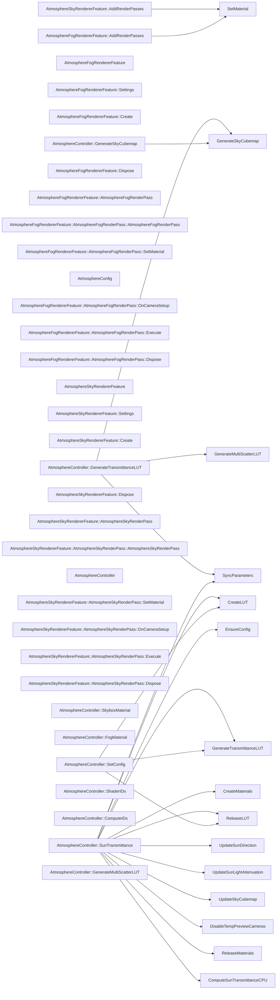

# 代码骨架：大气散射渲染（csharp）

> 状态：stale: false · 生成：2026-09-09T11:44:42+08:00

## 导出接口（33）
- `class AtmosphereConfig`（Scripts/AtmosphereConfig.cs:9:1）

```csharp
[CreateAssetMenu(menuName = "Atmosphere/Config")] public class AtmosphereConfig : ScriptableObject { [Header("行星参数")] public float planetRadius = 6360f; // km public float atmosphereHeight = 60f; // km（大气层厚度） [Header("瑞利散射")] public Vector3 rayleighCoeff = new Vector3(5
```

- `class AtmosphereController`（Scripts/AtmosphereController.cs:10:1）

```csharp
public class AtmosphereController : MonoBehaviour { [Header("配置")] [SerializeField] private AtmosphereConfig config; [Header("太阳光源")] [SerializeField] private Light sunLight; [Header("LUT Compute Shader")] [SerializeField] private ComputeShader transmittanceCompute; [SerializeField] priv
```

- `property AtmosphereController::SkyboxMaterial`（Scripts/AtmosphereController.cs:34:5）

```csharp
public static Material SkyboxMaterial { get; private set; }
```

- `property AtmosphereController::FogMaterial`（Scripts/AtmosphereController.cs:35:5）

```csharp
public static Material FogMaterial { get; private set; }
```

- `property AtmosphereController::SunTransmittance`（Scripts/AtmosphereController.cs:38:5）

```csharp
public static Vector3 SunTransmittance { get; private set; } = Vector3.one;
```

- `class AtmosphereController::ShaderIDs`（Scripts/AtmosphereController.cs:53:5）

```csharp
private static class ShaderIDs { public static readonly int PlanetRadius = Shader.PropertyToID("_Atm_PlanetRadius"); public static readonly int AtmosphereHeight = Shader.PropertyToID("_Atm_AtmosphereHeight"); public static readonly int AtmosphereRadius = Shader.PropertyToID("_Atm_AtmosphereRadius");
```

- `class AtmosphereController::ComputeIDs`（Scripts/AtmosphereController.cs:80:5）

```csharp
private static class ComputeIDs { public static readonly int LUTWidth = Shader.PropertyToID("_LUTWidth"); public static readonly int LUTHeight = Shader.PropertyToID("_LUTHeight"); public static readonly int LUTSteps = Shader.PropertyToID("_LUTSteps"); public static readonly int Result = Shader.Prope
```

- `fn AtmosphereController::GenerateTransmittanceLUT`（Scripts/AtmosphereController.cs:398:5）

```csharp
public void GenerateTransmittanceLUT()
```

- `fn AtmosphereController::GenerateMultiScatterLUT`（Scripts/AtmosphereController.cs:449:5）

```csharp
public void GenerateMultiScatterLUT()
```

- `fn AtmosphereController::GenerateSkyCubemap`（Scripts/AtmosphereController.cs:499:5）

```csharp
public void GenerateSkyCubemap()
```

- `fn AtmosphereController::SetConfig`（Scripts/AtmosphereController.cs:570:5）

```csharp
public void SetConfig(AtmosphereConfig newConfig)
```

- `class AtmosphereFogRendererFeature`（Scripts/AtmosphereFogRendererFeature.cs:11:1）

```csharp
public class AtmosphereFogRendererFeature : ScriptableRendererFeature { [System.Serializable] public class Settings { public RenderPassEvent renderPassEvent = RenderPassEvent.AfterRenderingOpaques; public Material fogMaterial; } public Settings settings = new Settings(); private AtmosphereFogRenderP
```

- `class AtmosphereFogRendererFeature::Settings`（Scripts/AtmosphereFogRendererFeature.cs:13:5）

```csharp
[System.Serializable] public class Settings { public RenderPassEvent renderPassEvent = RenderPassEvent.AfterRenderingOpaques; public Material fogMaterial; }
```

- `fn AtmosphereFogRendererFeature::Create`（Scripts/AtmosphereFogRendererFeature.cs:23:5）

```csharp
public override void Create()
```

- `fn AtmosphereFogRendererFeature::AddRenderPasses`（Scripts/AtmosphereFogRendererFeature.cs:28:5）

```csharp
public override void AddRenderPasses(ScriptableRenderer renderer, ref RenderingData renderingData)
```

- `fn AtmosphereFogRendererFeature::Dispose`（Scripts/AtmosphereFogRendererFeature.cs:48:5）

```csharp
protected override void Dispose(bool disposing)
```

- `class AtmosphereFogRendererFeature::AtmosphereFogRenderPass`（Scripts/AtmosphereFogRendererFeature.cs:53:5）

```csharp
class AtmosphereFogRenderPass : ScriptableRenderPass { private Settings _settings; private Material _material; private RTHandle _cameraColor; private RTHandle _tempTarget; public AtmosphereFogRenderPass(Settings settings) { _settings = settings; renderPassEvent = settings.renderPassEvent; } public v
```

- `fn AtmosphereFogRendererFeature::AtmosphereFogRenderPass::AtmosphereFogRenderPass`（Scripts/AtmosphereFogRendererFeature.cs:60:9）

```csharp
public AtmosphereFogRenderPass(Settings settings)
```

- `fn AtmosphereFogRendererFeature::AtmosphereFogRenderPass::SetMaterial`（Scripts/AtmosphereFogRendererFeature.cs:66:9）

```csharp
public void SetMaterial(Material mat)
```

- `fn AtmosphereFogRendererFeature::AtmosphereFogRenderPass::OnCameraSetup`（Scripts/AtmosphereFogRendererFeature.cs:71:9）

```csharp
public override void OnCameraSetup(CommandBuffer cmd, ref RenderingData renderingData)
```

- `fn AtmosphereFogRendererFeature::AtmosphereFogRenderPass::Execute`（Scripts/AtmosphereFogRendererFeature.cs:79:9）

```csharp
public override void Execute(ScriptableRenderContext context, ref RenderingData renderingData)
```

- `fn AtmosphereFogRendererFeature::AtmosphereFogRenderPass::Dispose`（Scripts/AtmosphereFogRendererFeature.cs:92:9）

```csharp
public void Dispose()
```

- `class AtmosphereSkyRendererFeature`（Scripts/AtmosphereSkyRendererFeature.cs:11:1）

```csharp
public class AtmosphereSkyRendererFeature : ScriptableRendererFeature { [System.Serializable] public class Settings { public RenderPassEvent renderPassEvent = RenderPassEvent.BeforeRenderingOpaques; public Material skyboxMaterial; } public Settings settings = new Settings(); private AtmosphereSkyRen
```

- `class AtmosphereSkyRendererFeature::Settings`（Scripts/AtmosphereSkyRendererFeature.cs:13:5）

```csharp
[System.Serializable] public class Settings { public RenderPassEvent renderPassEvent = RenderPassEvent.BeforeRenderingOpaques; public Material skyboxMaterial; }
```

- `fn AtmosphereSkyRendererFeature::Create`（Scripts/AtmosphereSkyRendererFeature.cs:23:5）

```csharp
public override void Create()
```

- `fn AtmosphereSkyRendererFeature::AddRenderPasses`（Scripts/AtmosphereSkyRendererFeature.cs:28:5）

```csharp
public override void AddRenderPasses(ScriptableRenderer renderer, ref RenderingData renderingData)
```

- `fn AtmosphereSkyRendererFeature::Dispose`（Scripts/AtmosphereSkyRendererFeature.cs:44:5）

```csharp
protected override void Dispose(bool disposing)
```

- `class AtmosphereSkyRendererFeature::AtmosphereSkyRenderPass`（Scripts/AtmosphereSkyRendererFeature.cs:49:5）

```csharp
class AtmosphereSkyRenderPass : ScriptableRenderPass { private Settings _settings; private Material _material; private RTHandle _cameraColor; public AtmosphereSkyRenderPass(Settings settings) { _settings = settings; renderPassEvent = settings.renderPassEvent; } public void SetMaterial(Material mat) 
```

- `fn AtmosphereSkyRendererFeature::AtmosphereSkyRenderPass::AtmosphereSkyRenderPass`（Scripts/AtmosphereSkyRendererFeature.cs:55:9）

```csharp
public AtmosphereSkyRenderPass(Settings settings)
```

- `fn AtmosphereSkyRendererFeature::AtmosphereSkyRenderPass::SetMaterial`（Scripts/AtmosphereSkyRendererFeature.cs:61:9）

```csharp
public void SetMaterial(Material mat)
```

- `fn AtmosphereSkyRendererFeature::AtmosphereSkyRenderPass::OnCameraSetup`（Scripts/AtmosphereSkyRendererFeature.cs:66:9）

```csharp
public override void OnCameraSetup(CommandBuffer cmd, ref RenderingData renderingData)
```

- `fn AtmosphereSkyRendererFeature::AtmosphereSkyRenderPass::Execute`（Scripts/AtmosphereSkyRendererFeature.cs:71:9）

```csharp
public override void Execute(ScriptableRenderContext context, ref RenderingData renderingData)
```

- `fn AtmosphereSkyRendererFeature::AtmosphereSkyRenderPass::Dispose`（Scripts/AtmosphereSkyRendererFeature.cs:86:9）

```csharp
public void Dispose()
```

## 调用关系



## 调用边（23）
- AtmosphereController::SunTransmittance → EnsureConfig（Scripts/AtmosphereController.cs:90:9）
- AtmosphereController::SunTransmittance → CreateMaterials（Scripts/AtmosphereController.cs:91:9）
- AtmosphereController::SunTransmittance → CreateLUT（Scripts/AtmosphereController.cs:92:9）
- AtmosphereController::SunTransmittance → GenerateTransmittanceLUT（Scripts/AtmosphereController.cs:97:9）
- AtmosphereController::SunTransmittance → SyncParameters（Scripts/AtmosphereController.cs:102:9）
- AtmosphereController::SunTransmittance → UpdateSunDirection（Scripts/AtmosphereController.cs:103:9）
- AtmosphereController::SunTransmittance → UpdateSunLightAttenuation（Scripts/AtmosphereController.cs:104:9）
- AtmosphereController::SunTransmittance → UpdateSkyCubemap（Scripts/AtmosphereController.cs:105:9）
- AtmosphereController::SunTransmittance → DisableTempPreviewCameras（Scripts/AtmosphereController.cs:112:9）
- AtmosphereController::SunTransmittance → ReleaseLUT（Scripts/AtmosphereController.cs:131:9）
- AtmosphereController::SunTransmittance → ReleaseMaterials（Scripts/AtmosphereController.cs:132:9）
- AtmosphereController::SunTransmittance → ComputeSunTransmittanceCPU（Scripts/AtmosphereController.cs:299:33）
- AtmosphereController::GenerateTransmittanceLUT → SyncParameters（Scripts/AtmosphereController.cs:407:9）
- AtmosphereController::GenerateTransmittanceLUT → GenerateMultiScatterLUT（Scripts/AtmosphereController.cs:442:9）
- AtmosphereController::GenerateTransmittanceLUT → GenerateSkyCubemap（Scripts/AtmosphereController.cs:443:9）
- AtmosphereController::GenerateSkyCubemap → GenerateSkyCubemap（Scripts/AtmosphereController.cs:563:13）
- AtmosphereController::SetConfig → ReleaseLUT（Scripts/AtmosphereController.cs:579:17）
- AtmosphereController::SetConfig → CreateLUT（Scripts/AtmosphereController.cs:580:17）
- AtmosphereController::SetConfig → GenerateTransmittanceLUT（Scripts/AtmosphereController.cs:583:9）
- AtmosphereController::SetConfig → GenerateTransmittanceLUT（Scripts/AtmosphereController.cs:633:9）
- AtmosphereFogRendererFeature::AddRenderPasses → SetMaterial（Scripts/AtmosphereFogRendererFeature.cs:36:17）
- AtmosphereFogRendererFeature::AddRenderPasses → SetMaterial（Scripts/AtmosphereFogRendererFeature.cs:42:13）
- AtmosphereSkyRendererFeature::AddRenderPasses → SetMaterial（Scripts/AtmosphereSkyRendererFeature.cs:40:9）