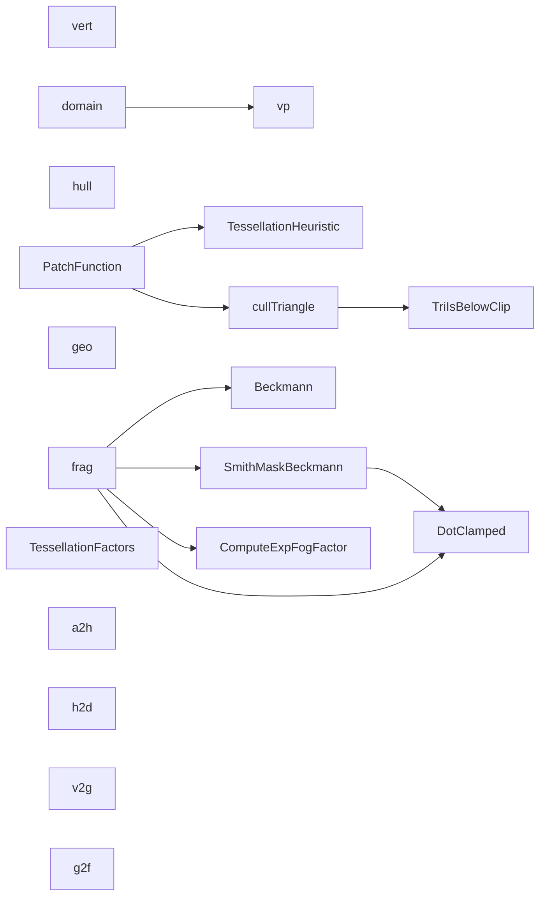

# 代码骨架：水面材质渲染（cpp）

> 状态：stale: false · 生成：2026-09-09T11:46:14+08:00

## 导出接口（19）
- `struct TessellationFactors`（FFTOcean_Render.shader:83:13）

```cpp
struct TessellationFactors { float edge[3] : SV_TESSFACTOR; float inside : SV_INSIDETESSFACTOR; }
```

- `fn TessellationHeuristic`（FFTOcean_Render.shader:90:13）

```cpp
float TessellationHeuristic(float3 cp1, float3 cp2)
```

- `fn TriIsBelowClip`（FFTOcean_Render.shader:99:13）

```cpp
bool TriIsBelowClip(float3 p0, float3 p1, float3 p2, int planeIndex, float bias)
```

- `fn cullTriangle`（FFTOcean_Render.shader:107:13）

```cpp
bool cullTriangle(float3 p0, float3 p1, float3 p2, float bias)
```

- `struct a2h`（FFTOcean_Render.shader:118:13）

```cpp
struct a2h { float4 vertex : POSITION; float2 uv : TEXCOORD0; float3 normal : NORMAL; }
```

- `struct h2d`（FFTOcean_Render.shader:125:13）

```cpp
struct h2d { float4 vertex : INTERNALTESSPOS; float2 uv : TEXCOORD0; float3 normal : NORMAL; }
```

- `struct v2g`（FFTOcean_Render.shader:132:13）

```cpp
struct v2g { float4 pos : SV_POSITION; float2 uv : TEXCOORD0; float3 worldPos : TEXCOORD1; float3 worldNormal : TEXCOORD2; float clipDepth : TEXCOORD3; float viewDepth : TEXCOORD4; float2 screenUV : TEXCOORD5; float4 shadowCoord : TEXCOORD6; }
```

- `struct g2f`（FFTOcean_Render.shader:144:13）

```cpp
struct g2f { v2g data; float2 barycentricCoordinates : TEXCOORD9; }
```

- `fn DotClamped`（FFTOcean_Render.shader:153:13）

```cpp
float DotClamped(float3 a, float3 b)
```

- `fn vert`（FFTOcean_Render.shader:161:13）

```cpp
h2d vert(a2h h)
```

- `fn vp`（FFTOcean_Render.shader:171:13）

```cpp
v2g vp(a2h d)
```

- `fn PatchFunction`（FFTOcean_Render.shader:208:13）

```cpp
TessellationFactors PatchFunction(InputPatch<h2d, 3> patch)
```

- `fn hull`（FFTOcean_Render.shader:236:17）

```cpp
hull(InputPatch<h2d, 3> patch, uint id : SV_OUTPUTCONTROLPOINTID)
```

- `fn domain`（FFTOcean_Render.shader:247:13）

```cpp
v2g domain(TessellationFactors factors, OutputPatch<h2d, 3> patch, float3 barycentricCoordinates : SV_DOMAINLOCATION)
```

- `fn geo`（FFTOcean_Render.shader:260:13）

```cpp
void geo(triangle v2g g[3], inout TriangleStream<g2f> stream)
```

- `fn Beckmann`（FFTOcean_Render.shader:277:13）

```cpp
float Beckmann(float nDoth, float Roughness)
```

- `fn SmithMaskBeckmann`（FFTOcean_Render.shader:284:13）

```cpp
float SmithMaskBeckmann(float3 halfDir, float3 otherDir, float roughness)
```

- `fn ComputeExpFogFactor`（FFTOcean_Render.shader:293:13）

```cpp
float ComputeExpFogFactor(float depth, float density)
```

- `fn frag`（FFTOcean_Render.shader:301:13）

```cpp
float4 frag(g2f i) : SV_TARGET
```

## 调用关系



## 调用边（23）
- cullTriangle → TriIsBelowClip（FFTOcean_Render.shader:109:24）
- cullTriangle → TriIsBelowClip（FFTOcean_Render.shader:110:24）
- cullTriangle → TriIsBelowClip（FFTOcean_Render.shader:111:24）
- cullTriangle → TriIsBelowClip（FFTOcean_Render.shader:112:24）
- PatchFunction → cullTriangle（FFTOcean_Render.shader:215:21）
- PatchFunction → TessellationHeuristic（FFTOcean_Render.shader:221:33）
- PatchFunction → TessellationHeuristic（FFTOcean_Render.shader:222:33）
- PatchFunction → TessellationHeuristic（FFTOcean_Render.shader:223:33）
- PatchFunction → TessellationHeuristic（FFTOcean_Render.shader:224:33）
- PatchFunction → TessellationHeuristic（FFTOcean_Render.shader:225:33）
- PatchFunction → TessellationHeuristic（FFTOcean_Render.shader:226:33）
- domain → vp（FFTOcean_Render.shader:253:24）
- SmithMaskBeckmann → DotClamped（FFTOcean_Render.shader:286:43）
- frag → SmithMaskBeckmann（FFTOcean_Render.shader:368:34）
- frag → SmithMaskBeckmann（FFTOcean_Render.shader:369:35）
- frag → DotClamped（FFTOcean_Render.shader:372:43）
- frag → DotClamped（FFTOcean_Render.shader:373:43）
- frag → Beckmann（FFTOcean_Render.shader:382:73）
- frag → DotClamped（FFTOcean_Render.shader:383:48）
- frag → DotClamped（FFTOcean_Render.shader:384:29）
- frag → DotClamped（FFTOcean_Render.shader:389:67）
- frag → DotClamped（FFTOcean_Render.shader:391:51）
- frag → ComputeExpFogFactor（FFTOcean_Render.shader:409:29）