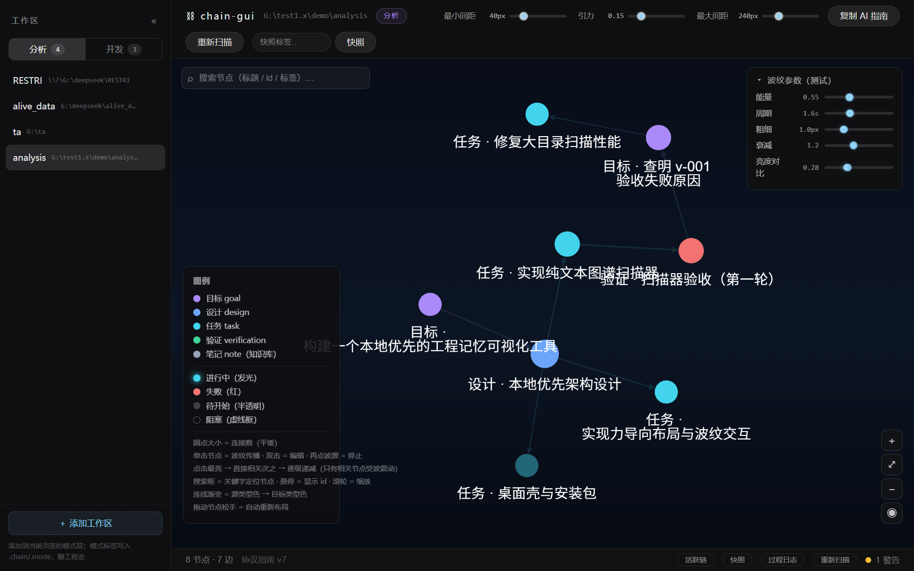
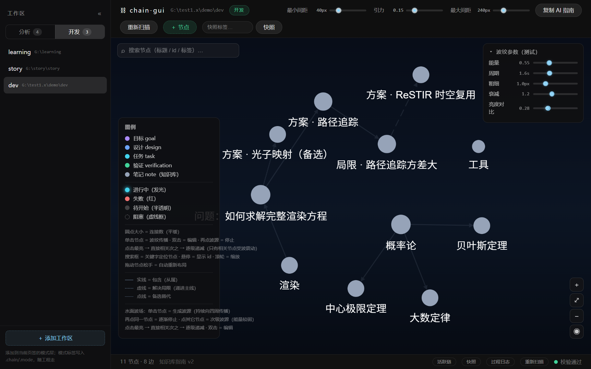
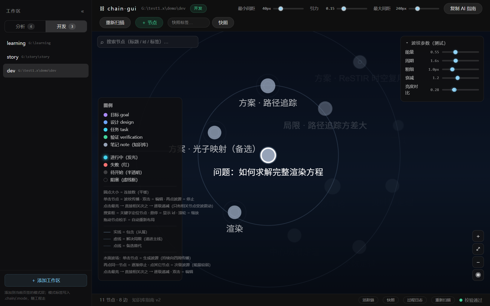

# chain-gui

> **开发者与 AI 共用的工程记忆图谱 · 桌面可视化工具**
> Tauri 2 · Svelte 5 · Cytoscape · Rust —— 纯文本存储，图谱呈现，水面般的交互

<p align="center">
  
  
</p>

---

## 它是什么

chain-gui 把你和 AI 在对话中共同维护的工程记忆（`.chain/nodes/*.md` 纯文本文件）渲染成一张可拖拽、可缩放、可交互的知识图谱。

**日常用法只有三步**：

1. 在软件里点一下「复制 AI 指南」，把它贴进任意 AI 对话——AI 就学会了你的工程记忆协议；
2. AI 按协议在 `.chain/` 里创建、更新节点（纯 Markdown + YAML frontmatter）；
3. 你随时打开 chain-gui：看全局结构、搜索定位节点、编辑正文、用波纹交互感知关联强弱。

人看图、AI 读文件——**双方共享的是同一份工程记忆**。数据是纯文本：可以 git 管理、可以迁移、任何编辑器都能改，软件只是它的一个窗口。

> 它不是"多 AI 协作框架"。它是一张**记忆图谱**：谁维护文件、用哪个模型，都不重要；重要的是项目走到哪一步、为什么这么走、失败过什么——这些都被如实钉在图上，随时可回溯。

---

## 两种模式，覆盖两类场景

| | 分析模式（链协议） | 开发模式（自由知识库） |
|---|---|---|
| 定位 | 工程推进：目标 → 设计 → 任务 → 验证 | 知识搭建：笔记、卡片、任意拓扑 |
| 结构 | 严格单根树，校验器强制（单根/无环/无悬空） | 完全自由：多根、孤立卡片、环都可以 |
| 状态 | pending / in_progress / success / failed / blocked | 无状态（中性 note 类型） |
| 失败处理 | 失败定格 → 派生追查链 → 重验闭环 | 递进关系建模（见下） |
| AI 指南 | `AI_GUIDE.md`（思维宪法 + 链协议，v7） | `AI_GUIDE_DEV.md`（知识库搭建指南，v2） |

**递进关系建模**（开发模式）：链接带关系类型，图谱用线型表达——
- 实线 `contains`：包含/从属
- 虚线 `solves`：子节点解决父节点的失败/局限（递进主线）
- 点线 `alternative`：备选方案

> 工作区模式由 `.chain/.mode` 标签绑定，随工程走，不可混用。

---

## 功能特性

**图谱交互**
- 🌊 **水面波纹交互**：单击节点 = 波源，同心细环向全场扩散；直接相关节点点亮并随之"震动"，更深层渐暗——关系强弱一眼可见；再点停止，其它节点可作次级波源
- 🔦 **亮度层级**：按 BFS 层深逐级衰减（默认曲线：d0=1.0 → d1=0.8 → d2=0.4 → …），「亮度对比」滑条可调陡峭度
- 🧲 **力导向布局**：BFS 分层初始散点 + 斥力/弹簧模拟 + 连线交叉最小化（交叉惩罚 + 质心归约）
  - 「最小间距」：任意两节点边缘间隙的硬保证（碰撞力每帧强制）
  - 「最大间距」：无链接的节点/节点链之间距离上限，全局观察不被拉散
  - 拖拽节点实时跟手重排，松手自动续排
- 🔎 **关键字搜索**：标题/id/标签模糊匹配，回车或点击结果居中定位 + 高亮脉冲
- 🖱️ 双击节点打开编辑侧栏；点空白收起为右缘细条（不丢上下文）

**节点与数据**
- 侧栏编辑：标题/状态/标签/正文（Markdown + LaTeX 预览）/证据文件/过程日志
- 证据产物分层归档 `artifacts/<节点id>/`，点击文件名直接打开
- 链快照（受控回溯）与子链折叠（压缩已完成的子链，历史永不丢）
- 文件监听实时刷新：外部编辑/AI 写入，图谱自动更新

**工程化**
- AI 指南内置版本管理：初始化/扫描时自动刷新工作区里的旧版指南副本
- 校验器反向生成规则文档，指南与软件行为严格一致
- 97 个 Rust 单元测试 + svelte-check 类型检查 + 生产构建

---

## 截图

分析模式（链协议图谱 + 状态光晕）：


开发模式（知识库 + 递进关系线型：实线/虚线/点线）：


单击节点后的波纹与亮度分层（点击节点最亮，直接相关次之，更深层渐暗）：



---

## 快速开始

**前置环境**

- [Rust](https://rustup.rs) ≥ 1.77（Windows 需 Visual Studio Build Tools 的 C++ 桌面开发组件）
- [Node.js](https://nodejs.org) 18+
- Tauri CLI：`cargo install tauri-cli --version "^2.0" --locked`

**运行**

```bash
git clone https://github.com/shijy-jy/chain-gui.git
cd chain-gui
npm install
cargo tauri dev
```

**体验示例**

仓库自带两个示例工程（`demo/analysis` 链协议示例、`demo/dev` 知识库+递进链示例）：
左侧工作区栏 → 添加文件夹 → 选择 `demo/analysis`（分析页签下）或 `demo/dev`（开发页签下）。

---

## 目录结构

```
chain-gui/
├── src/                      # 前端（Svelte 5 + TypeScript）
│   ├── App.svelte            # 主组件：图谱、波纹、布局、搜索、工具栏
│   ├── lib/                  # 涟漪 BFS 分层、链数据转换、侧栏编辑、正文渲染
│   └── components/           # 工作区栏、状态栏、新建节点对话框
├── src-tauri/                # Rust 后端
│   ├── model/                # Node / ChainSnapshot / 更新模型
│   ├── scanner/              # frontmatter 解析、目录扫描、结构校验
│   ├── commands/             # Tauri 命令（扫描/编辑/折叠/快照/指南/工作区）
│   └── watcher.rs            # 文件监听 → 前端实时刷新
├── resources/                # 双 AI 使用指南（分析 v7 / 开发 v2）
├── demo/                     # 两个示例工程（可直接打开体验）
└── docs/                     # 截图与文档
```

## 技术栈

| 层 | 选型 |
|---|---|
| 桌面壳 | Tauri 2 |
| 前端框架 | Svelte 5（runes）+ TypeScript |
| 构建 | Vite 5 |
| 图谱渲染 | Cytoscape.js（自定义力导向布局 + canvas 水面层） |
| 公式/正文 | markdown-it + KaTeX |
| 后端 | Rust（serde / serde_yaml / walkdir / notify） |

## 常用命令

| 命令 | 用途 |
|---|---|
| `cargo tauri dev` | 开发模式（vite + 桌面窗口） |
| `cargo tauri build` | 打包发布版安装包 |
| `npm run check` | svelte-check 类型检查 |
| `npm run build` | 前端生产构建 |
| `cargo test --lib` | Rust 单元测试 |

## 常见问题

| 症状 | 解决 |
|---|---|
| `tauri-cli not found` | 安装：`cargo install tauri-cli --version "^2.0" --locked` |
| `link.exe not found` | 安装 Visual Studio Build Tools（C++ 桌面开发 workload） |
| 窗口白屏 | 在工程根目录执行 `npm install` |
| 图谱空白 | 添加的目录必须**包含** `.chain/nodes/`（选其父目录） |
| 端口 1420 被占用 | 结束残留的 vite 进程后重试 |

## 许可证

[MIT](LICENSE) © 2026 shijy-jy
