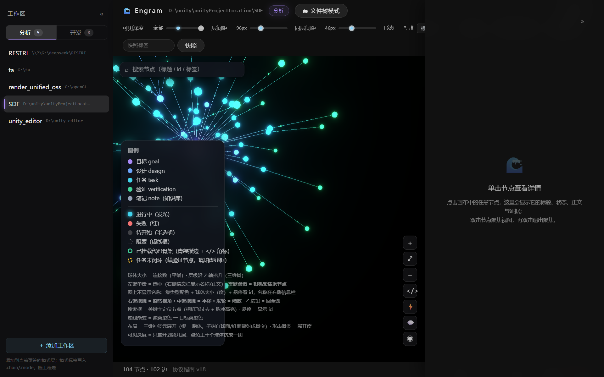
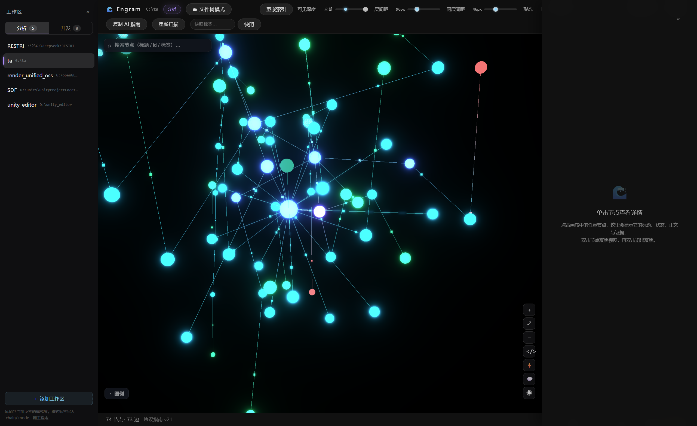
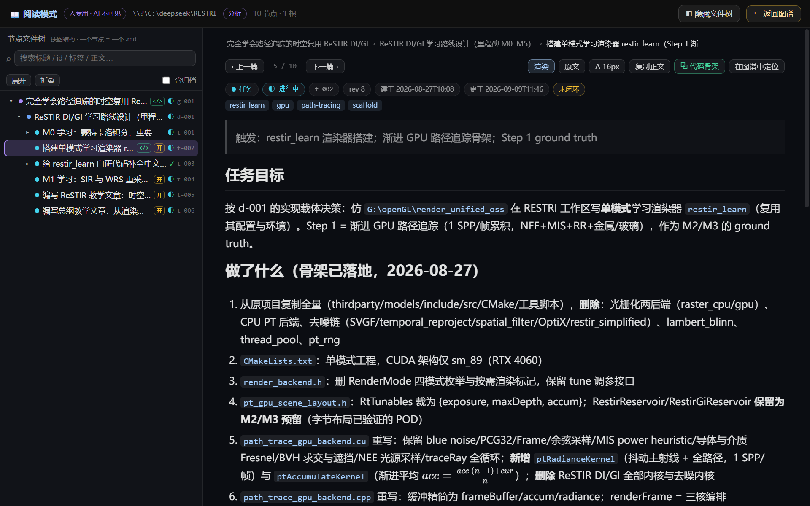
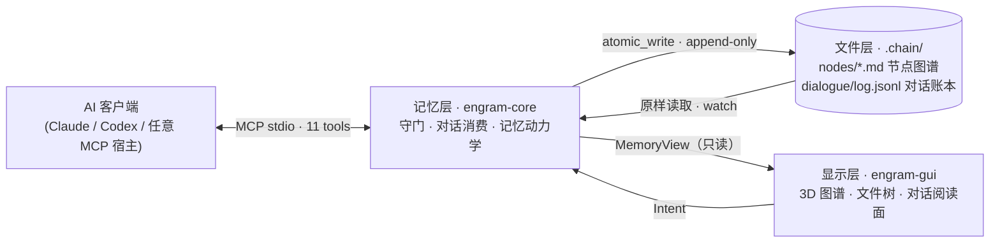

<p align="center">
  <h1 align="center">🌊 Engram</h1>
  <p align="center">
    <b>AI 负责记忆，你负责看清它 —— 本地优先的工程记忆图谱</b><br/>
    <i>An engineering memory graph where the AI writes, you observe, and every decision is traceable.</i>
  </p>
  <p align="center">
    <a href="LICENSE"></a>
    <a href="https://tauri.app"></a>
    <a href="https://svelte.dev"></a>
    <a href="https://www.rust-lang.org"></a>
    
    
  </p>
  <p align="center">
    
  </p>
  <p align="center">
    
    
  </p>
</p>

---

## 这是什么 / What is this

**Engram 是一个跑在你电脑上的工程记忆系统**：AI 在和你干活时，把对话中值得沉淀的结论写成一张纯文本节点图谱（`.chain/nodes/*.md`），并完整渲染成一张可交互的三维记忆图谱。数据就是 Markdown 文件——git 可管、可迁移、任何编辑器可改，软件只是它的一个窗口。

它解决一个很具体的问题：**换一个会话、换一个 AI，项目上下文就丢了**。Engram 让"项目知道自己在哪、为什么走到这、失败过什么"这件事，不依赖任何人的聊天记录。

| 你可能熟悉的 | Engram 的做法 |
|---|---|
| MEMORY.md / memory bank（一个文件塞所有上下文） | 结构化图谱：节点 + 关系 + 权重，检索与观察分离 |
| 云端记忆服务（数据在别人手里） | **纯本地**：文件层只是 `.chain/` 目录，零云端依赖 |
| AI 直接改文件，改错无从追溯 | **唯一写入口 + 全量留痕**：每个决策（含"不保留"）都有审计痕迹 |
| 人看不懂 AI 的记忆 | 人有完整观察面：3D 图谱、文件树、对话阅读面 |

> **不是"多 AI 协作框架"**。谁维护、用哪个模型都不重要；重要的是项目走到哪一步、为什么这么走——都被如实钉在图上，随时回溯。

---

## 30 秒工作流 / How it works


```mermaid
graph LR
  AI["AI 客户端<br/>(Claude / Codex / 任意 MCP 宿主)"] <-->|"MCP stdio · 11 tools"| M
  M["记忆层 · engram-core<br/>守门 · 对话消费 · 记忆动力学"] -->|"atomic_write · append-only"| F[("文件层 · .chain/<br/>nodes/*.md 节点图谱<br/>dialogue/log.jsonl 对话账本")]
  F -->|"原样读取 · watch"| M
  M -->|"MemoryView（只读）"| G["显示层 · engram-gui<br/>3D 图谱 · 文件树 · 对话阅读面"]
  G -->|"Intent"| M
```

日常循环只有三步：

1. **接入一次**：把 `engram-mcp` 挂进你的 MCP 客户端，指向项目目录
2. **AI 干活**：AI 通过 `remember` 写入节点、消费对话账本——所有写入过守门、留审计痕迹，人无法绕过、AI 也无法绕过
3. **你随时看**：打开 Engram——三维图谱看清结构，文件树把整库当书读，对话阅读面看 AI 的每一条决策理由

**人看图，AI 读写文件，双方共享同一份工程记忆。**

四条不变量（架构层面强制）：对话是唯一原始输入（append-only）· MCP 是 AI 唯一记忆入口 · 写路径唯一（守门+留痕）· 显示层只读。

---

## 🚀 快速开始 / Quick Start

**前置环境**：[Rust](https://rustup.rs) ≥ 1.77（Windows 需 VS Build Tools 的 C++ 组件）、[Node.js](https://nodejs.org) 18+、Tauri CLI（`cargo install tauri-cli --version "^2.0" --locked`）

**构建并运行桌面端**

```bash
git clone https://github.com/shijy-jy/chain-gui.git
cd chain-gui
npm install
cargo tauri dev        # 开发运行；cargo tauri build 打安装包
```

**体验示例**：左侧工作区栏 → 添加文件夹 → 选择仓库内的 `demo/dev`（知识库示例：递进关系线型、多根拓扑）。

**接入你的 AI（MCP）**

```bash
cargo build --release -p engram-mcp    # 产物: target/release/engram-mcp(.exe)
```

```jsonc
// Claude Desktop / 任意 MCP 宿主的 mcpServers 配置
{
  "mcpServers": {
    "engram": {
      "command": "/绝对路径/target/release/engram-mcp",
      "args": ["--workspace", "/你的项目目录"]
    }
  }
}
```

然后在任意对话里说一句「把这次讨论沉淀到 Engram」即可。工作区结构参考 `demo/dev`（`.chain/nodes/` + `.chain/dialogue/`）。

---

## 🔌 MCP 工具 / Tools（契约 v11）

| 读（8） | 作用 |
|---|---|
| `get_overview` | 全局概览：健康度、entry_hubs、active_chain、结构直方图 |
| `search` / `recall` | 关键词 / 语义检索（结果自带结构上下文：父链、层深、子节点数） |
| `read_node` / `read_path` / `expand` | 读节点 / 读链路 / 按方向+层距展开（`first_line` 120 字节机械截断，绝不冒充摘要） |
| `get_guide` | 拉取当前工作区的 AI 使用指南（版本自动对齐） |
| `dialogue_status` | 对话账本消费进度 + 未闭环任务 + 伏笔（foreshadowing）浮出 |

| 写（3） | 作用 |
|---|---|
| `remember` | **唯一写入口**：追加对话 + 落节点 + 决策留痕，一笔完成；op 词表 create/update/link/unlink/archive 全部过守门 |
| `consolidate` | 蒸馏：把多个节点合并为骨架（质量守恒） |
| `resolve_conflict` | 冻结自愈：并发冲突的唯一裁决出口 |

---

## 🧠 记忆层第一阶段：分布留痕 / Memory layer v1

AI 消费一段对话时，不是"一次生成一个节点"，而是（v3.2.0 起默认行为）：

```
三遍关注（要点 / 残余 / 结构）
  → 候选方向加权   w = s语义 × s结构 × s效用   （乘法门控，任一为零即淘汰）
  → 多峰检测       单峰 → 1 节点；多峰 → 每峰各 1 节点；全低 → skip 或伏笔
  → 提交           commit = argmax；探索模式 sample = 保留式抽取（种子可重放）
  → 痕迹写入       decision 记录 candidates / mode / seed / foreshadowing
```

三个值得注意的设计：

- **伏笔登记**（`foreshadow`）：注意到但还没懂的线索只登记在账本里，不进图谱——不给上下文的孤立断言只会污染事实源；等证据回来再结晶
- **决策全量留痕**：抽中谁、没抽中谁、权重多少全部写入 `decision` 记录——将来发现选错，替代方案就在痕迹里
- **对话账本**（`.chain/dialogue/log.jsonl`）：`covers` 既是消费锚点（新会话只读上次消费点之后）也是审计证据；`skip` 也必须留一行非空理由——这是"AI 自主跳过"与"AI 遗漏"的唯一区分证据

```json
{"k":"decision","seq":7,"decided":"keep","covers":[5,6],"mode":"sample","seed":"a3f9",
 "nodes":[{"id":"t-042","dir":"提炼为方案节点","score":0.62,"selected":true}],
 "candidates":[{"dir":"提炼为方案节点","score":0.62},{"dir":"并入 t-030","score":0.24}],
 "foreshadowing":[{"covers":[5,5],"note":"第 5 条消息提到一个未解释的常量，方向未定"}]}
```

---

## 🧭 两种模式 / Two Modes

| | 分析模式 · 链协议（指南 v23） | 开发模式 · 自由知识库（指南 v17） |
|---|---|---|
| 定位 | 工程推进：目标 → 设计 → 任务 → 验证 | 知识搭建：笔记、卡片、任意拓扑 |
| 结构 | 严格单根树，校验器强制（单根/无环/无悬空） | 完全自由：多根、孤立卡片、环都可以 |
| 状态 | pending / in_progress / success / failed / blocked | 无状态（中性 note 类型） |
| 建链 | `remember` op 词表护栏：根唯一、防环、前缀 id、状态流转（v3.2.1） | 自由建模，关系线型：`contains` / `solves` / `alternative` |

> 工作区模式由 `.chain/.mode` 绑定，随工程走，不可混用。两份 AI 指南内置版本管理，随 MCP `get_guide` 自动对齐。

---

## ⚡ 桌面端功能 / Desktop features

**观察面只读，写入只有一个入口（MCP `remember`）**——GUI 是"人的观察面"：你能看到的一切都来自 `.chain/` 事实源，改不了也骗不了。

- 🧊 **三维图谱**：three.js InstancedMesh 球节点 + 类型渐变边 + Bloom 光晕；Unity 式交互——右键旋转视角、中键平移、滚轮缩放、左键双击聚焦；节点状态直接画进样式（in_progress 增亮 / blocked 压暗 / failed 红色 / pending 半透明）
- 🎯 **图上不显示名称**：节点只按类型配色（目标/设计/任务/验证/笔记）+ 大小（度）呈现；悬停浮层显示 id·类型，点击右侧只读信息栏看全文——结构优先，不糊名
- 🧬 **两种确定性布局**：分析模式默认**层级球壳**（同心圈层，不做力导向松弛、确定性微扰防重叠）；开发模式默认**神经元**（力导向松弛仅作种子后处理，固定 tick 可复现）；紧凑/舒展两档形态 + 渐进披露（大图只铺开到可读深度，1500 节点实测可交互）
- ⚡ **突触脉冲**：沿边流动粒子；搜索定位时相机飞向节点 + 脉冲高亮
- 📖 **文件树模式**（人专用 · AI 不可见）：图谱一键切成只读阅读面——按父子关系梳理成文件树，折叠展开、关键字定位（标题/id/标签/正文）、「上一篇/下一篇」把整库当书读、渲染/原文切换、字号、面包屑、子节点与证据跳转、代码骨架全屏页
- 💬 **对话阅读面**：只读覆盖层，把 `.chain/dialogue/log.jsonl` 结构化账本渲染成可读对话——按会话/关键字筛选，会话头（模型/指南版本/开始时间）与消费进度一目了然；JSONL 是唯一事实，不落第二格式
- 🔎 **搜索定位**：标题/id/标签模糊匹配，回车居中 + 高亮脉冲
- 🗄️ **维护通道**：归档视图（归档节点淡色虚线显示）· 重嵌索引（本地模型全库重建嵌入）· 快照（一键可回溯）· 复制 AI 指南（贴给任何 AI 即完成协议交底）

---

## 📁 架构与目录 / Architecture

三层依赖单向（显示 → 记忆 → 文件），由 crate 依赖图在编译期强制：

```
chain-gui/
├── crates/
│   ├── engram-file/   # 文件层：.chain 唯一读写原语（atomic_write / append-only / scanner / watch）
│   ├── engram-core/   # 记忆层：规则 + 记忆动力学（守门 / 对话消费 / 嵌入 / 强度 / 蒸馏）
│   ├── engram-mcp/    # MCP server（stdio，11 工具）
│   ├── engram-gui/    # Tauri 2 桌面壳（Svelte 5 + three.js 三维图谱）
│   └── engram-cli/    # 命令行工具
├── resources/         # AI 指南（AI_GUIDE.md v23 / AI_GUIDE_DEV.md v17）
├── demo/dev/          # 可直接打开的示例工作区
├── docs/              # 设计文档（含 adr/ 决策记录）与 screenshots/ 实拍截图
└── src/               # 前端源码
```

**质量基线**：270 个 Rust 单元测试 + 38 条 golden 全绿 + svelte-check 类型检查；删光派生物（索引/统计/审计）软件仍可用。

## 📌 当前状态 / Status（v3.2.1，2026-10-04）

| 已落地 | 进行中 |
|---|---|
| 三层重构（文件层独立 crate、`remember` 唯一入口、GUI 写通道移除） | 部署实例切换到新契约 |
| 三维图谱（神经元 / 层级球壳 / 图上无名称 / 突触脉冲） | 强度修复（clamp 假零 / 墙钟假空） |
| 对话账本 + covers 消费锚点 | 判据与参数的实测数据校准 |
| 记忆层第一阶段：三遍关注 / 伏笔 / 多峰建节点 / 保留式抽取 | 记忆层第二阶段：新证据回写伏笔 |
| 分析模式建链词表护栏（根唯一 / 防环 / 状态流转） | — |

设计与理论文档见 [`docs/`](docs/)（三层重构、记忆层第一阶段设计、AI 可用性分析、记忆理论 v3.0、ADR-0001~0015）。

## ❓ 常见问题 / FAQ

| 症状 | 解决 |
|---|---|
| `tauri-cli not found` | `cargo install tauri-cli --version "^2.0" --locked` |
| `link.exe not found` | 安装 Visual Studio Build Tools（C++ 桌面开发 workload） |
| 图谱空白 | 工作区目录必须包含 `.chain/nodes/`（选其父目录；新工作区可复制 `demo/dev` 结构） |
| MCP 连不上 | 确认 `--workspace` 指向**已初始化**的工作区目录，且路径为绝对路径 |
| 端口 1420 被占用 | 结束残留的 vite 进程后重试 |

## 📄 许可证 / License

[MIT](LICENSE) © 2026 shijy-jy
